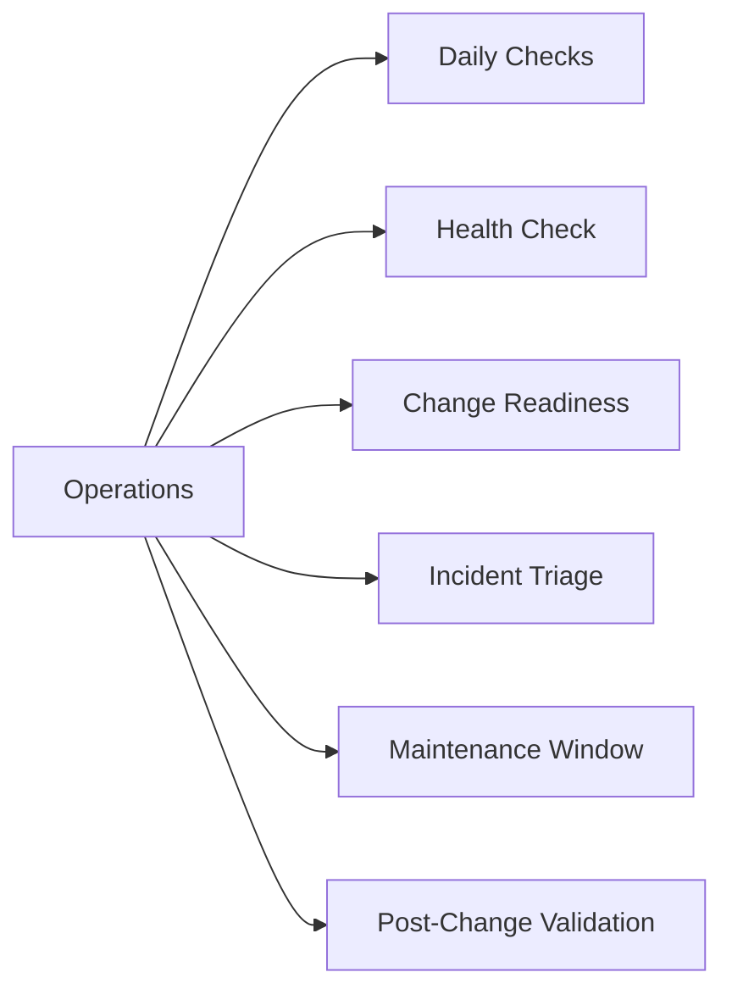

# Operations

> Part of the [Dell PowerPath](../) reference.

---

## Daily Checks

| Check | Command | Notes |
|---|---|---|
| [ ] Run `powermt display dev=all` on each managed host and scan for an | `powermt display dev=all` | a dead path requires investigation before the next maintenance window |
| [ ] Verify all pseudo devices show the expected number of active paths |  | compare against the site baseline (typically 4 or 8 paths per device depending on array and fabric redundancy) |
| [ ] Confirm the load balancing policy is `CLAROpt` (co) for all Dell/EMC array classes | `CLAROpt` |  |
| [ ] Check for devices in `pseudo` state with no backing paths | `pseudo` | this indicates a LUN that was removed at the array but not yet cleaned up on the host |
| [ ] Review host OS multipath logs for path flaps | `/var/log/messages` | recurring path flap events indicate a marginal cable, SFP, or switch port |
| [ ] Run `powermt check_registration` on recently upgraded or newly dep | `powermt check_registration` |  |

## Health Check

Run these checks before any SAN maintenance or as first-response steps when a host reports I/O errors or path loss.

- [ ] `powermt display dev=all` — all paths for all pseudo devices are in `alive` state; no `dead`, `unlic`, or missing paths
- [ ] Path count per device matches the site baseline — deviations indicate a fabric, zoning, or array-side masking change
- [ ] `powermt display ports class=all` — all HBA ports show `alive`; no ports in `dead` or `inactive` state
- [ ] `powermt display options` — Policy is `CLAROpt` for all Dell/EMC array device classes
- [ ] `powermt check_registration` — license is valid with a future expiry date
- [ ] `powermt version` — installed PowerPath version is within the supported matrix for the OS kernel and array firmware versions
- [ ] No recent path flap entries in `/var/log/messages` or Windows Event Log for the last 24 hours

~~~bash
# Display all PowerPath managed devices and path states
powermt display dev=all

# Display all HBA port states across all device classes
powermt display ports class=all

# Show current load balancing policy and PowerPath options
powermt display options

# Check PowerPath license registration status and expiry
powermt check_registration

# Show installed PowerPath version
powermt version

# Retry and restore all paths currently marked dead
powermt restore

# Display detailed path information for a specific pseudo device
powermt display dev=<pseudo-device-name>

# Rescan for new or removed devices after LUN mapping changes
powermt config
~~~

## Change Readiness

Verify these items before performing any SAN fabric maintenance, array-side masking change, or PowerPath upgrade on a host.

- [ ] `powermt display dev=all` confirms all paths are alive and path count matches the site baseline — do not start a SAN change with dead paths already present
- [ ] Save current PowerPath configuration before any change: `powermt save` — this persists the policy and path state so it can be reviewed or restored if the change causes issues
- [ ] `powermt check_registration` confirms the license is valid — an expired license will degrade paths to `unlic` state after a reboot
- [ ] Confirm the expected post-change path count per device — for a single SAN port maintenance event, each device should retain at least half its paths
- [ ] If this is a PowerPath version upgrade: confirm OS and kernel version compatibility against the Dell PowerPath support matrix before installing
- [ ] Quiesce or verify host I/O is healthy before the change — confirm the application is not in a high-latency state that would be worsened by temporarily reduced path count
- [ ] Notify the application team that SAN maintenance will temporarily reduce available paths; confirm their application can tolerate this
- [ ] Document the current `powermt display dev=all` output as the pre-change baseline for post-change comparison

| Item | Status | Notes |
|---|---|---|
| All paths alive, count matches baseline | | |
| powermt save completed | | |
| License valid (check_registration) | | |
| Post-change minimum path count acceptable | | |
| OS/kernel compatibility verified (if upgrade) | | |

## Incident Triage

When a host reports I/O errors, elevated latency, or a block device is inaccessible, work through this sequence first.

- [ ] Run `powermt display dev=all` on the affected host immediately — identify which pseudo devices have dead paths and how many paths remain alive for each
- [ ] Check the PowerPath policy: `powermt display options` — if policy shows `BasicFailover` instead of `CLAROpt`, load balancing is degraded; investigate license and run `powermt config`
- [ ] Run `powermt restore` to instruct PowerPath to retry all paths currently marked dead — this alone resolves transient path losses caused by brief fabric events
- [ ] Check HBA port states: `powermt display ports class=all` — a port in `dead` state indicates the HBA itself has lost fabric connectivity, not just individual paths
- [ ] Review host OS logs for the path failure timestamp: `grep -i "powermt\|path\|dead" /var/log/messages` — correlate with fabric switch events
- [ ] Check the SAN fabric switch: confirm the affected HBA WWN and storage array port are still zoned and active; look for CRC errors or port login/logout events on the switch
- [ ] If paths are dead and `powermt restore` does not recover them, confirm the array-side LUN masking is intact — check the masking view or storage view on the array
- [ ] Run `powermt check_registration` if paths show `unlic` state — a license issue will cause PowerPath to drop management of devices after a license check failure

| Question | Answer |
|---|---|
| Which pseudo devices have dead paths? | |
| How many paths remain alive per device? | |
| What is the current load balancing policy? | |
| Are any HBA ports in dead state? | |
| Did powermt restore recover any dead paths? | |

## Maintenance Window

Steps for SAN port or fabric maintenance that will temporarily reduce the active path count on PowerPath hosts.

1. Identify all hosts with paths through the port or fabric component being maintained — run `powermt display dev=all` on each host and record the pre-change path count per device
2. Run `powermt save` on each affected host to persist the current policy and path configuration
3. Confirm each device will retain at least half its active paths during the maintenance — do not proceed if a device would drop to a single path or zero paths
4. Notify application owners that path count will be temporarily reduced; confirm applications can tolerate the reduced redundancy
5. Remove or disable the target SAN port or fabric component per the approved runbook
6. On affected hosts, run `powermt display dev=all` to confirm remaining paths are alive and I/O is continuing via the surviving paths
7. Complete the maintenance on the SAN port or fabric component; restore the port to service
8. Run `powermt restore` on each affected host to bring the returned paths back online, then run `powermt display dev=all` to confirm the original path count has been restored

## Post-Change Validation

Run these checks after any SAN, fabric, or PowerPath change to confirm multipath health is fully restored.

- [ ] `powermt display dev=all` — all paths are alive and path count per device matches the pre-change baseline; no dead paths remain
- [ ] `powermt display ports class=all` — all HBA ports show `alive`; no ports stuck in `dead` state
- [ ] `powermt display options` — Policy is `CLAROpt` for all device classes; no policy drift occurred during the change
- [ ] `powermt check_registration` — license remains valid post-change
- [ ] No path flap entries in host OS logs in the 30 minutes following the maintenance window
- [ ] Application owners confirm I/O has resumed normally and no elevated latency is observed
- [ ] `powermt save` run after the change to persist the restored configuration state
