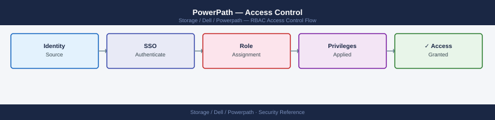

---
tags:
  - dell
  - security
---
# PowerPath — Access Control

<div class="kb-summary">
Access Control reference covering RBAC, Sudoers Configuration, Audit Logging.

*Applies to: PowerPath*
</div>


## Before you begin

- **Access:** Storage admin credentials (cluster admin or equivalent)
- **Change management:** security changes require CAB approval in most environments
- **Rollback plan:** document current state before any security control change
- **Testing:** validate in a non-production environment first where possible

---

## RBAC

PowerPath does not have its own RBAC system — access control is delegated entirely to the host OS.

| Role | OS Mechanism | PowerPath Access |
|---|---|---|
| Storage Admin | root (Linux) / Local Administrator (Windows) | Full `powermt` access — can change policy, config, save |
| Server Admin | Standard OS admin account | Read-only view via `powermt display` (requires root on Linux for most commands) |
| Read-only monitoring | Non-privileged user | Limited; `powermt display` may require sudo on Linux |
| Automation service account | Dedicated service account with sudo for `powermt` commands only | Configure via `/etc/sudoers` with specific command allowlist |

## Sudoers Configuration

Recommended sudoers entry for a monitoring service account on Linux:

```text
svc-monitoring ALL=(root) NOPASSWD: /usr/sbin/powermt display dev=all, /usr/sbin/powermt display ports class=all, /usr/sbin/powermt check_registration
```

## Audit Logging

PowerPath does not generate its own audit log, but path state changes are written to the OS syslog. Capture these for operational visibility:

- **Linux**: Events logged to `/var/log/messages` or `journalctl` under the `kernel` facility; keywords include `emcp`, `PowerPath`, `dead path`, `path restored`
- **Windows**: Events logged to the Windows Event Log under the PowerPath source; forward via Windows Event Forwarding to a SIEM
- **AIX**: Events logged to `/var/adm/ras/errlog`; use `errpt` to review

Log `powermt check_registration` and `powermt save` operations as part of any change management process — these are the two highest-impact administrative actions.

---

## See also

- [Powerpath — Authentication](../authentication/)
- [Powerpath — Hardening](../hardening/)
- [Powerpath — Encryption](../encryption/)
