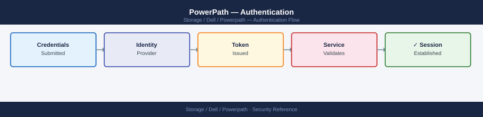
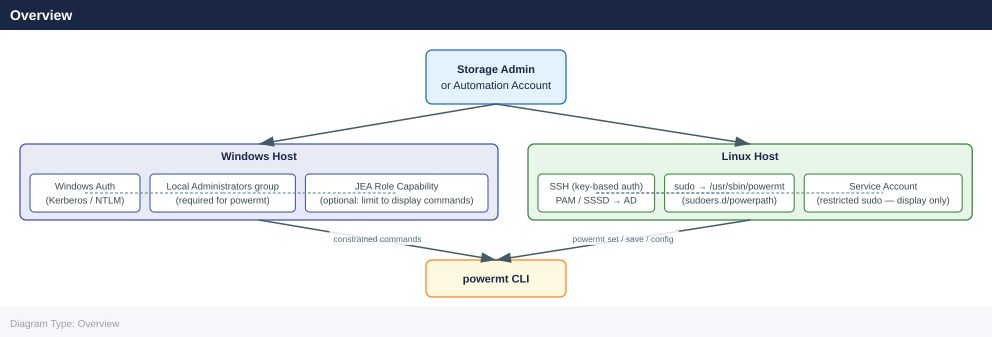

---
tags:
  - dell
  - security
---
# PowerPath — Authentication

<div class="kb-summary">
Authentication reference covering Overview, Linux Authentication, Windows Authentication, AIX Authentication, Automation and Service Accounts and 4 more sections.

*Applies to: PowerPath*
</div>


## Before you begin

- **Access:** Storage admin credentials (cluster admin or equivalent)
- **Change management:** security changes require CAB approval in most environments
- **Rollback plan:** document current state before any security control change
- **Testing:** validate in a non-production environment first where possible

---

## Overview



PowerPath does not implement its own authentication system. There is no PowerPath-native login, user database, or session management. Access to `powermt` CLI commands is controlled entirely by the host operating system's authentication and authorisation mechanisms.

This design means PowerPath security is inherited from the host OS security posture. Any account with sufficient OS privilege can run any `powermt` command — there is no additional PowerPath credential check.

---

## Linux Authentication

On Linux, all `powermt` commands that modify configuration require root privileges. Read-only display commands (`powermt display`) may or may not require root depending on the PowerPath version and kernel configuration.

### Root Access

The simplest and least secure model: operations staff SSH to the host as root and run `powermt` directly. Acceptable only in environments with full SSH key control and no shared root passwords.

```bash
# Direct root access
ssh root@db-prod-01
powermt display dev=all
powermt set policy=CLAROpt class=all
powermt save
```


```text title="Expected output"
root@db-prod-01's password: 
Symmetrix ID: 000297900001
Logical device name: emcpowera
Symmetrix address: 5000097900001234
Director: 4e
Port: 0
dev = emcpowera
hsv210 (/dev/sda): Alive; Policy: SymmOpt; Queued IOs: 0
hsv211 (/dev/sdb): Alive; Policy: SymmOpt; Queued IOs: 0
hsv212 (/dev/sdc): Alive; Policy: SymmOpt; Queued IOs: 0
hsv213 (/dev/sdd): Alive; Policy: SymmOpt; Queued IOs: 0
...
Setting policy to CLAROpt for all devices
Policy saved to /etc/powermt.custom
```

!!! warning "Common errors"
    **`powermt: Command not found`** — Install EMC PowerPath package with `apt-get install emc-powerpath` or `yum install EMCpower.LINUX` depending on your distribution.
    **`Permission denied (publickey,password)`** — Verify SSH key is loaded with `ssh-add` or use password authentication; check that root login is enabled in `/etc/ssh/sshd_config`.
    **`powermt: Unable to connect to Symmetrix`** — Confirm the storage array is reachable and PowerPath daemon is running with `systemctl status powerpath`.
### Sudo-Based Access (Recommended)

The recommended model for Linux: create a named storage administration account and grant it sudo access only to specific `powermt` commands. This provides auditability (sudo logs the caller's real username) while restricting blast radius.

**Sudoers configuration for a storage admin account:**

```bash
# /etc/sudoers.d/powerpath
# Storage admin — full powermt access
svc-storage ALL=(root) NOPASSWD: /usr/sbin/powermt
```


```text title="Expected output"
(no output — command completes silently)
```

!!! warning "Common errors"
    **`sudoers:1 syntax error near line 1`** — Verify the file is edited only with `visudo` and check for trailing whitespace or missing spaces around operators.
    **`sudo: /etc/sudoers.d/powermt: command not found`** — The sudoers.d file is a configuration file, not executable; verify it's in `/etc/sudoers.d/` with correct permissions (0440) and owned by root:root.
This grants the `svc-storage` account the ability to run any `powermt` subcommand. If tighter restriction is needed, specify individual commands:

```bash
# /etc/sudoers.d/powerpath-monitoring
# Read-only monitoring account — display and registration check only
svc-monitoring ALL=(root) NOPASSWD: \
    /usr/sbin/powermt display dev=all, \
    /usr/sbin/powermt display ports class=all, \
    /usr/sbin/powermt display options, \
    /usr/sbin/powermt check_registration, \
    /usr/sbin/powermt version
```


```text title="Expected output"
(no output — command completes silently)
```

!!! warning "Common errors"
    **`sudoers: parse error near line 5`** — Ensure each command line ends with a comma and there are no trailing spaces after the final backslash.
    **`svc-monitoring is not in the sudoers file. This incident will be reported.`** — Verify the sudoers.d file is owned by root:root with 0440 permissions and the user account svc-monitoring exists.
Validate the sudoers file syntax before applying:

```bash
visudo -c -f /etc/sudoers.d/powerpath-monitoring
```


```text title="Expected output"
/etc/sudoers.d/powerpath-monitoring: parsed OK
```

!!! warning "Common errors"
    **`visudo: /etc/sudoers.d/powerpath-monitoring: No such file or directory`** — Create the sudoers file first with `touch /etc/sudoers.d/powerpath-monitoring` and appropriate permissions before validating.
    **`visudo: /etc/sudoers.d/powerpath-monitoring: bad permissions, should be 0440`** — Fix file permissions with `chmod 0440 /etc/sudoers.d/powerpath-monitoring` to match sudoers security requirements.
### PAM Integration

PowerPath itself does not integrate with PAM. Host SSH authentication via PAM (including LDAP, Active Directory via SSSD, or MFA via PAM RADIUS) applies normally — PAM controls who can log into the host; once logged in, sudo controls what they can run.

For environments with Active Directory integration on Linux:

```bash
# Confirm the storage admin AD group resolves on the host
id svc-storage
getent group storage-admins

# Grant the AD group sudo access to powermt
# /etc/sudoers.d/powerpath-ad
%storage-admins ALL=(root) NOPASSWD: /usr/sbin/powermt
```


```text title="Expected output"
uid=1002(svc-storage) gid=1002(svc-storage) groups=1002(svc-storage),1003(storage-admins)
storage-admins:x:1003:svc-storage,admin-user,storage-ops-user
```

!!! warning "Common errors"
    **`id: 'svc-storage': no such user`** — Verify the service account exists in AD and has synced to the host via LDAP/SSSD with `getent passwd svc-storage`.
    **`storage-admins:x:1003:(empty)`** — Confirm AD group members are syncing by checking SSSD logs (`journalctl -u sssd -n 50`) and verifying group membership in Active Directory.
### SSH Key Management

Hosts running PowerPath should enforce SSH key authentication and disable password-based SSH login for root:

```bash
# /etc/ssh/sshd_config
PermitRootLogin prohibit-password
PasswordAuthentication no
```


```text title="Expected output"
(no output — command completes silently)
```

!!! warning "Common errors"
    **`sshd[12345]: error: Permissions denied (publickey).`** — Ensure your public key is added to `/root/.ssh/authorized_keys` before disabling password authentication.
    **`sshd: no hostkeys available -- exiting.`** — Generate SSH host keys with `ssh-keygen -A` before restarting sshd.
This ensures that interactive root access requires a managed SSH key, reducing the risk of credential-based attacks on hosts with privileged PowerPath access.

---

## Windows Authentication

On Windows Server, PowerPath installs as a system service and filter driver. The `powermt` command requires Local Administrator rights. There is no finer-grained Windows permission model for PowerPath — it is binary: Local Administrator or no access.

### Local Administrator Groups

```powershell
# Confirm account is in the local Administrators group
Get-LocalGroupMember -Group "Administrators"

# Add a service account to local Administrators (requires existing admin rights)
Add-LocalGroupMember -Group "Administrators" -Member "DOMAIN\svc-storage"
```

### Windows Remote Management (WinRM)

For remote PowerPath management on Windows, WinRM with constrained language mode or PowerShell JEA (Just Enough Administration) can be configured to restrict which `powermt` commands a delegated account can run remotely:

```powershell
# Example JEA configuration — restrict to display commands only
# In a JEA role capability file (.psrc):
VisibleExternalCommands = 'powermt display dev=all', 'powermt check_registration'
```

### Active Directory Integration

Windows Server hosts joined to Active Directory authenticate via Kerberos. Grant the relevant AD security group Local Administrator membership on PowerPath hosts via Group Policy:

```text
Computer Configuration > Policies > Windows Settings >
Security Settings > Restricted Groups >
Add DOMAIN\Storage-Admins to local Administrators
```

---

## AIX Authentication

On IBM AIX, `powermt` requires root access. AIX RBAC (Role-Based Access Control) can be used to grant the `powermt` command to a non-root user:

```bash
# Create a custom role for PowerPath operations
mkrole rolelist=powerpath_admin

# Assign the powermt binary to the role
# Edit /etc/security/roles to include command access

# Assign the role to a user
chuser roles=powerpath_admin storage_admin_user
```


```text title="Expected output"
(no output — command completes silently)
(no output — command completes silently)
(no output — command completes silently)
```

!!! warning "Common errors"
    **`mkrole: 0551-102 Cannot access the /etc/security/roles file.`** — Ensure you are running as root and the /etc/security directory has proper permissions (typically 755).
    **`chuser: 0551-101 User storage_admin_user does not exist.`** — Create the user first with `useradd storage_admin_user` before assigning roles.
For most AIX environments, the simpler approach is a named shared account in the `system` group that is permitted to run `powermt`, with sudo configured via the IBM AIX sudo package.

---

## Automation and Service Accounts

When PowerPath monitoring or automation scripts run `powermt` commands, use a dedicated service account rather than a shared root password or personal admin account.

Principles for automation service accounts:

1. **Least privilege**: Grant only the `powermt` subcommands the automation actually needs. Monitoring scripts typically need only `display` and `check_registration` — not `set`, `save`, or `config`.
2. **No interactive login**: Disable interactive shell login for the service account; only sudo-based command execution should be permitted.
3. **SSH key authentication**: Use a unique, passphrase-protected SSH key for each automation system. Rotate annually.
4. **Audit trail**: Ensure all `powermt` commands run by the service account are logged via sudo (`/var/log/secure` on RHEL/OEL, `/var/log/auth.log` on Debian/Ubuntu).

```bash
# Example: monitoring service account with restricted sudo
# /etc/sudoers.d/powerpath-svc-monitor

Defaults:svc-monitor !requiretty
svc-monitor ALL=(root) NOPASSWD: /usr/sbin/powermt display dev=all
svc-monitor ALL=(root) NOPASSWD: /usr/sbin/powermt display ports class=all
svc-monitor ALL=(root) NOPASSWD: /usr/sbin/powermt check_registration
svc-monitor ALL=(root) NOPASSWD: /usr/sbin/powermt display options
```


```text title="Expected output"
(no output — command completes silently)
```

!!! warning "Common errors"
    **`sudoedit: /etc/sudoers.d/powerpath-svc-monitor: syntax error near line 3`** — Verify the sudoers file syntax with `visudo -cf /etc/sudoers.d/powerpath-svc-monitor` before applying.
    **`svc-monitor is not in the sudoers file.  This incident will be reported.`** — Ensure the service account `svc-monitor` exists with `id svc-monitor` and the sudoers file is in `/etc/sudoers.d/` with mode 0440.
    **`powermt: command not found`** — Install or verify the PowerPath package is installed with `rpm -qa | grep powerpath` or `apt list --installed | grep powerpath`.
---

## Audit Trail

PowerPath does not write its own audit log. Administrative actions (`powermt set`, `powermt save`, `powermt config`, `powermt remove`) are only traceable through:

- **sudo logs** (Linux): `/var/log/secure` or `/var/log/auth.log` — records who ran which `powermt` command via sudo, including timestamp and originating user
- **Shell history**: If admins run `powermt` as root, the command will appear in the root shell history (`/root/.bash_history`) — unreliable unless audited centrally
- **Windows Event Log**: `powermt` executions on Windows are not specifically logged by PowerPath; rely on Windows process creation auditing (Security Event ID 4688) if process-level audit is required
- **Centralised logging**: Forward sudo logs and Windows Event Log to a SIEM for retention and alerting on privileged PowerPath operations

For change management compliance, document every `powermt set` and `powermt save` operation in the associated change record, including the before/after output of `powermt display options`.

---

## PowerPath Management Suite (PPMS) Authentication

Dell PowerPath Management Suite is the optional centralised management platform for PowerPath-managed hosts. PPMS has its own authentication layer, separate from host OS authentication:

- PPMS uses local accounts and optionally integrates with LDAP/Active Directory for SSO
- Role-based access within PPMS: Administrator, Operator, and Read-Only roles map to full management, limited change, and view-only access respectively
- PPMS API access uses token-based authentication; tokens are scoped per role
- For environments using PPMS, direct `powermt` command access on individual hosts should be restricted to break-glass scenarios

Refer to the Dell PowerPath Management Suite Installation and Administration Guide for PPMS-specific authentication configuration.

---

## Quick Reference

| Platform | Authentication Mechanism | Minimum Required Privilege |
|---|---|---|
| Linux | Root or sudo | Root (or sudo to powermt) |
| Windows Server | Windows authentication | Local Administrator |
| AIX | Root or AIX RBAC | Root (or RBAC role with powermt) |
| HP-UX | Root | Root |
| Solaris | Root or RBAC | Root (or RBAC profile) |
| PowerPath/VE (ESXi) | vSphere authentication | vSphere Administrator or Storage Administrator role |
| PPMS | Local account or LDAP/AD | PPMS Administrator role |
---

## Related Reference

- [Standard LDAP Integration](../../../../security/ldap-integration/index.md) — field reference, service account standards, TLS requirements, and connectivity testing
- [Standard SAML Configuration](../../../../security/saml-configuration/index.md) — SP/IdP setup, Azure AD and Okta steps, attribute mapping, and security requirements

---

## See also

- [Powerpath — Access Control](../access-control/)
- [Powerpath — Hardening](../hardening/)
- [Powerpath — Encryption](../encryption/)
