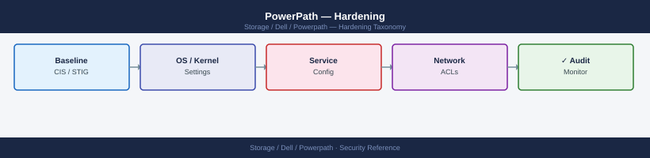

---
tags:
  - dell
  - security
---
# PowerPath — Hardening

Hardening reference covering Hardening Checklist, Compliance.

*Applies to: PowerPath*

## Before you begin

- **Access:** Storage admin credentials (cluster admin or equivalent)
- **Change management:** security changes require CAB approval in most environments
- **Rollback plan:** document current state before any security control change
- **Testing:** validate in a non-production environment first where possible

---

## Hardening Checklist

- [ ] Install PowerPath only on hosts that have a valid support contract and license; do not run unlicensed instances (paths show as `unlic` and are unmanaged)
- [ ] Restrict `powermt` CLI access to root / administrators only — PowerPath configuration changes can cause I/O disruption if misused
- [ ] On Linux, ensure the PowerPath configuration file (`/etc/powermt.custom` or equivalent) has permissions `600` owned by root
- [ ] Keep PowerPath version current — outdated versions may have kernel compatibility issues that can cause I/O errors or kernel panics
- [ ] Verify DM-Multipath is blacklisting Dell/EMC devices to prevent dual management of the same path (see Integration section)
- [ ] Include PowerPath host configuration in the host hardening baseline audit; confirm no unauthorised policy changes after maintenance windows
- [ ] Run `powermt check_registration` after any OS upgrade or license renewal; an expired license causes paths to become `unlic` and is not automatically alerted

## Compliance

PowerPath itself is not a compliance boundary, but as a host-side component it is in scope for:

| Framework | Consideration |
|---|---|
| CIS Benchmarks (OS level) | Ensure PowerPath kernel module and config files have correct permissions per OS hardening guide |
| PCI DSS | PowerPath hosts in the CDE must have access controls, patching (version currency), and audit logging per PCI requirements |
| Change management | Any `powermt set policy` or `powermt config` operation should be performed within an approved change window and documented |

---

## See also

- [Powerpath — Authentication](authentication/)
- [Powerpath — Access Control](access-control/)
- [Powerpath — Encryption](encryption/)
