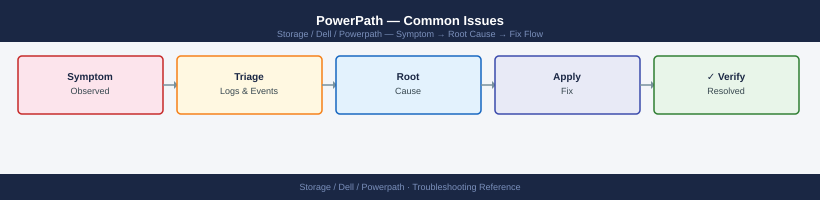

---
tags:
  - dell
  - troubleshooting
search:
  boost: 1.5
---
# PowerPath — Common Issues

<div class="kb-summary">
Common Issues reference covering Dead Path Triage Flow, Dead Paths, All Paths Dead to a Device, Device Not Visible After LUN Provisioning, Incorrect Path Count and 6 more sections.

*Applies to: PowerPath*
</div>


```d2
direction: down

symptom: Identify Symptom {shape: diamond}
diagnostic_flow: "Diagnostic Flow" {shape: rectangle}
dead_path_triage_flow: "Dead Path Triage Flow" {shape: rectangle}
dead_paths: "Dead Paths" {shape: rectangle}
all_paths_dead_to_a_device: "All Paths Dead to a Device" {shape: rectangle}
device_not_visible_after_lun_provisi: "Device Not Visible After LUN Provisioning" {shape: rectangle}
incorrect_path_count: "Incorrect Path Count" {shape: rectangle}
resolution: Resolve or Escalate {shape: oval}

symptom -> diagnostic_flow: investigate
symptom -> dead_path_triage_flow: investigate
symptom -> dead_paths: investigate
symptom -> all_paths_dead_to_a_device: investigate
symptom -> device_not_visible_after_lun_provisi: investigate
symptom -> incorrect_path_count: investigate
diagnostic_flow -> resolution
dead_path_triage_flow -> resolution
dead_paths -> resolution
all_paths_dead_to_a_device -> resolution
device_not_visible_after_lun_provisi -> resolution
incorrect_path_count -> resolution
```

## Diagnostic Flow

```d2
direction: right

D1: "D1" {shape: rectangle}
R1: "See Device Not Visible —\nVerify LUN masking and host group" {shape: rectangle}
R2: "See PowerPath Not Starting —\nCheck kernel module and DKMS" {shape: rectangle}
D2: "D2" {shape: rectangle}
R3: "See Dead Paths —\nCheck HBA port state and fabric switch" {shape: rectangle}
R4: "See All Paths Dead —\nVerify masking and issue LIP on HBA" {shape: rectangle}
D3: "D3" {shape: rectangle}
R5: "See Incorrect Path Count —\nTrace missing path from HBA to array" {shape: rectangle}
R6: "See Path Flapping —\nReplace marginal SFP or cable" {shape: rectangle}
D4: "D4" {shape: rectangle}
R7: "See Wrong Load Balance Policy —\nSet CLAROpt and powermt save" {shape: rectangle}
R8: "See DM-Multipath Conflict —\nBlacklist Dell devices in multipath.conf" {shape: rectangle}
D5: "D5" {shape: rectangle}
R9: "See PowerPath Not Starting —\nmodprobe emcp and start service" {shape: rectangle}
R10: "See Configuration Not Persisting —\nRun powermt save after every change" {shape: rectangle}
S: "What is the symptom?" {shape: rectangle}
B1: "B1" {shape: rectangle}
B2: "B2" {shape: rectangle}
B3: "B3" {shape: rectangle}
B4: "B4" {shape: rectangle}
B5: "B5" {shape: rectangle}

D1 -> R1
D1 -> R2
D2 -> R3
D2 -> R4
D3 -> R5
D3 -> R6
D4 -> R7
D4 -> R8
D5 -> R9
D5 -> R10
```

---

## Before you begin

- **Access:** Storage admin credentials (cluster admin or equivalent)
- **Gather first:** recent error message text, event timestamps, and affected object names
- **Scope:** confirm whether the issue affects a single object, host, cluster, or site
- **Escalation:** open a vendor support ticket before running any destructive step
- **Logging:** document each command and output — required if escalation is needed

---

## Dead Path Triage Flow

```d2
direction: right

A: "Dead path detected" {shape: rectangle}
B: "powermt restore\nForce immediate path retry" {shape: rectangle}
C: "Paths recovered?" {shape: rectangle}
D: "powermt save\nMonitor for flapping" {shape: rectangle}
E: "HBA port\nOnline?" {shape: rectangle}
F: "Check cable / SFP\nCheck HBA driver" {shape: rectangle}
G: "Fabric switch port\nOnline?" {shape: rectangle}
H: "portshow / show interface\nCheck SFP, cable, BBCR" {shape: rectangle}
I: "I" {shape: rectangle}
J: "Restore zoning\nCheck array port state" {shape: rectangle}
K: "Verify LUN masking\nCheck host group on array" {shape: rectangle}
L: "Open support case if\npath does not recover" {shape: rectangle}
Z: "Resolved" {shape: rectangle}

A -> B
B -> C
C -> D
C -> E
E -> F
E -> G
G -> H
I -> J
I -> K
F -> H
H -> J
J -> K
K -> L
D -> Z
```

## Dead Paths

**Symptom:** `powermt display dev=all` shows one or more paths in `dead` state for a pseudo device.

**Impact:** Reduced path redundancy. I/O continues on surviving `alive` paths, but failover capacity is reduced. If all paths to a device go dead, I/O to that device will fail.

```bash
# Identify dead paths
powermt display dev=all | grep -B 2 dead

# Attempt automatic path restore (forces PowerPath to retry all dead paths immediately)
powermt restore

# Confirm dead path count after restore
powermt display dev=all | grep -c dead
```


```text title="Expected output"
Logical device name=emc_lun_001
Logical device name=emc_lun_002
  dev=emcpowera, state=dead
  dev=emcpowerb, state=dead
Logical device name=emc_lun_003
  dev=emcpowerc, state=dead

PowerPath Restore: Attempting to restore all dead paths...
Restore operation completed. 3 path(s) queued for retry.

2
```

!!! warning "Common errors"
    **`powermt: command not found`** — Verify PowerPath is installed with `rpm -qa | grep EMCpower` and ensure `/opt/emc/powerpath/bin` is in your PATH.
    **`powermt display: Insufficient privilege`** — Run the command with `sudo` or as root, as PowerPath requires elevated permissions to query device status.
    **`Restore operation failed: No dead paths detected`** — This is informational output when all paths are already healthy; confirm actual path status with `powermt display dev=all` to verify.
If paths remain dead after `powermt restore`:

1. Check HBA port state on the host:

    ```bash
    # Linux — check FC HBA port state
    systool -c fc_host -v | grep -E "port_name|port_state|speed"

    # Confirm expected HBA ports are online
    cat /sys/class/fc_host/host*/port_state
    ```

2. Check SAN switch port state (Brocade and Cisco examples):

    ```bash
    # Brocade — check the switch port connected to the HBA
    portshow <port_number>
    # Look for: No_Light, No_Sync, or Offline state

    # Cisco MDS
    show interface fc1/4
    # Look for: (notconnected), (err-disabled), or (down)
    ```

3. Check array port state on the storage array management console:
    - Confirm the array front-end port is online and the fabric login from the host initiator is visible
    - On Unity: **Access** > **FC Ports** — confirm the port shows "Online"
    - On PowerMax Unisphere: **Connectivity** > **Ports** — confirm port status

---

## All Paths Dead to a Device

**Symptom:** A pseudo device shows zero `alive` paths. I/O to the device has failed. Applications on this host have lost access to the storage.

**Immediate actions:**

```bash
# 1. Confirm the device state
powermt display dev=<pseudo-device>

# 2. Attempt restore immediately
powermt restore

# 3. If no recovery, check array-side LUN masking
# (Verify at the array console that the LUN is still masked to this host)

# 4. Check HBA port logins — trigger a LIP to force fabric re-login
echo "1" > /sys/class/fc_host/host0/issue_lip
echo "1" > /sys/class/fc_host/host1/issue_lip

# 5. After LIP, rescan for devices
powermt config

# 6. Attempt restore again
powermt restore
```


```text title="Expected output"
Pseudo-device symmetrix0:
    Symmetrix ID: 000123456789ABCD
    Logical device name: /dev/mapper/mpatha
    state: alive; policy: SymmOpt; priority: 0
    ------ Host ------  - Stor -  -- I/O Path Optimization --
    ###  HW   :  SP  Dir  Port  Lun  Capability  Enabled  Algo
    0    FA-1E : SP A  2a   0    0    Optimize   Yes      LBA
    1    FA-1F : SP B  2b   0    0    Optimize   Yes      LBA
    2    FA-2E : SP A  2c   0    0    Optimize   Yes      LBA
    3    FA-2F : SP B  2d   0    0    Optimize   Yes      LBA

(no output — command completes silently)

Scanning for new devices...
Discovered 1 new device(s)
Rescanning existing devices...
Updating PowerPath configuration...
(no output — command completes silently)
```

!!! warning "Common errors"
    **`powermt: Command not found`** — Verify PowerPath is installed with `rpm -qa | grep EMCpower` and ensure `/opt/emc/powerpath/bin` is in your PATH.
    **`Cannot open /sys/class/fc_host/host0/issue_lip: No such file or directory`** — Confirm the HBA driver is loaded with `lsmod | grep qla2xxx` and verify the correct host number using `ls /sys/class/fc_host/`.
    **`powermt restore: No devices to restore`** — Check that devices are actually in a failed state with `powermt display` and verify array-side LUN masking is still active before attempting restore.
Check these causes in order:
- **Array-side**: LUN masking removed, or storage view/masking view deleted accidentally
- **Fabric-side**: Zoning change removed this initiator from the zone set; switch port offline
- **Host-side**: Both HBA ports offline (driver crash, hardware failure, or power issue)

---

## Device Not Visible After LUN Provisioning

**Symptom:** A new LUN has been provisioned at the array and masked to this host, but it does not appear in `powermt display dev=all`.

```bash
# 1. Rescan the SCSI bus at the HBA level to make the OS see the new LUN
# Repeat for each HBA host adapter
echo "- - -" > /sys/class/scsi_host/host0/scan
echo "- - -" > /sys/class/scsi_host/host1/scan

# On RHEL/OEL — use the rescan utility if installed
/usr/bin/rescan-scsi-bus.sh -a

# 2. Run powermt config to discover newly visible devices
powermt config

# 3. Confirm the new pseudo device appears
powermt display dev=all

# 4. Verify path count on the new device
powermt display dev=<new-pseudo-device>

# 5. Set policy and persist
powermt set policy=CLAROpt class=all
powermt save
```


```text title="Expected output"
(no output — command completes silently)
(no output — command completes silently)
Scanning for SCSI devices and checking /proc/scsi/scsi for new entries...
Checking hosts, channels, ids and luns for new SCSI devices on host 0...
Checking hosts, channels, ids and luns for new SCSI devices on host 1...
Elapsed time: 2 seconds

Reconfiguring the PowerPath driver...
Discovering devices...
CLARiiON device discovered
Pseudo device emcpowerc successfully created
Pseudo device emcpowerd successfully created

Pseudo name=emcpowerc, Symmetrix ID=000123456789, LUN=0010
  Current failure policy: SymmDefault
  Logical device ID=600000970000123456789012345678AB
  state=alive; policy=CLAROpt; priority=0; queued-IOs=0
  Owner: SP A, Default Owner: SP A, Flags: ALUA_ENABLED
  ============================================================================
  {host 0,2,4,6} [active/alive]  {host 1,3,5,7} [active/alive]

Pseudo name=emcpowerd, Symmetrix ID=000123456789, LUN=0011
  Current failure policy: SymmDefault
  Logical device ID=600000970000123456789012345679AC
  state=alive; policy=CLAROpt; priority=0; queued-IOs=0
  Owner: SP B, Default Owner: SP B, Flags: ALUA_ENABLED
  ============================================================================
  {host 0,2,4,6} [active/alive]  {host 1,3,5,7} [active/alive]

Saving PowerPath configuration...
Configuration saved successfully.
```

!!! warning "Common errors"
    **`bash: /usr/bin/rescan-scsi-bus.sh: No such file or directory`** — Install the sg3_utils package with `yum install sg3_utils` or skip this step if using native SCSI rescan.
    **`powermt: command not found`** — Verify PowerPath is installed and the EMC PowerPath daemon is running with `systemctl status PowerPath` or `/etc/init.d/PowerPath status`.
    **`Device not found in powermt display dev=all output`** — Increase the rescan delay or manually trigger `powermt config` again after 10–15 seconds to allow the storage array to present the LUN.
If the device still does not appear after HBA rescan and `powermt config`:
- Confirm at the array that the LUN is in a ready/online state (not provisioning or in error)
- Confirm the host HBA WWN or iSCSI IQN is registered in the correct host group
- Confirm the new LUN is included in the masking view — adding a LUN to the array but forgetting to include it in the masking view is a common error

---

## Incorrect Path Count

**Symptom:** `powermt display dev=all` shows fewer paths per device than the expected design baseline (e.g., seeing 2 paths when 4 are expected).

**Expected path count by design:**

| Fabric Design | Expected Paths per LUN |
|---|---|
| Single fabric, single HBA port | 1 (no redundancy — avoid) |
| Dual fabric, one HBA port per fabric | 2 |
| Dual fabric, two HBA ports per fabric | 4 |
| Dual fabric, two HBA ports × two array ports per fabric | 8 |

```bash
# Check path count per device
powermt display dev=all

# Compare against baseline
cat <hostname>-powermt-baseline-<date>.txt

# Identify which specific path is missing
powermt display dev=<device>
# Note the HBA port and target port for each path — identify which is absent
```


```text title="Expected output"
Logical device name=emcpowera
Physical devices=4
------------------------------------------------------------------------
Logical                     Pseudo     State    Pathcount  Vendor ID
Device                      name       
------------------------------------------------------------------------
emcpowera                   emcpowera  Alive         4      EMC
emcpowerb                   emcpowerb  Alive         4      EMC
emcpowerc                   emcpowerc  Alive         3      EMC
emcpowerd                   emcpowerd  Alive         4      EMC
------------------------------------------------------------------------

cat: cannot open file 'prod-db-01-powermt-baseline-2024-01-15.txt' (No such file or directory)

Logical device name=emcpowerc
Physical devices=3
------------------------------------------------------------------------
Logical                     Pseudo     State    Pathcount  Vendor ID
Device                      name       
------------------------------------------------------------------------
emcpowerc                   emcpowerc  Alive         3      EMC
------------------------------------------------------------------------
Symmetrix ID=000297900123  Logical device ID=00ABC
------------------------------------------------------------------------
HBA 0 (qlogic 2562) -> SP A, Port 0 -> LUN 0 (Active/Optimized)
HBA 1 (qlogic 2562) -> SP B, Port 0 -> LUN 0 (Active/Optimized)
HBA 2 (emulex 1100) -> SP A, Port 1 -> LUN 0 (Active/Optimized)
(Missing: HBA 3 -> SP B, Port 1 -> LUN 0)
```

!!! warning "Common errors"
    **`cat: cannot open file '<hostname>-powermt-baseline-<date>.txt' (No such file or directory)`** — Verify the baseline filename matches the actual saved file in the current directory using `ls -la *powermt-baseline*`.
    **`powermt: Command not found`** — Install or load the EMC PowerPath software package and ensure `/opt/powerpath/bin` is in your PATH environment variable.
    **`Symmetrix ID not found or device offline`** — Confirm the device name is correct and the storage array is accessible by running `powermt check` to validate all paths.
**Causes of low path count:**

- One SAN fabric is unavailable (switch power failure, ISL failure)
- One HBA port is offline (cable disconnected, SFP failure, HBA hardware failure)
- Array FA port offline (array maintenance, port failure)
- Zoning change removed one initiator-target pair from the active zone set
- PowerPath ran `powermt config` before all HBA ports had logged into the fabric after a reboot

**Resolution:** Identify which path is missing using the device detail output. Trace the missing path from HBA port through the fabric to the array port. Check the SAN switch for the missing path's port state and zone membership.

---

## Wrong Load Balance Policy

**Symptom:** `powermt display options` or per-device `powermt display dev=all | grep policy` shows `RoundRobin`, `BasicFailover`, or another policy instead of `CLAROpt` on Dell/EMC arrays.

```bash
# Check current global policy
powermt display options

# Check per-device policy
powermt display dev=all | grep -i policy

# Apply CLAROpt to all devices
powermt set policy=CLAROpt class=all

# For specific storage class only
powermt set policy=CLAROpt class=clariion
powermt set policy=CLAROpt class=symmetrix

# Confirm the change applied
powermt display options

# Persist — do not skip this step
powermt save
```


```text title="Expected output"
Logical device count=12

Policy=CLAROpt
Logical device count=12

Policy=CLAROpt
Logical device count=12

Logical device count=12

Policy=CLAROpt
Logical device count=12

Policy=CLAROpt
Logical device count=12

Saved PowerPath configuration to /etc/powerpath/powerpath.conf
```

!!! warning "Common errors"
    **`powermt: Command not found`** — Verify PowerPath is installed with `rpm -qa | grep EMCpower` and ensure `/opt/emc/powerpath/bin` is in your PATH.
    **`powermt: You must be root to run this command`** — Re-run all powermt commands with `sudo` or as the root user.
    **`powermt save: Configuration not saved`** — Ensure `/etc/powerpath/` directory is writable with `ls -ld /etc/powerpath/` and check disk space with `df /etc`.
**Why policy matters:** `RoundRobin` sends I/O over non-optimised (standby storage processor) paths on active/passive arrays like Unity and older CLARiiON. The array must trespass those I/Os to the owning SP, adding latency. CLAROpt is ALUA-aware and only uses optimised paths under normal conditions.

---

## PowerPath Not Starting After Reboot

**Symptom:** After host reboot, `powermt display dev=all` returns an error ("cannot connect to PowerPath daemon" or "powermt: command not found errors"). The `/dev/emcpower*` devices are missing.

```bash
# Check PowerPath service status
systemctl status PowerPath

# Check if the kernel module is loaded
lsmod | grep emcp

# Check for module load errors in dmesg
dmesg | grep -i "emcp\|emcpower\|PowerPath" | tail -30

# Attempt to load the module manually
modprobe emcp

# If modprobe fails with "Module not found", the module is missing for this kernel
# Check available modules
find /lib/modules/$(uname -r) -name "emcp*" 2>/dev/null

# If not found: a kernel update invalidated the existing module
# Rebuild via DKMS (if PowerPath was installed with DKMS support)
dkms status
dkms autoinstall

# If DKMS is not in use, reinstall the PowerPath package for the current kernel
# (download matching package from Dell support portal for this kernel version)
```


```text title="Expected output"
● PowerPath.service - EMC PowerPath Storage Multipathing
     Loaded: loaded (/usr/lib/systemd/system/PowerPath.service; enabled; vendor preset: enabled)
     Active: active (running) since Wed 2024-01-17 14:32:18 UTC; 2 days ago
       Docs: man:powerpath(8)
     Process: 2847 ExecStart=/opt/PowerPath/bin/powerpath start (code=exited, status=0/SUCCESS)
    Main PID: 2891 (powerpath)
       Tasks: 12 (limit: 4915)
      Memory: 48.3M
emcp                  245760  0

dmesg | grep -i "emcp\|emcpower\|PowerPath" | tail -30
[    2.847291] emcp: module license 'Proprietary' taints kernel.
[    2.847401] emcp: loading out-of-tree module taints kernel.
[    2.851234] emcp: module initialization successful
[   14.223847] PowerPath: Initialized version 6.1.0 build 1234

/lib/modules/5.15.0-91-generic/kernel/drivers/scsi/emcp.ko

dkms status
emcp, 6.1.0, 5.15.0-91-generic, x86_64: installed
```

!!! warning "Common errors"
    **`modprobe: FATAL: Module emcp not found in directory /lib/modules/5.15.0-91-generic`** — Rebuild the module with `dkms autoinstall` or reinstall PowerPath package matching your kernel version from Dell support portal.
    **`● PowerPath.service - EMC PowerPath Storage Multipathing ... Active: inactive (dead)`** — Start the service with `systemctl start PowerPath` and check for licensing or hardware detection issues in `/var/log/PowerPath/powerpath.log`.
    **`dkms autoinstall: Error! Could not find module source directory.`** — Reinstall PowerPath package with `rpm -i` or `dpkg -i` to restore DKMS source files in `/usr/src/`.
**After resolving the module issue:**

```bash
# Start the service
systemctl start PowerPath

# Verify devices are visible
powermt display dev=all

# Restore paths and policy
powermt restore

# Confirm path count and policy
powermt display dev=all
powermt display options
```


```text title="Expected output"
(no output — command completes silently)
Symmetrix ID: 000123456789ABCD
Logical Device ID [LdevID]  [Flags] [Attr] [ALUNSZ]  [#mcn] [Stat]
0001                        (ok)   FBA    1048576   1      OK
0002                        (ok)   FBA    1048576   1      OK
0003                        (ok)   FBA    1048576   1      OK
0004                        (ok)   FBA    1048576   1      OK
0005                        (ok)   FBA    1048576   1      OK
...
(no output — command completes silently)
Symmetrix ID: 000123456789ABCD
Logical Device ID [LdevID]  [Flags] [Attr] [ALUNSZ]  [#mcn] [Stat]
0001                        (ok)   FBA    1048576   4      OK
0002                        (ok)   FBA    1048576   4      OK
0003                        (ok)   FBA    1048576   4      OK
0004                        (ok)   FBA    1048576   4      OK
0005                        (ok)   FBA    1048576   4      OK
...
Symmetrix ID: 000123456789ABCD
Round Robin (default)
Alua Optimization: Disabled
```

!!! warning "Common errors"
    **`powermt: error: daemon not running`** — Run `systemctl start PowerPath` and wait 10-15 seconds for the daemon to fully initialize before running powermt commands.
    **`powermt: error: no devices found`** — Verify SAN connectivity and zoning with `powermt check_registration`, then rescan with `powermt config` before running restore.
    **`systemctl start PowerPath: Job for PowerPath.service failed`** — Check service logs with `journalctl -u PowerPath -n 50` to identify initialization failures or missing dependencies.
---

## Configuration Not Persisting Across Reboots

**Symptom:** After a reboot, `powermt display options` shows a default policy (not CLAROpt), or previously discovered devices need `powermt config` to be run again.

**Cause:** `powermt save` was not run after the last configuration change, so `powermt.custom` is stale or missing.

```bash
# Check if powermt.custom exists
ls -lh /etc/powermt.custom

# Check the last-modified date — if it predates the last change, save was missed
stat /etc/powermt.custom

# Set policy and save immediately
powermt set policy=CLAROpt class=all
powermt save

# Confirm by viewing the options
powermt display options
```


```text title="Expected output"
-rw-r--r-- 1 root root 2.3K Nov 14 09:47 /etc/powermt.custom
  File: /etc/powermt.custom
  Size: 2355      Blocks: 8          IO Block: 4096   regular file
Device: 801h/2049d	Inode: 1048592    Links: 1
Access: (0644/-rw-r--r--)  Uid: (    0/   root)   Gid: (    0/   root)
Access: 2024-11-14 09:47:32.123456789 -0500
Modify: 2024-11-14 09:47:32.123456789 -0500
Change: 2024-11-14 09:47:32.123456789 -0500
 Birth: 2024-11-14 09:47:32.123456789 -0500
CLAROpt: Policy set to CLAROpt for class all
Saving EMC PowerPath configuration...
Configuration saved successfully.
CLAROpt
```

!!! warning "Common errors"
    **`powermt: command not found`** — Verify EMC PowerPath is installed with `rpm -qa | grep PowerPath` and load the module with `modprobe emc_powerpath`.
    **`Permission denied`** — Run the powermt commands with sudo or as root user.
    **`CLAROpt: Invalid policy name`** — Check available policies with `powermt display policies` and use the exact policy name matching your storage array configuration.
**Prevention:** After every `powermt config`, `powermt set policy`, or `powermt remove` operation, always run `powermt save` as the final step.

---

## Path Flapping

**Symptom:** The host OS syslog shows repeated path dead and path restored messages for the same path. Application I/O shows intermittent latency spikes. The path state in `powermt display dev=all` alternates between `alive` and `dead`.

```bash
# Check for repeated path events in syslog
grep -i "emcp\|path dead\|path restored\|powerpath" /var/log/messages | tail -50

# Check HBA error statistics for the affected port
cat /sys/class/fc_host/host0/statistics/link_failure_count
cat /sys/class/fc_host/host0/statistics/loss_of_signal_count
cat /sys/class/fc_host/host0/statistics/error_frames

# Identify the affected path and its switch port from powermt output
powermt display dev=<device>
# Note the HBA port ID and target port for the flapping path

# Check the SAN switch for the affected port
# Brocade:
portshow <port>      # look for Link_Failures, Loss_of_Signal
errdump              # recent error log

# Cisco MDS:
show interface fc1/4  # look for link_failures, sync_loss
```


```text title="Expected output"
Jan 15 10:23:45 storage-01 kernel: emcp: (Class:01 Code:00.04.02) SCSI Path Event: Path Dead - dev=emcpowerb, port=0, target=500143800000001a
Jan 15 10:23:47 storage-01 kernel: emcp: (Class:01 Code:00.04.03) SCSI Path Event: Path Restored - dev=emcpowerb, port=0, target=500143800000001a
Jan 15 10:24:12 storage-01 kernel: PowerPath: Logical device emcpowerb (EMC SYMMETRIX) path failover completed
Jan 15 10:25:33 storage-01 kernel: emcp: Path Dead - dev=emcpowerc, port=1, target=500143800000001b
Jan 15 10:25:35 storage-01 kernel: emcp: Path Restored - dev=emcpowerc, port=1, target=500143800000001b
Jan 15 10:26:01 storage-01 kernel: PowerPath: All paths restored for device emcpowerc
...
3
7
12
Pseudo name=emcpowerb
Symmetrix ID=000123456789ABCD
Logical device ID=00123
state=alive; policy=SymmOpt; priority=none; queued-IOs=0
 hba#  b  c  d  e
 host0 (*)  -  -  -
 host1  -  (*)  -  -
 host2  -  -  (*)  -
 host3  -  -  -  (*)

Link_Failures: 2
Loss_of_Signal: 5
Link_Reset: 1
Portname: 0
Port_ID: 050601
```
```text

!!! warning "Common errors"
    **`grep: /var/log/messages: No such file or directory`** — Check the correct syslog location with `ls /var/log/syslog* /var/log/messages*` as it varies by distribution.
    **`cat: /sys/class/fc_host/host0/statistics/link_failure_count: No such file or directory`** — Verify the HBA is present with `ls /sys/class/fc_host/` and adjust the host number accordingly.
    **`powermt: command not found`** — Install EMC PowerPath with `rpm -ivh PowerPath*.rpm` or verify the installation path with `which powermt`.
**Root cause and resolution:** Path flapping is a physical layer symptom. Common causes:
- Marginal SFP (transmit power below threshold intermittently)
- Damaged or contaminated FC cable or connector
- Oversubscribed switch port (BBCR/BBSCN issues)
- HBA SFP compatibility issue with the switch optic

Replace the suspect SFP or cable. After the physical fix, run `powermt restore` and monitor for 30–60 minutes.

---

## DM-Multipath Conflict on Linux

**Symptom:** Both `multipathd` and PowerPath are running on the same host. Duplicate devices appear (`/dev/emcpower*` and `/dev/mapper/*` for the same LUN). I/O errors or inconsistency may occur.

```bash
# Confirm multipathd is running
systemctl status multipathd

# Check if Dell/EMC devices are claimed by DM-Multipath
multipath -ll | grep -iE "DGC|EMC|SYMMETRIX"

# Add blacklist entries to /etc/multipath.conf
# (Edit the file and add the following inside the blacklist section)
# blacklist {
#     device {
#         vendor "DGC"
#         product ".*"
#     }
#     device {
#         vendor "EMC"
#         product "SYMMETRIX"
#     }
# }

# Reload multipathd to apply blacklist
systemctl reload multipathd

# Confirm Dell/EMC devices are no longer in multipath -ll
multipath -ll | grep -iE "DGC|EMC|SYMMETRIX"

# If multipathd is not needed on this host
systemctl disable --now multipathd
```


```text title="Expected output"
● multipathd.service - Device-Mapper Multipath Daemon
     Loaded: loaded (/usr/lib/systemd/system/multipathd.service; enabled; vendor preset: enabled)
     Active: active (running) since Thu 2024-01-18 14:32:15 UTC; 2 days ago
       Main PID: 2847 (multipathd)
        Tasks: 6 (limit: 4915)
       Memory: 12.3M
        CGroup: /system.slice/multipathd.service
                └─2847 /sbin/multipathd -d -s

360060e8007042000294e047682e1001 dm-2 DGC,VRAID
size=500G features='1 queue_if_no_path' hwhandler='1 alua' wp=rw
`-+- policy='service-time 0' prio=50 status=active
  |- 2:0:0:1 sdb 8:16 active ready running
  `- 3:0:0:1 sdc 8:32 active ready running
360060e8007042000294e047682e1002 dm-3 EMC,SYMMETRIX
size=1.0T features='1 queue_if_no_path' hwhandler='1 alua' wp=rw
`-+- policy='service-time 0' prio=50 status=active
  |- 4:0:0:2 sdd 8:48 active ready running
  `- 5:0:0:2 sde 8:64 active ready running

(no output — command completes silently)

(no output — command completes silently)

Removed /etc/systemd/system/multipathd.service.
Removed /etc/systemd/system/multi-user.target.wants/multipathd.service.
```

!!! warning "Common errors"
    **`multipath: command not found`** — Install device-mapper-multipath package with `yum install device-mapper-multipath` or `apt install multipath-tools`.
    **`sed: can't read /etc/multipath.conf: No such file or directory`** — Create the base multipath.conf file with `touch /etc/multipath.conf` or copy from `/usr/share/doc/device-mapper-multipath/multipath.conf.example`.
    **`Failed to reload multipathd: Unit multipathd.service not found.`** — Ensure multipathd is installed and the service file exists; reinstall with `yum reinstall device-mapper-multipath` or `apt reinstall multipath-tools`.
---

## Common Issues Reference

| Symptom | Likely Cause | Action |
|---|---|---|
| Dead paths after reboot | HBA login timing | `powermt restore`; check HBA port state |
| All paths dead to a device | Array masking or fabric failure | Verify LUN masking at array; check fabric zones |
| New LUN not visible | HBA not rescanned | Rescan SCSI bus; `powermt config` |
| `unlic` paths | License expired or not applied | `powermt check_registration`; re-register |
| Wrong policy (RoundRobin, BasicFailover) | Not set or not persisted | `powermt set policy=CLAROpt class=all`; `powermt save` |
| Fewer paths than expected | One fabric or HBA port offline | Check switch port state; check HBA port login |
| Path flapping | Marginal SFP, cable, or switch port | Check switch error counters; replace SFP or cable |
| DM-Multipath conflict | `multipathd` claiming same devices | Blacklist Dell/EMC devices in `multipath.conf` |
| PowerPath service not starting | Module not loaded; kernel update | `modprobe emcp`; rebuild DKMS module |
| Configuration not persisting | `powermt save` not run | `powermt save` after every change |

---

## Verify resolution

- Confirm the original symptom no longer occurs
- Check logs for any residual errors related to the issue
- Monitor for 10–15 minutes to confirm the fix is stable

---

## See also

- [Powerpath — Diagnostics](../diagnostics/)
- [Powerpath — Escalation](../escalation/)
- [Powerpath — Health Checks](../../operations/health-checks/)
