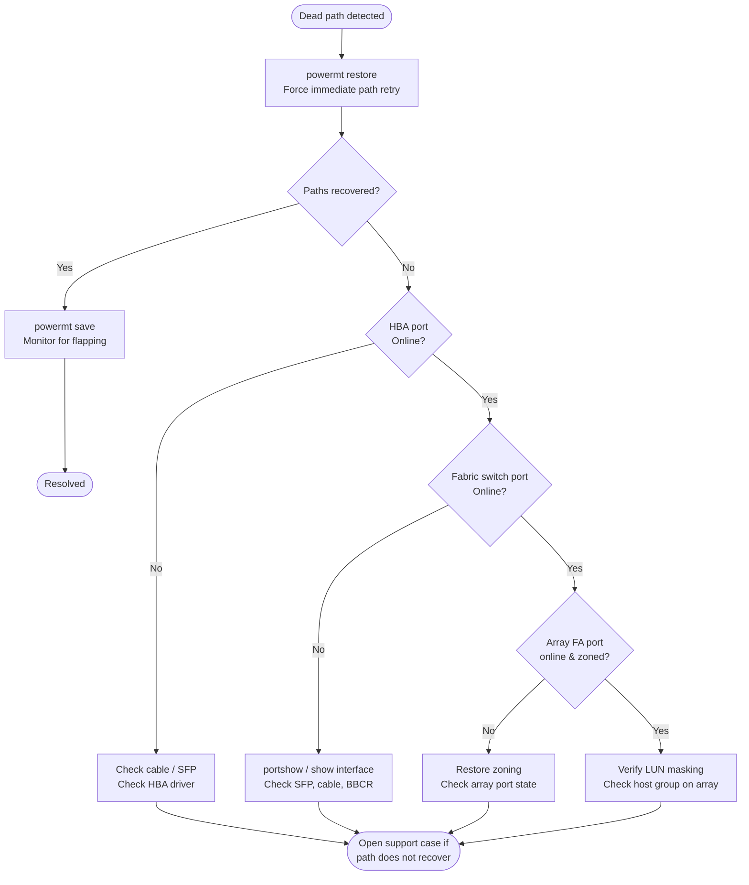

# PowerPath — Common Issues

## Dead Path Triage Flow



## Dead Paths

**Symptom:** `powermt display dev=all` shows one or more paths in `dead` state for a pseudo device.

**Impact:** Reduced path redundancy. I/O continues on surviving `alive` paths, but failover capacity is reduced. If all paths to a device go dead, I/O to that device will fail.

```bash
# Identify dead paths
powermt display dev=all | grep -B 2 dead

# Attempt automatic path restore (forces PowerPath to retry all dead paths immediately)
powermt restore

# Confirm dead path count after restore
powermt display dev=all | grep -c dead
```

If paths remain dead after `powermt restore`:

1. Check HBA port state on the host:

    ```bash
    # Linux — check FC HBA port state
    systool -c fc_host -v | grep -E "port_name|port_state|speed"

    # Confirm expected HBA ports are online
    cat /sys/class/fc_host/host*/port_state
    ```

2. Check SAN switch port state (Brocade and Cisco examples):

    ```bash
    # Brocade — check the switch port connected to the HBA
    portshow <port_number>
    # Look for: No_Light, No_Sync, or Offline state

    # Cisco MDS
    show interface fc1/4
    # Look for: (notconnected), (err-disabled), or (down)
    ```

3. Check array port state on the storage array management console:
    - Confirm the array front-end port is online and the fabric login from the host initiator is visible
    - On Unity: **Access** > **FC Ports** — confirm the port shows "Online"
    - On PowerMax Unisphere: **Connectivity** > **Ports** — confirm port status

---

## All Paths Dead to a Device

**Symptom:** A pseudo device shows zero `alive` paths. I/O to the device has failed. Applications on this host have lost access to the storage.

**Immediate actions:**

```bash
# 1. Confirm the device state
powermt display dev=<pseudo-device>

# 2. Attempt restore immediately
powermt restore

# 3. If no recovery, check array-side LUN masking
# (Verify at the array console that the LUN is still masked to this host)

# 4. Check HBA port logins — trigger a LIP to force fabric re-login
echo "1" > /sys/class/fc_host/host0/issue_lip
echo "1" > /sys/class/fc_host/host1/issue_lip

# 5. After LIP, rescan for devices
powermt config

# 6. Attempt restore again
powermt restore
```

Check these causes in order:
- **Array-side**: LUN masking removed, or storage view/masking view deleted accidentally
- **Fabric-side**: Zoning change removed this initiator from the zone set; switch port offline
- **Host-side**: Both HBA ports offline (driver crash, hardware failure, or power issue)

---

## Device Not Visible After LUN Provisioning

**Symptom:** A new LUN has been provisioned at the array and masked to this host, but it does not appear in `powermt display dev=all`.

```bash
# 1. Rescan the SCSI bus at the HBA level to make the OS see the new LUN
# Repeat for each HBA host adapter
echo "- - -" > /sys/class/scsi_host/host0/scan
echo "- - -" > /sys/class/scsi_host/host1/scan

# On RHEL/OEL — use the rescan utility if installed
/usr/bin/rescan-scsi-bus.sh -a

# 2. Run powermt config to discover newly visible devices
powermt config

# 3. Confirm the new pseudo device appears
powermt display dev=all

# 4. Verify path count on the new device
powermt display dev=<new-pseudo-device>

# 5. Set policy and persist
powermt set policy=CLAROpt class=all
powermt save
```

If the device still does not appear after HBA rescan and `powermt config`:
- Confirm at the array that the LUN is in a ready/online state (not provisioning or in error)
- Confirm the host HBA WWN or iSCSI IQN is registered in the correct host group
- Confirm the new LUN is included in the masking view — adding a LUN to the array but forgetting to include it in the masking view is a common error

---

## Incorrect Path Count

**Symptom:** `powermt display dev=all` shows fewer paths per device than the expected design baseline (e.g., seeing 2 paths when 4 are expected).

**Expected path count by design:**

| Fabric Design | Expected Paths per LUN |
|---|---|
| Single fabric, single HBA port | 1 (no redundancy — avoid) |
| Dual fabric, one HBA port per fabric | 2 |
| Dual fabric, two HBA ports per fabric | 4 |
| Dual fabric, two HBA ports × two array ports per fabric | 8 |

```bash
# Check path count per device
powermt display dev=all

# Compare against baseline
cat <hostname>-powermt-baseline-<date>.txt

# Identify which specific path is missing
powermt display dev=<device>
# Note the HBA port and target port for each path — identify which is absent
```

**Causes of low path count:**

- One SAN fabric is unavailable (switch power failure, ISL failure)
- One HBA port is offline (cable disconnected, SFP failure, HBA hardware failure)
- Array FA port offline (array maintenance, port failure)
- Zoning change removed one initiator-target pair from the active zone set
- PowerPath ran `powermt config` before all HBA ports had logged into the fabric after a reboot

**Resolution:** Identify which path is missing using the device detail output. Trace the missing path from HBA port through the fabric to the array port. Check the SAN switch for the missing path's port state and zone membership.

---

## Wrong Load Balance Policy

**Symptom:** `powermt display options` or per-device `powermt display dev=all | grep policy` shows `RoundRobin`, `BasicFailover`, or another policy instead of `CLAROpt` on Dell/EMC arrays.

```bash
# Check current global policy
powermt display options

# Check per-device policy
powermt display dev=all | grep -i policy

# Apply CLAROpt to all devices
powermt set policy=CLAROpt class=all

# For specific storage class only
powermt set policy=CLAROpt class=clariion
powermt set policy=CLAROpt class=symmetrix

# Confirm the change applied
powermt display options

# Persist — do not skip this step
powermt save
```

**Why policy matters:** `RoundRobin` sends I/O over non-optimised (standby storage processor) paths on active/passive arrays like Unity and older CLARiiON. The array must trespass those I/Os to the owning SP, adding latency. CLAROpt is ALUA-aware and only uses optimised paths under normal conditions.

---

## PowerPath Not Starting After Reboot

**Symptom:** After host reboot, `powermt display dev=all` returns an error ("cannot connect to PowerPath daemon" or "powermt: command not found errors"). The `/dev/emcpower*` devices are missing.

```bash
# Check PowerPath service status
systemctl status PowerPath

# Check if the kernel module is loaded
lsmod | grep emcp

# Check for module load errors in dmesg
dmesg | grep -i "emcp\|emcpower\|PowerPath" | tail -30

# Attempt to load the module manually
modprobe emcp

# If modprobe fails with "Module not found", the module is missing for this kernel
# Check available modules
find /lib/modules/$(uname -r) -name "emcp*" 2>/dev/null

# If not found: a kernel update invalidated the existing module
# Rebuild via DKMS (if PowerPath was installed with DKMS support)
dkms status
dkms autoinstall

# If DKMS is not in use, reinstall the PowerPath package for the current kernel
# (download matching package from Dell support portal for this kernel version)
```

**After resolving the module issue:**

```bash
# Start the service
systemctl start PowerPath

# Verify devices are visible
powermt display dev=all

# Restore paths and policy
powermt restore

# Confirm path count and policy
powermt display dev=all
powermt display options
```

---

## Configuration Not Persisting Across Reboots

**Symptom:** After a reboot, `powermt display options` shows a default policy (not CLAROpt), or previously discovered devices need `powermt config` to be run again.

**Cause:** `powermt save` was not run after the last configuration change, so `powermt.custom` is stale or missing.

```bash
# Check if powermt.custom exists
ls -lh /etc/powermt.custom

# Check the last-modified date — if it predates the last change, save was missed
stat /etc/powermt.custom

# Set policy and save immediately
powermt set policy=CLAROpt class=all
powermt save

# Confirm by viewing the options
powermt display options
```

**Prevention:** After every `powermt config`, `powermt set policy`, or `powermt remove` operation, always run `powermt save` as the final step.

---

## Path Flapping

**Symptom:** The host OS syslog shows repeated path dead and path restored messages for the same path. Application I/O shows intermittent latency spikes. The path state in `powermt display dev=all` alternates between `alive` and `dead`.

```bash
# Check for repeated path events in syslog
grep -i "emcp\|path dead\|path restored\|powerpath" /var/log/messages | tail -50

# Check HBA error statistics for the affected port
cat /sys/class/fc_host/host0/statistics/link_failure_count
cat /sys/class/fc_host/host0/statistics/loss_of_signal_count
cat /sys/class/fc_host/host0/statistics/error_frames

# Identify the affected path and its switch port from powermt output
powermt display dev=<device>
# Note the HBA port ID and target port for the flapping path

# Check the SAN switch for the affected port
# Brocade:
portshow <port>      # look for Link_Failures, Loss_of_Signal
errdump              # recent error log

# Cisco MDS:
show interface fc1/4  # look for link_failures, sync_loss
```

**Root cause and resolution:** Path flapping is a physical layer symptom. Common causes:
- Marginal SFP (transmit power below threshold intermittently)
- Damaged or contaminated FC cable or connector
- Oversubscribed switch port (BBCR/BBSCN issues)
- HBA SFP compatibility issue with the switch optic

Replace the suspect SFP or cable. After the physical fix, run `powermt restore` and monitor for 30–60 minutes.

---

## DM-Multipath Conflict on Linux

**Symptom:** Both `multipathd` and PowerPath are running on the same host. Duplicate devices appear (`/dev/emcpower*` and `/dev/mapper/*` for the same LUN). I/O errors or inconsistency may occur.

```bash
# Confirm multipathd is running
systemctl status multipathd

# Check if Dell/EMC devices are claimed by DM-Multipath
multipath -ll | grep -iE "DGC|EMC|SYMMETRIX"

# Add blacklist entries to /etc/multipath.conf
# (Edit the file and add the following inside the blacklist section)
# blacklist {
#     device {
#         vendor "DGC"
#         product ".*"
#     }
#     device {
#         vendor "EMC"
#         product "SYMMETRIX"
#     }
# }

# Reload multipathd to apply blacklist
systemctl reload multipathd

# Confirm Dell/EMC devices are no longer in multipath -ll
multipath -ll | grep -iE "DGC|EMC|SYMMETRIX"

# If multipathd is not needed on this host
systemctl disable --now multipathd
```

---

## Common Issues Reference

| Symptom | Likely Cause | Action |
|---|---|---|
| Dead paths after reboot | HBA login timing | `powermt restore`; check HBA port state |
| All paths dead to a device | Array masking or fabric failure | Verify LUN masking at array; check fabric zones |
| New LUN not visible | HBA not rescanned | Rescan SCSI bus; `powermt config` |
| `unlic` paths | License expired or not applied | `powermt check_registration`; re-register |
| Wrong policy (RoundRobin, BasicFailover) | Not set or not persisted | `powermt set policy=CLAROpt class=all`; `powermt save` |
| Fewer paths than expected | One fabric or HBA port offline | Check switch port state; check HBA port login |
| Path flapping | Marginal SFP, cable, or switch port | Check switch error counters; replace SFP or cable |
| DM-Multipath conflict | `multipathd` claiming same devices | Blacklist Dell/EMC devices in `multipath.conf` |
| PowerPath service not starting | Module not loaded; kernel update | `modprobe emcp`; rebuild DKMS module |
| Configuration not persisting | `powermt save` not run | `powermt save` after every change |
