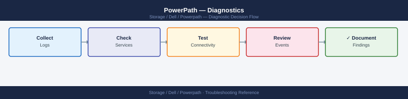

---
tags:
  - dell
  - troubleshooting
search:
  boost: 1.5
---
# PowerPath — Diagnostics

<div class="kb-summary">
PowerPath diagnostic commands: check path state and count with <code>powermt display dev=all</code> to identify dead or alive paths, verify license with <code>powermt check_registration</code>, inspect the PowerPath kernel module and HBA port state on Linux, correlate with FC switch fabric events (Brocade <code>errshow</code>, Cisco <code>show fcns database</code>), confirm array front-end port state at the array console, and collect a support bundle for Dell escalation.

*Applies to: PowerPath*
</div>



```mermaid
graph TD
    A([PowerPath issue or path loss]) --> B[powermt display dev=all\nCount dead vs alive paths]
    B --> C{Dead paths?}
    C -->|No dead paths| D[powermt check_registration\nConfirm license valid and current]
    C -->|Dead paths found| E[powermt display ports class=all\nIdentify HBA ports with dead paths]
    E --> F{HBA port state?}
    F -->|Port offline or missing| G[lsmod | grep emcp: module loaded?\ndmesg | grep emcpower: kern log\nSystemctl status PowerPath: service]
    F -->|Port online| H[Check fabric layer\nBrocade nsshow: initiator visible?\nCisco: show fcns database]
    G --> I{Module loaded?}
    I -->|No| J[Reinstall or reload emcp module\nCheck kernel version compatibility\nmodinfo emcp | grep version]
    I -->|Yes| K[/sys/class/fc_host: port state\nCheck link_failure_count value]
    H --> L{Initiator in name server?}
    L -->|No| M[Check FC zone configuration\nZone must contain initiator WWN\nCheck portlogshow for FLOGI events]
    L -->|Yes| N[Check array side\nConfirm FA port is Online\nConfirm host WWN is registered]
    J --> O[powermt restore\nVerify: powermt display dev=all]
    K --> O
    M --> O
    N --> O
    D --> O
    O --> P[Collect support bundle\nSee Step 6 for collection script\nOpen Dell support case]

    classDef dark fill:#1e3a5f,color:#fff
    classDef action fill:#78350f,color:#fff
    classDef escalate fill:#991b1b,color:#fff
    class A,C,F,I,L dark
    class B,D,E,G,H,J,K,M,N,O action
    class P escalate
```

## Before you begin

- **Access:** Root on the affected Linux host, or Administrator on Windows; SSH or console access to FC switches for fabric-level diagnostics; storage array admin account (Unisphere, Unisphere for PowerMax) for array-side checks
- **Gather first:** the exact PowerPath output (`powermt display dev=all`), the affected LUN pseudo device names, the number of dead vs alive paths, and whether the issue is on one host or multiple hosts
- **Scope:** determine which layer has failed — PowerPath layer (module issue, license expired), HBA/OS layer (port offline, driver crash), fabric layer (FC zone, switch port), or array layer (FA port offline, LUN masking) — `powermt display dev=all` tells you what PowerPath sees, not what caused it

---

## Step 1 — Initial diagnostic commands

Run these first on any host reporting I/O issues or path loss:

```bash
# 1. Full device and path state
powermt display dev=all

# 2. HBA port states (all device classes)
powermt display ports class=all

# 3. Current policy and PowerPath options
powermt display options

# 4. License state
powermt check_registration

# 5. PowerPath version
powermt version

# 6. Count dead paths — quick summary
powermt display dev=all | grep -c dead
powermt display dev=all | grep -c alive
```

Save the output of all commands before making any changes:

```bash
HOSTNAME=$(hostname -s)
TS=$(date +%Y%m%d_%H%M%S)
DIAG="${HOSTNAME}_powerpath_diag_${TS}.txt"

{
  echo "=== PowerPath Diagnostic: ${HOSTNAME} — $(date) ==="
  echo "--- powermt version ---"
  powermt version
  echo "--- powermt check_registration ---"
  powermt check_registration
  echo "--- powermt display options ---"
  powermt display options
  echo "--- powermt display dev=all ---"
  powermt display dev=all
  echo "--- powermt display ports class=all ---"
  powermt display ports class=all
} > "$DIAG"

echo "Diagnostic saved to: $DIAG"
```

---

## Step 2 — Linux-specific diagnostics

### Kernel module

```bash
# Confirm the PowerPath kernel module is loaded
lsmod | grep emcp

# Check the loaded module's version
modinfo emcp | grep -E "filename|version|description"

# Compare with the expected kernel version
uname -r

# Check for module load errors at boot time
dmesg | grep -i "emcp\|emcpower\|PowerPath" | head -50

# Check if the module is available for the current kernel
find /lib/modules/$(uname -r) -name "emcp*" 2>/dev/null
```

### PowerPath service

```bash
# Check the PowerPath daemon status
systemctl status PowerPath

# View recent service log entries
journalctl -u PowerPath --since "2 hours ago" --no-pager

# Check the service start time (to correlate with path events)
systemctl show PowerPath --property=ActiveEnterTimestamp
```

### HBA port state

```bash
# List all FC HBA ports and their state
ls /sys/class/fc_host/
for host in /sys/class/fc_host/host*; do
    port=$(basename $host)
    state=$(cat ${host}/port_state 2>/dev/null)
    wwpn=$(cat ${host}/port_name 2>/dev/null)
    speed=$(cat ${host}/speed 2>/dev/null)
    echo "${port}: state=${state} wwpn=${wwpn} speed=${speed}"
done

# Detailed HBA info via systool (if sysfsutils is installed)
systool -c fc_host -v

# HBA error statistics
for host in /sys/class/fc_host/host*; do
    port=$(basename $host)
    echo "=== ${port} statistics ==="
    cat ${host}/statistics/link_failure_count 2>/dev/null && echo " (link_failure_count)"
    cat ${host}/statistics/loss_of_signal_count 2>/dev/null && echo " (loss_of_signal_count)"
    cat ${host}/statistics/error_frames 2>/dev/null && echo " (error_frames)"
    cat ${host}/statistics/invalid_crc_count 2>/dev/null && echo " (invalid_crc_count)"
done
```

### Kernel messages

```bash
# SCSI and multipath-related kernel messages
dmesg | grep -iE "scsi|multipath|emcpower|powerpath|hba|fibre|fc_host" | tail -100

# Real-time kernel messages (watch during path restore)
dmesg -w | grep -iE "scsi|emcpower|powerpath"

# System log (path state change events)
grep -iE "emcp|PowerPath|dead path|path restored|SCSI error" /var/log/messages | tail -100

# journald equivalent
journalctl -k --since "2 hours ago" --no-pager | grep -iE "emcp|powerpath|scsi"
```

### SCSI device layer

```bash
# List all SCSI block devices (raw paths before PowerPath abstraction)
lsblk -S

# Confirm pseudo devices exist and are accessible
ls -la /dev/emcpower* 2>/dev/null
# Each emcpower* device corresponds to one LUN

# Check block device I/O queue state
cat /sys/block/sda/device/state 2>/dev/null
# 'running' is normal; 'offline' indicates a SCSI transport failure
```

### iSCSI-specific (if using iSCSI)

```bash
# Show iSCSI sessions
iscsiadm -m session

# Show detailed iSCSI session info
iscsiadm -m session -P 3

# Check iSCSI initiator IQN
cat /etc/iscsi/initiatorname.iscsi
```

---

## Step 3 — Windows-specific diagnostics

```powershell
# PowerPath device status
powermt display dev=all

# PowerPath service status
Get-Service -Name "EMCPower*"
Get-Service -Name "PowerPath*"

# Check if PowerPath driver is loaded
Get-WmiObject Win32_SystemDriver | Where-Object { $_.Name -match "emcpower" } |
    Select-Object Name, State, Status

# View recent PowerPath events in Windows Event Log
Get-WinEvent -LogName "System" -MaxEvents 100 |
    Where-Object { $_.ProviderName -match "emcpower|PowerPath" }

Get-WinEvent -LogName "Application" -MaxEvents 100 |
    Where-Object { $_.ProviderName -match "emcpower|PowerPath" }

# Disk status (confirm PowerPath disks are online)
Get-Disk | Select-Object Number, FriendlyName, OperationalStatus, HealthStatus

# HBA port info via WMI
Get-WmiObject -Namespace "root\WMI" -Class "MSFC_FCAdapterHBAAttributes" |
    Select-Object NodeWWN, PortWWN, NumberOfPorts
```

---

## Step 4 — SAN fabric diagnostics

When PowerPath dead paths do not recover after `powermt restore`, the issue is in the fabric or at the array. Run these on the switch, not on the host.

### Brocade (FOS)

```bash
# Port state for the switch port connected to the HBA
portshow <port_number>

# Fabric name server — confirm host initiator is logged in
nsshow
nsallshow

# Check port error counters
porterrshow

# Recent fabric event log
errshow

# Zone configuration — confirm this initiator and target are in the same zone
zoneshow
cfgshow
```

### Cisco MDS

```bash
# Port state for the switch port connected to the HBA
show interface fc1/4

# Name server — confirm host initiator is logged in
show fcns database

# Port error counters
show interface fc1/4 counters

# Zone set configuration
show zoneset active vsan <vsan_id>
show zone name <zone_name> vsan <vsan_id>
```

---

## Step 5 — Array-side diagnostics

Check at the storage array console when fabric-layer diagnostics show the fabric is healthy but paths remain dead.

### Unity (Unisphere)

- **System** > **Connectivity** > **FC Ports** — confirm all front-end ports are online
- **System** > **Hosts** — confirm the host is registered with correct WWNs; check connectivity status
- **Storage** > **LUNs** — confirm the LUN is in Ready state and the health is OK
- **Storage** > **Host Access** — confirm the LUN is included in the correct access policy or host group

### PowerMax (Unisphere for PowerMax)

- **System** > **Director and Port** — confirm FA (Front-end Adapter) ports are online and showing initiator logins
- **Connectivity** > **Host Views** — confirm the masking view for this host includes the expected LUNs
- **Performance** > **Frontend** — check for I/O errors or port saturation on the FA ports

---

## Step 6 — Support bundle collection

```bash
#!/bin/bash
# powerpath_support_collect.sh — Collect PowerPath diagnostic data for Dell Support
# Run as root on the affected host

HOSTNAME=$(hostname -s)
TS=$(date +%Y%m%d_%H%M%S)
OUTDIR="/tmp/pp_support_${HOSTNAME}_${TS}"
mkdir -p "$OUTDIR"

collect() {
  local label="$1"; shift
  echo "Collecting: ${label}"
  "$@" > "${OUTDIR}/${label}.txt" 2>&1 || true
}

# PowerPath data
collect "powermt_version"              powermt version
collect "powermt_check_registration"   powermt check_registration
collect "powermt_display_dev_all"      powermt display dev=all
collect "powermt_display_ports"        powermt display ports class=all
collect "powermt_display_options"      powermt display options

# OS and kernel
collect "uname"                        uname -a
collect "os_release"                   cat /etc/os-release
collect "kernel_modules"               lsmod

# HBA info
collect "fc_host_info"                 systool -c fc_host -v
collect "dmesg_scsi"                   bash -c "dmesg | grep -iE 'scsi|emcpower|powerpath|hba' | tail -200"

# Syslog
collect "syslog_emcp"                  bash -c "grep -iE 'emcp|powerpath|scsi error' /var/log/messages | tail -200"

# PowerPath service
collect "powerpath_service"            systemctl status PowerPath
collect "powerpath_journal"            bash -c "journalctl -u PowerPath --since '24 hours ago' --no-pager"

# Archive
tar -czf "/tmp/pp_support_${HOSTNAME}_${TS}.tar.gz" -C /tmp "pp_support_${HOSTNAME}_${TS}"
echo ""
echo "Support bundle: /tmp/pp_support_${HOSTNAME}_${TS}.tar.gz"
echo "Attach this file to your Dell support case."
```

---

## Log locations

| Platform | Log Location | What to Look For |
|---|---|---|
| Linux | `/var/log/messages` | `emcp`, `PowerPath`, `dead path`, `path restored`, `SCSI error` |
| Linux (systemd) | `journalctl -k` | Kernel messages with `emcp` or `scsi` keywords |
| Linux kernel ring | `dmesg` | Real-time SCSI transport and HBA events |
| Windows | Event Log — System + Application | Source: `emcpower`, `PowerPath` |
| AIX | `/var/adm/ras/errlog` (`errpt`) | PowerPath and SCSI-related error entries |
| HP-UX | `/var/adm/syslog/syslog.log` | PowerPath path state events |
| Brocade switch | `errshow` on the switch | Fabric events, port login/logout, CRC errors |
| Cisco MDS | `show logging` on the switch | Port state changes, FLOGI events |

---

## See also

- [PowerPath — Common Issues](common-issues/)
- [PowerPath — Escalation](escalation/)
- [PowerPath — Health Checks](../operations/health-checks/)

## Verify resolution

- `powermt display dev=all` shows no dead paths — all paths show `alive` for the affected LUNs
- `powermt display dev=all | grep -c dead` returns 0
- `powermt check_registration` shows the license is valid and not expired
- The host application can successfully read from and write to the affected LUN without I/O errors
- `dmesg | grep -i "emcpower\|SCSI error" | tail -10` shows no new error events after the fix was applied
