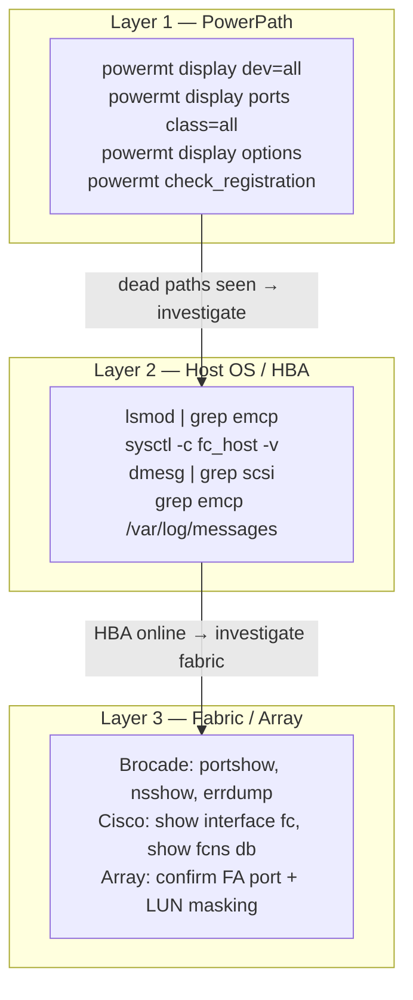

---
tags:
  - dell
  - troubleshooting
---
# PowerPath — Diagnostics


<div class="kb-summary">
Diagnostics reference covering Diagnostic Overview, Initial Diagnostic Commands, Linux-Specific Diagnostics, Windows-Specific Diagnostics, SAN Fabric Diagnostics and 3 more sections.
</div>
```text
┌──────────────────────────────────── Dell PowerPath — Diagnostics ─────────────────────────────────────┐
│                                                                                                       │
│   ┌───────────────────────────────────────────────────────────────────────────────────────────────┐   │
│   │         PowerPath diagnostics: log collection, health checks, and performance analysis        │   │
│   │          Tools: management CLI, REST API, vendor support bundle, and system event log         │   │
│   │          Performance: check I/O latency, throughput, queue depth, and cache hit rate          │   │
│   │       Collect support bundle before contacting vendor support to reduce time-to-resolve       │   │
│   └───────────────────────────────────────────────────────────────────────────────────────────────┘   │
│                                                                                                       │
│    Identify issue → collect logs → run diagnostics → analyse → resolve                                │
│                                                                                                       │
│                  ▼                                ▼                                ▼                  │
│                                                                                                       │
│   ┌─────────────────────────────┐  ┌─────────────────────────────┐  ┌─────────────────────────────┐   │
│   │            Layer            │  │          Component          │  │            Notes            │   │
│   │            Driver           │  │        powermt daemon       │  │           OS-level          │   │
│   │            Paths            │  │        Active-active        │  │         ≥4 paths/LUN        │   │
│   │            Policy           │  │        Adaptive/ALUA        │  │        Array-specific       │   │
│   │           Failover          │  │         Auto reroute        │  │          <5 sec RTO         │   │
│   │          Management         │  │           pp_mgmt           │  │         Centralised         │   │
│   └─────────────────────────────┘  └─────────────────────────────┘  └─────────────────────────────┘   │
│                                                                                                       │
│                          ▼                                                 ▼                          │
│                                                                                                       │
│   ┌───────────────────────────────────────────────────────────────────────────────────────────────┐   │
│   │    Component     │     Purpose      │      Command      │      Notes       │    Frequency     │   │
│   │ powermt display  │ Show path state  │  powermt display  │   Active/dead    │   Daily check    │   │
│   │  powermt check   │  Refresh paths   │   powermt check   │  After changes   │   Post-zoning    │   │
│   │  powermt config  │  Apply license   │  powermt config l │     Per host     │   Install time   │   │
│   │     pp_mgmt      │ Central monitor  │       Web UI      │     Optional     │    Multi-host    │   │
│   └───────────────────────────────────────────────────────────────────────────────────────────────┘   │
│                                                                                                       │
│    Physical: Host OS (Windows/Linux) · HBA or iSCSI NIC ports · FC/IP switches · Dell arrays          │
│                                                                                                       │
│    Key terms:                                                                                         │
│                                                                                                       │
│    PowerPath          = Dell multipath driver; manages multiple I/O paths to storage for HA/perform...│
│    powermt            = CLI utility; powermt display, powermt check, powermt save are core commands   │
│    Pseudo device      = virtual block device created by PowerPath aggregating physical I/O paths      │
│    Path health        = alive or dead status per path; dead paths trigger automatic I/O failover      │
│    Adaptive policy    = load-balancing that distributes I/O across all active paths evenly            │
│    CLARiiON policy    = active/passive policy for older VNX/CLARiiON arrays (one active path)         │
│    ALUA               = Asymmetric Logical Unit Access; array signals preferred vs. non-preferred p...│
│    Trespass           = LUN ownership movement between SP-A and SP-B on Unity or VNX arrays           │
│    Ghost path         = stale path entry in PowerPath no longer backed by a physical device           │
│    powermt check      = validates all paths and refreshes device table; run after fabric changes      │
│    pp_mgmt            = PowerPath Management Appliance; central monitoring for all PowerPath hosts    │
│    License key        = host-based license required per server; applied via powermt config license    │
│                                                                                                       │
└───────────────────────────────────────────────────────────────────────────────────────────────────────┘
```


## Diagnostic Overview



PowerPath diagnostics involve three layers: the PowerPath layer itself (pseudo devices, policies, path state), the host OS / HBA layer (kernel modules, HBA port state, SCSI transport), and the fabric/array layer (SAN switch, array front-end ports). Effective diagnosis requires correlating evidence from all three layers.

Always start with PowerPath-layer commands. They tell you what PowerPath sees. If PowerPath sees dead paths, the problem is at the HBA, fabric, or array layer — work outward from there.

---

## Initial Diagnostic Commands

Run these first on any host reporting I/O issues or path loss:

```bash
# 1. Full device and path state
powermt display dev=all

# 2. HBA port states (all device classes)
powermt display ports class=all

# 3. Current policy and PowerPath options
powermt display options

# 4. License state
powermt check_registration

# 5. PowerPath version
powermt version

# 6. Count dead paths — quick summary
powermt display dev=all | grep -c dead
powermt display dev=all | grep -c alive
```

Save the output of all five commands to a file before making any changes:

```bash
HOSTNAME=$(hostname -s)
TS=$(date +%Y%m%d_%H%M%S)
DIAG="${HOSTNAME}_powerpath_diag_${TS}.txt"

{
  echo "=== PowerPath Diagnostic: ${HOSTNAME} — $(date) ==="
  echo ""
  echo "--- powermt version ---"
  powermt version

  echo ""
  echo "--- powermt check_registration ---"
  powermt check_registration

  echo ""
  echo "--- powermt display options ---"
  powermt display options

  echo ""
  echo "--- powermt display dev=all ---"
  powermt display dev=all

  echo ""
  echo "--- powermt display ports class=all ---"
  powermt display ports class=all
} > "$DIAG"

echo "Diagnostic saved to: $DIAG"
```

---

## Linux-Specific Diagnostics

### Kernel Module

```bash
# Confirm the PowerPath kernel module is loaded
lsmod | grep emcp

# Check the loaded module's version
modinfo emcp | grep -E "filename|version|description"

# Compare with the expected kernel version
uname -r

# Check for module load errors at boot time
dmesg | grep -i "emcp\|emcpower\|PowerPath" | head -50

# Check if the module is available for the current kernel
find /lib/modules/$(uname -r) -name "emcp*" 2>/dev/null
```

### PowerPath Service

```bash
# Check the PowerPath daemon status
systemctl status PowerPath

# View recent service log entries
journalctl -u PowerPath --since "2 hours ago" --no-pager

# Check the service start time (to correlate with path events)
systemctl show PowerPath --property=ActiveEnterTimestamp
```

### HBA Port State

```bash
# List all FC HBA ports and their state
ls /sys/class/fc_host/
for host in /sys/class/fc_host/host*; do
    port=$(basename $host)
    state=$(cat ${host}/port_state 2>/dev/null)
    wwpn=$(cat ${host}/port_name 2>/dev/null)
    speed=$(cat ${host}/speed 2>/dev/null)
    echo "${port}: state=${state} wwpn=${wwpn} speed=${speed}"
done

# Detailed HBA info via systool (if sysfsutils is installed)
systool -c fc_host -v

# HBA error statistics (check for link_failure_count, loss_of_signal_count)
for host in /sys/class/fc_host/host*; do
    port=$(basename $host)
    echo "=== ${port} statistics ==="
    cat ${host}/statistics/link_failure_count 2>/dev/null && echo " (link_failure_count)"
    cat ${host}/statistics/loss_of_signal_count 2>/dev/null && echo " (loss_of_signal_count)"
    cat ${host}/statistics/error_frames 2>/dev/null && echo " (error_frames)"
    cat ${host}/statistics/invalid_crc_count 2>/dev/null && echo " (invalid_crc_count)"
done
```

### Kernel Messages

```bash
# SCSI and multipath-related kernel messages (most recent 100 lines)
dmesg | grep -iE "scsi|multipath|emcpower|powerpath|hba|fibre|fc_host" | tail -100

# Real-time kernel messages (watch during path restore)
dmesg -w | grep -iE "scsi|emcpower|powerpath"

# System log (path state change events)
grep -iE "emcp|PowerPath|dead path|path restored|SCSI error" /var/log/messages | tail -100

# journald equivalent
journalctl -k --since "2 hours ago" --no-pager | grep -iE "emcp|powerpath|scsi"
```

### SCSI Device Layer

```bash
# List all SCSI block devices (raw paths before PowerPath abstraction)
lsblk -S

# Show which underlying SCSI devices PowerPath is aggregating
ls /dev/sd* | head -30
# These should NOT have active mounts — they are raw paths under PowerPath pseudo devices

# Confirm pseudo devices exist and are accessible
ls -la /dev/emcpower* 2>/dev/null
# Each emcpower* device corresponds to one LUN (one pseudo device per LUN)

# Check block device I/O queue state
cat /sys/block/sda/device/state 2>/dev/null
# 'running' is normal; 'offline' indicates a SCSI transport failure
```

### iSCSI-Specific (if using iSCSI)

```bash
# Show iSCSI sessions
iscsiadm -m session

# Show detailed iSCSI session info (confirms which portal is connected)
iscsiadm -m session -P 3

# Check iSCSI initiator IQN
cat /etc/iscsi/initiatorname.iscsi
```

---

## Windows-Specific Diagnostics

```powershell
# PowerPath device status
powermt display dev=all

# PowerPath service status
Get-Service -Name "EMCPower*"
Get-Service -Name "PowerPath*"

# Check if PowerPath driver is loaded
Get-WmiObject Win32_SystemDriver | Where-Object { $_.Name -match "emcpower" } |
    Select-Object Name, State, Status

# View recent PowerPath events in Windows Event Log
Get-WinEvent -LogName "System" -MaxEvents 100 |
    Where-Object { $_.ProviderName -match "emcpower\|PowerPath" }

Get-WinEvent -LogName "Application" -MaxEvents 100 |
    Where-Object { $_.ProviderName -match "emcpower\|PowerPath" }

# Disk status (confirm PowerPath disks are online)
Get-Disk | Select-Object Number, FriendlyName, OperationalStatus, HealthStatus

# HBA port info via WMI
Get-WmiObject -Namespace "root\WMI" -Class "MSFC_FCAdapterHBAAttributes" |
    Select-Object NodeWWN, PortWWN, NumberOfPorts
```

---

## SAN Fabric Diagnostics

When PowerPath dead paths do not recover after `powermt restore`, the issue is in the fabric or at the array. These are reference commands — run on the switch, not on the host.

### Brocade (FOS)

```bash
# Port state for the switch port connected to the HBA
portshow <port_number>

# Fabric name server — confirm host initiator is logged in
nsshow
# or
nsallshow

# Check port error counters
porterrshow

# Recent fabric event log
errshow

# Zone configuration — confirm this initiator and target are in the same zone
zoneshow
cfgshow
```

### Cisco MDS

```bash
# Port state for the switch port connected to the HBA
show interface fc1/4

# Name server — confirm host initiator is logged in
show fcns database

# Port error counters
show interface fc1/4 counters

# Zone set configuration
show zoneset active vsan <vsan_id>
show zone name <zone_name> vsan <vsan_id>
```

---

## Array-Side Diagnostics

Check at the storage array console when fabric-layer diagnostics show the fabric is healthy but paths remain dead.

### Unity (Unisphere)

- **System** > **Connectivity** > **FC Ports** — confirm all front-end ports are online
- **System** > **Hosts** — confirm the host is registered with correct WWNs; check connectivity status
- **Storage** > **LUNs** — confirm the LUN is in Ready state and the health is OK
- **Storage** > **Host Access** — confirm the LUN is included in the correct access policy or host group

### PowerMax (Unisphere for PowerMax)

- **System** > **Director and Port** — confirm FA (Front-end Adapter) ports are online and showing initiator logins
- **Connectivity** > **Host Views** — confirm the masking view for this host includes the expected LUNs
- **Performance** > **Frontend** — check for I/O errors or port saturation on the FA ports

---

## Log Locations Reference

| Platform | Log Location | What to Look For |
|---|---|---|
| Linux | `/var/log/messages` | `emcp`, `PowerPath`, `dead path`, `path restored`, `SCSI error` |
| Linux (systemd) | `journalctl -k` | Kernel messages with `emcp` or `scsi` keywords |
| Linux kernel ring | `dmesg` | Real-time SCSI transport and HBA events |
| Windows | Event Log — System + Application | Source: `emcpower`, `PowerPath` |
| AIX | `/var/adm/ras/errlog` (`errpt`) | PowerPath and SCSI-related error entries |
| HP-UX | `/var/adm/syslog/syslog.log` | PowerPath path state events |
| Brocade switch | `errshow` on the switch | Fabric events, port login/logout, CRC errors |
| Cisco MDS | `show logging` on the switch | Port state changes, FLOGI events |

---

## Diagnostic Collection for Dell Support

Before escalating a case to Dell Support, collect all of the following. Attach as a single archive to the support case.

```bash
#!/bin/bash
# powerpath_support_collect.sh — Collect PowerPath diagnostic data for Dell Support
# Run as root on the affected host

HOSTNAME=$(hostname -s)
TS=$(date +%Y%m%d_%H%M%S)
OUTDIR="/tmp/pp_support_${HOSTNAME}_${TS}"
mkdir -p "$OUTDIR"

collect() {
  local label="$1"; shift
  echo "Collecting: ${label}"
  "$@" > "${OUTDIR}/${label}.txt" 2>&1 || true
}

# PowerPath data
collect "powermt_version"              powermt version
collect "powermt_check_registration"   powermt check_registration
collect "powermt_display_dev_all"      powermt display dev=all
collect "powermt_display_ports"        powermt display ports class=all
collect "powermt_display_options"      powermt display options

# OS and kernel
collect "uname"                        uname -a
collect "os_release"                   cat /etc/os-release
collect "kernel_modules"               lsmod

# HBA info
collect "fc_host_info"                 systool -c fc_host -v
collect "dmesg_scsi"                   bash -c "dmesg | grep -iE 'scsi|emcpower|powerpath|hba' | tail -200"

# Syslog
collect "syslog_emcp"                  bash -c "grep -iE 'emcp|powerpath|scsi error' /var/log/messages | tail -200"

# PowerPath service
collect "powerpath_service"            systemctl status PowerPath
collect "powerpath_journal"            bash -c "journalctl -u PowerPath --since '24 hours ago' --no-pager"

# Archive
tar -czf "/tmp/pp_support_${HOSTNAME}_${TS}.tar.gz" -C /tmp "pp_support_${HOSTNAME}_${TS}"
echo ""
echo "Support bundle: /tmp/pp_support_${HOSTNAME}_${TS}.tar.gz"
echo "Attach this file to your Dell support case."
```
