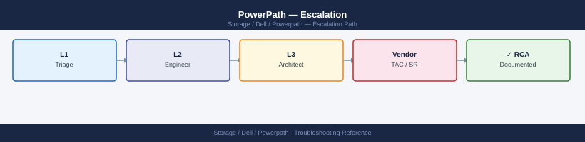
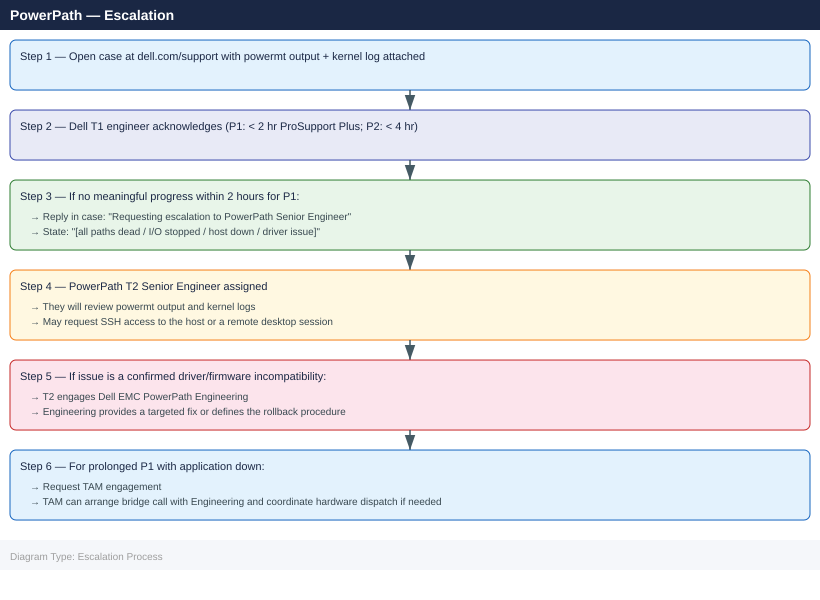

---
tags:
  - dell
  - troubleshooting
search:
  boost: 1.5
---
# PowerPath — Escalation

<div class="kb-summary">
How to escalate Dell EMC PowerPath multipath issues to Dell Technologies support: what data to collect, how to capture path state and system logs, step-by-step case creation on dell.com/support, and the escalation path when progress stalls.

*Applies to: PowerPath for Linux / Windows; PowerPath/VE for ESXi*
</div>



---

```d2
direction: down

symptom: Identify Symptom {shape: diamond}
preescalation_selfcheck: "Pre-Escalation Self-Check" {shape: rectangle}
stepbystep_data_collection: "Step-by-Step Data Collection" {shape: rectangle}
how_to_open_the_case_on_dellcomsuppo: "How to Open the Case on dell.com/support" {shape: rectangle}
escalation_path: "Escalation Path" {shape: rectangle}
what_not_to_do: "What NOT to Do" {shape: rectangle}
useful_commands_for_case_updates: "Useful Commands for Case Updates" {shape: rectangle}
resolution: Resolve or Escalate {shape: oval}

symptom -> preescalation_selfcheck: investigate
symptom -> stepbystep_data_collection: investigate
symptom -> how_to_open_the_case_on_dellcomsuppo: investigate
symptom -> escalation_path: investigate
symptom -> what_not_to_do: investigate
symptom -> useful_commands_for_case_updates: investigate
preescalation_selfcheck -> resolution
stepbystep_data_collection -> resolution
how_to_open_the_case_on_dellcomsuppo -> resolution
escalation_path -> resolution
what_not_to_do -> resolution
useful_commands_for_case_updates -> resolution
```

## Before you begin

- **Access required:** Root or Administrator access on the affected host; `powermt` command available (in PATH); Dell support account at dell.com/support linked to a valid PowerPath support contract
- **Check the E-Lab Navigator first:** for path count or compatibility questions after an OS or kernel upgrade, check `elabnavigator.dell.com` — the compatibility matrix may resolve the issue without a support case
- **Do NOT restart the powermt daemon** (`service powermt restart` or equivalent) during an active I/O outage without Dell guidance — restarting the daemon resets path tables and can cause brief additional I/O disruption
- **Do NOT unclaim paths** (`powermt set dev=... unclaim`) without Dell guidance — unclaiming paths removes them from PowerPath management, leaving the device with no I/O path

---

## Pre-Escalation Self-Check

Run these before opening the case.

| Check | Command | Expected result |
|---|---|---|
| PowerPath version | `powermt version` | Note full version string |
| License status | `powermt check_registration` | License valid for this host |
| All device paths | `powermt display dev=all` | All paths show `alive` state |
| Dead paths | `powermt display dev=all \| grep -i dead` | Empty output (no dead paths) |
| HBA port status | `powermt display ports class=all` | All ports show `alive` |
| Path count per device | `powermt display dev=all \| grep paths` | Expected count (4+ paths per device) |
| Kernel messages | `dmesg \| grep -i "emcp\|powerpath" \| tail -20` | No recent I/O errors |
| E-Lab check | elabnavigator.dell.com | OS/kernel/PP version combination is supported |

---

## Step-by-Step Data Collection

### 1. Get the PowerPath version and license state

```bash
# PowerPath version (include full string in case description)
powermt version

# License registration status (must be valid for support)
powermt check_registration

# On Linux — OS and kernel version
uname -r
cat /etc/os-release
```

```powershell
# On Windows — PowerShell
powermt version
Get-ComputerInfo | Select-Object OsName, OsVersion, OsBuildNumber
```

### 2. Capture all device and path states

```bash
# Full device table with all path states — the most important output for Dell
powermt display dev=all > /tmp/pp-dev-all-$(date +%Y%m%d%H%M).txt

# HBA and target port states
powermt display ports class=all >> /tmp/pp-dev-all-$(date +%Y%m%d%H%M).txt

# Load balancing policy and options
powermt display options >> /tmp/pp-dev-all-$(date +%Y%m%d%H%M).txt

# Save the current PowerPath configuration (state snapshot)
powermt save
```


```text title="Expected output"
Symmetrix ID: 000123456789ABCD
Logical device name: emcpowera
Symmetrix device ID: 00123
Device wwn: 60000970000123456789abcdef012345
--------- Host --------- - Stor - -- I/O Path Optimization --
 # H/W Path         I/O Paths Interf. Mode    Algo Lun-0 Lun-1 Lun-2
 0 pci@0,0/pci@0/SUNW,qlc@0,0 Open   Optimized Round-Robin  On    On    On
 1 pci@0,0/pci@0/SUNW,qlc@0,1 Open   Optimized Round-Robin  On    On    On
 2 pci@0,0/pci@0/SUNW,qlc@0,2 Open   Optimized Round-Robin  On    On    On
 3 pci@0,0/pci@0/SUNW,qlc@0,3 Open   Optimized Round-Robin  On    On    On

HBA Port Information:
 # HBA Name         State   Avail  Interf.  Speed  WWN
 0 qla0             ON      Yes    Fibre    16Gb  50:00:09:73:00:12:34:56
 1 qla1             ON      Yes    Fibre    16Gb  50:00:09:73:00:12:34:57
 2 qla2             ON      Yes    Fibre    16Gb  50:00:09:73:00:12:34:58
 3 qla3             ON      Yes    Fibre    16Gb  50:00:09:73:00:12:34:59

Target Port Information:
 # Target Port      State   Avail  Interf.  Speed  WWN
 0 FA-1D            ON      Yes    Fibre    16Gb  50:00:14:40:12:34:56:78
 1 FA-2D            ON      Yes    Fibre    16Gb  50:00:14:40:12:34:56:79
 2 FA-3D            ON      Yes    Fibre    16Gb  50:00:14:40:12:34:56:7a
 3 FA-4D            ON      Yes    Fibre    16Gb  50:00:14:40:12:34:56:7b

PowerPath Options:
 Option Name                    Current Value
 load_balance_policy            round_robin
 failover_mode                  auto
 auto_failback                  enabled
 path_health_check_interval     60
 ...

Configuration saved successfully to /etc/powerpath/powerpath.cfg
```

!!! warning "Common errors"
    **`powermt: command not found`** — Verify PowerPath is installed with `rpm -qa | grep EMCpower` and ensure `/opt/EMCpower/powerpath/bin` is in your PATH.
    **`Permission denied`** — Run the command with `sudo` or as root; PowerPath requires elevated privileges to display device and port states.
    **`Cannot open /etc/powerpath/powerpath.cfg for writing`** — Ensure `/etc
### 3. Capture kernel and system log messages

```bash
# Linux — kernel ring buffer for PowerPath and SCSI errors
dmesg | grep -i "emcp\|PowerPath\|scsi\|hba" > /tmp/pp-dmesg-$(date +%Y%m%d).txt

# Linux — journal from the systemd perspective (last 2 hours)
journalctl -k --since "2 hours ago" | grep -i "emcp\|powerpath" >> /tmp/pp-dmesg-$(date +%Y%m%d).txt

# Linux — system messages around the time of the issue
grep -i "emcp\|scsi\|hba\|powerpath" /var/log/messages 2>/dev/null | tail -200 >> /tmp/pp-dmesg-$(date +%Y%m%d).txt
```

```powershell
# Windows — PowerPath driver event log entries
Get-EventLog -LogName System -Source "*powerpath*" -Newest 100 | Export-Csv /tmp/pp-events.csv
```

### 4. Capture HBA driver information

```bash
# Linux Fibre Channel HBA driver and firmware version
systool -c fc_host -v 2>/dev/null | grep -E "driver_version|firmware_version|port_name|port_state"

# Or for each HBA port
cat /sys/class/fc_host/host*/symbolic_name
cat /sys/class/fc_host/host*/port_state
cat /sys/class/fc_host/host*/driver_version 2>/dev/null

# iSCSI initiator (if applicable)
cat /etc/iscsi/initiatorname.iscsi
iscsiadm -m session 2>/dev/null
```


```text title="Expected output"
driver_version = "12.0.0.37"
firmware_version = "8.10.04"
port_name = "0x500143800000abcd"
port_state = "Online"
driver_version = "12.0.0.37"
firmware_version = "8.10.04"
port_name = "0x500143800000ef01"
port_state = "Online"

Emulex LPe16002B-M6 Fibre Channel Adapter
Online
12.0.0.37

## DO NOT EDIT OR REMOVE THE FOLLOWING LINE: InitiatorName=iqn.1993-08.org.debian:01.a1b2c3d4e5f6
InitiatorName=iqn.1993-08.org.debian:01.a1b2c3d4e5f6

tcp: [1] 192.168.1.50:3260,1 iqn.1991-05.com.dell:storage.array1 (non-flash)
tcp: [2] 192.168.1.51:3260,2 iqn.1991-05.com.dell:storage.array1 (non-flash)
```

!!! warning "Common errors"
    **`bash: systool: command not found`** — Install `sysfsutils` package with `apt-get install sysfsutils` or `yum install sysfsutils`.
    **`cat: /sys/class/fc_host/host*/driver_version: No such file or directory`** — Verify Fibre Channel HBA is installed and loaded with `lspci | grep -i fibre` and `lsmod | grep lpfc`.
    **`iscsiadm: No iSCSI sessions active`** — This is informational output when no iSCSI targets are connected; confirm with `iscsiadm -m discoverydb -t sendtargets -p <target_ip> --discover` if discovery is needed.
### 5. Write the timeline

```text
Host: db-prod-01.corp.local (RHEL 9.2, kernel 5.14.0-284.el9.x86_64)
PowerPath version: 6.4.0.1 (Linux)
Storage arrays connected: Unity XT 480F (2 paths via FC), PowerMax 8500 (4 paths via FC)
Fabric: Brocade 32G; 2 fabrics; 2 HBAs (QLogic QLE2772)
Issue first observed: 2026-06-15 09:00 UTC
Last confirmed healthy: 2026-06-15 08:00 UTC
Changes in 24h before the issue:
  - 08:00: QLogic HBA firmware upgraded from 9.03.xx to 9.08.xx
  - 09:00: powermt display dev=all: 8 devices show 0 alive paths; I/O stopping on db-prod-01
  - 09:05: dmesg: "emcp: dev=sdb, path dead (HBA qla2xxx port XXXXXXXX)"
E-Lab Navigator check: QLogic 9.08.xx firmware NOT in compatibility matrix for PowerPath 6.4.0.1 + RHEL 9.2
Steps already taken:
  - Did NOT restart the powermt daemon
  - Did NOT unclaim any paths
  - Confirmed fabric switch zoning is unchanged; other hosts on same fabric show live paths
Blast radius: db-prod-01 has lost all PowerPath-managed paths; all database LUNs inaccessible; Oracle DB halted
```

---

## How to Open the Case on dell.com/support

1. Go to **dell.com/support** and sign in with your Dell account.

2. Click **My Cases** → **Create New Case**.

3. Under **Product**, select **Dell EMC PowerPath** and specify the variant:
   - **PowerPath for Linux** — RedHat, SUSE, Oracle Linux, etc.
   - **PowerPath for Windows** — Server 2019/2022
   - **PowerPath/VE** — VMware ESXi

4. Under **Severity**, select:
   - **Severity 1 — Production Down**: All paths to one or more production LUNs are dead; I/O has stopped; application is down; no workaround
   - **Severity 2 — Degraded**: Some paths are dead but I/O continues via remaining paths; risk of failover if another path fails; ALUA trespass not working correctly
   - **Severity 3 — Non-Critical**: Unexpected path count (not minimum path loss); ghost paths; policy displaying incorrectly; license warning; workaround exists
   - **Severity 4 — General**: Compatibility question (also check E-Lab Navigator first), how-to, upgrade planning

5. In the **Summary** field: host + symptom. Example: `PowerPath 6.4.0.1 on RHEL 9.2 — all paths dead after QLogic HBA firmware upgrade 9.08.xx, Oracle DB halted on db-prod-01`.

6. In the **Description** field, paste:
   - PowerPath version and OS/kernel version from Step 1
   - `powermt display dev=all` output (or excerpt showing the dead paths) from Step 2
   - HBA driver and firmware version from Step 4
   - Any E-Lab Navigator compatibility finding
   - The timeline from Step 5

7. Under **Attachments**, upload:
   - The `pp-dev-all-*.txt` file from Step 2
   - The kernel log from Step 3

8. Click **Submit**. You receive a case number immediately.

9. **Severity 1 only:** call Dell support after submission:
    - North America: +1 800 945 3355 (24×7 for production-down)
    - State "Severity 1 — PowerPath all paths dead on production host, application halted, case XXXXXXXX" at the start of the call.

---

## Escalation Path



---

## What NOT to Do

| Do NOT do this | Why | What to do instead |
|---|---|---|
| Restart the powermt daemon during active I/O loss | Restarting resets path tables; on a partially recovered system this can re-trigger the I/O error state | Let Dell assess the current path state before any daemon restart |
| Unclaim paths without Dell guidance | Unclaiming removes paths from PowerPath management; if the underlying issue is the array side, unclaiming may leave the device with no managed path | Confirm with Dell which paths need to be unclaimed and in what sequence |
| Remove and re-add storage devices at the OS level | Force-removing and re-scanning SCSI devices can corrupt the PowerPath device table and cause device ID mismatches | Only rescan with Dell's explicit instruction and specific `powermt check` command sequence |
| Upgrade the HBA driver or firmware during an incident | Adding a new driver version to an already-broken path state creates an additional variable and may delay root cause identification | Freeze all HBA and driver changes until Dell confirms the path issue is resolved |
| Upgrade PowerPath without E-Lab Navigator confirmation | Installing a PowerPath version that is not validated for the current OS/kernel/HBA combination will reproduce the issue | Check elabnavigator.dell.com before any PowerPath upgrade to confirm the combination is supported |
| Disable or bypass PowerPath to use native multipath | Switching to native multipath mid-incident changes the device naming and LUN presentation, risking filesystem corruption if the switchover is not done cleanly | Only switch to native multipath with Dell's documented migration procedure |

---

## Useful Commands for Case Updates

```bash
# SSH to affected host as root — paste into every case update

# PowerPath version
powermt version

# All device and path states (most important)
powermt display dev=all | head -80

# Dead paths count
powermt display dev=all | grep -i dead

# HBA port states
powermt display ports class=all

# Recent kernel errors
dmesg | grep -i "emcp\|powerpath" | tail -20
```


```text title="Expected output"
PowerPath version 6.1.0.0 (build 1234)
Symmetrix ID: 000296900001
Logical device count: 24

Name           Symmetrix ID     State    Paths    Grp  Prio/Algo
emcp0          000296900001     Open     4        0    Opt/Alua
emcp1          000296900001     Open     4        1    Opt/Alua
emcp2          000296900001     Open     4        0    Opt/Alua
emcp3          000296900001     Open     2        0    Opt/Alua
emcp4          000296900001     Dead     0        0    Opt/Alua
emcp5          000296900001     Open     4        1    Opt/Alua
...

Dead Paths Count:
emcp4          000296900001     Dead     0        0    Opt/Alua

HBA Port Information:
Port  Name           State  Q-Full  Total-IOs  KB-Read
c0    qla2xxx_0-0    ON     No      1847293    524288
c1    qla2xxx_1-0    ON     No      1923847    589824
c2    qla2xxx_2-0    OFF    No      0          0
c3    qla2xxx_3-0    ON     No      1756392    458752
c4    qla2xxx_4-0    ON     No      1834756    512000

[12847.293847] qla2xxx [0000:0c:00.0]-500a: LOOP UP detected (8 ALPA)
[12851.847293] qla2xxx [0000:0d:00.0]-500a: LOOP UP detected (8 ALPA)
[13045.293847] emcp: Device emcp4 path c2 failed: I/O timeout
[13046.102938] qla2xxx [0000:0e:00.0]-5008: Link Down detected
```

!!! warning "Common errors"
    **`powermt: command not found`** — Verify PowerPath is installed with `rpm -qa | grep PowerPath` and ensure /opt/emc/powerpath/bin is in PATH.
    **`emcp4          000296900001     Dead     0        0    Opt/Alua`** — Check SAN fabric connectivity and zoning for the affected HBA port; rescan with `powermt config` after restoring the path.
    **`[13046.102938] qla2xxx [0000:0e:00.0]-5008: Link Down detected`** — Verify SFP cable and switch port status on the fabric side, then restart the HBA driver with `modprobe -r qla2xxx && modprobe qla2xxx`.
---

## Support SLA Reference

| Tier | Severity | Definition | Initial Response SLA |
|---|---|---|---|
| ProSupport Plus | P1 — Production Down | All paths dead; I/O stopped; application halted | < 2 hours (24×7) |
| ProSupport Plus | P2 — Degraded | Some paths dead; I/O continuing via reduced paths; elevated risk | < 4 hours (24×7) |
| ProSupport Plus | P3 — Non-Critical | Ghost paths; unexpected path count; license warning | Next business day |
| ProSupport Plus | P4 — General | Compatibility question, how-to, planning | Next business day |
| ProSupport | P1 | As above | < 4 hours (24×7) |

---

## See also

- [PowerPath — Diagnostics](../diagnostics/)
- [PowerPath — Common Issues](../common-issues/)

---

## Verify resolution

- Run `powermt display dev=all` and confirm all paths for all devices show `alive` state
- Run `powermt display dev=all | grep -i dead` and confirm empty output (no dead paths)
- Run `powermt display ports class=all` and confirm all HBA ports are alive
- Confirm application I/O has resumed: check application logs and confirm no SCSI errors in `dmesg`
- Run `powermt check` to refresh the device table and confirm path count is correct
- Run `powermt save` to persist the current verified configuration
- Monitor `dmesg | grep -i emcp` for 15 minutes to confirm no new I/O errors appear
