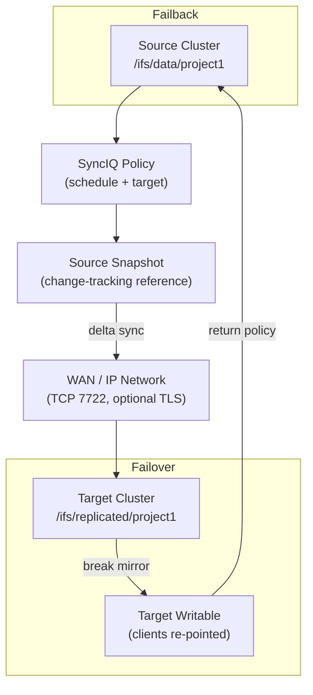

# PowerScale — Components

## Core Components

| Component | Description |
|---|---|
| OneFS Node | Individual server unit; contains CPU, RAM, NVMe/SSD/HDD storage, and network interfaces. Every node runs OneFS and participates in the distributed file system. |
| OneFS OS | Distributed OS running on all nodes; manages a single coherent namespace across the cluster. |
| SmartPools | Policy-based data tiering; automatically migrates files between node pools (SSD, SAS, SATA/NL-SAS) based on access time or custom criteria. |
| Access Zones | Virtual NAS partitions; each zone has its own IP pool, authentication provider, and export/share namespace. Used to multi-tenant the cluster. |
| SmartConnect | DNS-based connection load balancing; distributes NFS/SMB client connections across node IP addresses within a zone. |
| SyncIQ | Asynchronous replication engine; replicates directories to a remote PowerScale cluster at scheduled intervals or continuously. |
| SnapshotIQ | Per-directory point-in-time snapshots stored within `/ifs/.snapshot/` |
| SmartQuotas | Per-directory or per-user capacity quotas with advisory, soft, and hard thresholds. |
| CloudPools | Tiering of cold data to object stores (AWS S3, Azure Blob, ECS) as a transparent extension of `/ifs`. |
| InsightIQ | (Legacy) Performance analytics collector; replaced by CloudIQ in current deployments. |

## SyncIQ — Replication



SyncIQ policy management, monitoring, and failover/failback operations on Dell PowerScale.

### Policy Management

```bash
# List all SyncIQ policies
isi sync policies list
isi sync policies list -v

# View a specific policy
isi sync policies view <policy_name>

# Create a policy (source → target, daily at 02:00)
isi sync policies create <policy_name> \
    --action sync \
    --source-root-path /ifs/data/project1 \
    --target-host <target-cluster-ip> \
    --target-path /ifs/replicated/project1 \
    --schedule "every 1 days at 02:00"

# Enable / disable a policy
isi sync policies modify <policy_name> --enabled yes
isi sync policies modify <policy_name> --enabled no

# Delete a policy
isi sync policies delete <policy_name>
```

### Running and Monitoring Jobs

```bash
# Start a manual sync job
isi sync jobs start <policy_name>

# Check currently running jobs
isi sync jobs list
isi sync jobs list --state running

# View job details
isi sync jobs view <job_id>

# Check last completed job result
isi sync jobs list --state finished | head -5

# Failed jobs
isi sync jobs list --state failed
```

### Policy Health and RPO

```bash
# Last successful sync time for all policies
isi sync policies list | grep -E "Policy Name|Last Success"

# Policies that haven't synced in > 24 hours
isi sync policies list -v | grep -E "Name|Last Success" | paste - - | \
    awk '{ if ($NF < strftime("%s") - 86400) print "OVERDUE:", $0 }'

# Policy performance report
isi sync reports list <policy_name>
isi sync reports view <policy_name> <report_id>
```

### Failover and Failback

```bash
# --- Planned Failover ---

# Step 1 — disable the source policy (stops new syncs)
isi sync policies modify <policy_name> --enabled no

# Step 2 — run a final sync to minimise RPO
isi sync jobs start <policy_name>
isi sync jobs list --state running   # wait for completion

# Step 3 — on the TARGET cluster, allow writes (break the mirror)
isi sync policies delete <policy_name>   # or use Superna Eyeglass for orchestrated failover
# OR use the SyncIQ failover command if available:
isi sync policies failover <policy_name>

# Step 4 — mount shares from DR cluster
# (update DNS or DFS to point to DR cluster)
```

```bash
# --- Failback ---

# Step 1 — create a return policy from DR to primary
isi sync policies create <return_policy_name> \
    --action sync \
    --source-root-path /ifs/replicated/project1 \
    --target-host <primary-cluster-ip> \
    --target-path /ifs/data/project1

# Step 2 — run full sync back to primary
isi sync jobs start <return_policy_name>

# Step 3 — once synced, re-enable original policy on primary
isi sync policies modify <policy_name> --enabled yes
```

### SyncIQ Certificates and Connectivity

```bash
# List replication peer certificates
isi sync target policies list

# Test connectivity to the target cluster
isi sync policies view <policy_name> | grep "Target Host"
ping <target-cluster-ip>

# Check SyncIQ service
isi services synciq status
```

### Troubleshooting

```bash
# View error details for a failed job
isi sync jobs view <job_id>
isi sync reports list <policy_name> | head -3

# Check event log for SyncIQ errors
isi event events list | grep -i sync

# Reset a policy after conflict (when both sides have been written to)
isi sync policies reset <policy_name>
```
