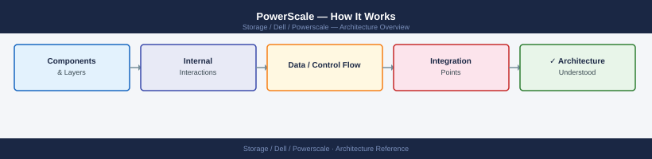
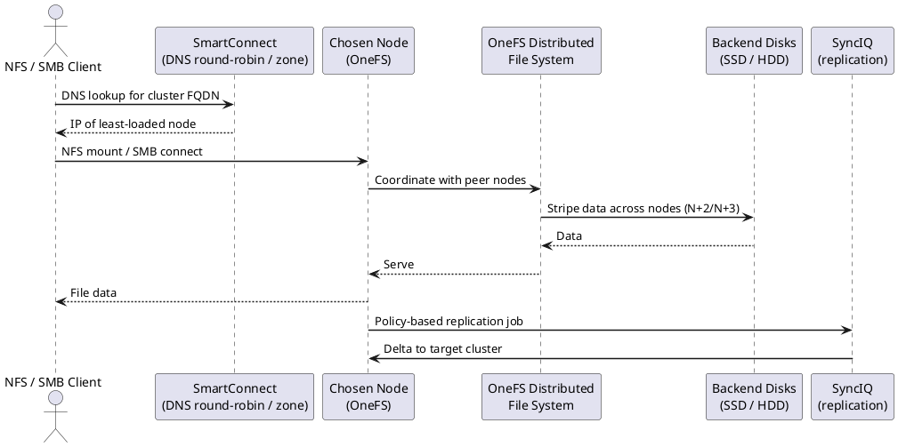

---
tags:
  - architecture
  - dell
---
# PowerScale — How It Works

<div class="kb-summary">
How It Works reference covering Overview, Architecture, OneFS Distributed File System, HA and Protection Levels, Node Pool and Tier Architecture and 4 more sections.

*Applies to: PowerScale (Isilon) 9.x*
</div>




## Overview

Dell PowerScale (formerly Isilon) is a scale-out NAS platform running the **OneFS** distributed operating system. All nodes in a cluster are peers — there is no dedicated metadata controller. The entire cluster presents a single namespace rooted at `/ifs` across all protocols (NFS, SMB, HDFS, S3, FTP). Clusters scale from a minimum of 3 nodes to 252 nodes.

## Architecture

```d2
direction: right

N1: "Node 1" {shape: rectangle}
N2: "Node 2" {shape: rectangle}
N3: "Node 3" {shape: rectangle}
NN: "Node N…" {shape: rectangle}
INT: "InfiniBand / 100GbE\nInternal Cluster Network" {shape: rectangle}
SC: "SmartConnect\n(DNS-based load balancing" {shape: rectangle}
NFS: "NFS v3/v4 Clients" {shape: rectangle}
SMB: "SMB / CIFS Clients" {shape: rectangle}
HDFS: "HDFS / S3 Clients" {shape: rectangle}

N1 -> N2
N2 -> N3
N3 -> NN
NN -> INT
INT -> SC
SC -> NFS
SC -> SMB
SC -> HDFS
```

## OneFS Distributed File System

OneFS runs identically on every node. There is no primary node or metadata controller — all nodes share metadata, data, and client I/O.

- **Single global namespace**: All data lives under `/ifs`. No volumes, LUNs, or mount points.
- **Distributed metadata**: File metadata (inodes, block maps, directory entries) is erasure-coded and distributed across all nodes — no metadata bottleneck.
- **Distributed locking**: Coherence is maintained via per-I/O node ownership; NFS write caching and SMB oplocks operate within this framework.

## HA and Protection Levels

| Level | Survives | Recommended Use |
|---|---|---|
| N+1 | 1 node or drive failure | Minimum for any production cluster |
| N+2 | 2 simultaneous failures | Standard recommendation for production |
| N+3 | 3 simultaneous failures | High-value data; archive clusters |
| 2x (mirroring) | Any 1 full copy lost | Small clusters or metadata-heavy workloads |

Losing a node triggers **SMARTFAIL** — OneFS rebalances data to remaining nodes. Quorum (strict majority) is required for write operations.

## Node Pool and Tier Architecture

```d2
direction: right

cluster: "OneFS Cluster\n(single /ifs namespace" {shape: rectangle}
poolNVMe: "Node Pool: F-series NVMe\n(all-flash — performance tier" {shape: rectangle}
poolSAS: "Node Pool: H-series Hybrid\n(NVMe + SAS — capacity tier" {shape: rectangle}
poolNLSAS: "Node Pool: A-series NL-SAS\n(high-density — archive tier" {shape: rectangle}
fp: "SmartPools File Policy\n(age / path / type rules" {shape: rectangle}

cluster -> poolNVMe
cluster -> poolSAS
cluster -> poolNLSAS
fp -> poolNVMe
fp -> poolSAS
fp -> poolNLSAS
```

## Components

| Component | Description |
|---|---|
| OneFS Node | Individual server unit with CPU, RAM, and NVMe/SSD/HDD. Every node runs OneFS. |
| SmartPools | Policy-based data tiering; migrates files between node pools based on access time or custom criteria. |
| Access Zones | Virtual NAS partitions; each zone has its own IP pool, auth provider, and share namespace. |
| SmartConnect | DNS-based load balancing; distributes client connections across node IPs within a zone. |
| SyncIQ | Asynchronous replication engine; replicates directories to a remote PowerScale cluster. |
| SnapshotIQ | Per-directory point-in-time snapshots stored within `/ifs/.snapshot/`. |
| SmartQuotas | Per-directory or per-user capacity quotas with advisory, soft, and hard thresholds. |
| CloudPools | Tiers cold data to object stores (AWS S3, Azure Blob, ECS) as a transparent extension of `/ifs`. |

## Connectivity

| Protocol | Port | Notes |
|---|---|---|
| NFS v3/v4 | TCP/UDP 2049 | Primary Unix/Linux protocol; per access zone |
| SMB 2.x/3.x | TCP 445 | Windows file sharing; per access zone |
| S3 | TCP 9020/9021 | Object API; per access zone |
| HDFS | TCP 8020 | Hadoop; maps `/ifs` paths as HDFS volumes |
| Management API (PAPI) | TCP 8080/8081 | REST API for automation |
| SyncIQ replication | TCP 7722 | Cluster-to-cluster replication traffic |
| SSH | TCP 22 | CLI access; restrict to management VLAN |

## Node Hardware Families

| Family | Storage Type | Primary Use Case |
|---|---|---|
| F-series (F600, F900) | All-NVMe SSD | High-IOPS workloads: EDA, genomics, databases |
| H-series (H700, H7000) | NVMe + SAS HDD hybrid | Mixed workloads: home directories, general NAS |
| A-series (A300, A3000) | NL-SAS (high-density) | Archive and cold data; long-term retention |

## Key CLI Commands

```bash
isi status                    # cluster node and drive health
isi event list                # active events — filter for CRITICAL
isi storagepool list          # capacity per tier
isi sync policies list        # SyncIQ policy status
isi quota list                # quota violations
isi network pools list        # SmartConnect zone config
isi job list                  # background jobs (Restripe, FlexProtect)
```

---

## See also

- [Powerscale — Design Standards](../design-standards/)
- [Powerscale — Integrations](../integrations/)
- [Powerscale — Deploy](../../deploy/)
