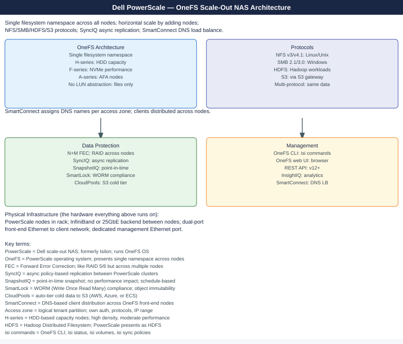
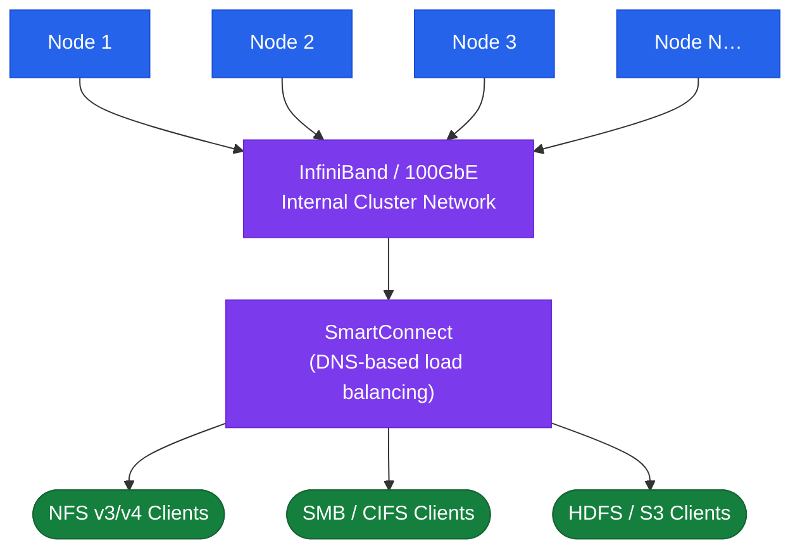
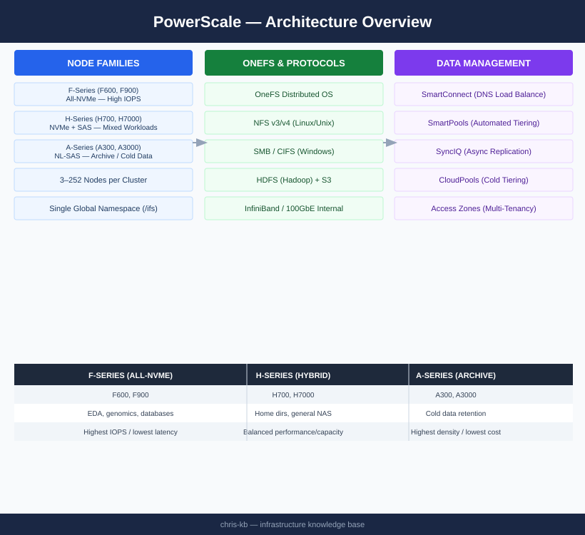

---
tags:
  - architecture
  - dell
---
# PowerScale — Architecture

Dell PowerScale (formerly Isilon) is a scale-out NAS platform running the OneFS distributed operating system. All nodes are peers sharing a single global namespace under <code>/ifs</code>. Clusters scale from 3 to 252 nodes across NFS, SMB, HDFS, and S3 protocols.

*Applies to: PowerScale (Isilon) 9.x*

  <a class="kb-card" href="how-it-works/">
    
⚙️

    
How It Works

    
OneFS distributed FS, SmartConnect DNS load balancing, SmartPools tiering, SyncIQ replication, and protection levels.

  </a>
  <a class="kb-card" href="integrations/">
    
🔗

    
Integrations

    
Hadoop/HDFS, VMware NFS datastores, S3 object API, CloudPools cold tiering, and Active Directory auth.

  </a>
  <a class="kb-card" href="design-standards/">
    
📐

    
Design Standards

    
Access zone layout, SmartConnect zone design, protection level selection, and SyncIQ policy standards.

  </a>

## Node Families

| Family | Models | Storage Type | Primary Use Case |
|---|---|---|---|
| F-series | F600, F900 | All-NVMe SSD | High-IOPS: EDA, genomics, databases |
| H-series | H700, H7000 | NVMe + SAS HDD hybrid | Mixed: home directories, general NAS |
| A-series | A300, A3000 | NL-SAS high-density | Archive and cold data retention |

## Topology

