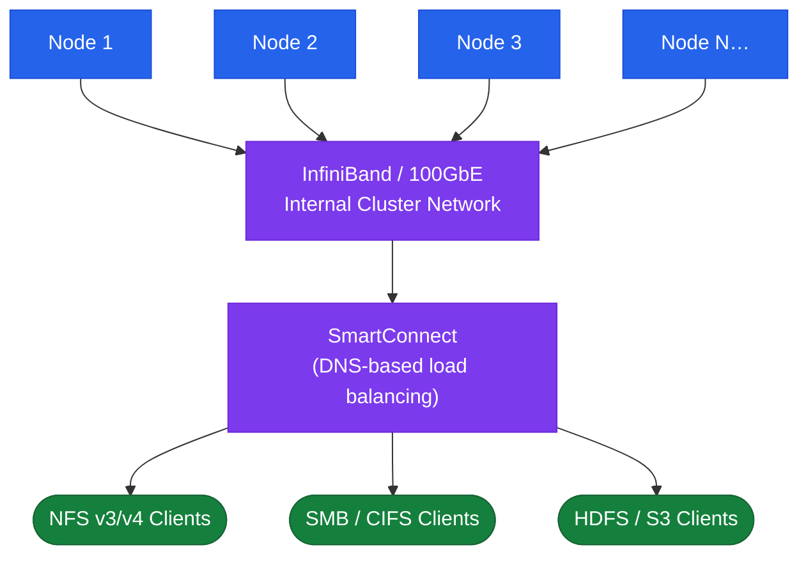

# PowerScale — Architecture Overview

Dell PowerScale (formerly Isilon) is a scale-out NAS platform running the **OneFS** distributed operating system. All nodes in a cluster are peers — there is no dedicated metadata controller. The entire cluster presents a single namespace rooted at `/ifs` across all protocols (NFS, SMB, HDFS, S3, FTP). Clusters scale from a minimum of 3 nodes to 252 nodes, with each node added linearly contributing both capacity and throughput. PowerScale is available in all-flash (F-series), hybrid (H-series), and archive (A-series) node families.

## Scale-Out NAS Cluster

## HA Topology

OneFS implements redundancy at the file system level rather than through a primary/secondary controller model:

- **N+1 / N+2 / N+3 protection**: Data is protected using a distributed Reed-Solomon-like scheme. Protection level (N+1 to N+4) is set per directory or at the pool level. N+2 can survive two simultaneous node or drive failures.
- **No single controller**: All nodes are symmetric. Losing a single node triggers a **SMARTFAIL** process where OneFS rebalances the data from the failed node across remaining nodes.
- **Intra-cluster network (back-end)**: Nodes are connected via a dedicated back-end InfiniBand or 10/25 GbE network for inter-node data and metadata traffic. This is separate from the front-end client network.
- **Quorum**: OneFS requires a strict majority of nodes to be online for writes. Read access continues with fewer nodes but write quorum must be maintained.
- **FlexProtect**: Dynamic protection rebalancing; continuously adjusts data layout as nodes are added or removed.

## Connectivity

| Protocol | Notes |
|---|---|
| NFS v3/v4 | Primary Unix/Linux client protocol; exposed per access zone |
| SMB 2.x/3.x | Windows file sharing; per access zone |
| HDFS | Hadoop workloads; maps `/ifs` paths as HDFS volumes |
| S3 | Object storage API over S3-compatible interface; per access zone |
| FTP/FTPS | Supported but not recommended for high-throughput workloads |

Network design:
- Front-end client network: 10 or 25 GbE per node; aggregate bandwidth scales linearly with nodes.
- Back-end cluster network: dedicated InfiniBand (older nodes) or 25/100 GbE; must be isolated from client traffic.
- SmartConnect DNS delegation: parent zone must delegate the SmartConnect zone to the cluster's back-end node IPs.
