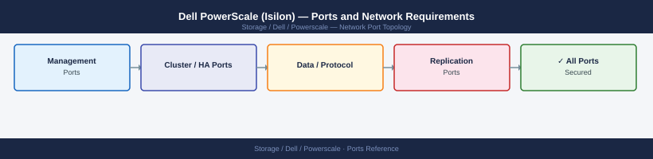

---
tags:
  - powerscale
  - isilon
  - dell
  - networking
  - firewall
  - ports
  - nas
---
# Dell PowerScale (Isilon) — Ports and Network Requirements

<div class="kb-summary">
Firewall port reference for Dell PowerScale (formerly Isilon). Covers OneFS management, NFS, SMB, S3 object, FTP, HDFS, and SyncIQ cross-cluster replication.

*Applies to: OneFS 9.x / PowerScale F-series and H-series*
</div>


## Inbound — Management

| Port | Protocol | Source | Purpose |
|---|---|---|---|
| 443 | TCP | Admin workstations | OneFS Web UI (HTTPS) and REST Platform API |
| 22 | TCP | Jump hosts | SSH — OneFS CLI (isi commands) |
| 8080 | TCP | Admin workstations (older OneFS) | OneFS legacy management port (deprecated in 9.x) |
| 161 | UDP | Monitoring systems | SNMP polling |

## Outbound — Array to External

| Port | Protocol | Destination | Purpose |
|---|---|---|---|
| 162 | UDP | SNMP receiver | SNMP traps |
| 514 | UDP/TCP | Syslog server | OneFS syslog forwarding |
| 123 | UDP | NTP | Time synchronisation |
| 25 | TCP | SMTP relay | Alert email |
| 443 | TCP | *.dell.com | CloudIQ, ESRS, support |

## NFS Data Access

| Port | Protocol | Source | Purpose |
|---|---|---|---|
| 2049 | TCP/UDP | NFS clients | NFS v3 / v4.1 file access |
| 111 | TCP/UDP | NFS v3 clients | rpcbind (portmapper) |
| 635 | TCP/UDP | NFS v3 clients | mountd |
| 4045 | TCP/UDP | NFS v3 clients | nlockmanager (file locking) |
| 4046 | TCP/UDP | NFS v3 clients | statd |

## SMB Data Access

| Port | Protocol | Source | Purpose |
|---|---|---|---|
| 445 | TCP | Windows / Linux SMB clients | SMB direct TCP |
| 139 | TCP | Legacy clients | NetBIOS over TCP |

## S3 Object Access (S3-Compatible API)

| Port | Protocol | Source | Purpose |
|---|---|---|---|
| 9020 | TCP | S3 clients | S3 HTTP |
| 9021 | TCP | S3 clients | S3 HTTPS |

## HDFS (Hadoop)

| Port | Protocol | Source | Purpose |
|---|---|---|---|
| 8020 | TCP | Hadoop clients (NameNode port) | HDFS data access via PowerScale HDFS connector |

## FTP (If Enabled)

| Port | Protocol | Source | Purpose |
|---|---|---|---|
| 21 | TCP | FTP clients | FTP control channel |
| Passive range | TCP | FTP clients | FTP data (passive mode — configurable range) |

## SyncIQ Replication (Cross-Cluster)

| Port | Protocol | Between | Purpose |
|---|---|---|---|
| 11111 | TCP | PowerScale source → PowerScale target | SyncIQ replication data transfer (default — configurable) |
| 7722 | TCP | PowerScale source → PowerScale target | SyncIQ control channel (OneFS 9.x) |

## Active Directory Integration

| Port | Protocol | Destination | Purpose |
|---|---|---|---|
| 389 | TCP | AD DCs | LDAP — domain join, user auth |
| 636 | TCP | AD DCs | LDAPS |
| 88 | TCP/UDP | AD DCs | Kerberos |
| 445 | TCP | AD DCs | SMB domain join |

## Firewall Zone Summary

| From | To | Ports | Notes |
|---|---|---|---|
| Admin clients | PowerScale mgmt IP | 443, 22 | OneFS UI and CLI |
| NFS clients | SmartConnect / data IPs | 2049, 111 | Use NFSv4.1 to reduce portmapper deps |
| SMB clients | SmartConnect / data IPs | 445 | SMB shares |
| S3 clients | Zone IPs | 9020/9021 | S3 object access |
| Source cluster | Target cluster | 11111, 7722 | SyncIQ replication |

## Verify

```bash
# From admin workstation — test OneFS API
curl -sk -o /dev/null -w "%{http_code}" https://<powerscale-mgmt-ip>/platform/1/cluster/config

# From NFS client — test NFS export list
showmount -e <smartconnect-zone-ip>

# From S3 client — test object API
curl -sk -o /dev/null -w "%{http_code}" http://<zone-ip>:9020/

# From source cluster CLI — test SyncIQ target
isi sync target list
```

## See also

- [Dell PowerScale — Architecture](../how-it-works/)
- [Dell PowerScale — Operations](../../operations/)
- [NetApp ONTAP — Ports](../../../netapp/ontap/architecture/ports.md)
