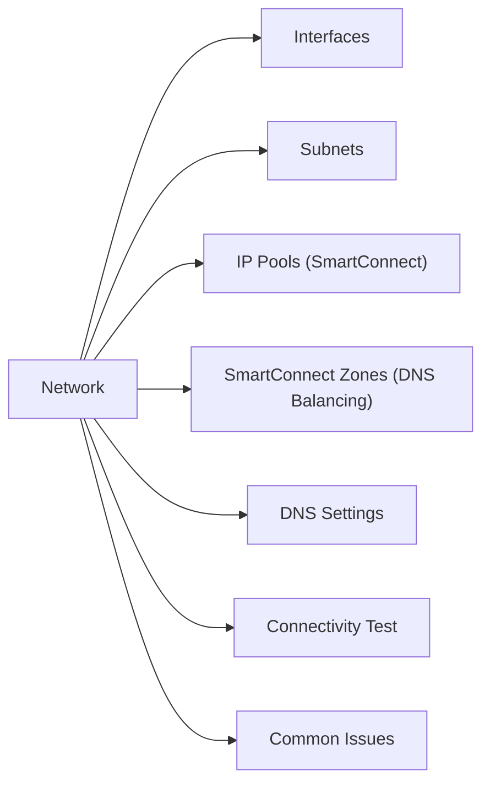

# Network

> Part of the Dell PowerScale (Isilon) CLI Reference.



## Interfaces

```bash
# List all network interfaces
isi network interfaces list
isi network interfaces view <iface>

# Filter by node
isi network interfaces list --node-id <node_id>
```

## Subnets

```bash
isi network subnets list
isi network subnets view <subnet_name>

# Create a subnet
isi network subnets create <subnet_name> --subnet-mask <mask> --gateway <gateway>
```

## IP Pools (SmartConnect)

```bash
# List IP pools
isi network pools list
isi network pools view <pool_name>

# Create an IP pool
isi network pools create \
    --name <pool_name> \
    --subnet <subnet_name> \
    --access-zone <zone_name>

# Add an IP range to a pool
isi network pools modify <pool_name> --add-ranges <ip_start>-<ip_end>
```

## SmartConnect Zones (DNS Balancing)

```bash
# View SmartConnect rules
isi network rules list
isi network rules view <rule_name>
```

SmartConnect policies:
| Policy | Behavior |
|---|---|
| round-robin | Rotates IPs across connections |
| cpu-usage | Directs to least-loaded node |
| throughput | Directs to lowest-throughput node |
| connection-count | Directs to node with fewest connections |

## DNS Settings

```bash
isi network dns view
isi network external settings view
```

## Connectivity Test

```bash
ping <ip>
isi network interfaces list --node-id <node_id>
```

## Common Issues

| Issue | Check | Action |
|---|---|---|
| Client can't mount | IP pool and DNS | Verify SmartConnect DNS zone |
| Node not accepting connections | Interface status | Check interface state |
| Wrong node handling client | SmartConnect policy | Review and change pool policy |
| IP not responding | Pool membership | Verify IP in pool range |
