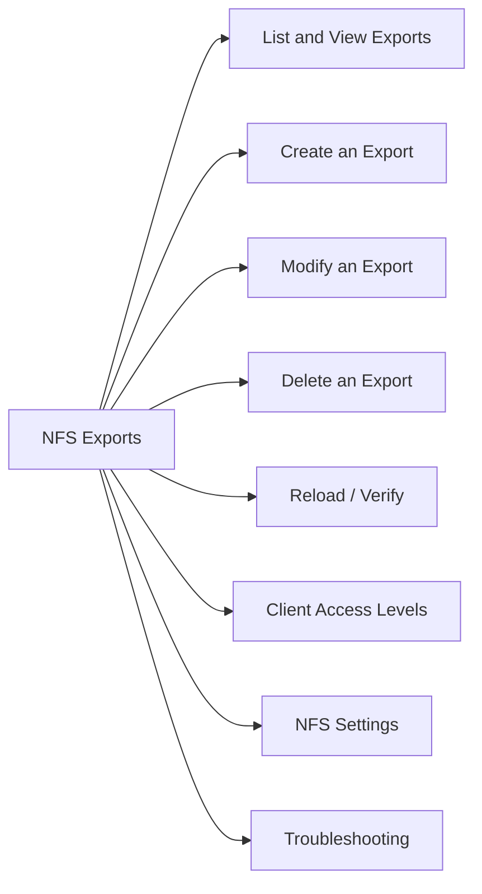

# NFS Exports

> Part of the Dell PowerScale (Isilon) CLI Reference.



## List and View Exports

```bash
# List all NFS exports (export ID, path, clients)
isi nfs exports list

# Specific export detail
isi nfs exports view <export_id>

# Exports in a specific access zone
isi nfs exports list --zone <zone_name>
```

## Create an Export

```bash
# Basic export — read-write for a CIDR, root access for specific host
isi nfs exports create /ifs/<path> \
    --clients <ip_or_cidr> \
    --read-write-clients <ip_or_cidr> \
    --root-clients <root_client_ip>

# Export with access zone
isi nfs exports create /ifs/data/dept1 \
    --clients 10.0.1.0/24 \
    --read-write-clients 10.0.1.0/24 \
    --zone DeptZone1

# Read-only export
isi nfs exports create /ifs/archive \
    --clients 10.0.0.0/8 \
    --read-only-clients 10.0.0.0/8
```

## Modify an Export

```bash
# Add a root client to an existing export
isi nfs exports modify <export_id> --add-root-clients <new_ip>

# Add a read-write client
isi nfs exports modify <export_id> --add-read-write-clients <new_ip>

# Remove a client
isi nfs exports modify <export_id> --remove-clients <old_ip>
```

## Delete an Export

```bash
isi nfs exports delete <export_id>
```

## Reload / Verify

```bash
# Check exports for configuration errors
isi nfs exports check

# Reload NFS service (applies config changes)
isi services nfs reload

# View global NFS settings
isi nfs settings global view

# View default export settings
isi nfs settings export view
```

## Client Access Levels

| Client Type | Access |
|---|---|
| `--clients` | Listed as a client, inherits defaults |
| `--read-only-clients` | Read-only regardless of mount options |
| `--read-write-clients` | Full read-write |
| `--root-clients` | Root user retains root privileges (no squash) |

## NFS Settings

```bash
# NFS v3/v4 protocol settings
isi nfs settings global view | grep -E "nfs3|nfs4|nfsv4"

# Modify global NFS settings
isi nfs settings global modify --nfsv4-enabled true --nfsv3-enabled true
```

## Troubleshooting

| Issue | Check | Command |
|---|---|---|
| Mount fails | Export exists for client IP? | `isi nfs exports list` |
| Access denied | Root squash on root-clients? | `isi nfs exports view <id>` |
| Stale NFS | NFS service running? | `isi services -a nfs` |
| Export check warnings | Configuration error | `isi nfs exports check` |
