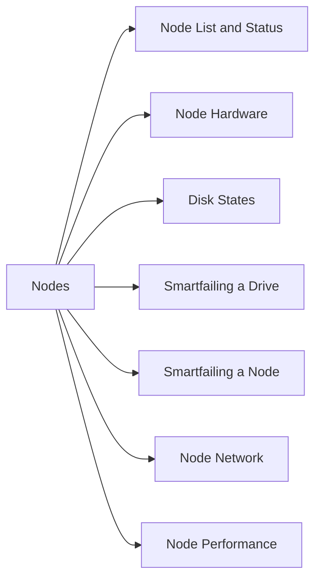

# Nodes

> Part of the Dell PowerScale (Isilon) CLI Reference.



## Node List and Status

```bash
# List all nodes
isi node list

# Specific node detail (state, IP, version)
isi node view <node_id>

# Node status overlay on the cluster status
isi status -n <node_id>
```

## Node Hardware

```bash
# Hardware details (model, CPU, RAM, NIC, HBA)
isi node hardware view <node_id>

# Drive bays and disk states
isi node drives list <node_id>

# Specific bay
isi node drives view <node_id> <bay>

# Environmental sensors (temperature, fans, power supplies)
isi node sensors view <node_id>
```

## Disk States

| State | Meaning | Action |
|---|---|---|
| `HEALTHY` | Normal | None |
| `SMARTFAIL` | Being evacuated | Do not remove until complete |
| `DEAD` | Failed | Replace after data evacuated |
| `REPLACING` | Replacement in progress | Wait for rebuild |
| `STALLED` | Stuck rebuild | Contact Dell support |

## Smartfailing a Drive

```bash
# Mark a drive for evacuation (data moves to remaining drives)
isi devices drive smartfail -d <node_id> -b <bay_id>

# Monitor FlexProtect rebuild after drive removal
isi job jobs list | grep FlexProtect
isi status -n <node_id>
```

## Smartfailing a Node

Smartfailing a node redistributes all data from that node before removal:

```bash
# Initiate node smartfail
isi devices smartfail -d <node_id>

# Monitor progress
isi status | grep smartfail
isi job jobs list | grep -i FlexProtect

# Re-add node after replacement/repair
isi devices add -d <node_id>
```

## Node Network

```bash
# Network interfaces on a node
isi network interfaces list --node <node_id>

# IP pool assignments
isi network pools list

# Check node's external IPs
isi network interfaces list --node <node_id> | grep ext
```

## Node Performance

```bash
# Per-node I/O statistics
isi statistics node list

# Node CPU and memory usage
isi statistics system list --nodes <node_id>
```
