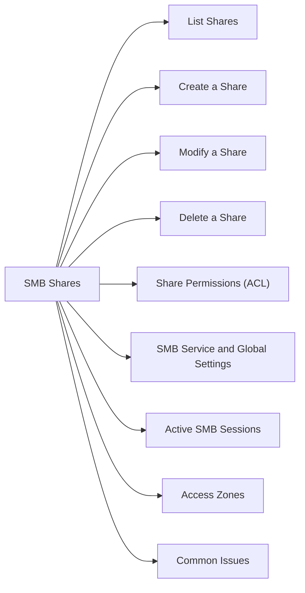

# SMB Shares

> Part of the Dell PowerScale (Isilon) CLI Reference.



## List Shares

```bash
isi smb shares list
isi smb shares view <share_name>
```

## Create a Share

```bash
isi smb shares create <share_name> /ifs/<path>
```

## Modify a Share

```bash
isi smb shares modify <share_name> --description "<text>"

# Enable Access Based Enumeration
isi smb shares modify <share_name> --access-based-enumeration true

# Set continuous availability (for CA shares)
isi smb shares modify <share_name> --continuously-available true
```

## Delete a Share

```bash
isi smb shares delete <share_name>
```

## Share Permissions (ACL)

```bash
# List permissions
isi smb shares permission list <share_name>

# Grant full control to a group
isi smb shares permission create <share_name> \
    --authority <DOMAIN\\Group> \
    --permission-type allow \
    --permission full

# Remove a permission
isi smb shares permission delete <share_name> --authority <DOMAIN\\Group>
```

## SMB Service & Global Settings

```bash
# View global SMB settings (SMB versions, security)
isi smb settings global view

# Enable SMB2 and SMB3 (disable SMB1 for security)
isi smb settings global modify --support-smb2 true

# View SMB service status
isi smb settings service view
```

## Active SMB Sessions

```bash
isi smb sessions list
```

## Access Zones

PowerScale SMB shares are created within an access zone. Verify the correct zone is specified:

```bash
isi smb shares list --zone <zone_name>
isi smb shares create <share_name> /ifs/<path> --zone <zone_name>
```

## Common Issues

| Issue | Check | Action |
|---|---|---|
| Share inaccessible | Share exists? | `isi smb shares list` |
| Permission denied | ACL | `isi smb shares permission list` |
| Share in wrong zone | Zone | Specify `--zone` on create |
| SMB1 negotiated | SMB settings | Disable SMB1 globally |
