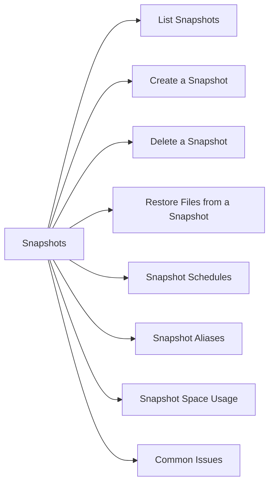

# Snapshots

> Part of the Dell PowerScale (Isilon) CLI Reference.



## List Snapshots

```bash
isi snapshot snapshots list
isi snapshot snapshots view <snap_id>
```

## Create a Snapshot

```bash
isi snapshot snapshots create /ifs/<path> --name <snap_name>
```

## Delete a Snapshot

```bash
isi snapshot snapshots delete <snap_id>
isi snapshot snapshots delete --path /ifs/<path> --name <snap_name>
```

## Restore Files from a Snapshot

Snapshots are accessible via the `.snapshot` directory in the file system:

```bash
ls /ifs/<path>/.snapshot/
cp -a /ifs/.snapshot/<snap_name>/<path>/* /ifs/<path>/
```

## Snapshot Schedules

```bash
# List schedules
isi snapshot schedules list
isi snapshot schedules view <schedule_name>

# Create a schedule (daily at midnight)
isi snapshot schedules create <schedule_name> /ifs/<path> "every day"

# Modify retention
isi snapshot schedules modify <schedule_name> --duration 7D

# Delete a schedule
isi snapshot schedules delete <schedule_name>
```

## Snapshot Aliases

Aliases are pointers to specific snapshots, useful for mounting a "latest" snapshot without changing the mount path:

```bash
isi snapshot aliases list
isi snapshot aliases create <alias_name> --target <snap_id>
```

## Snapshot Space Usage

```bash
# View space used by snapshots
isi quota list --type directory --path /ifs/<path>

# Or from snapshot list
isi snapshot snapshots list --verbose
```

## Common Issues

| Issue | Check | Action |
|---|---|---|
| Snapshot not found | Path or name | `isi snapshot snapshots list` |
| `.snapshot` not visible | Client mount options | Verify NFS client has access to `.snapshot` |
| Snapshot space growing | Retention policy | Reduce schedule duration |
| Restore incomplete | Snapshot covers only part of path | Use correct snap path |
