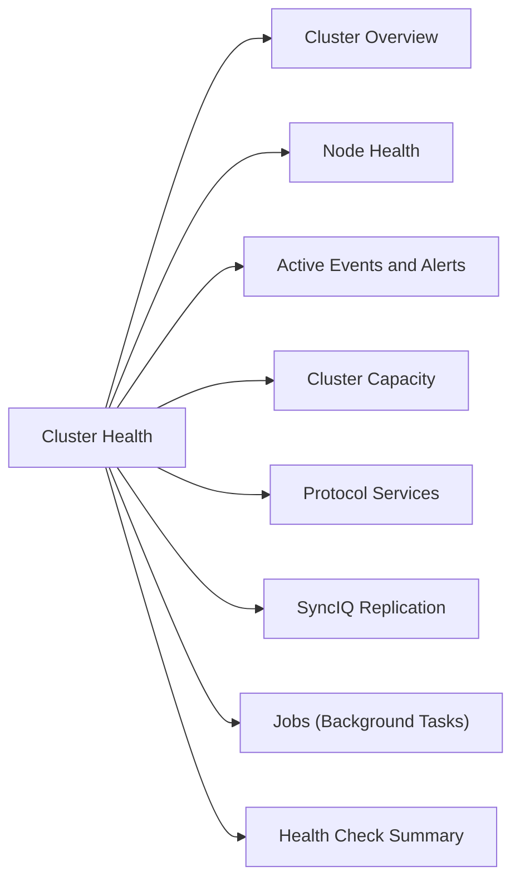

# PowerScale Cluster Health

Daily health checks and status commands for Dell PowerScale (Isilon) clusters.



## Cluster Overview

```bash
# Cluster identity, version, and status
isi version
isi status
isi cluster identity view

# Node count and status summary
isi node list
isi status -n all   # Per-node health summary
```

## Node Health

```bash
# List all nodes with status
isi node list

# Detailed view of a specific node
isi node view <node_id>

# Node hardware sensors (temperature, fans, power)
isi node sensors view <node_id>

# Node drives — check for failed or degraded drives
isi node drives list <node_id>
isi node drives list <node_id> | grep -iE "failed|degraded|missing"
```

## Active Events and Alerts

```bash
# All unresolved critical events
isi event events list --severity critical

# All unresolved events (all severities)
isi event events list

# Events from the last 24 hours
isi event events list --start-time $(date -d 'yesterday' '+%Y-%m-%d')

# Alert channels configured
isi event channels list
```

## Cluster Capacity

```bash
# Overall used vs. free capacity
isi statistics system list | grep -E "Cluster Capacity|Used|Free"

# Storage pool capacity breakdown
isi storagepool nodepools list
isi storagepool tiers list

# SmartQuotas — total quota usage
isi quota quotas list --type directory | head -20
```

## Protocol Services

```bash
# NFS service status
isi services -a | grep nfs

# SMB service status
isi services -a | grep smb

# All running services
isi services -a | grep running
```

## SyncIQ Replication

```bash
# Policy status
isi sync policies list
isi sync policies view <policy_name>

# Last job result for each policy
isi sync jobs list --state finished | head -10

# Check for failed replication jobs
isi sync jobs list --state failed
isi sync jobs list --state paused
```

## Jobs (Background Tasks)

```bash
# Currently running jobs
isi job status

# Any job in error state
isi job jobs list | grep -i error

# FlexProtect status (data protection rebuild)
isi job jobs list | grep -i "FlexProtect\|Repair"
```

## Health Check Summary

| Check | Command | Healthy |
|---|---|---|
| All nodes online | `isi node list` | All = online |
| No critical events | `isi event events list --severity critical` | 0 events |
| Capacity < 80% | `isi statistics system list` | Used < 80% |
| NFS/SMB services running | `isi services -a` | Both running |
| SyncIQ policies healthy | `isi sync policies list` | All enabled, last job success |
| No jobs in error | `isi job jobs list` | 0 errors |
| No failed drives | `isi node drives list` | 0 failed/degraded |
