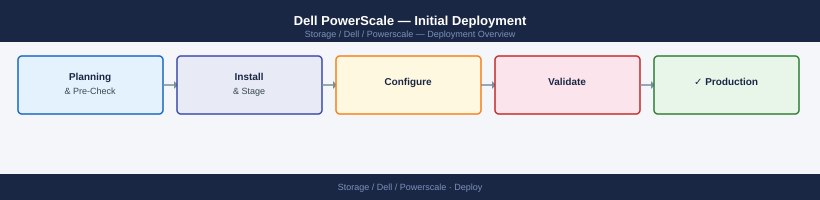
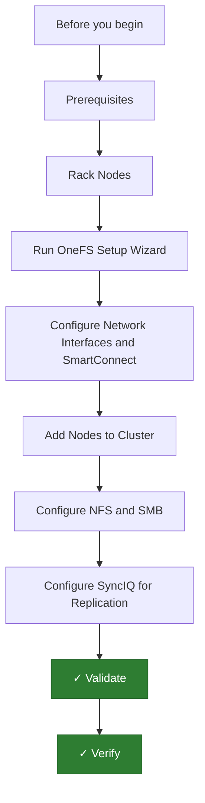

---
tags:
  - dell
  - deployment
search:
  boost: 1.5
---

## Before you begin

- **Access:** admin credentials for the target system and any upstream dependencies (DNS, NTP, vCenter, directory services)
- **Timing:** safe to run during a scheduled maintenance window; allow 1-2 hours for initial deployment
- **Dependencies:** network connectivity verified; DNS resolvable; NTP configured; any licence keys available
- **Logging:** record every IP address, hostname, and credential set assigned during this deployment

---

# Dell PowerScale — Initial Deployment



This guide covers deploying a Dell PowerScale (formerly Isilon) cluster from physical node installation through validated NFS and SMB access. Applies to PowerScale F600, H700, and H7000 nodes running OneFS 9.x.

---




## Prerequisites

**Hardware:**

- At minimum three nodes (OneFS requires a quorum of three nodes for cluster formation)
- InfiniBand or 100GbE internal backend switches for intra-cluster communication (Dell provides dedicated backend switches for PowerScale configurations)
- Front-end network switches (10GbE/25GbE) for client data access
- OOB management network for node management interfaces (Eth0 on each node)
- Rack units: each 1U node occupies 1RU; chassis nodes (H7000) are 4U

**Networking plan:**

| Component                | Network          | IP range         |
|--------------------------|------------------|------------------|
| Node management (Eth0)   | OOB management   | 10.0.0.21–23     |
| External client access   | Data VLAN        | 192.168.10.0/24  |
| SmartConnect zone VIP    | Data VLAN        | 192.168.10.100   |
| Backend (internal)       | InfiniBand/100GbE| Factory default  |

**Software and licenses:**

- OneFS license file (capacity-based) from Dell
- SmartConnect Advanced license if you need zone-based DNS failover
- SyncIQ license for replication
- NTP server for cluster time sync (critical for SMB Kerberos authentication)
- AD domain details if SMB with Active Directory authentication is required

---

## Rack Nodes

1. Mount each node into the rack using the rail kit supplied per node. Maintain consistent top-to-bottom order if using Dell-supplied rear backend switches — cable lengths are factory-matched.
2. Connect the backend InfiniBand or 100GbE cables between nodes:
   - Each node has two internal network ports — connect port 1 to the internal switch fabric port A and port 2 to fabric port B.
   - Dell ships the backend switch and cables bundled — do not substitute cable lengths.
3. Connect each node's management Ethernet (Eth0) to the OOB management switch.
4. Connect each node's front-end data ports (10GbE/25GbE) to the client data network switches.
5. Connect PDU cables. Nodes use standard C13/C19 power connectors.
6. Power on all nodes simultaneously by pressing the power button on each or using the Dell IPMI/iDRAC remote power-on if configured.

---

## Run OneFS Setup Wizard

OneFS cluster formation is initiated from the first node (the "wizard node").

1. Connect a serial console cable to Node 1's serial port (or access via iDRAC/IPMI serial-over-LAN).
2. Log in as `root` using the default password printed on the node's service tag.
3. Launch the cluster creation wizard:

```bash
isi_setup
```

4. When prompted:
   - **Cluster name:** Enter the cluster name (e.g., `pscale-prod`).
   - **Internal network:** Select the InfiniBand or backend interface. Accept the factory defaults for internal IP range.
   - **External IP:** Assign the node's external management IP.
   - **Default gateway:** Enter the gateway for the external network.
   - **DNS:** Enter DNS server IPs.
   - **Join or create cluster:** Select **Create new cluster**.
5. The wizard finalizes cluster formation. The WebUI becomes accessible at `https://<node1_external_IP>:8080`.

---

## Configure Network Interfaces and SmartConnect

OneFS uses IP pools (sets of external IPs) and SmartConnect zones for client access. SmartConnect balances NFS/SMB connections across nodes.

**Create an IP pool for client access:**

1. In the OneFS WebUI, navigate to **Cluster Management > Network Configuration > External Network > Subnets**.
2. Select the external subnet (or create one for the client VLAN).
3. Under the subnet, click **Add Pool**.
4. Set:
   - Pool name: `client_pool`
   - Address range: assign a block of IPs (one per node)
   - Allocation method: **Dynamic** (SmartConnect assigns client connections)
   - SmartConnect zone name: `pscale.example.com`
   - SmartConnect service IP (VIP): `192.168.10.100` — this is the single DNS name clients resolve

**Configure SmartConnect DNS delegation:**

1. In your corporate DNS server, create a delegation for `pscale.example.com` pointing to the SmartConnect service IP (`192.168.10.100`).
2. Clients resolve `pscale.example.com` and SmartConnect returns the IP of the least-loaded node.

**Verify interface status via CLI:**

```bash
isi network interfaces list
isi network pools list
```

---

## Add Nodes to Cluster

Additional nodes join the cluster after the first node is set up.

1. Power on the new node.
2. Connect to its serial console and log in as `root`.
3. Run the setup wizard on the new node:

```bash
isi_setup
```

4. At the join prompt, select **Join existing cluster**.
5. Enter the existing cluster's internal IP (the first node's internal backend IP).
6. Enter the cluster's join password (set during cluster creation).
7. The new node joins and the cluster redistributes data automatically across all nodes.
8. Monitor join progress from the WebUI under **Cluster Management > Cluster Overview**. The new node appears with status **Joining** and transitions to **Healthy**.

Verify node count:

```bash
isi status -q
# Should show all nodes as healthy
```

---

## Configure NFS and SMB

**NFS export:**

1. Navigate to **Protocols > Unix Sharing (NFS) > NFS Exports > Create Export**.
2. Set:
   - Directory path: `/ifs/data/nfs_share01`
   - Clients: IP range or subnet allowed to mount (e.g., `192.168.10.0/24`)
   - Access permissions: `Read/Write`
   - Root squash: enabled (recommended for security)
3. Click **Add Export**.
4. From a Linux client:

```bash
mount -t nfs pscale.example.com:/ifs/data/nfs_share01 /mnt/pscale_nfs
df -h /mnt/pscale_nfs
```

**SMB share (Active Directory integration):**

1. Join the cluster to Active Directory:

```bash
isi auth ads create --name CORP.EXAMPLE.COM --user Administrator --password <password>
```

2. Verify AD join:

```bash
isi auth ads list
```

3. Navigate to **Protocols > Windows Sharing (SMB) > SMB Shares > Create Share**.
4. Set:
   - Share name: `data01`
   - Directory: `/ifs/data/smb_share01`
   - Permissions: add AD groups with appropriate read/write access
5. From a Windows client:

```cmd
net use Z: \\pscale.example.com\data01 /persistent:yes
```

---

## Configure SyncIQ for Replication

SyncIQ replicates OneFS directories to a target cluster for DR or data distribution.

**On the source cluster:**

1. Navigate to **Data Protection > SyncIQ > Policies > Create Policy**.
2. Set:
   - Policy name: `replicate_data01`
   - Action: **Synchronize**
   - Source directory: `/ifs/data`
   - Target cluster: enter the target cluster's SmartConnect hostname or IP
   - Target directory: `/ifs/replica/data`
   - Schedule: every 1 hour or as required by RPO
3. Click **Create Policy**.

**Run the first sync manually:**

```bash
isi sync policies run replicate_data01
```

**Monitor sync progress:**

```bash
isi sync jobs list
# Shows the running job, bytes transferred, ETA
```

**On the target cluster**, verify the directory is populated:

```bash
ls /ifs/replica/data
```

---

## Validate

1. Confirm all nodes are healthy:

```bash
isi status
# All nodes should show "Healthy" — no errors or warnings
```

2. Check the cluster's drive health:

```bash
isi devices drive list
# All drives should show status "HEALTHY"
```

3. Verify NFS mounts from multiple clients to confirm SmartConnect is distributing connections across nodes.
4. Run a write test to confirm throughput meets expectations:

```bash
dd if=/dev/zero of=/mnt/pscale_nfs/test.bin bs=1M count=10240 oflag=direct
```

5. Confirm SyncIQ policy ran successfully and shows **Finished** status under **Data Protection > SyncIQ > Reports**.
6. Check no active alerts under **Cluster Management > Events**.

---

## Verify

- **Cluster health:** all nodes show online in the management UI
- **Volume access:** mount a test LUN/NFS export from a host and confirm read/write
- **Replication:** confirm replication partner shows last-sync within RPO window

---

## See also

- [Powerscale — Procedures](../operations/procedures/)
- [Powerscale — Common Issues](../troubleshooting/common-issues/)
- [Powerscale — How It Works](../architecture/how-it-works/)
