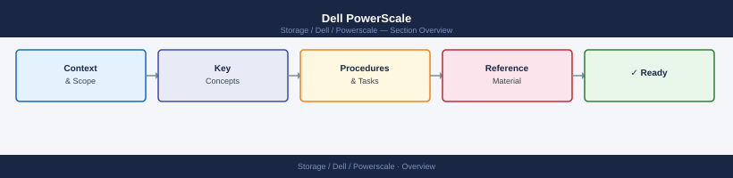

---
tags:
  - dell
---
# Dell PowerScale

Scale-out NAS platform running OneFS — multi-protocol access (NFS, SMB, S3, HDFS), SmartQuotas, SyncIQ replication, SmartPools tiering, and cluster-wide management for unstructured data at scale.

*Applies to: PowerScale (Isilon) 9.x*

<a class="kb-card" href="architecture/">
  <strong>Architecture</strong>
  How it works, integrations, and design standards.
</a>

<a class="kb-card" href="deploy/">
  <strong>Deploy</strong>
  Installation, initial configuration, and deployment procedures.
</a>

<a class="kb-card" href="operations/">
  <strong>Operations</strong>
  CLI reference, health checks, procedures, lifecycle, backup, and scripts.
</a>

<a class="kb-card" href="security/">
  <strong>Security</strong>
  Authentication, access control, encryption, and hardening.
</a>

<a class="kb-card" href="troubleshooting/">
  <strong>Troubleshooting</strong>
  Common issues, diagnostics, and escalation.
</a>

