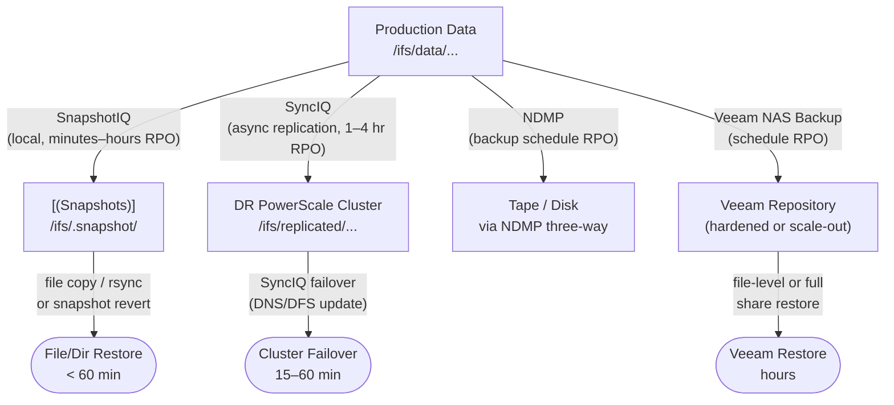

# PowerScale — Backup & Restore


<div class="kb-summary">
> Backup configuration, restore procedures, and validation for Dell PowerScale.
</div>
```
┌──────────────────────────────── Dell PowerScale — Backup and Restore ─────────────────────────────────┐
│                                                                                                       │
│   ┌───────────────────────────────────────────────────────────────────────────────────────────────┐   │
│   │     PowerScale backup: snapshots, replication, and external backup application integration    │   │
│   │        Snapshot schedule: hourly for 24 h, daily for 7 days, weekly for 4 weeks minimum       │   │
│   │            Replication: async or sync to DR site for off-site data protection copy            │   │
│   │       Restore: volume-level or file-level restore from snapshot; test restore quarterly       │   │
│   └───────────────────────────────────────────────────────────────────────────────────────────────┘   │
│                                                                                                       │
│    Snapshot → replicate to DR → verify → document → test restore                                      │
│                                                                                                       │
│                  ▼                                ▼                                ▼                  │
│                                                                                                       │
│   ┌─────────────────────────────┐  ┌─────────────────────────────┐  ┌─────────────────────────────┐   │
│   │            Layer            │  │          Component          │  │           Function          │   │
│   │              OS             │  │            OneFS            │  │        Distributed FS       │   │
│   │           Tiering           │  │          SmartPools         │  │        Auto data move       │   │
│   │         Replication         │  │            SyncIQ           │  │        Async DR copy        │   │
│   │          Snapshots          │  │          SnapshotIQ         │  │       Space-efficient       │   │
│   │         Load balance        │  │         SmartConnect        │  │       DNS client dist.      │   │
│   └─────────────────────────────┘  └─────────────────────────────┘  └─────────────────────────────┘   │
│                                                                                                       │
│                          ▼                                                 ▼                          │
│                                                                                                       │
│   ┌───────────────────────────────────────────────────────────────────────────────────────────────┐   │
│   │       Type       │     Schedule     │     Retention     │     Offsite?     │    Test cycle    │   │
│   │     Snapshot     │   Hourly/daily   │    7/30/90 days   │        No        │     Monthly      │   │
│   │   Replication    │  Policy-driven   │     Per policy    │     Yes (DR)     │    Quarterly     │   │
│   │    Backup app    │ Daily full+incr  │      90+ days     │ Yes (tape/cloud  │    Quarterly     │   │
│   │     Archive      │     Monthly      │      7+ years     │   Yes (object)   │      Annual      │   │
│   └───────────────────────────────────────────────────────────────────────────────────────────────┘   │
│                                                                                                       │
│    Physical: PowerScale nodes (All-Flash/Hybrid) · InfiniBand backend · 25/100 GbE frontend           │
│                                                                                                       │
│    Key terms:                                                                                         │
│                                                                                                       │
│    OneFS              = Dell PowerScale distributed filesystem OS; all nodes share a single namespace │
│    SmartPools         = tiering engine; moves files between All-Flash, Hybrid, and Archive tiers      │
│    SyncIQ             = async replication to DR cluster; RPO-based schedule; failover in minutes      │
│    SnapshotIQ         = space-efficient snapshots; accessed via .snapshot directory in each share     │
│    SmartConnect       = DNS-based load balancing; distributes NFS/SMB client connections across nodes │
│    Access zone        = logical container with separate authentication and export namespace per tenant│
│    Quota              = directory or user quota; hard/soft/advisory limits enforced by OneFS QuotaIQ  │
│    CloudPools         = tiering to cloud object storage (S3/Blob); data remains accessible locally    │
│    isi CLI            = OneFS command-line interface; all management operations available via isi c...│
│    Node pool          = group of same-model nodes sharing protection domain for data distribution     │
│    Protection level   = N+2:1, N+3:1 etc.; defines how many node or drive failures are tolerated      │
│    File pool policy   = rule-based policy assigning files to specific node pools or storage tiers     │
│                                                                                                       │
└───────────────────────────────────────────────────────────────────────────────────────────────────────┘
```


## Overview



PowerScale provides several complementary mechanisms for data protection and recovery. Selecting the right combination depends on the RPO, RTO, and retention requirements for each data set.

| Mechanism | Type | RPO | Recovery Scope |
|---|---|---|---|
| SnapshotIQ | Local point-in-time snapshot | Minutes to hours | File and directory |
| SyncIQ | Async replication to remote cluster | Minutes to hours | Directory tree or full cluster |
| NDMP | Network backup to tape or disk | Backup schedule interval | File and directory |
| Veeam NAS Backup | NAS-aware backup via Veeam v12+ | Backup schedule interval | File and directory |

## SnapshotIQ — Local Snapshots

SnapshotIQ creates point-in-time snapshots of any directory under `/ifs`. Snapshots are stored within the same cluster and are accessible immediately via the `.snapshot` directory. They do not protect against cluster-level failures but provide rapid file-level recovery.

### Creating Snapshots

```bash
# Manual snapshot of a directory
isi snapshot snapshots create /ifs/data/project1 --name project1-$(date +%Y%m%d)

# Create a snapshot with a 30-day expiration
isi snapshot snapshots create /ifs/data/project1 \
    --name project1-$(date +%Y%m%d) \
    --expires $(date -d '+30 days' +%s)

# List all snapshots for a path
isi snapshot snapshots list --path /ifs/data/project1

# List all snapshots (all paths)
isi snapshot snapshots list

# View details of a snapshot (size, creation time, expiration)
isi snapshot snapshots view <snapshot_id>

# Delete a snapshot by ID
isi snapshot snapshots delete <snapshot_id>

# Delete a snapshot by name
isi snapshot snapshots delete --path /ifs/data/project1 --name project1-20260101
```

### Snapshot Schedules

Schedule automated snapshots per directory with retention periods:

```bash
# List all snapshot schedules
isi snapshot schedules list
isi snapshot schedules list -v

# Create a daily schedule at midnight, retaining 14 snapshots
isi snapshot schedules create daily-project1 \
    /ifs/data/project1 \
    --schedule "every 1 days at 00:00" \
    --retention 14D

# Create an hourly schedule, retaining 48 hours of snapshots
isi snapshot schedules create hourly-project1 \
    /ifs/data/project1 \
    --schedule "every 1 hours" \
    --retention 2D

# Modify a schedule retention period
isi snapshot schedules modify daily-project1 --retention 30D

# View a schedule
isi snapshot schedules view daily-project1

# Disable a schedule without deleting it
isi snapshot schedules modify daily-project1 --enabled false

# Delete a schedule (existing snapshots are NOT deleted)
isi snapshot schedules delete daily-project1
```

### Accessing Snapshots

Snapshots are visible within the live filesystem under the `.snapshot` directory at the root of the snapshotted path:

```bash
# From the cluster shell — list available snapshots for a path
ls /ifs/data/project1/.snapshot/

# List files at a specific snapshot
ls -la /ifs/data/project1/.snapshot/project1-20260101/

# From an NFS client — browse the snapshot directory
ls /mnt/project1/.snapshot/

# Confirm .snapshot is accessible on the NFS export
isi nfs exports view <export_id> | grep allow-snapshot
# Enable .snapshot visibility on an NFS export if not already set
isi nfs exports modify <export_id> --allow-snapshot-dirs true
```

### Restoring Files from a Snapshot

```bash
# Restore a single file from a snapshot
cp -p /ifs/data/project1/.snapshot/project1-20260101/report.xlsx \
       /ifs/data/project1/report.xlsx

# Restore a directory tree from a snapshot (preserves permissions and timestamps)
rsync -av /ifs/data/project1/.snapshot/project1-20260101/ \
          /ifs/data/project1/

# Revert an entire directory to a snapshot state (DESTRUCTIVE — all data after the snapshot is lost)
# Protect the snapshot from expiration before reverting
isi snapshot snapshots modify <snapshot_id> --set-expiration never
# Perform the revert
isi snapshot snapshots revert <snapshot_id>
```

> Snapshot revert is destructive. All changes made after the snapshot timestamp are permanently discarded. Always confirm with the application and data owner before reverting.

### Snapshot Space Usage

```bash
# Total snapshot space used cluster-wide
isi snapshot settings view | grep -i "space\|reserve"

# Per-snapshot space consumption
isi snapshot snapshots list -v | grep -E "Name|Size"

# Snapshot reserve (percentage of cluster capacity reserved for snapshots)
isi snapshot settings view
isi snapshot settings modify --reserve 10    # 10% reservation
```

---

## SyncIQ — Replication-Based Recovery

SyncIQ replicates directory trees to a remote PowerScale cluster. For full details on policy management, monitoring, and failover, see [Architecture — How It Works](../../architecture/how-it-works/index.md).

### Backup to a Dedicated DR Cluster

Use SyncIQ to replicate production data to a secondary PowerScale cluster on a separate site. The target cluster holds a consistent replica that can be mounted read-only or failed over to:

```bash
# Create a replication policy targeting a DR cluster
isi sync policies create backup-project1 \
    --action sync \
    --source-root-path /ifs/data/project1 \
    --target-host <dr-cluster-ip> \
    --target-path /ifs/replicated/project1 \
    --schedule "every 1 hours" \
    --description "Hourly sync of project1 to DR cluster"

# Run a manual sync immediately
isi sync jobs start backup-project1

# Confirm last successful sync time
isi sync policies view backup-project1 | grep "Last Success"

# View the full report of the most recent sync job
isi sync reports list backup-project1 | head -3
```

### SyncIQ Restore (Failback to Primary)

When recovering from a DR failover, replicate data back from the DR cluster to the primary:

```bash
# On the DR cluster — create a return policy
isi sync policies create restore-project1 \
    --action sync \
    --source-root-path /ifs/replicated/project1 \
    --target-host <primary-cluster-ip> \
    --target-path /ifs/data/project1 \
    --description "Failback restore of project1 to primary"

# Run the full restore
isi sync jobs start restore-project1

# Monitor progress
isi sync jobs list --state running
isi sync jobs view <job_id>

# Confirm completion
isi sync reports list restore-project1 | head -3
```

---

## NDMP — Network Data Management Protocol

NDMP enables third-party backup applications (NetBackup, Veritas Backup Exec, CommVault) to back up PowerScale data without traversing the backup server. PowerScale streams data directly to the backup target (tape library or disk appliance).

### Enabling NDMP

```bash
# Enable the NDMP service
isi ndmp settings global modify --enabled true

# Verify NDMP service is running
isi services -a | grep ndmp

# View global NDMP settings
isi ndmp settings global view

# Configure NDMP port (default 10000)
isi ndmp settings global modify --port 10000
```

### NDMP Users

NDMP requires a dedicated backup account separate from the admin account:

```bash
# Create an NDMP user
isi ndmp users create --name backup_user --password <password>

# List NDMP users
isi ndmp users list

# View NDMP user details
isi ndmp users view backup_user

# Delete an NDMP user
isi ndmp users delete backup_user
```

### NDMP Sessions and Diagnostics

```bash
# List active NDMP sessions (shows backup jobs in progress)
isi ndmp sessions list

# View details of a specific NDMP session
isi ndmp sessions view <session_id>

# Terminate a stuck NDMP session
isi ndmp sessions delete <session_id>

# View NDMP diagnostic logs
isi ndmp diagnostics view
```

### NDMP Configuration Reference

| Setting | Recommended Value | Notes |
|---|---|---|
| Port | 10000 | Default; must match backup application configuration |
| User | Dedicated backup account | Never use root for NDMP |
| Three-way backup | Preferred | Client connects to backup target directly — backup server coordinates only |
| Backup type | Dump (type 0) | Standard for full and incremental; tar type supported but less common |
| Network interface | Management or dedicated backup VLAN | Isolate NDMP traffic from client NFS/SMB |

---

## Veeam NAS Backup Integration

Veeam Backup & Replication v12 and later supports PowerScale NAS backup using SnapshotIQ for array-level snapshots and incremental NAS backup policies.

### Configuration

1. Add the PowerScale SMB or NFS share as a **NAS backup source** in the Veeam console.
2. Configure a **NAS Backup Policy** targeting a Veeam backup repository (scale-out repository or hardened Linux repository).
3. Enable **SnapshotIQ integration** in the NAS policy: Veeam orchestrates SnapshotIQ to create consistent snapshots before reading the backup data.
4. Set the backup schedule and retention (point-in-time copies) based on RPO requirements.

### Restore from Veeam NAS Backup

- **Individual file restore**: Use Veeam's **File-level Restore** wizard; browse the NAS backup point and restore individual files or folders.
- **Full share restore**: Use Veeam's **NAS Restore** to restore the entire share to the original or alternate location.
- **Self-service restore**: Veeam Enterprise Manager allows end users to browse and restore their own files from a web portal.

### Key Veeam Settings for PowerScale

| Setting | Recommended Value |
|---|---|
| Backup repository type | Scale-out or Linux hardened repo |
| Proxy architecture | Direct connect via NFS — backup data streams directly from PowerScale to the repo |
| SnapshotIQ integration | Enabled — provides crash-consistent NAS snapshots |
| Maximum concurrent tasks | Set based on PowerScale node count and repo throughput capacity |
| Retention — short-term | 7–14 days of daily restore points |
| Retention — long-term | Weekly or monthly GFS (Grandfather-Father-Son) copies to secondary storage |

---

## Backup Validation

Backup without regular validation is not a reliable protection mechanism. Validate all backup methods on a regular schedule.

### SnapshotIQ Validation

```bash
# Confirm a snapshot exists for each protected path
isi snapshot snapshots list --path /ifs/data/project1

# Verify a file is recoverable from the most recent snapshot
ls /ifs/data/project1/.snapshot/$(isi snapshot snapshots list --path /ifs/data/project1 | tail -2 | head -1 | awk '{print $2}')/

# Perform a live restore test to a staging directory
mkdir -p /ifs/data/restore-test/project1
cp -r /ifs/data/project1/.snapshot/project1-$(date +%Y%m%d)/ \
      /ifs/data/restore-test/project1/
```

### SyncIQ Validation

```bash
# Confirm the last replication completed successfully
isi sync reports list <policy_name> | head -3

# Check the timestamp of the most recent successful sync against RPO
isi sync policies view <policy_name> | grep -E "Last Success|Schedule"

# Test-mount the target path on the DR cluster (read-only)
# SSH to the DR cluster and verify the data is present and consistent
ls /ifs/replicated/project1/
```

### NDMP / Veeam Validation

| Test Type | Frequency | Procedure |
|---|---|---|
| File-level restore test | Monthly | Restore a sample file from the backup and verify its integrity |
| Full share restore test | Quarterly | Restore to a staging directory and compare file count/size to production |
| DR failover test | Annually | Fail over to the SyncIQ replica or Veeam NAS backup and verify application functionality |

---

## Backup Design Decisions

| Decision | Recommendation |
|---|---|
| Snapshot frequency for user home directories | Hourly snapshots with 48-hour retention; daily with 30-day retention |
| Snapshot frequency for application data | Minimum hourly; match to application RPO |
| SyncIQ target cluster location | Off-site or separate failure domain from production cluster |
| SyncIQ RPO | 1 hour for critical data; 4 hours for non-critical |
| NDMP vs. SyncIQ for long-term retention | Use SyncIQ for primary DR; NDMP or Veeam for long-term retention to tape or object storage |
| Snapshot retention on full cluster | Monitor snapshot space; keep total snapshot reserve below 20% of cluster capacity |
| Quota interaction with snapshots | Snapshot space consumption is charged against the directory quota unless `--include-snapshots false` is set |

---

## Recovery Time Estimates

| Recovery Scenario | Typical RTO | Method |
|---|---|---|
| Single file recovery from SnapshotIQ | < 5 minutes | Browse `.snapshot`, copy file |
| Directory recovery from SnapshotIQ | 10–60 minutes | `rsync` from snapshot; duration depends on directory size |
| Snapshot revert (whole directory) | 5–15 minutes | `isi snapshot snapshots revert` — instant metadata operation |
| SyncIQ failover to DR cluster | 15–60 minutes | Update DNS or DFS; redirect clients; mount shares from DR cluster |
| SyncIQ failback to primary | Variable (depends on data changed during DR period) | Run return policy sync; validate completion; redirect clients |
| NDMP full restore | Hours to days | Depends on backup size and network/tape throughput |
| Veeam NAS full share restore | Hours | Depends on share size and network throughput |
