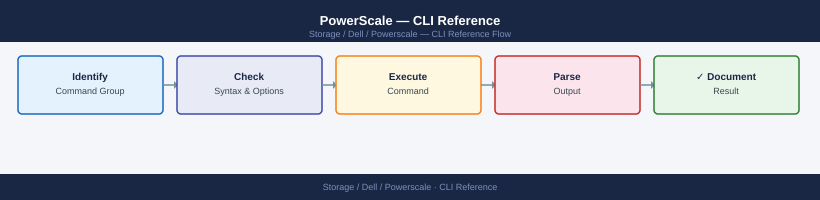

---
tags:
  - dell
  - operations
---
# PowerScale — CLI Reference


<div class="kb-summary">
Commonly used `isi` commands for managing Dell PowerScale (formerly Isilon) scale-out NAS clusters. All commands run from the cluster CLI — log in via SSH to any node. > Use `isi --help` or `isi <subcommand> --help` for full option lists.

*Applies to: PowerScale (Isilon) 9.x*
</div>



Commonly used `isi` commands for managing Dell PowerScale (formerly Isilon) scale-out NAS clusters. All commands run from the cluster CLI — log in via SSH to any node.

> Use `isi --help` or `isi <subcommand> --help` for full option lists.

## Before you begin

- **Access:** Storage admin credentials (cluster admin or equivalent)
- **Timing:** safe to run during business hours unless a step is marked ⚠ (causes interruption)
- **Dependencies:** no active upgrades or migrations on the same infrastructure
- **Logging:** capture command output — paste into the change record on completion

---

## Cluster Status & Identity

```bash
# OneFS version
isi version

# Cluster status overview (nodes, capacity, health)
isi status

# Cluster name, contact info, timezone
isi cluster identity view

# Cluster configuration — join mode, ifs mount point
isi cluster config view
```

### Node Status

```bash
# List all nodes with ID, name, state
isi node list

# Specific node detail
isi node view <node_id>

# Node status on the cluster
isi status -n <node_id>
```

### Cluster Statistics

```bash
# Cluster-wide throughput and latency
isi statistics cluster list

# Drive statistics summary
isi statistics drive list

# Current IOPS and throughput
isi statistics system list

# Protocol breakdown (NFS, SMB, iSCSI)
isi statistics protocol list
```

### Cluster Events and Jobs

```bash
# Active events (alerts)
isi events list

# Running jobs (FlexProtect, SmartPools, etc.)
isi job jobs list

# Job detail
isi job jobs view <job_id>
```

### Quick Cluster Health

```bash
# Combined status view
isi status
isi events list | grep -i "error\|critical\|warning"
isi job jobs list | grep -i running
```

---

## Nodes

```bash
# List all nodes
isi node list

# Specific node detail (state, IP, version)
isi node view <node_id>

# Node status overlay on the cluster status
isi status -n <node_id>
```

### Node Hardware

```bash
# Hardware details (model, CPU, RAM, NIC, HBA)
isi node hardware view <node_id>

# Drive bays and disk states
isi node drives list <node_id>

# Specific bay
isi node drives view <node_id> <bay>

# Environmental sensors (temperature, fans, power supplies)
isi node sensors view <node_id>
```

### Disk States

| State | Meaning | Action |
|---|---|---|
| `HEALTHY` | Normal | None |
| `SMARTFAIL` | Being evacuated | Do not remove until complete |
| `DEAD` | Failed | Replace after data evacuated |
| `REPLACING` | Replacement in progress | Wait for rebuild |
| `STALLED` | Stuck rebuild | Contact Dell support |

### Smartfailing a Drive

```bash
# Mark a drive for evacuation (data moves to remaining drives)
isi devices drive smartfail -d <node_id> -b <bay_id>

# Monitor FlexProtect rebuild after drive removal
isi job jobs list | grep FlexProtect
isi status -n <node_id>
```

### Smartfailing a Node

```bash
# Initiate node smartfail
isi devices smartfail -d <node_id>

# Monitor progress
isi status | grep smartfail
isi job jobs list | grep -i FlexProtect

# Re-add node after replacement/repair
isi devices add -d <node_id>
```

### Node Network

```bash
# Network interfaces on a node
isi network interfaces list --node <node_id>

# IP pool assignments
isi network pools list

# Check node's external IPs
isi network interfaces list --node <node_id> | grep ext
```

### Node Performance

```bash
# Per-node I/O statistics
isi statistics node list

# Node CPU and memory usage
isi statistics system list --nodes <node_id>
```

---

## Storage Pools & Tiers

### Node Pools

```bash
# List all node pools
isi storagepool nodepools list

# Detailed view of a node pool
isi storagepool nodepools view <pool_name>

# Check node pool capacity usage
isi storagepool nodepools list | awk '{print $1, $4, $5, $6}'
```

### Tiers

```bash
# List configured tiers
isi storagepool tiers list

# View a tier (shows which node pools are members)
isi storagepool tiers view <tier_name>

# Create a tier
isi storagepool tiers create <tier_name> --children <nodepool1>,<nodepool2>

# Delete a tier
isi storagepool tiers delete <tier_name>
```

### File Pool Policies

```bash
# List all file pool policies
isi filepool policies list

# View the default policy
isi filepool default-policy view

# View a specific policy
isi filepool policies view <policy_name>

# Create a policy — move files older than 30 days to archive tier
isi filepool policies create archive-old-files \
    --file-matching-pattern 'accessed:>30:days' \
    --set-data-storage-target <archive_tier> \
    --set-data-ssd-strategy avoid

# Modify the default policy
isi filepool default-policy modify \
    --set-data-storage-target <performance_tier>

# Delete a policy
isi filepool policies delete <policy_name>
```

### SmartPools Job

```bash
# Check SmartPools job status
isi job jobs list | grep SmartPool
isi job status | grep SmartPool

# Start SmartPools manually (e.g., after policy change)
isi job jobs start SmartPools

# View SmartPools job results
isi job history list | grep SmartPool
```

### Spillover Configuration

```bash
# View spillover settings
isi storagepool settings view

# Enable spillover to a specific tier
isi storagepool settings modify \
    --spillover-enabled yes \
    --spillover-target <tier_name>
```

### SSD Strategy Options

| Strategy | Behaviour |
|---|---|
| `metadata` | SSD caches metadata only (default) |
| `metadata-write` | SSD caches metadata + write cache |
| `data` | SSD caches full file data |
| `avoid` | No SSD caching — use for cold/archive data |

---

## File System & Quotas

```bash
# Browse
ls /ifs/
ls -la /ifs/<path>

# Directory info
isi get /ifs/<path>
isi get -D /ifs/<path>

# Create directory
mkdir -p /ifs/<path>

# Permissions
chmod 755 /ifs/<path>
chown <user>:<group> /ifs/<path>
isi get -a /ifs/<path>
```

### Quotas

```bash
# List quotas
isi quota quotas list
isi quota quotas list --type directory
isi quota quotas list --path /ifs/<path>

# View quota details
isi quota quotas view --path /ifs/<path> --type directory

# Create quota
isi quota quotas create /ifs/<path> directory --hard-threshold <size>G --soft-threshold <size>G --advisory-threshold <size>G

# Modify quota
isi quota quotas modify --path /ifs/<path> --type directory --hard-threshold <size>G

# Delete quota
isi quota quotas delete --path /ifs/<path> --type directory

# Quota reports
isi quota reports list
isi quota reports create
```

---

## NFS Exports

```bash
# List all NFS exports (export ID, path, clients)
isi nfs exports list

# Specific export detail
isi nfs exports view <export_id>

# Exports in a specific access zone
isi nfs exports list --zone <zone_name>
```

### Create an Export

```bash
# Basic export — read-write for a CIDR, root access for specific host
isi nfs exports create /ifs/<path> \
    --clients <ip_or_cidr> \
    --read-write-clients <ip_or_cidr> \
    --root-clients <root_client_ip>

# Export with access zone
isi nfs exports create /ifs/data/dept1 \
    --clients 10.0.1.0/24 \
    --read-write-clients 10.0.1.0/24 \
    --zone DeptZone1

# Read-only export
isi nfs exports create /ifs/archive \
    --clients 10.0.0.0/8 \
    --read-only-clients 10.0.0.0/8
```

### Modify an Export

```bash
# Add a root client to an existing export
isi nfs exports modify <export_id> --add-root-clients <new_ip>

# Add a read-write client
isi nfs exports modify <export_id> --add-read-write-clients <new_ip>

# Remove a client
isi nfs exports modify <export_id> --remove-clients <old_ip>
```

### Delete an Export

```bash
isi nfs exports delete <export_id>
```

### Reload / Verify

```bash
# Check exports for configuration errors
isi nfs exports check

# Reload NFS service (applies config changes)
isi services nfs reload

# View global NFS settings
isi nfs settings global view

# View default export settings
isi nfs settings export view
```

### Client Access Levels

| Client Type | Access |
|---|---|
| `--clients` | Listed as a client, inherits defaults |
| `--read-only-clients` | Read-only regardless of mount options |
| `--read-write-clients` | Full read-write |
| `--root-clients` | Root user retains root privileges (no squash) |

### NFS Settings

```bash
# NFS v3/v4 protocol settings
isi nfs settings global view | grep -E "nfs3|nfs4|nfsv4"

# Modify global NFS settings
isi nfs settings global modify --nfsv4-enabled true --nfsv3-enabled true
```

### NFS Troubleshooting

| Issue | Check | Command |
|---|---|---|
| Mount fails | Export exists for client IP? | `isi nfs exports list` |
| Access denied | Root squash on root-clients? | `isi nfs exports view <id>` |
| Stale NFS | NFS service running? | `isi services -a nfs` |
| Export check warnings | Configuration error | `isi nfs exports check` |

---

## SMB Shares

```bash
# List all SMB shares
isi smb shares list
isi smb shares view <share_name>
```

### Create / Modify / Delete

```bash
# Create
isi smb shares create <share_name> /ifs/<path>

# Modify — description
isi smb shares modify <share_name> --description "<text>"

# Enable Access Based Enumeration
isi smb shares modify <share_name> --access-based-enumeration true

# Set continuous availability (for CA shares)
isi smb shares modify <share_name> --continuously-available true

# Delete
isi smb shares delete <share_name>
```

### Share Permissions (ACL)

```bash
# List permissions
isi smb shares permission list <share_name>

# Grant full control to a group
isi smb shares permission create <share_name> \
    --authority <DOMAIN\\Group> \
    --permission-type allow \
    --permission full

# Remove a permission
isi smb shares permission delete <share_name> --authority <DOMAIN\\Group>
```

### SMB Service & Global Settings

```bash
# View global SMB settings (SMB versions, security)
isi smb settings global view

# Enable SMB2 and SMB3 (disable SMB1 for security)
isi smb settings global modify --support-smb2 true

# View SMB service status
isi smb settings service view

# Active SMB sessions
isi smb sessions list
```

### Access Zones

```bash
isi smb shares list --zone <zone_name>
isi smb shares create <share_name> /ifs/<path> --zone <zone_name>
```

### SMB Common Issues

| Issue | Check | Action |
|---|---|---|
| Share inaccessible | Share exists? | `isi smb shares list` |
| Permission denied | ACL | `isi smb shares permission list` |
| Share in wrong zone | Zone | Specify `--zone` on create |
| SMB1 negotiated | SMB settings | Disable SMB1 globally |

---

## Network

### Interfaces

```bash
# List all network interfaces
isi network interfaces list
isi network interfaces view <iface>

# Filter by node
isi network interfaces list --node-id <node_id>
```

### Subnets

```bash
isi network subnets list
isi network subnets view <subnet_name>

# Create a subnet
isi network subnets create <subnet_name> --subnet-mask <mask> --gateway <gateway>
```

### IP Pools (SmartConnect)

```bash
# List IP pools
isi network pools list
isi network pools view <pool_name>

# Create an IP pool
isi network pools create \
    --name <pool_name> \
    --subnet <subnet_name> \
    --access-zone <zone_name>

# Add an IP range to a pool
isi network pools modify <pool_name> --add-ranges <ip_start>-<ip_end>
```

### SmartConnect Policies

| Policy | Behavior |
|---|---|
| round-robin | Rotates IPs across connections |
| cpu-usage | Directs to least-loaded node |
| throughput | Directs to lowest-throughput node |
| connection-count | Directs to node with fewest connections |

```bash
# View SmartConnect rules
isi network rules list
isi network rules view <rule_name>

# DNS settings
isi network dns view
isi network external settings view
```

### Network Common Issues

| Issue | Check | Action |
|---|---|---|
| Client can't mount | IP pool and DNS | Verify SmartConnect DNS zone |
| Node not accepting connections | Interface status | Check interface state |
| Wrong node handling client | SmartConnect policy | Review and change pool policy |
| IP not responding | Pool membership | Verify IP in pool range |

---

## Access Zones & Authentication

### Access Zones

```bash
# List zones
isi zone zones list
isi zone zones view <zone_name>

# Create / delete zone
isi zone zones create <zone_name> --path /ifs/<path>
isi zone zones delete <zone_name>

# Modify zone
isi zone zones modify <zone_name> --add-auth-providers <provider>
```

### Authentication & Users

```bash
# Auth providers
isi auth providers list
isi auth providers ad list
isi auth providers ad view <provider_name>

# Join AD domain
isi auth ads create --name <domain> --user <admin_user> --password <password>

# Local users and groups
isi auth users list
isi auth users view <username>
isi auth users create --name <username> --password <password>
isi auth users delete <username>
isi auth groups list
isi auth groups view <group_name>

# Map rules
isi auth mappings rules list
```

---

## Snapshots

```bash
# List snapshots
isi snapshot snapshots list
isi snapshot snapshots view <snap_id>
```

### Create / Delete

```bash
# Create a snapshot
isi snapshot snapshots create /ifs/<path> --name <snap_name>

# Delete by ID
isi snapshot snapshots delete <snap_id>
# Delete by path and name
isi snapshot snapshots delete --path /ifs/<path> --name <snap_name>
```

### Restore Files from a Snapshot

```bash
ls /ifs/<path>/.snapshot/
cp -a /ifs/.snapshot/<snap_name>/<path>/* /ifs/<path>/
```

### Snapshot Schedules

```bash
# List schedules
isi snapshot schedules list
isi snapshot schedules view <schedule_name>

# Create a schedule (daily at midnight)
isi snapshot schedules create <schedule_name> /ifs/<path> "every day"

# Modify retention
isi snapshot schedules modify <schedule_name> --duration 7D

# Delete a schedule
isi snapshot schedules delete <schedule_name>
```

### Snapshot Aliases

```bash
isi snapshot aliases list
isi snapshot aliases create <alias_name> --target <snap_id>
```

### Snapshot Common Issues

| Issue | Check | Action |
|---|---|---|
| Snapshot not found | Path or name | `isi snapshot snapshots list` |
| `.snapshot` not visible | Client mount options | Verify NFS client has access to `.snapshot` |
| Snapshot space growing | Retention policy | Reduce schedule duration |
| Restore incomplete | Snapshot covers only part of path | Use correct snap path |

---

## SyncIQ — Replication

```bash
# List policies
isi sync policies list
isi sync policies view <policy_name>

# Create policy
isi sync policies create \
    --name <policy_name> \
    --action sync \
    --source-root-path /ifs/<src> \
    --target-host <ip> \
    --target-path /ifs/<dst>

# List running jobs
isi sync jobs list

# Run / pause / cancel
isi sync jobs start <policy_name>
isi sync jobs pause <policy_name>
isi sync jobs cancel <policy_name>

# View job progress
isi sync jobs view <job_id>

# Reports
isi sync reports list
isi sync reports view <report_id>

# Bandwidth rules (throttle replication to protect production I/O)
isi sync rules list
isi sync rules create bandwidth --limit <kbps> --schedule always

# Failover / failback
isi sync policies disable <policy_name>
isi sync recover policies list
```

---

## Jobs (Background Tasks)

### Check Running Jobs

```bash
# Summary of currently running jobs
isi job status

# List all active jobs
isi job jobs list

# List jobs in a specific state
isi job jobs list --state running
isi job jobs list --state paused
isi job jobs list --state failed

# View details of a specific job
isi job jobs view <job_id>
```

### Key Job Types

| Job | Purpose |
|---|---|
| FlexProtect | Re-protects data after a node or drive failure |
| SmartPools | Moves files between tiers based on file pool policies |
| Dedupe | Block-level deduplication (requires SmartDedupe license) |
| QuotaScan | Recalculates quota accounting |
| MultiScan | Combined integrity and protection scan |
| AutoBalance | Rebalances data across nodes |

```bash
# List all available job types
isi job types list

# View details and description of a job type
isi job types view <type_name>
```

### Start, Cancel, Pause, Resume

```bash
isi job jobs start FlexProtect
isi job jobs start QuotaScan
isi job jobs start SmartPools
isi job jobs cancel <job_id>
isi job jobs pause <job_id>
isi job jobs resume <job_id>
```

### Job History

```bash
# View completed job history
isi job history list

# Job events (detailed log entries)
isi job events list
isi job events list --job-id <job_id>
```

### Job Impact Policies

```bash
isi job policies list
isi job policies view <policy_name>

# Run Dedupe at low impact during business hours
isi job types modify Dedupe --policy LOW
```

### Monitoring FlexProtect

```bash
# Check if FlexProtect is running
isi job jobs list | grep FlexProtect

# Check overall data protection status
isi status | grep -E "SmartFail|Unhealthy|At risk"

# Check for unprotected files
isi status -n all | grep -i "unprotected\|degraded"
```

---

## Performance & Statistics

### Cluster-Level Stats

```bash
# Live cluster-wide stats
isi statistics system list

# Per-client breakdown
isi statistics client list

# Protocol-level stats
isi statistics protocol list

# Filter by specific protocol
isi statistics protocol list --protocol nfs3
isi statistics protocol list --protocol smb2
```

### Node-Level Stats

```bash
isi statistics node list
isi statistics node list --node-id <node_id>
```

### Drive & Disk Stats

```bash
isi statistics drive list
```

### Active Client Stats

```bash
# Active NFS client stats
isi statistics query current --stats node.clientstats.active.nfs

# Active SMB client stats
isi statistics query current --stats node.clientstats.active.smb2
```

### Historical Performance

```bash
isi statistics history list
```

### Performance Thresholds

| Metric | Normal | Action if Exceeded |
|---|---|---|
| Node CPU utilization | < 70% | Investigate top protocol clients |
| Disk latency | < 10 ms | Check drives; consider SSD tier |
| Network throughput | < 80% link capacity | Review top clients |

### Common Performance Issues

| Symptom | Check | Action |
|---|---|---|
| High latency on NFS | `isi statistics protocol list --protocol nfs3` | Identify top clients |
| One node overloaded | Node stats | Review SmartConnect zone policy |
| Drive latency high | `isi statistics drive list` | Check for failing drives |

---

## Events & Alerts

### View Events

```bash
# All active events
isi event events list

# Critical events only
isi event events list --severity critical

# Warning and above
isi event events list --severity warning

# Events since a specific date
isi event events list --start-time 2026-05-01

# Verbose output with full description
isi event events list -v

# Filter by event type
isi event events list | grep -i "disk\|node\|network\|quota"
```

### Resolve and Acknowledge Events

```bash
# Resolve an event (marks it as handled)
isi event events resolve <event_id>
```

### Alert Channels

```bash
# List configured alert channels (email, SNMP, etc.)
isi event channels list
isi event channels view <channel_name>

# Create an email alert channel
isi event channels create email-ops \
    --type smtp \
    --address ops-team@corp.local \
    --send-test yes

# Modify a channel
isi event channels modify <channel_name> --address new@corp.local
```

### Alert Rules

```bash
# List alert rules (which events trigger which channels)
isi event alerts list
isi event alerts view <alert_name>

# Create an alert rule — send critical events to email channel
isi event alerts create critical-to-email \
    --event-category all \
    --severity critical \
    --channels email-ops
```

### SNMP Configuration

```bash
isi snmp settings view

isi snmp settings modify \
    --snmp-v3-access-enable yes \
    --system-contact "infra-team@corp.local" \
    --system-location "DC1-Row3-Rack5"
```

---

## Firmware, Upgrades & Support

```bash
# Current OneFS version
isi version

# Drive firmware inventory
isi devices drives firmware list

# Start drive firmware upgrade
isi devices drives firmware upgrade start

# Cluster upgrade (rolling — one node at a time)
isi upgrade cluster --upgrade-image <image>
isi upgrade cluster check
isi upgrade nodes list
isi upgrade nodes view <node_id>

# License status (SmartPools, SyncIQ, SmartDedupe, etc.)
isi license licenses list
isi license licenses view <license_name>

# ESRS (remote support connectivity)
isi esrs settings view
isi esrs connectivity test

# Export cluster config (for support or documentation)
isi config dump
```

---

## Verify

- Confirm the operation completed without errors in the log or management UI
- Verify the expected state change is visible (service running, object created, config applied)
- Document the outcome in the change record

---

## See also

- [Powerscale — Procedures](procedures/)
- [Powerscale — Scripts](scripts/)
- [Powerscale — Health Checks](health-checks/)
