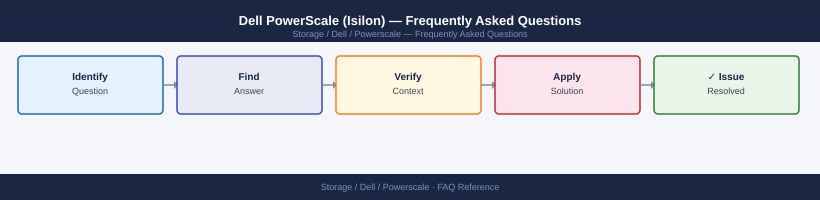

---
tags:
  - dell-powerscale
  - faq
  - operations
---
# Dell PowerScale (Isilon) — Frequently Asked Questions

Common questions about Dell PowerScale (Isilon) operations, configuration, and troubleshooting. For step-by-step procedures, see the <a href="index.md">Operations</a> section.

## General

**Q: What OneFS version is recommended for new deployments?**
A: OneFS 9.7.x is the current recommendation. Check with `isi version` on a node CLI or Isilon Management Interface (IMI) → Help → About.

**Q: How do I check the current Dell PowerScale (Isilon) version?**
A: `isi version`

## Configuration

**Q: What is the default protection level and when should it change?**
A: Default protection is +2d:1n (survive 2 drive failures or 1 node failure). Increase to +3d:1n1d or +2n for mission-critical data. Review with `isi storagepool list`.

**Q: How do I enable SmartQuotas for per-directory capacity limits?**
A: Enable the SmartQuotas licence and module. Create a quota: `isi quota quotas create /ifs/data/dept type=directory hard-threshold=1T`. Monitor with `isi quota quotas list`.

## Operations

**Q: How do I upgrade OneFS without disrupting NFS/SMB clients?**
A: OneFS rolling upgrades are supported: `isi upgrade cluster start --release <ver>`. Nodes upgrade one at a time; clients reconnect automatically. Verify cluster health before each node upgrade with `isi status`.

**Q: What is the correct procedure to add a new node to a PowerScale cluster?**
A: Rack and cable the node, power on, join via the join wizard or `isi devices node add`. OneFS rebalances data across the expanded cluster automatically. Monitor with `isi rebalance status`.

## Troubleshooting

**Q: PowerScale shows 'Node is in a degraded state'. What does it mean?**
A: A drive or network component in the node is failed or degraded. Check `isi status` for details. If a drive has failed, OneFS automatically reprotects data. If network is degraded, check InfiniBand/Ethernet back-end connections.

**Q: NFS throughput is below expectations — where do I start?**
A: Check `isi statistics client` for per-client throughput. Verify NIC bonding and MTU (jumbo frames recommended). Review SmartPools tiering — data may have migrated to slower HDD tiers. Check for heavy metadata operations with `isi statistics system`.

## Backup and Recovery

**Q: How often should I back up PowerScale configuration?**
A: Weekly configuration backup via `isi_gather_info --upload`. For DR, configure SyncIQ replication to a second cluster. Test SyncIQ failover quarterly.

**Q: Can I restore a single directory from a SyncIQ replica?**
A: Yes — with SyncIQ, perform a selective recovery: `isi sync policies edit --target-compare-initial-sync true`. For SnapshotIQ, restore a directory: `isi snapshot restore <snapshot> /ifs/data/dir`.

## See Also

- [Dell PowerScale (Isilon) Operations](index.md)
- [Dell PowerScale (Isilon) Troubleshooting](../../../troubleshooting/index.md)
