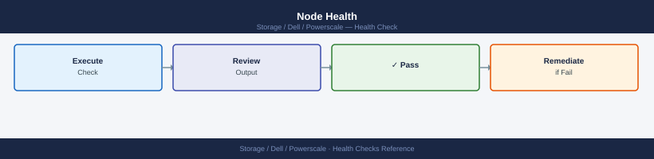

---
tags:
  - dell
  - operations
---
# PowerScale — Health Checks

<div class="kb-summary">
Health Checks reference covering Daily Checks, Health Check, Cluster Health Commands, Health Check Summary.

*Applies to: PowerScale (Isilon) 9.x*
</div>

## Before you begin

- **Access:** Storage admin credentials (cluster admin or equivalent)
- **Timing:** safe to run during business hours unless a step is marked ⚠ (causes interruption)
- **Dependencies:** no active upgrades or migrations on the same infrastructure
- **Logging:** capture command output — paste into the change record on completion

---

## Run This Routine

1. **Cluster health:** `isi status` — all nodes should show status Healthy
2. **Quota status:** `isi quota quotas list --format=table` — check near-threshold quotas
3. **SyncIQ replication:** `isi sync reports list` — check last sync success/failure
4. **SmartPools:** `isi storagepool nodepools list` — verify tier assignments
5. **Disk status:** `isi devices drive list` — all drives Healthy
6. **Network interfaces:** `isi network interfaces list` — all Up
7. **Active alerts:** `isi events list --is_alertable=true --resolved=false`

## Daily Checks


```d2
direction: right

A: "Daily Health Check" {shape: rectangle}
B: "isi status\nAll nodes ONLINE?" {shape: rectangle}
C: "SMARTFAIL\nor DOWN node?" {shape: rectangle}
D: "Do NOT remove manually\nMonitor Restripe job\nOpen Dell support case" {shape: rectangle}
E: "isi storagepool list\nCapacity < 80%?" {shape: rectangle}
F: "Pool > 80%?" {shape: rectangle}
G: "Identify top consumers\nisi quota quotas list\nPlan expansion or cleanup" {shape: rectangle}
H: "isi sync policies list\nSyncIQ all SUCCESS?" {shape: rectangle}
I: "Policy FAILED\nor OVERDUE?" {shape: rectangle}
J: "isi sync reports list\nInvestigate error\nRestart if needed" {shape: rectangle}
K: "isi event list --limit 20\nCRITICAL events?" {shape: rectangle}
L: "Unack" {shape: rectangle}
M: "Triage event code\nEscalate if hardware" {shape: rectangle}
N: "Checks passed" {shape: rectangle}

A -> B
B -> C
C -> D
C -> E
E -> F
F -> G
F -> H
H -> I
I -> J
I -> K
K -> L
L -> M
L -> N
D -> G
G -> J
J -> M
M -> N
```

| Check | Command | Notes |
|---|---|---|
| [ ] Run `isi status` | `isi status` | confirm all nodes show `ONLINE` and no node is in `SMARTFAIL` or `DOWN` state; note any drive alerts |
| [ ] Run `isi job list` | `isi job list` | confirm no active cluster jobs are in `ERROR` or `PAUSED` state; note unusually long-running Restripe or MultiScan jobs |
| [ ] Check SyncIQ policies | `isi sync policies list` | confirm each policy shows `Last Success` with a timestamp within the expected RPO window |
| [ ] Review recent events | `isi event list --limit 20` | triage any CRITICAL or ERROR severity events |
| [ ] Check storage pool capacity | `isi storagepool list` | alert if any pool or tier exceeds 80% used |
| [ ] Check SmartQuota violations | `isi quota quotas list` | look for directories that have exceeded soft or hard thresholds |
| [ ] Review InsightIQ or CloudIQ for performance anomalies |  | flag any node with sustained CPU utilisation above 85% or latency spikes |
| [ ] Confirm SyncIQ RPO compliance by checking `isi sync reports list` | `isi sync reports list --limit 5` |  |

## Health Check


Run these checks before any maintenance or change, or as first steps when investigating a reported issue.

- [ ] `isi status` — cluster health summary, node states, and drive health are all clean (no SMARTFAIL, no DOWN, no drive faults)
- [ ] `isi storagepool list` — all pools and tiers are below 80% used; confirm SmartPool tiering policies are active
- [ ] `isi job list` — no jobs in ERROR or unexpectedly PAUSED; note any job running longer than its typical duration
- [ ] `isi sync reports list --limit 5` — most recent SyncIQ reports for all policies show SUCCESS; check for policies with repeated failures
- [ ] `isi event list` — no unacknowledged CRITICAL events in the last 24 hours
- [ ] `isi license list` — all required licenses (SmartQuotas, SyncIQ, SmartPools, SnapshotIQ) are valid and not near expiry
- [ ] `isi network subnets list` — SmartConnect zones are configured correctly and DNS delegation is in place
- [ ] `isi statistics query current --keys CPU` — no individual nodes showing sustained CPU saturation

```bash
# Overall cluster node and drive health summary
isi status

# List all storage pool tiers and their capacity usage
isi storagepool list

# List active and recent cluster background jobs
isi job list

# List SyncIQ policies and their last run status
isi sync policies list

# Show the 5 most recent SyncIQ replication reports
isi sync reports list --limit 5

# List all cluster events (triage CRITICAL severity first)
isi event list --limit 20

# List all SmartQuota entries including directories near threshold
isi quota quotas list

# Query current per-node CPU utilisation
isi statistics query current --keys CPU

# Show installed OneFS version and license status
isi license list
```

## Cluster Health Commands


```bash
# Cluster identity, version, and status
isi version
isi status
isi cluster identity view

# Node count and status summary
isi node list
isi status -n all   # Per-node health summary
```

### Node Health



```bash
# List all nodes with status
isi node list

# Detailed view of a specific node
isi node view <node_id>

# Node hardware sensors (temperature, fans, power)
isi node sensors view <node_id>

# Node drives — check for failed or degraded drives
isi node drives list <node_id>
isi node drives list <node_id> | grep -iE "failed|degraded|missing"
```

### Active Events and Alerts


```bash
# All unresolved critical events
isi event events list --severity critical

# All unresolved events (all severities)
isi event events list

# Events from the last 24 hours
isi event events list --start-time $(date -d 'yesterday' '+%Y-%m-%d')

# Alert channels configured
isi event channels list
```

### Cluster Capacity


```bash
# Overall used vs. free capacity
isi statistics system list | grep -E "Cluster Capacity|Used|Free"

# Storage pool capacity breakdown
isi storagepool nodepools list
isi storagepool tiers list

# SmartQuotas — total quota usage
isi quota quotas list --type directory | head -20
```

### Protocol Services


```bash
# NFS service status
isi services -a | grep nfs

# SMB service status
isi services -a | grep smb

# All running services
isi services -a | grep running
```

### SyncIQ Replication


```bash
# Policy status
isi sync policies list
isi sync policies view <policy_name>

# Last job result for each policy
isi sync jobs list --state finished | head -10

# Check for failed replication jobs
isi sync jobs list --state failed
isi sync jobs list --state paused
```

### Jobs (Background Tasks)


```bash
# Currently running jobs
isi job status

# Any job in error state
isi job jobs list | grep -i error

# FlexProtect status (data protection rebuild)
isi job jobs list | grep -i "FlexProtect\|Repair"
```

## Health Check Summary


| Check | Command | Healthy |
|---|---|---|
| All nodes online | `isi node list` | All = online |
| No critical events | `isi event events list --severity critical` | 0 events |
| Capacity < 80% | `isi statistics system list` | Used < 80% |
| NFS/SMB services running | `isi services -a` | Both running |
| SyncIQ policies healthy | `isi sync policies list` | All enabled, last job success |
| No jobs in error | `isi job jobs list` | 0 errors |
| No failed drives | `isi node drives list` | 0 failed/degraded |

---

## Verify

- Confirm the operation completed without errors in the log or management UI
- Verify the expected state change is visible (service running, object created, config applied)
- Document the outcome in the change record

---

## See also

- [Powerscale — Procedures](../procedures/)
- [Powerscale — CLI Reference](../cli-reference/)
- [Powerscale — Common Issues](../../troubleshooting/common-issues/)
