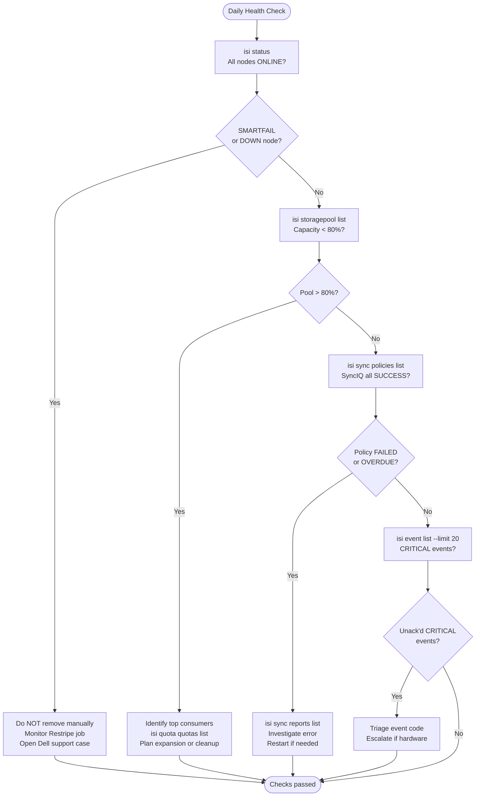

# PowerScale — Health Checks


<div class="kb-summary">
Health Checks reference covering Daily Checks, Health Check, Cluster Health Commands, Health Check Summary.
</div>
```text
┌─────────────────────────────────── Dell PowerScale — Health Checks ───────────────────────────────────┐
│                                                                                                       │
│   ┌───────────────────────────────────────────────────────────────────────────────────────────────┐   │
│   │      PowerScale health checks: routine verification of operational status and performance     │   │
│   │         Checks include: controller status, drive health, replication lag, and capacity        │   │
│   │         Frequency: daily quick checks; weekly detailed review; monthly capacity report        │   │
│   │        Configure threshold-based alerts for proactive incident prevention and awareness       │   │
│   └───────────────────────────────────────────────────────────────────────────────────────────────┘   │
│                                                                                                       │
│    Check status → review alerts → verify replication → capacity → log                                 │
│                                                                                                       │
│                  ▼                                ▼                                ▼                  │
│                                                                                                       │
│   ┌─────────────────────────────┐  ┌─────────────────────────────┐  ┌─────────────────────────────┐   │
│   │            Layer            │  │          Component          │  │           Function          │   │
│   │              OS             │  │            OneFS            │  │        Distributed FS       │   │
│   │           Tiering           │  │          SmartPools         │  │        Auto data move       │   │
│   │         Replication         │  │            SyncIQ           │  │        Async DR copy        │   │
│   │          Snapshots          │  │          SnapshotIQ         │  │       Space-efficient       │   │
│   │         Load balance        │  │         SmartConnect        │  │       DNS client dist.      │   │
│   └─────────────────────────────┘  └─────────────────────────────┘  └─────────────────────────────┘   │
│                                                                                                       │
│                          ▼                                                 ▼                          │
│                                                                                                       │
│   ┌───────────────────────────────────────────────────────────────────────────────────────────────┐   │
│   │    Check area    │  How to verify   │   Pass criteria   │    Frequency     │       Tool       │   │
│   │   Controllers    │   show status    │    All healthy    │      Daily       │     CLI/GUI      │   │
│   │      Drives      │   show drives    │  No failed/pred.  │      Daily       │     CLI/GUI      │   │
│   │   Replication    │ show replication │  Lag < threshold  │      Daily       │     CLI/GUI      │   │
│   │     Capacity     │  show capacity   │     < 80% used    │      Daily       │     CLI/GUI      │   │
│   └───────────────────────────────────────────────────────────────────────────────────────────────┘   │
│                                                                                                       │
│    Physical: PowerScale nodes (All-Flash/Hybrid) · InfiniBand backend · 25/100 GbE frontend           │
│                                                                                                       │
│    Key terms:                                                                                         │
│                                                                                                       │
│    OneFS              = Dell PowerScale distributed filesystem OS; all nodes share a single namespace │
│    SmartPools         = tiering engine; moves files between All-Flash, Hybrid, and Archive tiers      │
│    SyncIQ             = async replication to DR cluster; RPO-based schedule; failover in minutes      │
│    SnapshotIQ         = space-efficient snapshots; accessed via .snapshot directory in each share     │
│    SmartConnect       = DNS-based load balancing; distributes NFS/SMB client connections across nodes │
│    Access zone        = logical container with separate authentication and export namespace per tenant│
│    Quota              = directory or user quota; hard/soft/advisory limits enforced by OneFS QuotaIQ  │
│    CloudPools         = tiering to cloud object storage (S3/Blob); data remains accessible locally    │
│    isi CLI            = OneFS command-line interface; all management operations available via isi c...│
│    Node pool          = group of same-model nodes sharing protection domain for data distribution     │
│    Protection level   = N+2:1, N+3:1 etc.; defines how many node or drive failures are tolerated      │
│    File pool policy   = rule-based policy assigning files to specific node pools or storage tiers     │
│                                                                                                       │
└───────────────────────────────────────────────────────────────────────────────────────────────────────┘
```

## Run This Routine

1. **Cluster health:** `isi status` — all nodes should show status Healthy
2. **Quota status:** `isi quota quotas list --format=table` — check near-threshold quotas
3. **SyncIQ replication:** `isi sync reports list` — check last sync success/failure
4. **SmartPools:** `isi storagepool nodepools list` — verify tier assignments
5. **Disk status:** `isi devices drive list` — all drives Healthy
6. **Network interfaces:** `isi network interfaces list` — all Up
7. **Active alerts:** `isi events list --is_alertable=true --resolved=false`

## Daily Checks



| Check | Command | Notes |
|---|---|---|
| [ ] Run `isi status` | `isi status` | confirm all nodes show `ONLINE` and no node is in `SMARTFAIL` or `DOWN` state; note any drive alerts |
| [ ] Run `isi job list` | `isi job list` | confirm no active cluster jobs are in `ERROR` or `PAUSED` state; note unusually long-running Restripe or MultiScan jobs |
| [ ] Check SyncIQ policies | `isi sync policies list` | confirm each policy shows `Last Success` with a timestamp within the expected RPO window |
| [ ] Review recent events | `isi event list --limit 20` | triage any CRITICAL or ERROR severity events |
| [ ] Check storage pool capacity | `isi storagepool list` | alert if any pool or tier exceeds 80% used |
| [ ] Check SmartQuota violations | `isi quota quotas list` | look for directories that have exceeded soft or hard thresholds |
| [ ] Review InsightIQ or CloudIQ for performance anomalies |  | flag any node with sustained CPU utilisation above 85% or latency spikes |
| [ ] Confirm SyncIQ RPO compliance by checking `isi sync reports list` | `isi sync reports list --limit 5` |  |

## Health Check

Run these checks before any maintenance or change, or as first steps when investigating a reported issue.

- [ ] `isi status` — cluster health summary, node states, and drive health are all clean (no SMARTFAIL, no DOWN, no drive faults)
- [ ] `isi storagepool list` — all pools and tiers are below 80% used; confirm SmartPool tiering policies are active
- [ ] `isi job list` — no jobs in ERROR or unexpectedly PAUSED; note any job running longer than its typical duration
- [ ] `isi sync reports list --limit 5` — most recent SyncIQ reports for all policies show SUCCESS; check for policies with repeated failures
- [ ] `isi event list` — no unacknowledged CRITICAL events in the last 24 hours
- [ ] `isi license list` — all required licenses (SmartQuotas, SyncIQ, SmartPools, SnapshotIQ) are valid and not near expiry
- [ ] `isi network subnets list` — SmartConnect zones are configured correctly and DNS delegation is in place
- [ ] `isi statistics query current --keys CPU` — no individual nodes showing sustained CPU saturation

```bash
# Overall cluster node and drive health summary
isi status

# List all storage pool tiers and their capacity usage
isi storagepool list

# List active and recent cluster background jobs
isi job list

# List SyncIQ policies and their last run status
isi sync policies list

# Show the 5 most recent SyncIQ replication reports
isi sync reports list --limit 5

# List all cluster events (triage CRITICAL severity first)
isi event list --limit 20

# List all SmartQuota entries including directories near threshold
isi quota quotas list

# Query current per-node CPU utilisation
isi statistics query current --keys CPU

# Show installed OneFS version and license status
isi license list
```

## Cluster Health Commands

```bash
# Cluster identity, version, and status
isi version
isi status
isi cluster identity view

# Node count and status summary
isi node list
isi status -n all   # Per-node health summary
```

### Node Health

```bash
# List all nodes with status
isi node list

# Detailed view of a specific node
isi node view <node_id>

# Node hardware sensors (temperature, fans, power)
isi node sensors view <node_id>

# Node drives — check for failed or degraded drives
isi node drives list <node_id>
isi node drives list <node_id> | grep -iE "failed|degraded|missing"
```

### Active Events and Alerts

```bash
# All unresolved critical events
isi event events list --severity critical

# All unresolved events (all severities)
isi event events list

# Events from the last 24 hours
isi event events list --start-time $(date -d 'yesterday' '+%Y-%m-%d')

# Alert channels configured
isi event channels list
```

### Cluster Capacity

```bash
# Overall used vs. free capacity
isi statistics system list | grep -E "Cluster Capacity|Used|Free"

# Storage pool capacity breakdown
isi storagepool nodepools list
isi storagepool tiers list

# SmartQuotas — total quota usage
isi quota quotas list --type directory | head -20
```

### Protocol Services

```bash
# NFS service status
isi services -a | grep nfs

# SMB service status
isi services -a | grep smb

# All running services
isi services -a | grep running
```

### SyncIQ Replication

```bash
# Policy status
isi sync policies list
isi sync policies view <policy_name>

# Last job result for each policy
isi sync jobs list --state finished | head -10

# Check for failed replication jobs
isi sync jobs list --state failed
isi sync jobs list --state paused
```

### Jobs (Background Tasks)

```bash
# Currently running jobs
isi job status

# Any job in error state
isi job jobs list | grep -i error

# FlexProtect status (data protection rebuild)
isi job jobs list | grep -i "FlexProtect\|Repair"
```

## Health Check Summary

| Check | Command | Healthy |
|---|---|---|
| All nodes online | `isi node list` | All = online |
| No critical events | `isi event events list --severity critical` | 0 events |
| Capacity < 80% | `isi statistics system list` | Used < 80% |
| NFS/SMB services running | `isi services -a` | Both running |
| SyncIQ policies healthy | `isi sync policies list` | All enabled, last job success |
| No jobs in error | `isi job jobs list` | 0 errors |
| No failed drives | `isi node drives list` | 0 failed/degraded |
