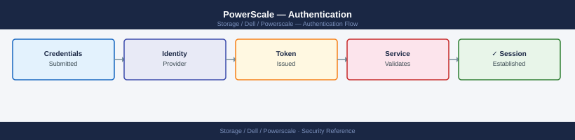
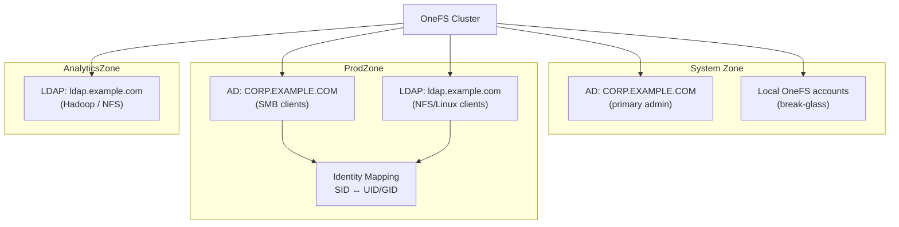

---
tags:
  - dell
  - security
---
# PowerScale — Authentication


<div class="kb-summary">
SSO, LDAP, local accounts, and identity sources for Dell PowerScale.

*Applies to: PowerScale (Isilon) 9.x*
</div>



## Before you begin

- **Access:** Storage admin credentials (cluster admin or equivalent)
- **Change management:** security changes require CAB approval in most environments
- **Rollback plan:** document current state before any security control change
- **Testing:** validate in a non-production environment first where possible

---

## Overview



PowerScale OneFS supports multiple identity providers per cluster, scoped to individual access zones. Each access zone can have its own set of authentication providers, allowing different client groups to use different identity sources against the same physical cluster. Supported providers are:

| Provider | Use Case |
|---|---|
| Active Directory (AD) | Windows SMB clients; multi-protocol environments with Windows identity |
| LDAP | Unix/Linux NFS clients; non-Windows environments |
| NIS | Legacy Unix environments; combined with LDAP or AD via identity mapping |
| Local OneFS accounts | Emergency access; service accounts; small deployments |
| Kerberos | Strong authentication for NFS v4 (NFSv4 Kerberos); SMB signing and sealing |

---

## Active Directory

### Joining an AD Domain

```bash
# Join an AD domain for a specific access zone
isi auth ads create \
    --name CORP.EXAMPLE.COM \
    --user svc-isilon-join \
    --password <password> \
    --zone ProdZone

# Join the System zone (default zone)
isi auth ads create \
    --name CORP.EXAMPLE.COM \
    --user svc-isilon-join \
    --password <password>

# Join with an organisational unit (OU) path
isi auth ads create \
    --name CORP.EXAMPLE.COM \
    --user svc-isilon-join \
    --password <password> \
    --organizational-unit "OU=StorageServers,OU=Servers,DC=corp,DC=example,DC=com"
```

> Use a dedicated service account for the AD join. The account only needs permissions to join computers to the specified OU. Revoke the password after the join is complete — the cluster uses the machine account for ongoing Kerberos operations.

### Managing AD Providers

```bash
# List AD providers (all zones)
isi auth ads list

# List AD providers for a specific zone
isi auth ads list --zone ProdZone

# View AD provider details (join status, domain controller, SPN)
isi auth ads view CORP.EXAMPLE.COM --zone ProdZone

# Check AD connectivity and Kerberos ticket status
isi auth ads check CORP.EXAMPLE.COM

# Force re-authentication with the domain controller
isi auth ads update CORP.EXAMPLE.COM

# Remove an AD provider from a zone
isi auth ads delete CORP.EXAMPLE.COM --zone ProdZone
```

### AD Provider Settings

```bash
# View current AD provider configuration
isi auth ads view CORP.EXAMPLE.COM -v

# Modify an AD provider — change DC lookup mode
isi auth ads modify CORP.EXAMPLE.COM \
    --domain-controller dc01.corp.example.com \
    --zone ProdZone

# Configure AD to enumerate all trusted domains
isi auth ads modify CORP.EXAMPLE.COM \
    --lookup-groups yes \
    --lookup-users yes \
    --zone ProdZone

# Set a specific site for DC selection (useful in multi-site environments)
isi auth ads modify CORP.EXAMPLE.COM \
    --site LondonDC \
    --zone ProdZone
```

### AD Troubleshooting

```bash
# Test AD authentication for a specific user
isi auth users view CORP\\testuser --zone ProdZone

# Check group memberships resolve correctly
isi auth groups view "CORP\\Domain Users" --zone ProdZone

# Verify the machine account is healthy in AD
isi auth ads check CORP.EXAMPLE.COM

# Check for Kerberos ticket issues
isi auth ads update CORP.EXAMPLE.COM --update-password yes

# Review auth provider events
isi event events list | grep -i "auth\|kerberos\|AD"
```

| Problem | Command | Action |
|---|---|---|
| AD provider shows `disconnected` | `isi auth ads check` | Verify DC connectivity; check DNS resolution from cluster nodes |
| SMB auth failing for AD users | `isi auth users view <user>` | Confirm provider is joined; check Kerberos time sync |
| User not found when accessing SMB share | `isi auth ads list` | Confirm the provider is assigned to the correct access zone |
| Group membership not resolving | `isi auth ads view` | Confirm `lookup-groups` is enabled; check trusted domain traversal |

---

## LDAP

### Adding an LDAP Provider

```bash
# Basic LDAP provider (anonymous bind)
isi auth ldap create \
    --name ldap-prod \
    --server ldap://ldap.example.com \
    --base-dn "dc=example,dc=com" \
    --zone ProdZone

# LDAP with authenticated bind (recommended)
isi auth ldap create \
    --name ldap-prod \
    --server ldap://ldap.example.com \
    --base-dn "dc=example,dc=com" \
    --bind-dn "cn=isilon-svc,ou=service-accounts,dc=example,dc=com" \
    --bind-password <password> \
    --zone ProdZone

# LDAPS (TLS-encrypted LDAP)
isi auth ldap create \
    --name ldap-prod-tls \
    --server ldaps://ldap.example.com:636 \
    --base-dn "dc=example,dc=com" \
    --bind-dn "cn=isilon-svc,ou=service-accounts,dc=example,dc=com" \
    --bind-password <password> \
    --tls-revocation-check-level none \
    --zone ProdZone

# Add a secondary LDAP server for failover
isi auth ldap modify ldap-prod \
    --add-server ldap://ldap2.example.com \
    --zone ProdZone
```

### LDAP Configuration Options

```bash
# View LDAP provider configuration
isi auth ldap view ldap-prod --zone ProdZone

# Modify user and group search bases
isi auth ldap modify ldap-prod \
    --user-search-dn "ou=users,dc=example,dc=com" \
    --group-search-dn "ou=groups,dc=example,dc=com" \
    --zone ProdZone

# Configure custom LDAP attribute mappings (if using non-standard schemas)
isi auth ldap modify ldap-prod \
    --user-uid-attribute sAMAccountName \
    --user-gid-attribute gidNumber \
    --zone ProdZone

# Set LDAP search scope
isi auth ldap modify ldap-prod \
    --search-scope subtree \
    --zone ProdZone

# Test LDAP provider connectivity and user lookup
isi auth users view ldap-prod\\testuser --zone ProdZone
```

### LDAP Troubleshooting

```bash
# Check provider status
isi auth providers list --zone ProdZone

# Verify LDAP server reachability from cluster
# (run on any cluster node as root)
ldapsearch -H ldap://ldap.example.com \
    -D "cn=isilon-svc,ou=service-accounts,dc=example,dc=com" \
    -w <password> \
    -b "dc=example,dc=com" \
    "(uid=testuser)"

# View auth events for LDAP errors
isi event events list | grep -i ldap
```

---

## NIS

NIS is supported for legacy Unix environments, typically alongside LDAP or AD for full user and group resolution.

```bash
# Add a NIS provider
isi auth nis create \
    --name nis-prod \
    --servers nis.example.com \
    --domain example.com \
    --zone ProdZone

# List NIS providers
isi auth nis list

# View NIS provider details
isi auth nis view nis-prod

# Remove a NIS provider
isi auth nis delete nis-prod --zone ProdZone
```

NIS is not recommended for new deployments. Use LDAP or Active Directory instead; maintain NIS only if existing Unix clients rely on it.

---

## Local OneFS Accounts

Local accounts are stored in OneFS and are not tied to an external identity provider. Use local accounts for emergency administrative access and OneFS service accounts.

```bash
# List all local users
isi auth users list

# List local users in a specific zone
isi auth users list --zone ProdZone

# View a local user
isi auth users view admin

# Create a local user
isi auth users create \
    --name backupadmin \
    --password <password> \
    --enabled yes

# Modify a local user — set password expiry
isi auth users modify backupadmin --password-expires true --password-expiry 90D

# Disable a local user account (without deleting)
isi auth users modify backupadmin --enabled no

# Delete a local user
isi auth users delete backupadmin

# Local groups
isi auth groups list
isi auth groups create monitoring-group
isi auth groups modify monitoring-group --add-user backupadmin
isi auth groups view monitoring-group
```

### Local Account Security Practices

| Practice | Detail |
|---|---|
| Disable unused local accounts | Leave only `root` and a break-glass admin account enabled |
| Set password complexity | Configure via `isi auth settings global modify` |
| Restrict `root` login | Disable root SSH; use `root` only from the cluster console |
| Password rotation | Rotate local account passwords every 90 days; store in a privileged access vault |

---

## Identity Mapping (Multi-Protocol)

In environments where both Windows (SMB/AD) and Unix (NFS/LDAP) clients access the same data, OneFS must map identities between Windows SIDs and Unix UIDs/GIDs. Identity mapping rules control how this translation occurs.

```bash
# List current identity mapping rules
isi auth mappings rules list

# View identity mapping rules for a zone
isi auth mappings rules list --zone ProdZone

# View identity mapping settings
isi auth mappings settings view

# Create a bidirectional mapping rule (AD user → LDAP UID)
isi auth mappings rules create \
    --type bidir \
    --source-user "CORP\\jsmith" \
    --target-user "jsmith" \
    --zone ProdZone

# Create a range mapping (maps a range of UIDs to the equivalent GIDs)
isi auth mappings rules create \
    --type uid-to-gid \
    --source-range 10000-20000 \
    --target-range 10000-20000

# View the resolved identity for a specific user (effective UID, GIDs, SID)
isi auth users view CORP\\jsmith --zone ProdZone

# Check how a UNIX UID maps to an AD SID
isi auth users view --uid 1001 --zone ProdZone
```

### Identity Mapping Modes

| Mode | Behaviour |
|---|---|
| `algorithmic` | OneFS auto-generates a UID/GID from the SID — consistent but not portable to other systems |
| `manual` | Explicit rule-based mapping; required when existing Unix UID/GID values must be preserved |
| `mixed` | Manual rules apply where defined; algorithmic mapping applies for unmapped identities |

Configure the mapping mode per zone:

```bash
isi auth mappings settings modify --zone ProdZone --default-unix-shell /bin/bash
isi auth mappings settings view --zone ProdZone
```

---

## Kerberos — NFSv4 and SMB

### Kerberos for NFSv4

NFSv4 Kerberos provides strong mutual authentication between NFS clients and the PowerScale cluster. The cluster must be joined to an AD domain (or have Kerberos KDC configured) and NFS clients must have valid Kerberos tickets.

```bash
# Verify the cluster machine account has the correct SPNs for NFS
isi auth ads view CORP.EXAMPLE.COM | grep -i "SPN\|service"

# Enable NFSv4 with Kerberos on an export
isi nfs exports modify <export_id> \
    --security-flavors krb5,krb5i,krb5p

# View security flavors on an export
isi nfs exports view <export_id> | grep -i security

# Available security flavors
# krb5  — Kerberos authentication only (identity verified, data not signed/encrypted)
# krb5i — Kerberos with integrity (signed packets — protection against replay)
# krb5p — Kerberos with privacy (signed and encrypted — strongest; adds CPU overhead)
```

NFS client requirements for Kerberos:
- Client must have a valid Kerberos ticket (`kinit user@CORP.EXAMPLE.COM`).
- The NFS client's hostname must resolve forward and reverse in DNS.
- System time on NFS clients must be within 5 minutes of the cluster (configure NTP).

### SMB Signing and Sealing

```bash
# Require SMB signing for all clients (recommended for security)
isi smb settings global modify --server-signing required

# Enable SMB3 encryption (sealing) per share
isi smb shares modify <share_name> --encrypt-data true

# Enable SMB3 encryption for all shares in a zone
isi smb settings zone modify --zone ProdZone --encrypt-data true

# View current SMB signing settings
isi smb settings global view | grep -i signing
```

---

## Authentication Provider Order

Each access zone has a priority-ordered list of authentication providers. When a user logs in, providers are consulted in order until the identity is resolved.

```bash
# View providers assigned to a zone and their order
isi zone zones view ProdZone | grep -A 20 "Auth Providers"

# List all providers assigned to a zone
isi auth providers list --zone ProdZone

# Modify provider order for a zone (AD first, LDAP second)
isi zone zones modify ProdZone \
    --auth-providers "lsa-activedirectory-provider:CORP.EXAMPLE.COM,lsa-ldap-provider:ldap-prod"
```

---

## Multi-Zone Authentication Reference

| Scenario | Configuration |
|---|---|
| Pure Windows SMB environment | AD provider only; no LDAP/NIS |
| Pure Linux NFS environment | LDAP or NIS provider; no AD |
| Multi-protocol NFS + SMB, shared data | AD provider + LDAP/NIS provider; identity mapping rules to align SIDs with UIDs |
| Multi-tenant cluster | Separate access zones; each zone has its own provider scoped to its user base |
| Emergency access with no directory available | Local OneFS accounts with known credentials stored in a break-glass vault |

---

## NTP — Required for Kerberos

Kerberos authentication fails if system clocks are out of sync by more than 5 minutes. Configure NTP on the cluster and verify synchronisation:

```bash
# View NTP configuration
isi ntp settings view

# Add an NTP server
isi ntp servers create --name ntp.example.com

# List configured NTP servers
isi ntp servers list

# Check NTP sync status (run on a cluster node)
ntpq -p
```

Ensure all NFS clients with Kerberos mounts also use the same NTP source as the cluster and the domain controllers.
---

## Related Reference

- [Standard LDAP Integration](../../../../security/ldap-integration/index.md) — field reference, service account standards, TLS requirements, and connectivity testing
- [Standard SAML Configuration](../../../../security/saml-configuration/index.md) — SP/IdP setup, Azure AD and Okta steps, attribute mapping, and security requirements

---

## See also

- [Powerscale — Access Control](access-control/)
- [Powerscale — Hardening](hardening/)
- [Powerscale — Encryption](encryption/)
