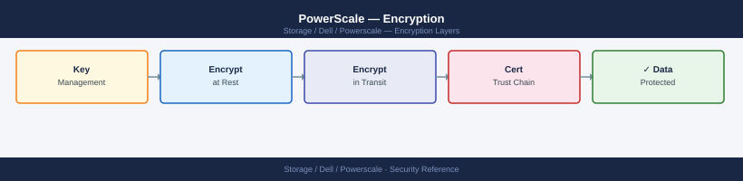
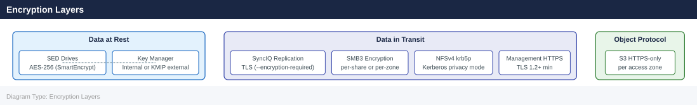

---
tags:
  - dell
  - security
---
# PowerScale — Encryption

<div class="kb-summary">
TLS certificate management and data encryption for Dell PowerScale.

*Applies to: PowerScale (Isilon) 9.x*
</div>


## Before you begin

- **Access:** Storage admin credentials (cluster admin or equivalent)
- **Change management:** security changes require CAB approval in most environments
- **Rollback plan:** document current state before any security control change
- **Testing:** validate in a non-production environment first where possible

---

## Encryption Layers



| Layer | Mechanism | Notes |
|---|---|---|
| Data at Rest | Self-Encrypting Drives (SED) with AES-256 | Hardware-based; configured at factory order time. Cannot be enabled retroactively on non-SED nodes. |
| Data in Transit (SyncIQ) | TLS-encrypted replication channel | Enable per policy: `--encryption-required true` |
| Data in Transit (S3) | HTTPS (TLS 1.2+) | Enforced per access zone S3 configuration |
| Management Traffic | HTTPS (TLS 1.2+) for web UI; SSH for CLI | Disable TLS 1.0/1.1; restrict to strong cipher suites |
| SMB Encryption | SMB3 end-to-end encryption | Enable per-share or per-zone |
| NFS in Transit | NFSv4 with `krb5p` (Kerberos privacy) | Provides NFS packet-level encryption; requires Kerberos setup |

---

## Data at Rest — Self-Encrypting Drives (SED)

SED-based encryption is implemented in hardware on each drive. The encryption key is held by the drive controller and managed by the PowerScale cluster using the OneFS SmartEncrypt feature. SED drives cannot be read outside the cluster without the Data At Rest Encryption (DARE) key.

### Confirming SED Status

```bash
# Verify the cluster has SED drives and encryption is enabled
isi get -D /ifs | grep -i encrypt

# Check per-node drive encryption status
isi node drives list <node_id> | grep -i SED

# View drive details including encryption flag
isi node drives view <node_id> <bay>

# Confirm SmartEncrypt license is active
isi license licenses list | grep -i encrypt
```


```text title="Expected output"
Encryption: True
Encryption Mode: AES-256
Encryption Key Rotation: Enabled

Node: 1
Bay 1: SED (Self-Encrypting Drive) - Status: Active
Bay 2: SED (Self-Encrypting Drive) - Status: Active
Bay 3: SED (Self-Encrypting Drive) - Status: Active
Bay 4: SED (Self-Encrypting Drive) - Status: Active
...

Drive Details:
  Bay: 1
  Model: TOSHIBA MG07ACA14TE
  Serial: Y5K0A01VFKDE
  Encryption: Enabled
  FIPS Mode: Compliant

License: SmartEncrypt
  Status: Active
  Expiration: 2026-03-15
  Nodes Licensed: 6/6
```

!!! warning "Common errors"
    **`isi: command not found`** — Ensure you are running commands on the PowerScale cluster management node or install the OneFS CLI tools.
    **`Error: Invalid node ID '<node_id>'`** — Replace `<node_id>` with an actual node number (e.g., `1`, `2`, `3`) from your cluster.
    **`Error: License not found or inactive`** — Contact Dell support to activate the SmartEncrypt license or verify the license key is properly installed via System Settings > Licensing.
### Key Management

OneFS manages SED keys internally (local key management) by default. For regulatory environments requiring external key management, integrate with a KMIP-compliant external key manager (e.g., Dell Key Management Server, HashiCorp Vault, Thales).

```bash
# View current key management configuration
isi_kmip settings view 2>/dev/null || echo "KMIP not configured; using local key management"

# Configure KMIP server (if applicable)
isi_kmip servers create \
    --hostname kmip.example.com \
    --port 5696 \
    --certificate <cert_path>

# List KMIP servers
isi_kmip servers list

# Test KMIP connectivity
isi_kmip servers test <server_name>
```


```text title="Expected output"
KMIP not configured; using local key management
Created KMIP server: kmip.example.com
Server Name                Hostname              Port    Status
kmip.example.com           kmip.example.com      5696    Active
kmip-backup.example.com    kmip-backup.example.com 5696  Active

Testing KMIP server connectivity...
Server: kmip.example.com
Status: Connected
Response Time: 45ms
Certificate Valid Until: 2026-03-15
```

!!! warning "Common errors"
    **`Error: Certificate file not found at <cert_path>`** — Verify the certificate path is absolute and readable with `ls -la <cert_path>`.
    **`Error: Unable to connect to kmip.example.com:5696 - Connection refused`** — Confirm the KMIP server is running and firewall rules allow outbound port 5696 from the PowerScale cluster.
    **`Error: Certificate validation failed - untrusted CA`** — Import the KMIP server's CA certificate to the PowerScale cluster using `isi_kmip ca import`.
### SED Operational Notes

| Situation | Action |
|---|---|
| Replacing a failed SED drive | Follow standard drive replacement; OneFS automatically re-keys the replacement drive when inserted |
| Decommissioning a node | Perform a SmartFail before removal; drives are cryptographically erased on decommission |
| Node stolen or lost | SED keys are destroyed; data is unreadable without the cluster's key material |
| Expanding the cluster with non-SED nodes | Non-SED nodes will join as unencrypted storage pools; data written to non-SED nodes is not encrypted at rest |

> SED encryption cannot be retroactively enabled on drives ordered without the SED option. Order nodes with the `SED` BOM option at procurement time for regulatory environments.

---

## SyncIQ — Replication Encryption

By default, SyncIQ replication traffic crosses the WAN without encryption. Enable TLS encryption on replication policies for any data classified as sensitive or where the WAN link is untrusted.

### Enabling SyncIQ Encryption

```bash
# Require encryption on a specific SyncIQ policy
isi sync policies modify <policy_name> --encryption-required true

# View encryption status of all policies
isi sync policies list -v | grep -E "Name|Encryption"

# Require encryption at a global level (all new policies)
isi sync settings global modify --encryption-required true

# View global SyncIQ settings
isi sync settings global view
```


```text title="Expected output"
Modify policy 'prod-backup-daily': encryption required set to true
(no output — command completes silently)

Name                          Encryption Required
prod-backup-daily             true
dr-hourly-sync                false
archive-weekly                false
test-policy-01                false

Modify global settings: encryption required set to true
(no output — command completes silently)

=== Global SyncIQ Settings ===
Encryption Required:           true
Bandwidth Throttling:          disabled
Connection Pool Size:          4
Report Email Interval:         weekly
Max Parallel Transfers:        8
Bandwidth Limit (Mbps):        unlimited
```

!!! warning "Common errors"
    **`Error: Policy '<policy_name>' not found`** — Verify the policy name exists with `isi sync policies list` and use the exact name.
    **`Error: Access denied. Insufficient privileges for this operation`** — Run the command with appropriate admin credentials or use `sudo isi` if configured for passwordless sudo.
### SyncIQ Certificate Management

SyncIQ uses certificates to authenticate cluster-to-cluster connections. In older OneFS versions, this was based on shared keys; in OneFS 9.x, TLS certificates are used.

```bash
# List replication peer certificates
isi sync target policies list

# View the certificate for a specific target policy
isi sync target policies view <policy_name>

# Check SyncIQ service certificate
isi sync settings global view | grep -i cert

# Import a CA certificate for SyncIQ peer validation
isi certificate authority import --certificate-path /ifs/certs/ca.pem

# List all CA certificates
isi certificate authority list

# Delete an expired CA certificate
isi certificate authority delete <cert_id>
```


```text title="Expected output"
ID                          Policy Name              Target Cluster           Replication State
1                           prod-to-dr               192.168.1.50             Active
2                           prod-to-backup           10.20.30.40              Idle
3                           archive-sync             172.16.0.100             Active

Policy Name: prod-to-dr
Target Cluster: 192.168.1.50
Certificate Subject: CN=dr-cluster.example.com,O=Example Corp,C=US
Certificate Expiration: 2025-12-15
Thumbprint: a1b2c3d4e5f6g7h8i9j0k1l2m3n4o5p6q7r8s9t0

certificate_path: /ifs/data/synciq/certs/synciq.pem
certificate_expiration: 2026-03-20
certificate_status: Valid

Certificate imported successfully.
Certificate ID: ca-cert-2024-001
Subject: CN=ca.example.com,O=Example Corp,C=US

ID                          Subject                                    Expiration       Status
ca-cert-2024-001            CN=ca.example.com,O=Example Corp,C=US     2026-03-20       Valid
ca-cert-2023-005            CN=old-ca.example.com,O=Example Corp      2024-11-10       Expired
ca-cert-2023-002            CN=intermediate-ca.example.com,C=US       2025-08-30       Valid

Certificate ca-cert-2023-005 deleted successfully.
```

!!! warning "Common errors"
    **`isi: command not found`** — Ensure the OneFS CLI tools are installed and the PATH includes `/usr/local/bin` or the appropriate OneFS installation directory.
    **`Error: Certificate not found or invalid certificate ID`** — Verify the certificate ID exists by running `isi certificate authority list` and use the exact ID from the output.
    **`Error: Certificate is in use by active replication policies`** — Delete or update all replication policies using the certificate before attempting to remove it.
---

## SMB Encryption

SMB3 encryption provides end-to-end encryption of data in transit between Windows clients and the PowerScale cluster. SMB3 encryption requires Windows 8/Server 2012 or later clients.

### Enabling SMB Encryption

```bash
# Enable SMB3 encryption on a specific share
isi smb shares modify <share_name> --encrypt-data true

# Enable SMB3 encryption for all shares in an access zone
isi smb settings zone modify --zone <zone_name> --encrypt-data true

# Enable SMB3 encryption cluster-wide (all zones)
isi smb settings global modify --encrypt-data true

# Verify encryption setting on a share
isi smb shares view <share_name> | grep -i encrypt

# View SMB global settings including encryption
isi smb settings global view | grep -i "encrypt\|signing"
```


```text title="Expected output"
Share <share_name> modified successfully.
(no output — command completes silently)
(no output — command completes silently)
    encrypt_data: true
    encrypt_data: true
    smb_signing: required
    smb_encryption: required
    encryption_mode: aes-128-ccm
```

!!! warning "Common errors"
    **`Error: Invalid share name '<share_name>'`** — Replace `<share_name>` with an actual share name from `isi smb shares list`.
    **`Error: Access denied. Insufficient privileges to modify SMB settings.`** — Run the command with root or admin credentials, or use `sudo isi` if configured.
    **`Error: Zone '<zone_name>' does not exist`** — Verify the zone name exists by running `isi zone zones list` first.
### SMB Signing

SMB signing verifies the integrity of SMB packets and prevents man-in-the-middle attacks. Signing is distinct from encryption — it validates data integrity without encrypting the content.

```bash
# Require SMB signing for all clients (recommended baseline)
isi smb settings global modify --server-signing required

# Verify signing configuration
isi smb settings global view | grep -i signing

# View per-zone SMB settings
isi smb settings zone view --zone <zone_name>
```


```text title="Expected output"
SMB server signing has been set to required.
Server signing: required
Require signing: Yes
Per-zone SMB Settings for zone 'System':
  Zone name: System
  Server signing: required
  Signing required: true
  SMB dialects: SMB2, SMB3
  Encryption: preferred
```

!!! warning "Common errors"
    **`Error: Invalid zone name '<zone_name>'`** — Replace `<zone_name>` with an actual zone name from your cluster (e.g., `System` or `zone-1`).
    **`Error: Permission denied`** — Run the command with appropriate admin credentials or use `sudo isi` if your user lacks SMB configuration privileges.
| Setting | Value | Effect |
|---|---|---|
| `--server-signing disabled` | Legacy default | Signing only if client requests it |
| `--server-signing if_requested` | Transitional | Signs if client supports and requests it |
| `--server-signing required` | Recommended | All SMB sessions must sign — unsigned clients are rejected |

---

## NFS Encryption (Kerberos krb5p)

NFSv4 with the `krb5p` security flavor provides NFS packet-level encryption. All NFS data in transit is encrypted using the Kerberos session key.

```bash
# Enable krb5p on an NFS export (strongest NFS security)
isi nfs exports modify <export_id> \
    --security-flavors krb5p

# Enable multiple security flavors (clients negotiate the strongest supported)
isi nfs exports modify <export_id> \
    --security-flavors krb5p,krb5i,krb5

# View security flavors on an export
isi nfs exports view <export_id> | grep -i "security"

# View all exports and their security settings
isi nfs exports list -v | grep -E "Export|Security"
```


```text title="Expected output"
Modify operation completed successfully.
Modify operation completed successfully.
Security Flavors: krb5p
Export ID: /ifs/data/prod
Security Flavors: krb5p,krb5i,krb5
Export ID: /ifs/data/archive
Security Flavors: sys
Export ID: /ifs/data/public
Security Flavors: krb5p,krb5i
Export ID: /ifs/data/backup
Security Flavors: krb5
```

!!! warning "Common errors"
    **`Error: Invalid export ID`** — Verify the export ID exists by running `isi nfs exports list` and use the correct numeric or path identifier.
    **`Error: Security flavor 'krb5p' is not supported on this cluster`** — Ensure Kerberos is configured on the cluster with `isi auth krb5 view` and that the KDC is reachable.
    **`Error: Cannot modify export while clients are actively connected`** — Disconnect all NFS clients from the export or use the `--force` flag to apply changes immediately.
`krb5p` requires a Kerberos infrastructure (Active Directory or MIT Kerberos KDC). Clients must have valid Kerberos tickets and system time within 5 minutes of the cluster and KDC. See [Authentication](authentication.md) for Kerberos setup.

---

## Management Interface Encryption (HTTPS / TLS)

### TLS Configuration

OneFS exposes the management API and web UI over HTTPS. Configure TLS to meet security baselines:

```bash
# View current SSL/TLS certificate on the management interface
isi certificate server list
isi certificate server view <cert_id>

# Generate a new self-signed certificate for the management interface
isi certificate server create \
    --certificate-path /ifs/certs/mgmt.crt \
    --private-key-path /ifs/certs/mgmt.key

# Import a CA-signed certificate
isi certificate server import \
    --certificate-path /ifs/certs/mgmt-signed.crt \
    --private-key-path /ifs/certs/mgmt.key

# View certificate expiration date
isi certificate server list -v | grep -E "Name|Expire"

# Set the active management certificate
isi certificate server modify <cert_id> --default-https true
```


```text title="Expected output"
ID                                     Name                 Expires              Status
0a1b2c3d-4e5f-6a7b-8c9d-0e1f2a3b4c5d   mgmt-default         2025-03-15 14:32:00  Active
1f2a3b4c-5d6e-7f8a-9b0c-1d2e3f4a5b6c   mgmt-signed          2026-09-22 08:15:00  Inactive

Certificate ID: 0a1b2c3d-4e5f-6a7b-8c9d-0e1f2a3b4c5d
Name: mgmt-default
Issuer: CN=powerscale-cluster-01.local
Subject: CN=powerscale-cluster-01.local
Expires: 2025-03-15 14:32:00
Fingerprint: A1:B2:C3:D4:E5:F6:7A:8B:9C:0D:1E:2F:3A:4B:5C:6D

Created self-signed certificate: 2b3c4d5e-6f7a-8b9c-0d1e-2f3a4b5c6d7e

Imported CA-signed certificate: 1f2a3b4c-5d6e-7f8a-9b0c-1d2e3f4a5b6c

Name                 Expires
mgmt-default         2025-03-15 14:32:00
mgmt-signed          2026-09-22 08:15:00

Certificate 1f2a3b4c-5d6e-7f8a-9b0c-1d2e3f4a5b6c set as default HTTPS certificate
```

!!! warning "Common errors"
    **`Error: Certificate file not found at /ifs/certs/mgmt.crt`** — Verify the certificate file path exists and is readable by the OneFS system user.
    **`Error: Private key does not match certificate`** — Ensure the private key and certificate were generated as a pair or import them together from the same CA bundle.
    **`Error: Certificate ID 0a1b2c3d-4e5f-6a7b-8c9d-0e1f2a3b4c5d not found`** — Run `isi certificate server list` to confirm the certificate ID exists before modifying it.
### TLS Protocol and Cipher Configuration

```bash
# View current TLS configuration
isi https settings view

# Disable TLS 1.0 and TLS 1.1 (requires OneFS 9.4+)
isi https settings modify --tls-min-version 1.2

# View current minimum TLS version
isi https settings view | grep -i "tls\|version"
```


```text title="Expected output"
TLS Minimum Version: 1.0
TLS Maximum Version: 1.3
Cipher Suites: DEFAULT
HSTS Enabled: false
HSTS Max Age: 31536000
Certificate Subject: CN=isiloncluster.example.com,O=Dell EMC,C=US

(no output — command completes silently)

TLS Minimum Version: 1.2
TLS Maximum Version: 1.3
```

!!! warning "Common errors"
    **`Error: This operation requires OneFS 9.4 or later`** — Verify your OneFS version with `isi status` and upgrade if necessary before modifying TLS settings.
    **`Error: Invalid value '1.2' for --tls-min-version`** — Use only supported values (1.0, 1.1, 1.2, or 1.3) and ensure your OneFS version supports the requested minimum version.
| TLS Setting | Recommended | Notes |
|---|---|---|
| Minimum TLS version | 1.2 | TLS 1.0 and 1.1 are deprecated; disable for PCI-DSS and modern security baselines |
| Cipher suite preference | Strong (AES-256-GCM, AES-128-GCM) | Disable RC4, DES, 3DES, and MD5-based cipher suites |
| HTTPS port | 8080 (API), 443 (web UI redirect) | Ensure firewall allows only these ports from management subnets |
| HTTP (unencrypted) | Disabled | Block port 8080/80 for plain HTTP via firewall or OneFS ACL |

---

## S3 Protocol Encryption

When the S3 access protocol is enabled in an access zone, configure it to require HTTPS:

```bash
# View S3 settings for an access zone
isi s3 settings global view
isi s3 settings zone view --zone <zone_name>

# Require HTTPS for S3 access in a zone
isi s3 settings zone modify --zone <zone_name> --https-only true

# View S3 buckets in a zone
isi s3 buckets list --zone <zone_name>
```


```text title="Expected output"
=== S3 Global Settings ===
S3 Service: enabled
Default Zone: System
HTTPS Only: false
Server Certificate: /etc/isi_objects/certificates/server.crt
Versioning: disabled

=== S3 Zone Settings (zone-1) ===
Zone Name: zone-1
HTTPS Only: false
Access Key Length: 20
Secret Key Length: 40
Bucket Naming: dns-compliant

Modify S3 zone settings zone-1...
HTTPS Only: true
(operation completed successfully)

=== S3 Buckets in zone-1 ===
Name                          Owner              Created
backup-prod-01                admin              2024-01-15T09:23:44Z
data-archive-2024             svc_s3_user       2024-01-10T14:12:18Z
logs-retention-90d            monitoring        2024-01-08T11:45:02Z
...
```

!!! warning "Common errors"
    **`Error: zone <zone_name> not found`** — Verify the zone exists with `isi zones list` and use the correct zone name.
    **`Error: HTTPS only mode requires a valid server certificate`** — Ensure a valid SSL certificate is installed via `isi certificate server view` before enabling HTTPS-only mode.
---

## Certificate Lifecycle Management

| Event | Action |
|---|---|
| Certificate expiration approaching | Alert at 60 days and 30 days; renew and replace before expiry |
| CA certificate expiry | Update the CA cert in `isi certificate authority` before the issuing CA expires |
| Key compromise | Revoke and replace the certificate immediately; rotate any service accounts that used client certificate auth |
| Cluster expansion | Verify new nodes inherit the same TLS configuration and certificate after join |

```bash
# Check all server certificate expiration dates
isi certificate server list -v | grep -E "Name|Expiry|Valid"

# Check CA certificate expiration dates
isi certificate authority list -v | grep -E "Name|Expiry|Valid"

# Alert command — find certs expiring within 60 days
# (run from a Linux management host)
TODAY=$(date +%s)
THRESHOLD=$((TODAY + 60*86400))
isi certificate server list -v | grep "Expiry" | while read -r line; do
    expiry=$(date -d "$(echo "$line" | awk '{print $2, $3}')" +%s 2>/dev/null)
    if [[ "$expiry" -lt "$THRESHOLD" ]]; then
        echo "WARNING: Certificate expiring soon — $line"
    fi
done
```


```text title="Expected output"
Name: powerscale-node1.corp.local
Expiry: 2025-08-15 14:32:00
Valid: Yes

Name: powerscale-node2.corp.local
Expiry: 2025-09-22 10:15:00
Valid: Yes

Name: powerscale-node3.corp.local
Expiry: 2025-07-18 09:45:00
Valid: Yes

Name: Root-CA-2022
Expiry: 2027-03-10 00:00:00
Valid: Yes

Name: Intermediate-CA-2023
Expiry: 2026-11-05 00:00:00
Valid: Yes

WARNING: Certificate expiring soon — Expiry: 2025-07-18 09:45:00
```

!!! warning "Common errors"
    **`date: invalid date '2025-07-18 09:45:00'`** — Adjust the date parsing format in the awk command to match your system's locale (e.g., use `date -d "2025-07-18" +%s` without the time component).
    **`isi: command not found`** — Install the OneFS CLI tools or run this script from a management host with the PowerScale SDK installed and configured.
---

## Encryption Compliance Reference

| Framework | Requirement | PowerScale Control |
|---|---|---|
| PCI-DSS 4.0 — Req 3.5 | Strong cryptography for stored cardholder data | SED AES-256 (SmartEncrypt); KMIP for external key management |
| PCI-DSS 4.0 — Req 4.2 | Strong cryptography for data in transit | SyncIQ TLS; SMB3 encryption; HTTPS-only management |
| HIPAA §164.312(a)(2)(iv) | Encryption and decryption of ePHI | SED encryption for PHI data paths; DARE verified via `isi license` |
| GDPR Article 32 | Appropriate technical measures (encryption) | At-rest SED; in-transit SMB3 encryption and SyncIQ TLS |
| ISO 27001 A.10.1 | Cryptographic controls | SED + key management policy; TLS for all management and replication channels |
| NIST SP 800-53 SC-28 | Protection of information at rest | SED drives with AES-256; KMIP for key management |

---

## See also

- [Powerscale — Hardening](../hardening/)
- [Powerscale — Authentication](../authentication/)
- [Powerscale — Access Control](../access-control/)
