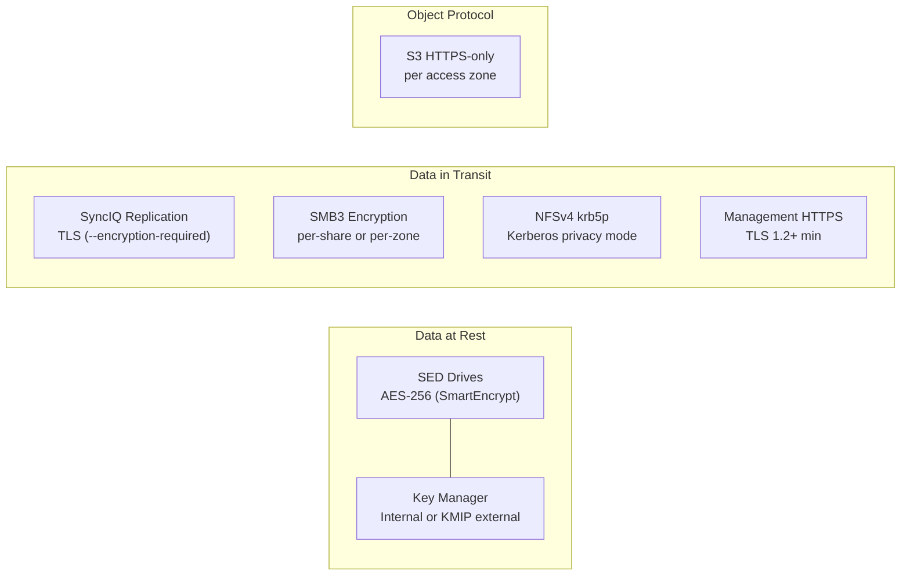

# PowerScale — Encryption


<div class="kb-summary">
> TLS certificate management and data encryption for Dell PowerScale.
</div>

## Encryption Layers



| Layer | Mechanism | Notes |
|---|---|---|
| Data at Rest | Self-Encrypting Drives (SED) with AES-256 | Hardware-based; configured at factory order time. Cannot be enabled retroactively on non-SED nodes. |
| Data in Transit (SyncIQ) | TLS-encrypted replication channel | Enable per policy: `--encryption-required true` |
| Data in Transit (S3) | HTTPS (TLS 1.2+) | Enforced per access zone S3 configuration |
| Management Traffic | HTTPS (TLS 1.2+) for web UI; SSH for CLI | Disable TLS 1.0/1.1; restrict to strong cipher suites |
| SMB Encryption | SMB3 end-to-end encryption | Enable per-share or per-zone |
| NFS in Transit | NFSv4 with `krb5p` (Kerberos privacy) | Provides NFS packet-level encryption; requires Kerberos setup |

---

## Data at Rest — Self-Encrypting Drives (SED)

SED-based encryption is implemented in hardware on each drive. The encryption key is held by the drive controller and managed by the PowerScale cluster using the OneFS SmartEncrypt feature. SED drives cannot be read outside the cluster without the Data At Rest Encryption (DARE) key.

### Confirming SED Status

```bash
# Verify the cluster has SED drives and encryption is enabled
isi get -D /ifs | grep -i encrypt

# Check per-node drive encryption status
isi node drives list <node_id> | grep -i SED

# View drive details including encryption flag
isi node drives view <node_id> <bay>

# Confirm SmartEncrypt license is active
isi license licenses list | grep -i encrypt
```

### Key Management

OneFS manages SED keys internally (local key management) by default. For regulatory environments requiring external key management, integrate with a KMIP-compliant external key manager (e.g., Dell Key Management Server, HashiCorp Vault, Thales).

```bash
# View current key management configuration
isi_kmip settings view 2>/dev/null || echo "KMIP not configured; using local key management"

# Configure KMIP server (if applicable)
isi_kmip servers create \
    --hostname kmip.example.com \
    --port 5696 \
    --certificate <cert_path>

# List KMIP servers
isi_kmip servers list

# Test KMIP connectivity
isi_kmip servers test <server_name>
```

### SED Operational Notes

| Situation | Action |
|---|---|
| Replacing a failed SED drive | Follow standard drive replacement; OneFS automatically re-keys the replacement drive when inserted |
| Decommissioning a node | Perform a SmartFail before removal; drives are cryptographically erased on decommission |
| Node stolen or lost | SED keys are destroyed; data is unreadable without the cluster's key material |
| Expanding the cluster with non-SED nodes | Non-SED nodes will join as unencrypted storage pools; data written to non-SED nodes is not encrypted at rest |

> SED encryption cannot be retroactively enabled on drives ordered without the SED option. Order nodes with the `SED` BOM option at procurement time for regulatory environments.

---

## SyncIQ — Replication Encryption

By default, SyncIQ replication traffic crosses the WAN without encryption. Enable TLS encryption on replication policies for any data classified as sensitive or where the WAN link is untrusted.

### Enabling SyncIQ Encryption

```bash
# Require encryption on a specific SyncIQ policy
isi sync policies modify <policy_name> --encryption-required true

# View encryption status of all policies
isi sync policies list -v | grep -E "Name|Encryption"

# Require encryption at a global level (all new policies)
isi sync settings global modify --encryption-required true

# View global SyncIQ settings
isi sync settings global view
```

### SyncIQ Certificate Management

SyncIQ uses certificates to authenticate cluster-to-cluster connections. In older OneFS versions, this was based on shared keys; in OneFS 9.x, TLS certificates are used.

```bash
# List replication peer certificates
isi sync target policies list

# View the certificate for a specific target policy
isi sync target policies view <policy_name>

# Check SyncIQ service certificate
isi sync settings global view | grep -i cert

# Import a CA certificate for SyncIQ peer validation
isi certificate authority import --certificate-path /ifs/certs/ca.pem

# List all CA certificates
isi certificate authority list

# Delete an expired CA certificate
isi certificate authority delete <cert_id>
```

---

## SMB Encryption

SMB3 encryption provides end-to-end encryption of data in transit between Windows clients and the PowerScale cluster. SMB3 encryption requires Windows 8/Server 2012 or later clients.

### Enabling SMB Encryption

```bash
# Enable SMB3 encryption on a specific share
isi smb shares modify <share_name> --encrypt-data true

# Enable SMB3 encryption for all shares in an access zone
isi smb settings zone modify --zone <zone_name> --encrypt-data true

# Enable SMB3 encryption cluster-wide (all zones)
isi smb settings global modify --encrypt-data true

# Verify encryption setting on a share
isi smb shares view <share_name> | grep -i encrypt

# View SMB global settings including encryption
isi smb settings global view | grep -i "encrypt\|signing"
```

### SMB Signing

SMB signing verifies the integrity of SMB packets and prevents man-in-the-middle attacks. Signing is distinct from encryption — it validates data integrity without encrypting the content.

```bash
# Require SMB signing for all clients (recommended baseline)
isi smb settings global modify --server-signing required

# Verify signing configuration
isi smb settings global view | grep -i signing

# View per-zone SMB settings
isi smb settings zone view --zone <zone_name>
```

| Setting | Value | Effect |
|---|---|---|
| `--server-signing disabled` | Legacy default | Signing only if client requests it |
| `--server-signing if_requested` | Transitional | Signs if client supports and requests it |
| `--server-signing required` | Recommended | All SMB sessions must sign — unsigned clients are rejected |

---

## NFS Encryption (Kerberos krb5p)

NFSv4 with the `krb5p` security flavor provides NFS packet-level encryption. All NFS data in transit is encrypted using the Kerberos session key.

```bash
# Enable krb5p on an NFS export (strongest NFS security)
isi nfs exports modify <export_id> \
    --security-flavors krb5p

# Enable multiple security flavors (clients negotiate the strongest supported)
isi nfs exports modify <export_id> \
    --security-flavors krb5p,krb5i,krb5

# View security flavors on an export
isi nfs exports view <export_id> | grep -i "security"

# View all exports and their security settings
isi nfs exports list -v | grep -E "Export|Security"
```

`krb5p` requires a Kerberos infrastructure (Active Directory or MIT Kerberos KDC). Clients must have valid Kerberos tickets and system time within 5 minutes of the cluster and KDC. See [Authentication](../authentication/index.md) for Kerberos setup.

---

## Management Interface Encryption (HTTPS / TLS)

### TLS Configuration

OneFS exposes the management API and web UI over HTTPS. Configure TLS to meet security baselines:

```bash
# View current SSL/TLS certificate on the management interface
isi certificate server list
isi certificate server view <cert_id>

# Generate a new self-signed certificate for the management interface
isi certificate server create \
    --certificate-path /ifs/certs/mgmt.crt \
    --private-key-path /ifs/certs/mgmt.key

# Import a CA-signed certificate
isi certificate server import \
    --certificate-path /ifs/certs/mgmt-signed.crt \
    --private-key-path /ifs/certs/mgmt.key

# View certificate expiration date
isi certificate server list -v | grep -E "Name|Expire"

# Set the active management certificate
isi certificate server modify <cert_id> --default-https true
```

### TLS Protocol and Cipher Configuration

```bash
# View current TLS configuration
isi https settings view

# Disable TLS 1.0 and TLS 1.1 (requires OneFS 9.4+)
isi https settings modify --tls-min-version 1.2

# View current minimum TLS version
isi https settings view | grep -i "tls\|version"
```

| TLS Setting | Recommended | Notes |
|---|---|---|
| Minimum TLS version | 1.2 | TLS 1.0 and 1.1 are deprecated; disable for PCI-DSS and modern security baselines |
| Cipher suite preference | Strong (AES-256-GCM, AES-128-GCM) | Disable RC4, DES, 3DES, and MD5-based cipher suites |
| HTTPS port | 8080 (API), 443 (web UI redirect) | Ensure firewall allows only these ports from management subnets |
| HTTP (unencrypted) | Disabled | Block port 8080/80 for plain HTTP via firewall or OneFS ACL |

---

## S3 Protocol Encryption

When the S3 access protocol is enabled in an access zone, configure it to require HTTPS:

```bash
# View S3 settings for an access zone
isi s3 settings global view
isi s3 settings zone view --zone <zone_name>

# Require HTTPS for S3 access in a zone
isi s3 settings zone modify --zone <zone_name> --https-only true

# View S3 buckets in a zone
isi s3 buckets list --zone <zone_name>
```

---

## Certificate Lifecycle Management

| Event | Action |
|---|---|
| Certificate expiration approaching | Alert at 60 days and 30 days; renew and replace before expiry |
| CA certificate expiry | Update the CA cert in `isi certificate authority` before the issuing CA expires |
| Key compromise | Revoke and replace the certificate immediately; rotate any service accounts that used client certificate auth |
| Cluster expansion | Verify new nodes inherit the same TLS configuration and certificate after join |

```bash
# Check all server certificate expiration dates
isi certificate server list -v | grep -E "Name|Expiry|Valid"

# Check CA certificate expiration dates
isi certificate authority list -v | grep -E "Name|Expiry|Valid"

# Alert command — find certs expiring within 60 days
# (run from a Linux management host)
TODAY=$(date +%s)
THRESHOLD=$((TODAY + 60*86400))
isi certificate server list -v | grep "Expiry" | while read -r line; do
    expiry=$(date -d "$(echo "$line" | awk '{print $2, $3}')" +%s 2>/dev/null)
    if [[ "$expiry" -lt "$THRESHOLD" ]]; then
        echo "WARNING: Certificate expiring soon — $line"
    fi
done
```

---

## Encryption Compliance Reference

| Framework | Requirement | PowerScale Control |
|---|---|---|
| PCI-DSS 4.0 — Req 3.5 | Strong cryptography for stored cardholder data | SED AES-256 (SmartEncrypt); KMIP for external key management |
| PCI-DSS 4.0 — Req 4.2 | Strong cryptography for data in transit | SyncIQ TLS; SMB3 encryption; HTTPS-only management |
| HIPAA §164.312(a)(2)(iv) | Encryption and decryption of ePHI | SED encryption for PHI data paths; DARE verified via `isi license` |
| GDPR Article 32 | Appropriate technical measures (encryption) | At-rest SED; in-transit SMB3 encryption and SyncIQ TLS |
| ISO 27001 A.10.1 | Cryptographic controls | SED + key management policy; TLS for all management and replication channels |
| NIST SP 800-53 SC-28 | Protection of information at rest | SED drives with AES-256; KMIP for key management |
