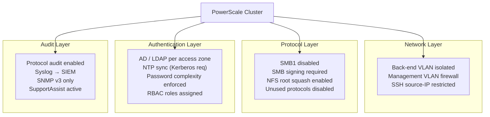

# PowerScale — Hardening


<div class="kb-summary">
Security baselines and compliance configuration for Dell PowerScale.
</div>
```text
┌──────────────────────────────── Dell PowerScale — Security Hardening ─────────────────────────────────┐
│                                                                                                       │
│   ┌───────────────────────────────────────────────────────────────────────────────────────────────┐   │
│   │      PowerScale hardening: disable unused protocols, enforce encryption, restrict access      │   │
│   │         Network: dedicated storage VLAN; restrict management access to jump hosts only        │   │
│   │        Auth: disable default accounts; enforce password complexity and rotation policy        │   │
│   │         Audit: forward syslog to SIEM; alert on privilege escalation and failed logins        │   │
│   └───────────────────────────────────────────────────────────────────────────────────────────────┘   │
│                                                                                                       │
│    Baseline config → disable unused → enforce MFA → enable logging → audit                            │
│                                                                                                       │
│                  ▼                                ▼                                ▼                  │
│                                                                                                       │
│   ┌─────────────────────────────┐  ┌─────────────────────────────┐  ┌─────────────────────────────┐   │
│   │            Layer            │  │          Component          │  │           Function          │   │
│   │              OS             │  │            OneFS            │  │        Distributed FS       │   │
│   │           Tiering           │  │          SmartPools         │  │        Auto data move       │   │
│   │         Replication         │  │            SyncIQ           │  │        Async DR copy        │   │
│   │          Snapshots          │  │          SnapshotIQ         │  │       Space-efficient       │   │
│   │         Load balance        │  │         SmartConnect        │  │       DNS client dist.      │   │
│   └─────────────────────────────┘  └─────────────────────────────┘  └─────────────────────────────┘   │
│                                                                                                       │
│                          ▼                                                 ▼                          │
│                                                                                                       │
│   ┌───────────────────────────────────────────────────────────────────────────────────────────────┐   │
│   │       Area       │     Control      │      Standard     │      Verify      │    Frequency     │   │
│   │     Accounts     │ Disable defaults │  No default creds │   Login audit    │      Deploy      │   │
│   │    Protocols     │  Disable unused  │   TLS 1.2+ only   │    Port scan     │     Monthly      │   │
│   │       MFA        │ Enforce all admi │   TOTP/hardware   │    Auth logs     │    Continuous    │   │
│   │     Logging      │ SIEM forwarding  │  All admin events │   SIEM alerts    │      Daily       │   │
│   └───────────────────────────────────────────────────────────────────────────────────────────────┘   │
│                                                                                                       │
│    Physical: PowerScale nodes (All-Flash/Hybrid) · InfiniBand backend · 25/100 GbE frontend           │
│                                                                                                       │
│    Key terms:                                                                                         │
│                                                                                                       │
│    OneFS              = Dell PowerScale distributed filesystem OS; all nodes share a single namespace │
│    SmartPools         = tiering engine; moves files between All-Flash, Hybrid, and Archive tiers      │
│    SyncIQ             = async replication to DR cluster; RPO-based schedule; failover in minutes      │
│    SnapshotIQ         = space-efficient snapshots; accessed via .snapshot directory in each share     │
│    SmartConnect       = DNS-based load balancing; distributes NFS/SMB client connections across nodes │
│    Access zone        = logical container with separate authentication and export namespace per tenant│
│    Quota              = directory or user quota; hard/soft/advisory limits enforced by OneFS QuotaIQ  │
│    CloudPools         = tiering to cloud object storage (S3/Blob); data remains accessible locally    │
│    isi CLI            = OneFS command-line interface; all management operations available via isi c...│
│    Node pool          = group of same-model nodes sharing protection domain for data distribution     │
│    Protection level   = N+2:1, N+3:1 etc.; defines how many node or drive failures are tolerated      │
│    File pool policy   = rule-based policy assigning files to specific node pools or storage tiers     │
│                                                                                                       │
└───────────────────────────────────────────────────────────────────────────────────────────────────────┘
```


## Hardening Checklist



Apply all items before placing a cluster into production. Re-verify after each major upgrade.

### Initial Setup

- [ ] Change the default `root` and `admin` passwords immediately after cluster initialisation; store in a privileged access vault
- [ ] Rename or disable the `admin` account if a named service account is being used for administration
- [ ] Configure the cluster name to match the naming standard (`<site>-ps-<number>`) before exposing the cluster to clients
- [ ] Register the cluster in the CMDB with owner, site, support contract, and serial number

### Network Hardening

- [ ] Isolate the back-end cluster network (InfiniBand or 10/25 GbE) on a dedicated VLAN — client traffic must not reach the back-end network
- [ ] Restrict management interface access to management VLAN source IPs using firewall rules or OneFS IP access rules
- [ ] Enable HTTPS-only access to the OneFS management GUI; disable HTTP access
- [ ] Restrict SSH to management VLAN source IPs — block SSH from client VLANs
- [ ] Apply SmartConnect IP pool source filters to ensure each access zone only accepts client connections from authorised subnets

### Protocol Hardening

- [ ] Enable SMB signing: `isi smb settings global modify --server-signing required`
- [ ] Disable SMB1 globally: `isi smb settings global modify --support-smb1 false`
- [ ] Enable NFS root squash on all exports unless there is a documented technical exception
- [ ] Disable unused protocols per access zone (FTP, HDFS, S3 if not required)
- [ ] Set NFS export client lists explicitly — do not use wildcards (`*`) on production exports
- [ ] Enable NFSv4 and disable NFSv3 where all clients support v4; NFSv4 supports stronger security flavors

### Authentication Hardening

- [ ] Join each access zone to the appropriate identity provider (AD, LDAP) — do not use local accounts for regular client access
- [ ] Disable or restrict the `root` local account from SSH login; use named accounts with sudo-equivalent roles
- [ ] Configure NTP with at least two NTP servers — required for Kerberos authentication
- [ ] Configure password complexity and expiration for all local OneFS accounts: `isi auth settings global modify`
- [ ] Review and remove any stale or unused NDMP user accounts

### Audit and Monitoring

- [ ] Enable protocol audit logging for NFS, SMB access events: `isi audit settings global modify --auditing-enabled true`
- [ ] Configure audit log forwarding to the centralised SIEM via syslog or CEE: `isi audit settings global modify --cee-server-uri http://siem.example.com:12228/cee`
- [ ] Configure SNMP v3 (not v2c) for monitoring integration: `isi snmp settings modify --snmp-v3-access-enable yes`
- [ ] Enable email or SIEM alerting for CRITICAL cluster events via alert channels
- [ ] Configure SupportAssist (PhoneHome) for automatic case creation on hardware faults

### Quota and Data Protection

- [ ] Apply SmartQuota hard limits to all user-accessible directories before production data lands
- [ ] Set advisory and soft thresholds below the hard limit to provide advance warning before write failures
- [ ] Set minimum protection level to N+2 on all production node pools

---

## Commands

### Disable HTTP, Enforce HTTPS

```bash
# Enforce HTTPS-only for the management API and web UI
# (Block HTTP at the firewall level; OneFS redirects HTTP to HTTPS by default)

# View current HTTPS/TLS settings
isi https settings view

# Set minimum TLS version to 1.2
isi https settings modify --tls-min-version 1.2

# Configure session timeout for the web UI (15 minutes recommended)
isi web settings modify --session-timeout 900
```

### Disable SMB1 and Enforce SMB Signing

```bash
# Disable SMBv1 (legacy; insecure — affected by WannaCry and EternalBlue)
isi smb settings global modify --support-smb1 false

# Require SMB packet signing on all connections
isi smb settings global modify --server-signing required

# Verify settings
isi smb settings global view | grep -E "smb1|signing"
```

### NFS Root Squash

Root squash maps NFS client UID 0 (root) to the anonymous user (typically `nobody`). This prevents an NFS client root user from having unrestricted access to cluster data.

```bash
# View current root squash settings on an export
isi nfs exports view <export_id> | grep -E "root|squash|map"

# Enable root squash on all clients (map root to nobody)
isi nfs exports modify <export_id> \
    --map-root user:nobody

# For an export that requires root access (e.g., backup host), add only that IP to root-clients
isi nfs exports modify <export_id> \
    --add-root-clients 10.0.1.5 \
    --map-root user:nobody

# Global NFS settings — default squash behaviour
isi nfs settings export view | grep -i "map\|root"
isi nfs settings export modify --map-root user:nobody
```

### Disable Unused Protocols Per Access Zone

```bash
# View current protocol status for a zone
isi zone zones view <zone_name> | grep -i protocol

# Disable FTP for a zone (if not in use)
isi ftp settings global modify --enabled false

# Disable HDFS for a zone
isi hdfs settings global modify --enabled false

# Disable S3 in an access zone
isi s3 settings zone modify --zone <zone_name> --service false

# Verify which services are running
isi services -a | grep running
```

### Restrict SSH Access

```bash
# View SSH configuration
isi ssh settings view

# Restrict SSH to specific source IPs (management VLAN only)
# Done via firewall rules at the network level — not natively enforced in OneFS
# Alternatively, configure /etc/hosts.allow on each node (TCP wrappers)
# Best practice: use a jump host / bastion in the management VLAN

# Disable root SSH login (use named accounts with role-based access)
# Edit /etc/ssh/sshd_config on each node: PermitRootLogin no
# Or use the OneFS security policy if available in your version
isi ssh settings modify --allow-root-login no 2>/dev/null || \
    echo "Restrict root SSH login via /etc/ssh/sshd_config on each node"
```

### SNMP v3 Configuration

```bash
# Disable SNMP v1 and v2c (insecure community strings)
isi snmp settings modify \
    --snmp-v1-v2c-access-enable no \
    --snmp-v3-access-enable yes

# Configure SNMP v3 with authentication and privacy
isi snmp settings modify \
    --snmp-v3-access-enable yes \
    --system-contact "infra-team@corp.example.com" \
    --system-location "DC1-Row3-Rack5-Node1"

# View SNMP settings
isi snmp settings view

# Create an SNMP v3 user with auth + privacy
isi snmp v3users create \
    --name monitoring-user \
    --auth-password <auth_password> \
    --priv-password <priv_password> \
    --auth-type SHA \
    --priv-type AES
```

### Audit Logging

```bash
# Enable protocol audit logging (NFS and SMB access events)
isi audit settings global modify --auditing-enabled true

# Set the syslog audit target
isi audit settings global modify \
    --syslog-forwarding-enabled true \
    --syslog-server siem.example.com \
    --syslog-facility local6

# Configure CEE (Common Event Enabler) forwarding for SIEM integration
isi audit settings global modify \
    --cee-server-uri "http://siem.example.com:12228/cee"

# Enable configuration change audit (admin actions)
isi audit settings global modify --config-auditing-enabled true

# View current audit configuration
isi audit settings global view

# View audit topics (what events are captured)
isi audit topics list
isi audit topics view protocol
```

### Restrict IP Pool Access by Subnet

Limit which source IPs can connect to each access zone's IP pool:

```bash
# View IP pool configuration
isi network pools view <pool_name>

# Set source IP restrictions on a pool (only allow connections from authorised subnets)
isi network pools modify <pool_name> \
    --sc-subnet <allowed_subnet>

# Alternatively, enforce access zone path restrictions via NFS export client lists
# and SMB share permissions — restrict client lists to known IP ranges
```

---

## Role-Based Administration

Apply the principle of least privilege for cluster administrators:

```bash
# List all available privileges
isi auth privileges list

# Create a read-only monitoring role (no configuration changes)
isi auth roles create \
    --name ReadOnlyMonitor \
    --description "Read-only cluster monitoring — no configuration access"
isi auth roles modify ReadOnlyMonitor --add-priv ISI_PRIV_LOGIN_CONSOLE
isi auth roles modify ReadOnlyMonitor --add-priv ISI_PRIV_STATISTICS
isi auth roles modify ReadOnlyMonitor --add-priv ISI_PRIV_EVENT_READ

# Create a backup operator role
isi auth roles create \
    --name BackupOperator \
    --description "NDMP backup operations only"
isi auth roles modify BackupOperator --add-priv ISI_PRIV_LOGIN_CONSOLE
isi auth roles modify BackupOperator --add-priv ISI_PRIV_BACKUP

# Assign a role to a user
isi auth roles modify ReadOnlyMonitor --add-user <username>
isi auth roles modify ReadOnlyMonitor --add-group "CORP\\StorageMonitoring"

# View roles assigned to a user
isi auth users view <username> | grep -i role

# List all roles and their members
isi auth roles list
isi auth roles view ReadOnlyMonitor
```

### Recommended Role Structure

| Role | Members | Privileges |
|---|---|---|
| `StorageAdmin` | Named storage administrators | Full cluster administration |
| `ReadOnlyMonitor` | Monitoring and NOC team | Statistics, events, status — read only |
| `BackupOperator` | Backup service account | NDMP access; snapshot management |
| `SyncIQOperator` | Replication team | SyncIQ policy management |
| `SecurityAuditor` | Security team | Audit log access; no configuration |

---

## Security Baseline Validation

Run these checks to confirm the hardening baseline is in place:

```bash
# Confirm SMB1 is disabled
isi smb settings global view | grep -i smb1
# Expected: support_smb1: No

# Confirm SMB signing is required
isi smb settings global view | grep -i signing
# Expected: server_signing: Required

# Confirm audit logging is enabled
isi audit settings global view | grep -i auditing
# Expected: auditing_enabled: Yes

# Confirm SNMP v3 is enabled and v1/v2c disabled
isi snmp settings view | grep -E "v1_v2c|v3"
# Expected: snmp_v1_v2c_access_enable: No, snmp_v3_access_enable: Yes

# Confirm HTTPS min TLS version
isi https settings view | grep -i tls
# Expected: tls_min_version: 1.2

# Confirm NFS exports do not use wildcards
isi nfs exports list -v | grep -E "Clients:|Root Clients:|Read Write Clients:"
# Review for any entry with * — replace with specific CIDRs

# Confirm SyncIQ policies require encryption
isi sync policies list -v | grep -E "Name|Encryption"
# Expected: encryption_required: Yes for all policies carrying sensitive data

# Confirm no unused local user accounts are enabled
isi auth users list | grep -v "Enabled: No"
```

---

## Hardening Standards Reference

| Standard | Relevant Sections | Key Controls |
|---|---|---|
| CIS Benchmark (Dell Isilon) | All | SMB1 disabled; SSH restricted; audit logging; SNMP v3 |
| PCI-DSS 4.0 | Req 2 (secure defaults), Req 7 (access control), Req 10 (logging) | RBAC; audit to SIEM; encryption; NFS root squash |
| HIPAA §164.312 | Access control; audit controls | Named accounts; RBAC; audit logging forwarded to SIEM |
| NIST SP 800-53 | AC, AU, IA, SC controls | Least privilege; audit; identity management; encryption |
| ISO 27001 | A.9 (access control), A.12 (operations security) | RBAC; change management; logging |
