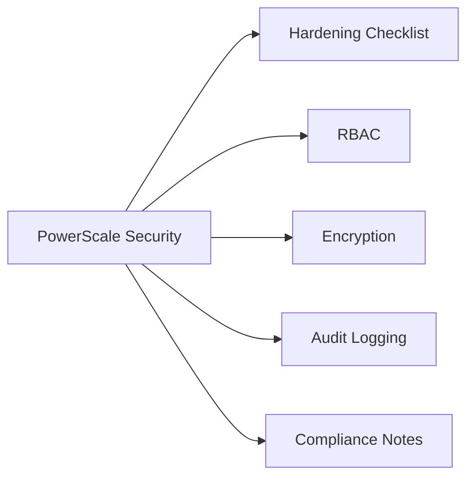

# PowerScale Security



## Hardening Checklist

- [ ] Change the default `root` and `admin` passwords immediately after cluster initialisation
- [ ] Disable SSH for non-administrative users; restrict SSH to management VLAN source IPs via firewall rules
- [ ] Enable HTTPS-only access to the OneFS web administration GUI; disable HTTP
- [ ] Configure session timeout on the web UI (recommended: 15 minutes)
- [ ] Enable audit logging for protocol access (NFS, SMB) and configuration changes
- [ ] Forward audit events to a centralised SIEM via syslog
- [ ] Restrict `root` squash on all NFS exports unless there is a specific technical requirement
- [ ] Apply SmartQuota hard limits to all user-accessible directories to prevent runaway consumption
- [ ] Enable SMB signing (`isi smb settings global modify --server-signing required`) for all Windows client access
- [ ] Review and restrict access zone IP pool source ranges to the specific client subnets for that zone
- [ ] Enable at-rest encryption (SED drives) if node hardware supports it; configure through Dell factory order
- [ ] Disable unused protocols per access zone (e.g., disable FTP, HDFS, S3 if not in use)

## RBAC

PowerScale uses role-based administration for cluster management:

| Role | Permissions |
|---|---|
| `SystemAdmin` | Full cluster administration including security, users, and hardware |
| `AuditAdmin` | Read access to all audit logs and events; cannot change configuration |
| `BackupAdmin` | Permission to read all files for backup purposes (NDMP/snapshot) regardless of file ACLs |
| `VMwareAdmin` | Access to VMware-related cluster functions (vVols, VAAI) |
| `SecurityAdmin` | Manage authentication providers, zones, and user role assignments |
| `ISI_PRIV_AUTH` | Privilege to manage authentication configuration (AD, LDAP, NIS) |
| `ISI_PRIV_SNAPSHOT` | Privilege to create and manage SnapshotIQ policies |
| `ISI_PRIV_SYNCIQ` | Privilege to manage SyncIQ replication policies |

Create custom roles and assign specific privileges:
```bash
isi auth roles create --name ReadOnlyMonitor --description "Read-only cluster monitoring"
isi auth roles modify ReadOnlyMonitor --add-priv ISI_PRIV_LOGIN_CONSOLE
isi auth roles modify ReadOnlyMonitor --add-priv ISI_PRIV_STATISTICS
isi auth roles modify ReadOnlyMonitor --add-user <username>
```

## Encryption

| Layer | Mechanism | Notes |
|---|---|---|
| Data at Rest | Self-Encrypting Drives (SED) with AES-256 | Hardware-based; configured at factory order time. Cannot be enabled retroactively on spinning drives. |
| Data in Transit (SyncIQ) | TLS-encrypted SyncIQ replication channel | Enable with `isi sync policies modify <name> --encryption-required true` |
| Management Traffic | HTTPS (TLS 1.2+) for web UI; SSH for CLI | Disable TLS 1.0/1.1; restrict cipher suites to strong options |
| SMB Encryption | SMB3 end-to-end encryption | Enable per-share: `isi smb shares modify <share> --encrypt-data true` |

## Audit Logging

```bash
# Enable protocol audit logging (NFS, SMB events)
isi audit settings global modify --auditing-enabled true

# View audit configuration
isi audit settings global view

# Set syslog forwarding for audit events
isi audit settings global modify \
  --cee-server-uri http://siem.example.com:12228/cee

# View recent audit log entries (protocol access events)
isi audit log view
```

- Audit events cover: file open, read, write, delete, rename, permission change, and authentication events.
- Forward to a syslog receiver or a Dell Common Event Enabler (CEE) API endpoint for SIEM integration.
- Retain audit logs for a minimum of 12 months; 24 months for regulated environments.

## Compliance Notes

| Framework | Relevant Control | PowerScale Capability |
|---|---|---|
| PCI-DSS | Requirement 3 (data at rest encryption) | SED-based AES-256 encryption |
| PCI-DSS | Requirement 10 (audit logging) | Protocol and admin audit logging via CEE |
| HIPAA | §164.312 (access control) | Access zones, RBAC, and per-share ACLs |
| GDPR | Article 32 (security of processing) | Encryption in transit (SMB3, SyncIQ TLS) and at rest (SED) |
| ISO 27001 | A.9 (access control) | RBAC roles, AD/LDAP integration, root squash on NFS |
