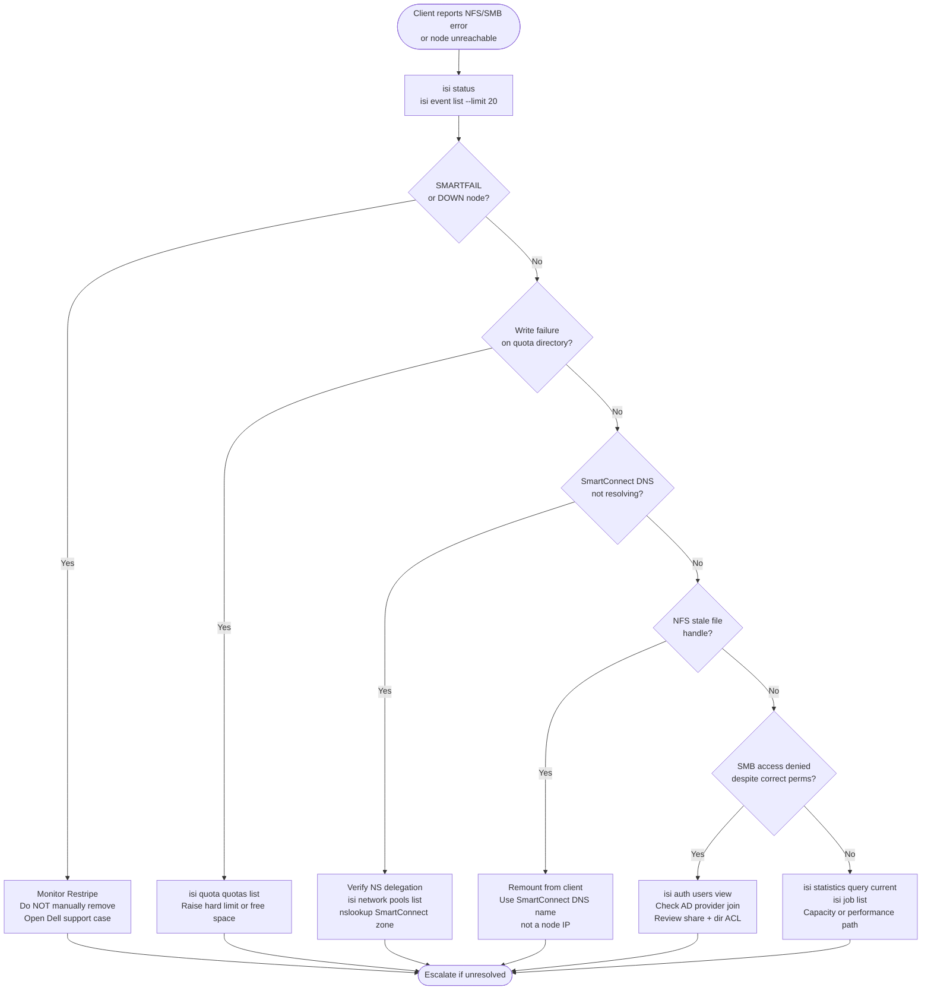

---
tags:
  - dell
  - troubleshooting
---
# PowerScale — Common Issues


<div class="kb-summary">
Common Issues reference covering Quick Reference, Incident Triage.
</div>
```text
┌─────────────────────────────────── Dell PowerScale — Common Issues ───────────────────────────────────┐
│                                                                                                       │
│   ┌───────────────────────────────────────────────────────────────────────────────────────────────┐   │
│   │         PowerScale common issues: quick-reference for frequently encountered problems         │   │
│   │         Issues: path failures, connectivity errors, capacity alerts, and auth failures        │   │
│   │         For each issue: symptoms, root cause, diagnostic steps, and resolution actions        │   │
│   │           Escalate to vendor support if the issue persists after standard procedures          │   │
│   └───────────────────────────────────────────────────────────────────────────────────────────────┘   │
│                                                                                                       │
│    Identify symptom → check logs → diagnose root cause → resolve → verify                             │
│                                                                                                       │
│                  ▼                                ▼                                ▼                  │
│                                                                                                       │
│   ┌─────────────────────────────┐  ┌─────────────────────────────┐  ┌─────────────────────────────┐   │
│   │            Layer            │  │          Component          │  │           Function          │   │
│   │              OS             │  │            OneFS            │  │        Distributed FS       │   │
│   │           Tiering           │  │          SmartPools         │  │        Auto data move       │   │
│   │         Replication         │  │            SyncIQ           │  │        Async DR copy        │   │
│   │          Snapshots          │  │          SnapshotIQ         │  │       Space-efficient       │   │
│   │         Load balance        │  │         SmartConnect        │  │       DNS client dist.      │   │
│   └─────────────────────────────┘  └─────────────────────────────┘  └─────────────────────────────┘   │
│                                                                                                       │
│                          ▼                                                 ▼                          │
│                                                                                                       │
│   ┌───────────────────────────────────────────────────────────────────────────────────────────────┐   │
│   │    Component     │     Purpose      │      Protocol     │       Auth       │      Notes       │   │
│   │      OneFS       │ Distributed file │  NFS/SMB/S3/HDFS  │  Kerberos/NTLM   │ Single namespac  │   │
│   │    SmartPools    │  Tiering policy  │      Internal     │    Admin role    │  Auto data move  │   │
│   │      SyncIQ      │ Async replicatio │   Encrypted TCP   │   Certificate    │   Policy-based   │   │
│   │    SnapshotIQ    │    Snapshots     │      Internal     │    Admin role    │  Per directory   │   │
│   └───────────────────────────────────────────────────────────────────────────────────────────────┘   │
│                                                                                                       │
│    Physical: PowerScale nodes (All-Flash/Hybrid) · InfiniBand backend · 25/100 GbE frontend           │
│                                                                                                       │
│    Key terms:                                                                                         │
│                                                                                                       │
│    OneFS              = Dell PowerScale distributed filesystem OS; all nodes share a single namespace │
│    SmartPools         = tiering engine; moves files between All-Flash, Hybrid, and Archive tiers      │
│    SyncIQ             = async replication to DR cluster; RPO-based schedule; failover in minutes      │
│    SnapshotIQ         = space-efficient snapshots; accessed via .snapshot directory in each share     │
│    SmartConnect       = DNS-based load balancing; distributes NFS/SMB client connections across nodes │
│    Access zone        = logical container with separate authentication and export namespace per tenant│
│    Quota              = directory or user quota; hard/soft/advisory limits enforced by OneFS QuotaIQ  │
│    CloudPools         = tiering to cloud object storage (S3/Blob); data remains accessible locally    │
│    isi CLI            = OneFS command-line interface; all management operations available via isi c...│
│    Node pool          = group of same-model nodes sharing protection domain for data distribution     │
│    Protection level   = N+2:1, N+3:1 etc.; defines how many node or drive failures are tolerated      │
│    File pool policy   = rule-based policy assigning files to specific node pools or storage tiers     │
│                                                                                                       │
└───────────────────────────────────────────────────────────────────────────────────────────────────────┘
```


## Quick Reference

| Symptom | Likely Cause | Action |
|---|---|---|
| SyncIQ policy stuck in `running` or `failed` | Network interruption, snapshot conflict on source, or target cluster quota/capacity reached | `isi sync reports list --policy-name <name>`; check network to target; resolve snapshot or quota issue; restart with `isi sync policies run <name>` |
| Node in SMARTFAIL state | Drive failures or hardware fault triggered automatic node removal | Do NOT intervene manually; monitor `isi job list` for Restripe job progress; replace failed hardware; open Dell Support case |
| Write failure on a quota directory | Hard quota threshold exceeded | `isi quota list --path /ifs/<path>`; raise or remove hard limit, or delete data to free space; notify directory owner |
| SmartConnect DNS name not resolving | Missing NS delegation in parent DNS zone, or IP pool has no healthy nodes | Verify NS record delegates zone to cluster node IPs; check pool health with `isi network pools list`; test with `nslookup <sc-zone>` |
| NFS stale file handle | Node rebooted or network partition caused NFS client to lose session | Remount on client; ensure NFS client uses SmartConnect DNS name, not a node IP directly |
| SMB access denied despite correct share permissions | SID mapping issue between Windows identity and OneFS local user; ACL misconfiguration | Check `isi auth users view --name <user> --zone <zone>`; verify AD provider is joined; review share ACL and directory ACL |
| Cluster capacity unexpectedly full | Snapshot accumulation, CloudPools recall, or runaway data ingest | `isi snapshot list`; delete expired snapshots; check `isi quota list` for violations; identify largest directories with `isi statistics query` |
| High per-node CPU or latency spike | Imbalanced SmartConnect; hot directory; too many concurrent jobs | `isi statistics query current --keys CPU --nodes all`; check `isi job list` for competing cluster jobs; pause non-critical jobs |

## Incident Triage



When clients report NFS/SMB errors, SyncIQ failures, or a node is unreachable, work through this sequence first.

- [ ] Run `isi status` immediately — confirm which nodes and drives are in a fault state; note SMARTFAIL nodes, DOWN nodes, and drive error counts
- [ ] Run `isi event list --limit 20` — find CRITICAL or ERROR events timestamped near the start of the incident; note the event code and description
- [ ] Check SyncIQ if the report involves replication failures: `isi sync policies list` and `isi sync reports list --limit 5` — identify the failing policy and the error message in the report
- [ ] Check quota violations if clients report write failures: `isi quota quotas list` — identify directories at or above hard threshold
- [ ] Verify network connectivity for client-facing interfaces: `isi network subnets list` — confirm all SmartConnect zones and IP pools are intact
- [ ] Check cluster job status: `isi job list` — a long-running Restripe after a node SMARTFAIL can cause elevated latency across the cluster
- [ ] Review per-node statistics for the affected time window: `isi statistics query current --keys CPU` and `isi statistics query current --keys DISK`
- [ ] If a node is DOWN, do not manually remove it — open a Dell support case and monitor `isi job list` for Restripe progress

| Question | Answer |
|---|---|
| Which nodes are SMARTFAIL or DOWN in isi status? | |
| What CRITICAL events appear in isi event list? | |
| Which SyncIQ policies are failing and what is the error? | |
| Are any quota directories at or above hard threshold? | |
| Is a Restripe job running and what is its progress? | |
