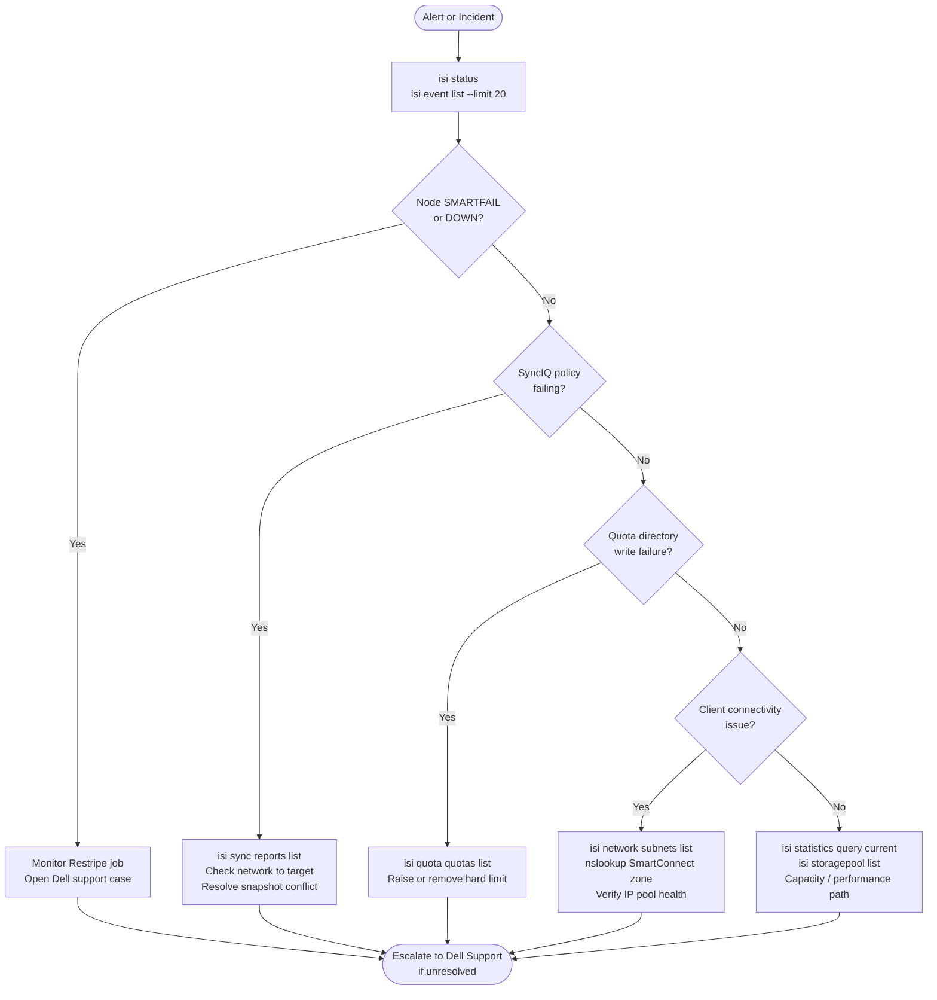

---
tags:
  - dell
  - troubleshooting
search:
  boost: 1.5
---
# PowerScale — Diagnostics


<div class="kb-summary">
Diagnostics reference covering Triage Flow, Diagnostic Commands, Log Locations, Capacity Diagnostics, Capacity Management Actions and 1 more sections.
</div>
```text
┌──────────────────────────────────── Dell PowerScale — Diagnostics ────────────────────────────────────┐
│                                                                                                       │
│   ┌───────────────────────────────────────────────────────────────────────────────────────────────┐   │
│   │        PowerScale diagnostics: log collection, health checks, and performance analysis        │   │
│   │          Tools: management CLI, REST API, vendor support bundle, and system event log         │   │
│   │          Performance: check I/O latency, throughput, queue depth, and cache hit rate          │   │
│   │       Collect support bundle before contacting vendor support to reduce time-to-resolve       │   │
│   └───────────────────────────────────────────────────────────────────────────────────────────────┘   │
│                                                                                                       │
│    Identify issue → collect logs → run diagnostics → analyse → resolve                                │
│                                                                                                       │
│                  ▼                                ▼                                ▼                  │
│                                                                                                       │
│   ┌─────────────────────────────┐  ┌─────────────────────────────┐  ┌─────────────────────────────┐   │
│   │            Layer            │  │          Component          │  │           Function          │   │
│   │              OS             │  │            OneFS            │  │        Distributed FS       │   │
│   │           Tiering           │  │          SmartPools         │  │        Auto data move       │   │
│   │         Replication         │  │            SyncIQ           │  │        Async DR copy        │   │
│   │          Snapshots          │  │          SnapshotIQ         │  │       Space-efficient       │   │
│   │         Load balance        │  │         SmartConnect        │  │       DNS client dist.      │   │
│   └─────────────────────────────┘  └─────────────────────────────┘  └─────────────────────────────┘   │
│                                                                                                       │
│                          ▼                                                 ▼                          │
│                                                                                                       │
│   ┌───────────────────────────────────────────────────────────────────────────────────────────────┐   │
│   │    Component     │     Purpose      │      Protocol     │       Auth       │      Notes       │   │
│   │      OneFS       │ Distributed file │  NFS/SMB/S3/HDFS  │  Kerberos/NTLM   │ Single namespac  │   │
│   │    SmartPools    │  Tiering policy  │      Internal     │    Admin role    │  Auto data move  │   │
│   │      SyncIQ      │ Async replicatio │   Encrypted TCP   │   Certificate    │   Policy-based   │   │
│   │    SnapshotIQ    │    Snapshots     │      Internal     │    Admin role    │  Per directory   │   │
│   └───────────────────────────────────────────────────────────────────────────────────────────────┘   │
│                                                                                                       │
│    Physical: PowerScale nodes (All-Flash/Hybrid) · InfiniBand backend · 25/100 GbE frontend           │
│                                                                                                       │
│    Key terms:                                                                                         │
│                                                                                                       │
│    OneFS              = Dell PowerScale distributed filesystem OS; all nodes share a single namespace │
│    SmartPools         = tiering engine; moves files between All-Flash, Hybrid, and Archive tiers      │
│    SyncIQ             = async replication to DR cluster; RPO-based schedule; failover in minutes      │
│    SnapshotIQ         = space-efficient snapshots; accessed via .snapshot directory in each share     │
│    SmartConnect       = DNS-based load balancing; distributes NFS/SMB client connections across nodes │
│    Access zone        = logical container with separate authentication and export namespace per tenant│
│    Quota              = directory or user quota; hard/soft/advisory limits enforced by OneFS QuotaIQ  │
│    CloudPools         = tiering to cloud object storage (S3/Blob); data remains accessible locally    │
│    isi CLI            = OneFS command-line interface; all management operations available via isi c...│
│    Node pool          = group of same-model nodes sharing protection domain for data distribution     │
│    Protection level   = N+2:1, N+3:1 etc.; defines how many node or drive failures are tolerated      │
│    File pool policy   = rule-based policy assigning files to specific node pools or storage tiers     │
│                                                                                                       │
└───────────────────────────────────────────────────────────────────────────────────────────────────────┘
```


## Before you begin

- **Access:** Storage admin credentials (cluster admin or equivalent)
- **Gather first:** recent error message text, event timestamps, and affected object names
- **Scope:** confirm whether the issue affects a single object, host, cluster, or site
- **Escalation:** open a vendor support ticket before running any destructive step
- **Logging:** document each command and output — required if escalation is needed

---

## Triage Flow



## Diagnostic Commands

```bash
# Cluster node and drive health summary
isi status

# Per-node hardware component status
isi devices node list

# List all cluster background jobs and their state
isi job list

# Show CPU and throughput statistics per node
isi statistics query current --keys CPU,BYTES_OUT,BYTES_IN --nodes all

# Show storage pool and tier capacity
isi storagepool list

# Show SyncIQ policy status and last run result
isi sync policies list
isi sync reports list

# Show recent cluster events (filter by severity)
isi event list --severity critical

# List all quotas and their consumption
isi quota list

# Show network interfaces per node
isi network interfaces list

# Verify AD join status per zone
isi auth ads list

# Show snapshot space usage
isi snapshot list
```

## Log Locations

| Log | Location / Command | Notes |
|---|---|---|
| OneFS system log | `/var/log/messages` (on any node) | Node-level OS and OneFS daemon messages |
| Cluster event log | `isi event list` | Authoritative source for hardware and software events |
| SyncIQ job log | `isi sync reports view --id <report-id>` | Per-policy replication details including errors |
| Audit log (protocol) | `isi audit settings global view` | Configures syslog forwarding of NFS/SMB access events |
| isi_logs bundle | `isi_gather_info` (run on any node as root) | Collects full cluster diagnostic bundle for Dell Support |

## Capacity Diagnostics

```bash
# Overall cluster used vs. free
isi statistics system list | grep -E "Cluster Capacity|Used|Free|HDD|SSD"

# Capacity by storage pool / node pool
isi storagepool nodepools list
isi storagepool tiers list

# Live statistics query
isi statistics query current \
    --stats cluster.disk.xfers.rate.read,cluster.disk.xfers.rate.write,\
cluster.disk.bytes.rate.read,cluster.disk.bytes.rate.write

# Node pool capacity breakdown
isi storagepool nodepools list -v

# File pool policies and tiering
isi filepool policies list
isi filepool default-policy view

# Largest directories under /ifs (run from cluster shell)
du -sh /ifs/* 2>/dev/null | sort -h | tail -20

# Directories nearing quota threshold
isi quota quotas list --type directory | awk '
    NR>1 {
        if ($3 != "---" && $2 != "---") {
            pct = $3/$2*100
            if (pct > 80) print "WARNING:", pct"%", $1
        }
    }'

# Historical capacity statistics
isi statistics history list \
    --stats cluster.disk.bytes.used,cluster.disk.bytes.free
```

## Capacity Management Actions

| Situation | Action |
|---|---|
| > 80% used | Alert, review quotas, identify top consumers |
| > 90% used | Emergency — identify and remove/archive data |
| Node pool full but cluster has free space | File pool policy not moving data — check SmartPools job |
| SSD tier full | Check SSD caching policies; consider adding SSD nodes |
| Quota exceeded by application | Increase quota with change approval |

## Before Calling Support

1. OneFS version: `isi version`
2. Cluster serial number: `isi config`
3. Node health summary: `isi status > /tmp/status.txt`
4. Event log: `isi event list > /tmp/events.txt`
5. For SyncIQ issues: `isi sync reports list > /tmp/synciq.txt`
6. For node hardware faults: note the node number and drive bay from `isi status`
7. Collect a full diagnostic bundle: `isi_gather_info` — saves to `/ifs/data/Isilon_Support/`

Upload the `isi_gather_info` bundle via the Dell Support case portal or via SupportAssist auto-collection.

---

## Verify resolution

- Confirm the original symptom no longer occurs
- Check logs for any residual errors related to the issue
- Monitor for 10–15 minutes to confirm the fix is stable
