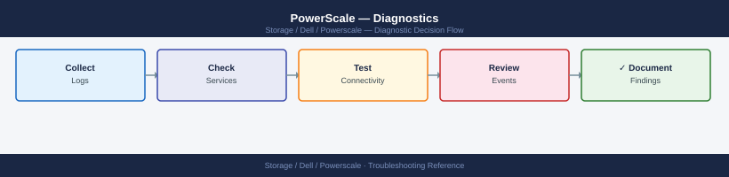
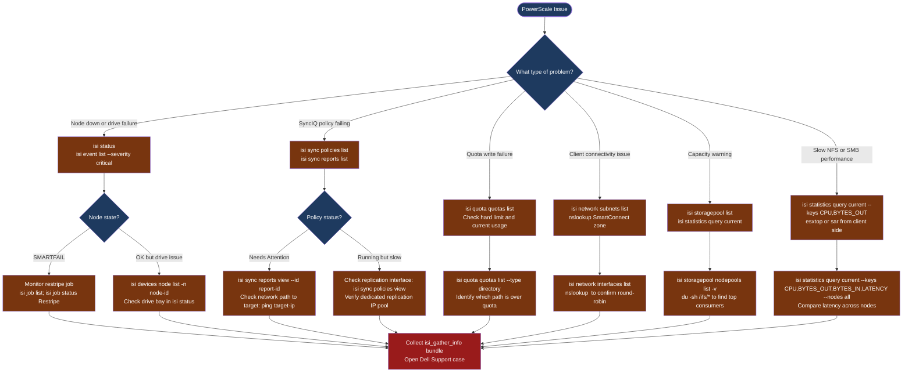

---
tags:
  - dell
  - troubleshooting
search:
  boost: 1.5
---
# PowerScale — Diagnostics

<div class="kb-summary">
Dell PowerScale (Isilon) diagnostic commands: check cluster node and drive health with isi status, list critical events, inspect SyncIQ replication policy status, check quota consumption, query live performance statistics, test network and SmartConnect DNS, and collect the isi_gather_info support bundle for Dell cases.

*Applies to: PowerScale OneFS 9.x (formerly Dell EMC Isilon)*
</div>





## Before you begin

- **Access:** PowerScale cluster admin (SSH to any node, or via web admin UI); read-only access for live statistics
- **Gather first:** the specific symptom (node alarm, SyncIQ error, client mount failure, write denied), the affected path or policy name, and the time the issue started
- **Scope:** confirm whether the issue affects one node, one access zone, one protocol (NFS vs. SMB), or the entire cluster

---

## Step 1 — Check cluster and node health

```bash
# SSH to any PowerScale node
ssh admin@<powerscale-node-ip>

# Cluster health summary (most important first check)
isi status
# Shows: node list, status (U=up, D=down, S=smartfail), drive state, cluster health
# Problem: any node showing D (down) or S (smartfail)

# All critical and warning events
isi event list --severity critical --limit 20
isi event list --severity warning --limit 20

# Full detail for a specific event
isi event view --id <event-id>

# Hardware components on a specific node
isi devices node list -n <node-number>
# Shows: drives by bay, status (healthy/failing/failed), capacity

# All background cluster jobs and their progress
isi job list
# Expected: SmartPools, IntegrityScan running; no ERROR state jobs
# If a node smartfailed: Restripe job should be running

# Track Restripe progress
isi job status Restripe
# Shows: percentage complete, estimated time remaining

# Get OneFS version
isi version
```

---

## Step 2 — Check cluster event log

```bash
# Recent critical events (hardware faults, node failures)
isi event list --severity critical --limit 50

# Events from a specific time window
isi event list --begin "2026-06-01 00:00:00" --end "2026-06-01 23:59:59"

# Events related to a specific node
isi event list --node <node-number> --limit 20

# Resolve a notification after fixing the underlying issue
isi event resolve --id <event-id>

# View event detail with recommended action
isi event view --id <event-id> --verbose

# System log on the node (OS-level events)
tail -100 /var/log/messages | grep -i "error\|fail\|warn"
```

---

## Step 3 — Check SyncIQ replication status

```bash
# List all SyncIQ policies with last run result
isi sync policies list
# Expected: all policies with Last Policy Run = Finished
# Problem: "Needs Attention" or "Disabled"

# Detailed report for the most recent policy run
isi sync reports list
# Shows: policy, start/end time, result (Success/Failed), files synced, bytes sent

# View detail for a specific report
isi sync reports view --id <report-id>
# Shows: error messages, which file failed, network details

# View error log for a failed policy
isi sync reports errors view --id <report-id>

# Test network connectivity to the target cluster
ping <target-cluster-ip>
nc -zv <target-cluster-ip> 7722     # SyncIQ data port (default)
nc -zv <target-cluster-ip> 8080     # SyncIQ management port

# Check replication interface configuration
isi sync policies view <policy-name>
# Look for: Source Root Path, Target Host, Enabled=Yes, Schedule
```

---

## Step 4 — Check quotas

```bash
# List all directory quotas and their usage
isi quota quotas list --type directory
# Columns: Path, Type, AppliesTo, HardLimit, UsedCapacity, UsedPercent
# Problem: UsedPercent > 100% or hard limit exceeded

# List quotas nearing the threshold (> 80% used)
isi quota quotas list --type directory | awk '
  NR>1 {
    if ($5 != "---" && $4 != "---" && $5+0 > 0) {
      pct = $5/$4*100
      if (pct > 80) print "WARNING:", int(pct)"%", $1
    }
  }'

# View detail for a specific quota
isi quota quotas view --path /ifs/data/dept/finance --type directory

# Increase a quota hard limit (requires change approval)
isi quota quotas modify --path /ifs/data/dept/finance --type directory \
  --hard-threshold 2T
```

---

## Step 5 — Check storage capacity and performance statistics

```bash
# Overall cluster capacity (used vs. free)
isi storagepool list
# Shows: pool name, total capacity, used capacity, free capacity

# Node pool breakdown
isi storagepool nodepools list -v
# Shows per-pool: SSD vs. HDD bytes, protection level, node count

# Storage tier (SSD / HDD / Archive) capacity
isi storagepool tiers list

# Live I/O statistics (per node, for all nodes)
isi statistics query current \
  --keys CPU,BYTES_OUT,BYTES_IN,LATENCY \
  --nodes all
# Shows: per-node CPU%, throughput, and latency

# Historical capacity trend (last 24h)
isi statistics history list \
  --stats cluster.disk.bytes.used,cluster.disk.bytes.free \
  --begin $(date -d "24 hours ago" +%s)

# Find largest directories under /ifs
du -sh /ifs/* 2>/dev/null | sort -h | tail -20
```

---

## Step 6 — Check network and SmartConnect

```bash
# List all network interfaces across the cluster
isi network interfaces list
# Expected: all subnet interfaces up and showing correct IPs

# Check SmartConnect DNS zone is resolving correctly
nslookup <smartconnect-zone-fqdn>
# Expected: one IP per resolution (round-robins across active nodes)

# Verify SmartConnect zone configuration
isi network pools list
# Shows: pool name, subnet, SmartConnect zone, IP range, active IPs

# Test NFS mount from an external client
showmount -e <powerscale-smartconnect-fqdn>
# Expected: list of NFS exports

# Check AD authentication per access zone
isi auth ads list
# Expected: Status = connected for all configured AD domains

# Verify protocol audit is configured (for compliance environments)
isi audit settings global view
```

---

## Step 7 — Collect support bundle for Dell case

```bash
# Run isi_gather_info on any cluster node (root required)
sudo isi_gather_info
# Output: /ifs/data/Isilon_Support/pkg/isi_gather_info_<cluster>_<date>.tar.gz
# Includes: all node logs, config, hardware state, event history

# Upload the bundle from the /ifs/data/Isilon_Support/ path
# Transfer to your workstation:
scp admin@<powerscale-node>:/ifs/data/Isilon_Support/pkg/isi_gather_info_*.tar.gz ./

# Also prepare for the Dell case:
isi version > /tmp/onefs-version.txt
isi status > /tmp/cluster-status.txt
isi event list > /tmp/events.txt
isi sync reports list > /tmp/synciq-reports.txt  # if SyncIQ related

# Include in the Dell SR:
# - isi_gather_info .tar.gz bundle
# - Cluster serial: isi config | grep serial
# - Node number or drive bay if hardware fault
# - OneFS version, cluster name, and affected path or policy
```

---

## Log locations

| Source | Path / Command | What to look for |
|---|---|---|
| Cluster events | `isi event list --severity critical` | Node failures, drive errors, restripe triggers |
| SyncIQ jobs | `isi sync reports list` | Policy run result, errors, file counts |
| OS syslog (per node) | `/var/log/messages` | Node-level daemon and kernel errors |
| Job status | `isi job list` | Background jobs (Restripe, IntegrityScan) |
| Full diagnostic | `isi_gather_info` | Everything — for Dell Support cases |

---

## See also

- [PowerScale — Common Issues](common-issues/)
- [PowerScale — Escalation](escalation/)

## Verify resolution

- `isi status` shows all nodes in U (up) state with no SMARTFAIL
- `isi event list --severity critical` shows no new critical events since the fix
- `isi sync policies list` shows all SyncIQ policies with last run = Finished
- Client NFS or SMB mount test succeeds and I/O completes at expected throughput
- `isi quota quotas list` shows affected quota below the hard threshold
