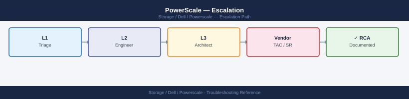
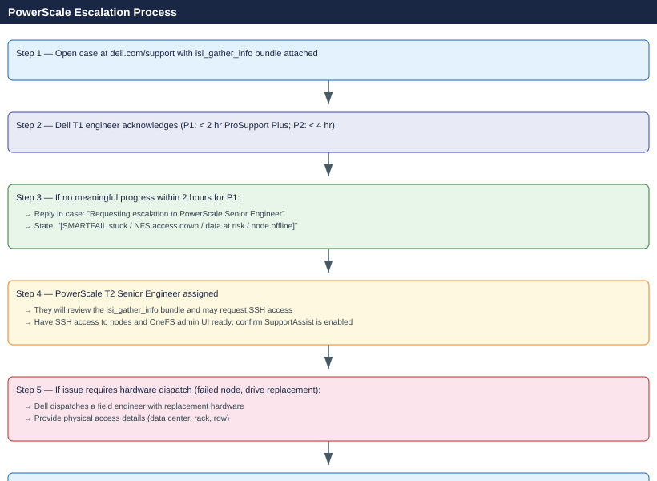

---
tags:
  - dell
  - troubleshooting
search:
  boost: 1.5
---
# PowerScale — Escalation

<div class="kb-summary">
How to escalate Dell PowerScale (Isilon) issues to Dell Technologies support: what data to collect, how to run isi_gather_info, step-by-step case creation on dell.com/support, and the escalation path when progress stalls.

*Applies to: PowerScale (Isilon) OneFS 9.x*
</div>



---

## Before you begin

- **Access required:** SSH access to any PowerScale node (admin user or root); OneFS web admin UI access; Dell support account at dell.com/support linked to the cluster service tag
- **SupportAssist auto-cases:** PowerScale can automatically open Dell support cases for hardware faults if SupportAssist is configured. Check `isi phone_home settings view` to confirm call-home is active — if it is, a case may already exist before you call
- **Do NOT remove a SMARTFAILed node** without Dell direction — SMARTFAIL is a controlled removal process; removing the node before SMARTFAIL completes can leave data components without sufficient protection
- **Do NOT start a OneFS upgrade** during an active incident — upgrades in a degraded cluster state can fail mid-way and make the cluster config inconsistent

---

## Pre-Escalation Self-Check

Run these before opening the case.

| Check | Command | Expected result |
|---|---|---|
| OneFS version | `isi version` | Note full version + build |
| Cluster node health | `isi status` | All nodes Online (`--`) |
| Storage pool health | `isi storagepool list` | All pools show healthy; no unprotected data |
| Active alerts | `isi alerts list --limit 50` | No CRITICAL or ERROR alerts |
| Drive health | `isi statistics drive` | No drives in DEAD or SMARTFAIL state |
| SyncIQ status | `isi sync policies list` | No policies in "needs attention" |
| Active jobs | `isi job list` | No stuck jobs (check job pause/error state) |
| SupportAssist | `isi phone_home settings view` | Enabled; last call-home successful |
| NFS/SMB access | Mount a share and write a test file | Write succeeds; read returns same data |

---

## Step-by-Step Data Collection

### 1. Get the OneFS version and cluster serial number

```bash
# SSH to any PowerScale node as admin
ssh admin@<node-ip>

# OneFS version (include in every case)
isi version

# Cluster name and serial numbers (required for case registration)
isi cluster identity view
isi license list   # shows cluster serial

# Node list with serial numbers
isi status -n
```

### 2. Run isi_gather_info (full cluster diagnostic bundle)

```bash
# SSH to any node — isi_gather_info collects from all nodes automatically
isi_gather_info

# Bundle is written to /ifs/data/Isilon_Support/
ls -lh /ifs/data/Isilon_Support/

# Copy to a local workstation for upload to Dell case
scp admin@<node-ip>:/ifs/data/Isilon_Support/<bundle-filename>.tar.gz /tmp/
```

This bundle contains: OneFS logs, cluster config, hardware inventory, performance stats, alert history, and job state from every node.

### 3. Capture current cluster status

```bash
# Node and drive states
isi status

# Storage pools and capacity
isi storagepool list

# Drive statistics (I/O errors, SMARTFAIL drives)
isi statistics drive | head -100

# Active alerts
isi alerts list --limit 100

# Active OneFS background jobs
isi job list

# SyncIQ policy status
isi sync policies list
isi sync reports list
```

### 4. Collect SupportAssist phone-home status

```bash
# SupportAssist configuration
isi phone_home settings view

# Send a test notification to confirm connectivity
isi phone_home send --type test

# Check last auto-case if SupportAssist triggered one
isi events list | grep -i "support\|case\|esrs" | tail -20
```

### 5. Write the timeline

```text
OneFS version: 9.5.0.0 build XXXXXXXX
Cluster: prod-ps-01 (cluster serial: XXXXXXXX)
Nodes: 12 nodes (4x F200, 4x H600, 4x A300 archive tier)
Protection level: N+2:1 on all pools
Issue first observed: 2026-06-14 14:00 UTC
Last known healthy state: 2026-06-14 12:00 UTC
Changes in 24h before the issue:
  - 12:00: Node 7 showed drive fault alert (Drive Bay 3: SSD DEAD)
  - 14:00: Node 7 entered SMARTFAIL state automatically
  - 14:05: isi status shows Node 7 in "SMARTFAILING" state; other nodes Online
  - 14:10: isi storagepool list shows "H600 pool: DEGRADED - 1 device in SMARTFAIL"
SupportAssist: case auto-created (Dell case number XXXXXXXX)
Steps already taken:
  - Did NOT remove Node 7 or pull the failed drive
  - Did NOT initiate manual SMARTFAIL on additional nodes
  - SyncIQ: replication from prod-ps-01 to dr-ps-01 still running
Blast radius: H600 pool degraded; data protected at N+1 only; one more drive failure = data at risk
```

---

## How to Open the Case on dell.com/support

1. Go to **dell.com/support** and sign in with your Dell account.

2. Click **My Cases** → **Create New Case**.

3. Under **Product**, select your PowerScale cluster by service tag (cluster serial number from `isi license list`).

4. Under **Severity**, select:
   - **Severity 1 — Production Down**: NFS/SMB access is completely unavailable; a node is offline with unprotected data; SMARTFAIL cannot complete; data loss is imminent; no workaround
   - **Severity 2 — Degraded Performance**: A node or drive is in SMARTFAIL and data is at N+1 protection; SyncIQ replication is failing; performance is significantly degraded; workaround is incomplete
   - **Severity 3 — Non-Critical Issue**: A storage pool is in a degraded but protected state; a background job is stuck; a specific protocol is partially failing; workaround exists
   - **Severity 4 — General Question**: How-to question, pre-upgrade review, capacity planning

5. In the **Summary** field: symptom + scope. Example: `PowerScale prod-ps-01 — Node 7 in SMARTFAIL, H600 pool degraded to N+1, drive failure risk imminent`.

6. In the **Description** field, paste:
   - OneFS version and cluster serial from Step 1
   - `isi status` and `isi storagepool list` output from Step 3
   - The alert details from Step 3
   - The timeline from Step 5
   - Note any Dell SupportAssist auto-case number if one was already created

7. Under **Attachments**, upload the `isi_gather_info` bundle from Step 2.

8. Click **Submit**. You receive a case number immediately.

9. **Severity 1 only:** call Dell support after submission:
    - North America: +1 800 945 3355 (24×7 for production-down)
    - Reference the case number and state "Severity 1 — PowerScale node SMARTFAIL, data at risk" at the start of the call.

---

## Escalation Path



---

## What NOT to Do

| Do NOT do this | Why | What to do instead |
|---|---|---|
| Remove a SMARTFAILed node before SMARTFAIL completes | SMARTFAIL is a data migration process; removing the node early leaves data components without sufficient protection copies | Let SMARTFAIL complete fully (`isi status` shows node removed); only then power off and remove the node |
| Pull a drive from a node showing as DEAD without Dell guidance | A DEAD drive may still hold the only copy of a component if SMARTFAIL has not yet migrated it | Confirm with Dell that the drive's data has been migrated to other drives before any physical removal |
| Reformat or rebuild a node without Dell direction | Rebuilding destroys all node data; in a degraded cluster this can push the cluster below its protection threshold | Only reformat/rebuild with explicit Dell instructions and after confirming all data is protected on other nodes |
| Disable SupportAssist during an active incident | SupportAssist provides Dell with real-time cluster telemetry that accelerates diagnosis | Keep SupportAssist enabled; if connectivity is an issue, arrange an alternate network path for call-home |
| Start a OneFS upgrade during an active degraded state | Upgrades in a degraded cluster can fail mid-way, leaving the cluster in an inconsistent version state | Wait for the cluster to return to a fully healthy state before initiating any upgrade |
| Run `isi job delete` on active protection or SMARTFAIL jobs | Cancelling a SMARTFAIL or FlexProtect job stops the data migration and leaves the cluster in a partially protected state | Let Dell direct any job cancellation; only stop jobs that Dell explicitly identifies as stuck |

---

## Useful Commands for Case Updates

```bash
# SSH to any PowerScale node as admin — paste these into every case update

# OneFS version
isi version

# Node health overview
isi status

# Storage pool health (protection status)
isi storagepool list

# Drive states (DEAD/SMARTFAIL drives)
isi statistics drive | grep -E "DEAD|SMARTFAIL|ERROR"

# Active alerts
isi alerts list --limit 50

# Active background jobs
isi job list

# SyncIQ replication status
isi sync policies list
```

---

## Support SLA Reference

| Tier | Severity | Definition | Initial Response SLA |
|---|---|---|---|
| ProSupport Plus | P1 — Production Down | NFS/SMB unavailable; node offline; data at risk | < 2 hours (24×7) |
| ProSupport Plus | P2 — Degraded | Node/drive in SMARTFAIL; N+1 protection only; workaround partial | < 4 hours (24×7) |
| ProSupport Plus | P3 — Non-Critical | Specific protocol issue; background job stuck; workaround exists | Next business day |
| ProSupport Plus | P4 — General | How-to, planning, capacity review | Next business day |
| ProSupport | P1 | As above | < 4 hours (24×7) |
| ProSupport | P2–P4 | As above | Next business day |

---

## See also

- [PowerScale — Diagnostics](diagnostics/)
- [PowerScale — Common Issues](common-issues/)

---

## Verify resolution

- Run `isi status` and confirm all nodes are Online (no SMARTFAIL or Degraded state)
- Run `isi storagepool list` and confirm all pools show their full protection level (N+2:1 or configured policy)
- Run `isi statistics drive` and confirm no drives in DEAD or SMARTFAIL state
- Run `isi alerts list --limit 20` and confirm no active CRITICAL or ERROR alerts
- Confirm NFS/SMB client access is restored: mount a share and write/read a test file
- Check `isi sync reports list` to confirm SyncIQ replication has resumed and the last run succeeded
- Run `isi_gather_info` again and attach to the Dell case as the post-resolution bundle
