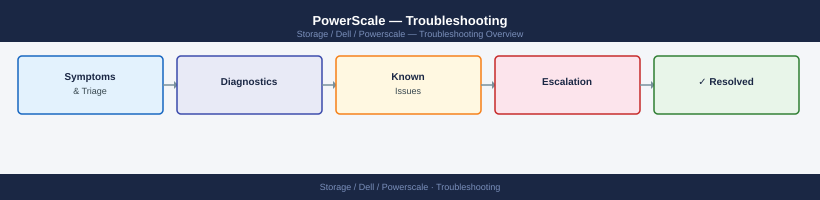

---
tags:
  - dell
  - troubleshooting
search:
  boost: 1.5
---
# PowerScale — Troubleshooting

Diagnosing PowerScale replication failures, protocol errors, quota violations, node faults, and cluster health issues.

*Applies to: PowerScale (Isilon) 9.x*

<a class="kb-card" href="common-issues/">
  <strong>Common Issues</strong>
  Quick reference for common problems and resolutions.
</a>

<a class="kb-card" href="diagnostics/">
  <strong>Diagnostics</strong>
  Diagnostic procedures and log analysis.
</a>

<a class="kb-card" href="escalation/">
  <strong>Escalation</strong>
  Vendor escalation procedures and support contacts.
</a>

