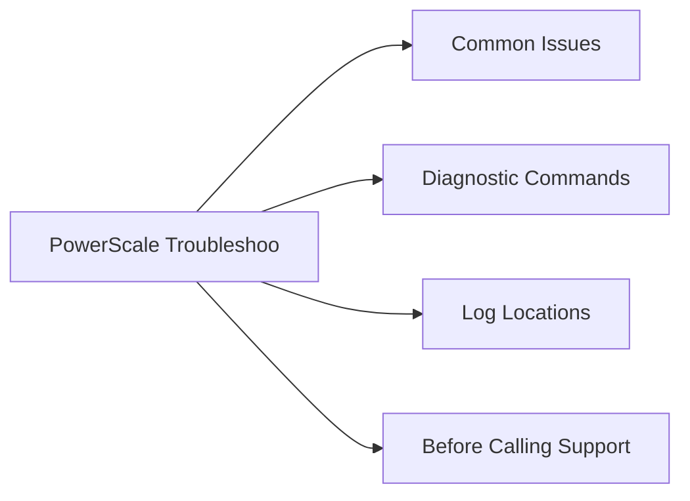

# PowerScale Troubleshooting



## Common Issues

| Symptom | Likely Cause | Action |
|---|---|---|
| SyncIQ policy stuck in `running` or `failed` | Network interruption, snapshot conflict on source, or target cluster quota/capacity reached | `isi sync reports list --policy-name <name>`; check network to target; resolve snapshot or quota issue; restart with `isi sync policies run <name>` |
| Node in SMARTFAIL state | Drive failures or hardware fault triggered automatic node removal | Do NOT intervene manually; monitor `isi job list` for Restripe job progress; replace failed hardware; open Dell Support case |
| Write failure on a quota directory | Hard quota threshold exceeded | `isi quota list --path /ifs/<path>`; raise or remove hard limit, or delete data to free space; notify directory owner |
| SmartConnect DNS name not resolving | Missing NS delegation in parent DNS zone, or IP pool has no healthy nodes | Verify NS record delegates zone to cluster node IPs; check pool health with `isi network pools list`; test with `nslookup <sc-zone>` |
| NFS stale file handle | Node rebooted or network partition caused NFS client to lose session | Remount on client; ensure NFS client uses SmartConnect DNS name, not a node IP directly |
| SMB access denied despite correct share permissions | SID mapping issue between Windows identity and OneFS local user; ACL misconfiguration | Check `isi auth users view --name <user> --zone <zone>`; verify AD provider is joined; review share ACL and directory ACL |
| Cluster capacity unexpectedly full | Snapshot accumulation, CloudPools recall, or runaway data ingest | `isi snapshot list`; delete expired snapshots; check `isi quota list` for violations; identify largest directories with `isi statistics query` |
| High per-node CPU or latency spike | Imbalanced SmartConnect; hot directory; too many concurrent jobs | `isi statistics query current --keys CPU --nodes all`; check `isi job list` for competing cluster jobs; pause non-critical jobs |

## Diagnostic Commands

```bash
# Cluster node and drive health summary
isi status

# Per-node hardware component status
isi devices node list

# List all cluster background jobs and their state
isi job list

# Show CPU and throughput statistics per node
isi statistics query current --keys CPU,BYTES_OUT,BYTES_IN --nodes all

# Show storage pool and tier capacity
isi storagepool list

# Show SyncIQ policy status and last run result
isi sync policies list
isi sync reports list

# Show recent cluster events (filter by severity)
isi event list --severity critical

# List all quotas and their consumption
isi quota list

# Show network interfaces per node
isi network interfaces list

# Verify AD join status per zone
isi auth ads list

# Show snapshot space usage
isi snapshot list
```

## Log Locations

| Log | Location / Command | Notes |
|---|---|---|
| OneFS system log | `/var/log/messages` (on any node) | Node-level OS and OneFS daemon messages |
| Cluster event log | `isi event list` | Authoritative source for hardware and software events |
| SyncIQ job log | `isi sync reports view --id <report-id>` | Per-policy replication details including errors |
| Audit log (protocol) | `isi audit settings global view` | Configures syslog forwarding of NFS/SMB access events |
| isi_logs bundle | `isi_gather_info` (run on any node as root) | Collects full cluster diagnostic bundle for Dell Support |

## Before Calling Support

1. OneFS version: `isi version`
2. Cluster serial number: `isi config`
3. Node health summary: `isi status > /tmp/status.txt`
4. Event log: `isi event list > /tmp/events.txt`
5. For SyncIQ issues: `isi sync reports list > /tmp/synciq.txt`
6. For node hardware faults: note the node number and drive bay from `isi status`
7. Collect a full diagnostic bundle: `isi_gather_info` — saves to `/ifs/data/Isilon_Support/`

Upload the `isi_gather_info` bundle via the Dell Support case portal or via SupportAssist auto-collection.
