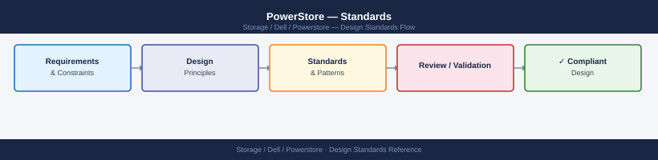
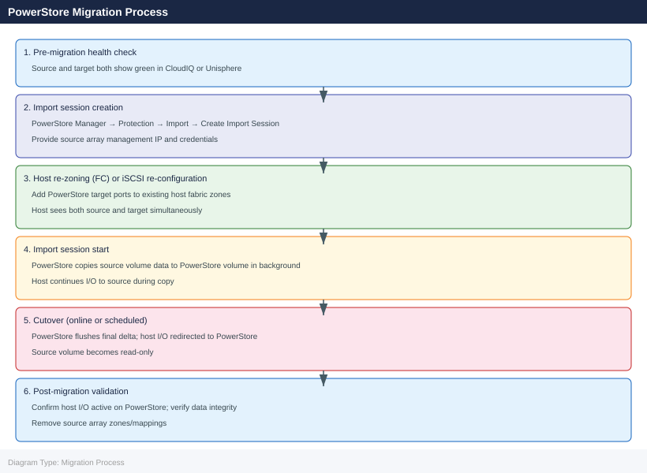

---
tags:
  - architecture
  - dell
---
# PowerStore — Standards

<div class="kb-summary">
Standards reference covering Naming Conventions, Capacity Sizing Guidelines, Protection Policy Standards, Host Configuration Standards, Software Version Matrix and 2 more sections.

*Applies to: PowerStore 3.x*
</div>


## Naming Conventions

Consistent naming prevents confusion during incidents and makes automation reliable. Apply these standards at initial deployment — renaming objects later requires API calls for each object.

| Object | Convention | Example |
|---|---|---|
| PowerStore system (cluster) | `<site>-pstore-<seq>` | `lon01-pstore-001` |
| Appliance (within cluster) | `<system>-appl-<letter>` | `lon01-pstore-001-appl-a` |
| Volume | `<app>-<env>-<seq>` | `oradb-prod-001`, `veeam-bkp-001` |
| Volume group | `<app>-<env>-vg` | `oradb-prod-vg`, `sqldb-dev-vg` |
| NAS server | `nas-<env>-<seq>` | `nas-prod-001`, `nas-files-001` |
| File system | `<app>-<env>-<seq>` | `home-dirs-prod-001` |
| NFS export | `/<app>/<env>` | `/homedirs/prod` |
| SMB share | `<app>-<env>` | `homedirs-prod` |
| Host (ESXi) | Match vCenter hostname | `lon01-esxi-001.corp.example.com` |
| Host group | `<cluster>-hg` | `lon01-vcl01-hg` |
| Snapshot policy | `<app>-<rpo>-snap` | `oradb-4h-snap`, `vmfs-1d-snap` |
| Replication rule | `<rpo>-async` or `metro` | `1h-async`, `metro-sync` |
| Protection policy | `<tier>-<rpo>` | `tier1-5m`, `tier2-1h`, `tier3-1d` |
| Remote system | `<site>-pstore-<seq>` | `lon02-pstore-001` |

## Capacity Sizing Guidelines

### Raw to Usable Conversion

PowerStore RAID overhead and data reduction should both be factored into sizing:

| Model | Drive Count (example) | RAID Type | RAID Overhead | Effective Raw |
|---|---|---|---|---|
| 500T | 10 NVMe | RAID 5 (4+1) | 20% | 8 TiB of 10 TiB |
| 3000T | 40 NVMe | RAID 6 (8+2) | 20% | 32 TiB of 40 TiB |
| 9000T | 120 NVMe | RAID 6 (8+2) | 20% | 96 TiB of 120 TiB |

After RAID overhead, apply expected data reduction ratio (DRR) to arrive at effective usable capacity:

| Workload Type | Expected DRR | Effective Usable = Raw × DRR |
|---|---|---|
| Virtualised mixed workloads (VMs, databases) | 3–5:1 | 3–5× the post-RAID raw capacity |
| Databases (Oracle, SQL Server) | 2–4:1 | 2–4× post-RAID capacity |
| Pre-encrypted backup data | 1:1 | No reduction; plan raw = usable |
| Compressed log data | 1.1–1.5:1 | Minimal reduction |

**Recommended starting point**: size raw capacity assuming 3:1 DRR for mixed environments; validate against actual DRR after 30 days of production load.

### Capacity Alert Thresholds

| Alert Level | Pool Utilisation | Action |
|---|---|---|
| Warning | 70% | Review capacity forecast; plan expansion |
| Critical | 80% | Initiate capacity expansion or data management |
| Emergency | 90% | Immediate action required; risk of write failures |

Set these thresholds in PowerStore Manager → **Settings → Monitoring → Capacity Alerts**.

### Volume Sizing

- Size volumes to the actual application requirement — do not over-allocate
- PowerStore thin volumes report the allocated size to the host but only consume physical capacity as data is written
- Thin provisioning is the default for all PowerStore volumes; thick volumes are available but rarely needed
- Maximum single volume size: 256 TiB

## Protection Policy Standards

PowerStore protection policies combine snapshot schedules with optional replication rules. Define standardised policies by tier:

| Policy Name | Snapshot Schedule | Retention | Replication Rule | Use Case |
|---|---|---|---|---|
| `tier1-5m` | Every 5 min | 24 hours local | Metro Volume or 5-min async | Tier-1 databases; zero-RPO required |
| `tier1-1h` | Hourly | 7 days local | 1-hour async | Tier-1 applications; standard RPO |
| `tier2-4h` | Every 4 hours | 14 days local | 4-hour async | Tier-2 applications |
| `tier3-daily` | Daily at 21:00 | 30 days local | Daily async (optional) | Dev/test; non-critical data |
| `backup-only` | Daily at 22:00 | 7 days local | None | Backup targets; file servers |

Apply policies at the volume group level so that all volumes in an application group share the same snapshot schedule and replication relationship.

## Host Configuration Standards

### Fibre Channel Host Configuration

```bash
# 1. Create host in PowerStore (one host object per physical host or VM cluster)
curl -k -X POST "https://<mgmt-ip>/api/rest/host" \
  -H "DELL-EMC-TOKEN: <token>" \
  -H "Content-Type: application/json" \
  -d '{
    "name": "lon01-esxi-001.corp.example.com",
    "os_type": "ESXi",
    "description": "ESXi host lon01-esxi-001"
  }'

# 2. Add FC initiators (both HBA ports)
curl -k -X POST "https://<mgmt-ip>/api/rest/host_initiator" \
  -H "DELL-EMC-TOKEN: <token>" \
  -H "Content-Type: application/json" \
  -d '{
    "host_id": "<host-id>",
    "port_name": "21:00:00:11:0d:ab:cd:ef",
    "port_type": "FC",
    "chap_mutual_username": null
  }'

# 3. Add the host to a host group (cluster-level grouping)
curl -k -X POST "https://<mgmt-ip>/api/rest/host_group" \
  -H "DELL-EMC-TOKEN: <token>" \
  -H "Content-Type: application/json" \
  -d '{
    "name": "lon01-vcl01-hg",
    "description": "vSphere cluster lon01-vcl01 host group"
  }'
```

### ESXi Host Connectivity Standards

| Parameter | Recommended Value | Rationale |
|---|---|---|
| Multipath policy (VMFS) | Round Robin (RR) | Distributes I/O across all available paths |
| Path failure retry | 3 | Before path is marked dead |
| iSCSI MTU | 9000 (jumbo frames) | End-to-end for all iSCSI paths |
| NFS MTU | 9000 (jumbo frames) | End-to-end for NFS paths |
| NFS max volumes per host | 256 (NFS v3) | ESXi limit; plan datastore count accordingly |
| vVols VASA timeout | 60 seconds | Avoid premature vVols path failures |

### Linux Host iSCSI Standards

```bash
# /etc/iscsi/iscsid.conf — key parameters for PowerStore iSCSI
node.session.timeo.replacement_timeout = 120
node.conn[0].timeo.login_timeout = 15
node.conn[0].timeo.logout_timeout = 15
node.session.queue_depth = 32
node.session.iscsi.FastAbort = No
node.session.err_timeo.abort_timeout = 15

# Multipath configuration for PowerStore iSCSI (multipath.conf)
defaults {
    user_friendly_names yes
    find_multipaths yes
}

devices {
    device {
        vendor               "DELL"
        product              "PowerStore"
        path_grouping_policy group_by_prio
        prio                 alua
        path_checker         tur
        failback             immediate
        no_path_retry        fail
        rr_min_io            1
    }
}
```

## Software Version Matrix

### PowerStoreOS Release Cadence

Dell releases PowerStoreOS updates approximately quarterly. Major version increments introduce new capabilities; minor versions are primarily bug fixes and security patches.

| PowerStoreOS Version | Minimum Supported Hardware | Key Features |
|---|---|---|
| 3.x | All T/X models | Metro Volume GA; import from Unity/SC |
| 3.2.x | All T/X models | NVMe-oF (RoCE) host support |
| 3.5.x | All T/X models | vVols 2.0 enhancements; Ansible collection v1.0 |
| 4.0.x | All T/X models | Enhanced data reduction; expanded CloudIQ integration |
| 4.5.x (current) | All T/X models | PowerShell module; extended Metro Volume geography |

Always check the [Dell PowerStore Interoperability Matrix](https://elabnavigator.dell.com) before upgrading:

- Verify that the vSphere version, vCenter version, and any SRA/VASA plugin version are compatible with the target PowerStoreOS
- Confirm Veeam and other backup software compatibility
- Review the PowerStoreOS Release Notes for any special upgrade sequencing requirements

### Supported Connectivity Matrix (abbreviated)

| Protocol | Minimum PowerStoreOS | Notes |
|---|---|---|
| FC (16/32 Gb) | 1.0 | All FC I/O modules supported |
| iSCSI (10/25 GbE) | 1.0 | CHAP optional but recommended |
| NVMe-oF (RoCE) | 3.2 | Requires 25/100 GbE RoCE I/O module; lossless network |
| NFS v3 | 1.0 | ESXi, Linux hosts |
| NFS v4.1 | 2.0 | Recommended for Linux file servers; session trunking |
| SMB 2.x/3.x | 1.0 | Windows, Linux (Samba) clients |
| vVols | 1.0 | Requires VASA registration in vCenter |

## Import Standards (from Legacy Arrays)

PowerStore supports non-disruptive import from the following Dell legacy platforms:

| Source Array | Import Method | Notes |
|---|---|---|
| Unity XT / Unity | Block volume import via iSCSI | Online import; host switches to PowerStore during migration |
| SC (Compellent) | Block volume import via iSCSI | Online import; requires SC serial number mapping |
| VNX / VNXe | Block volume import via iSCSI | Legacy support; requires older import toolkit version |
| PowerMax / VMAX | Not supported via native import | Use host-based migration (vmkfstools, dd, backup/restore) |

### Import Process Overview



## Monitoring and Alerting Standards

### Alert Notification Configuration

Configure the following alert destinations for all production PowerStore systems:

| Severity | Destination | Response Time |
|---|---|---|
| CRITICAL | On-call pager / PagerDuty webhook | Immediate (< 15 min) |
| CRITICAL | ITSM system (ServiceNow) for incident creation | Automatic |
| WARNING | Storage ops email list | Review within 4 hours |
| INFO | Storage ops email list | Review daily |

Configure under PowerStore Manager → **Settings → Monitoring → Alerts → Notification Destinations**.

### CloudIQ Integration Baseline

Every production PowerStore must be registered to CloudIQ via the Secure Connect Gateway (SCG):

- [ ] PowerStore visible in CloudIQ dashboard with a health score ≥ 90
- [ ] Capacity forecast visible for the system (requires 7+ days of data)
- [ ] CloudIQ CRITICAL alert notification rule pointing to ops email and/or webhook
- [ ] CloudIQ system tagged with `site:`, `env:`, and `platform:` tags

---

## See also

- [Powerstore — How It Works](how-it-works/)
- [Powerstore — Integrations](integrations/)
- [Powerstore — Deploy](../deploy/)
