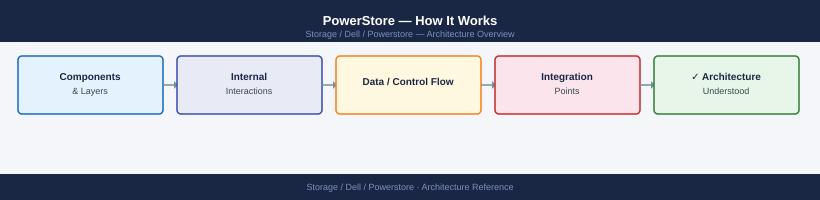
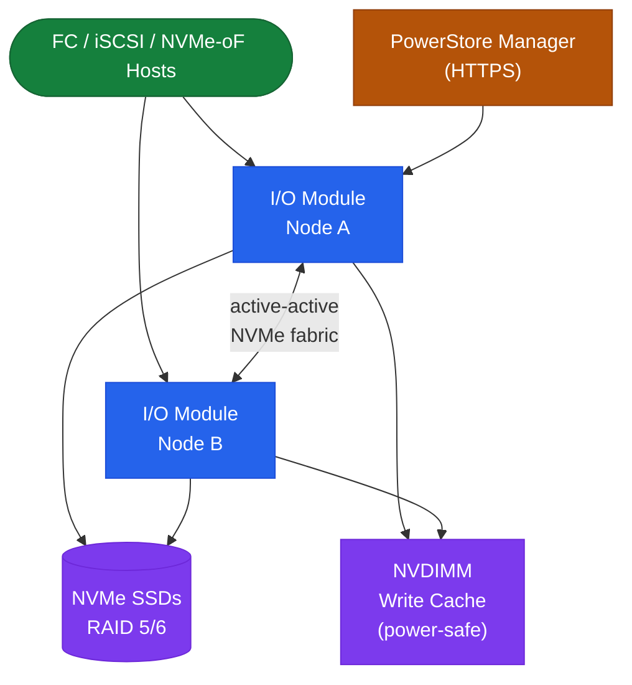

---
tags:
  - architecture
  - dell
---
# PowerStore — How It Works

How It Works reference covering Overview, Architecture, Appliance Architecture, Hardware Models, Components and 4 more sections.

*Applies to: PowerStore 3.x*

## Overview

Dell PowerStore is a mid-range all-flash platform built on an active-active appliance architecture with an NVMe-based internal fabric. It runs **PowerStoreOS (PSTROS)** — a microservices-based OS with containerised workloads. Two families: PowerStore **T** (scale-out capable) and PowerStore **X** (includes AppsOn — embedded vSphere).

## Architecture

## Appliance Architecture

Each PowerStore system has one or more **appliances**, each containing:

- Two storage nodes (Node A and Node B) — active-active; both serve I/O simultaneously
- NVMe storage enclosure with SSDs only — no spinning disk in any configuration
- Field-replaceable front-end I/O modules (FC, iSCSI, NVMe-oF/RoCE)
- Internal NVMe PCIe fabric connecting nodes to drives

PowerStore T supports up to 4 appliances in a cluster with unified management. PowerStore X does not support cluster scale-out — designed for single-appliance with AppsOn workloads.

## Hardware Models

| Family | Models | Key Differentiator |
|---|---|---|
| PowerStore T | 500T–9000T | Scale-out; standard appliance; block, file, vVols |
| PowerStore X | 500X–9000X | AppsOn: runs vSphere VMs directly on array nodes |

## Components

| Component | Description |
|---|---|
| Storage Nodes (A/B) | Dual Intel Xeon nodes; active-active; distributed NVMe volume ownership |
| NVDIMM | Non-volatile DIMM write buffer per node; writes acknowledged after NVDIMM, destaged async to NVMe |
| NVMe SSDs | Performance (TLC) and capacity (QLC) drives; all hot-swap; RAID 5 (3+1) or RAID 6 (4+2) |
| PowerStore Manager | HTTPS web UI served from management IP; all provisioning and monitoring |
| REST API | `https://<mgmt-ip>/api/rest/`; same API used internally by the UI |
| pstcli | CLI binary (installed on management host); wraps REST API for scripting |
| VASA Provider | Embedded in PowerStoreOS; enables vVols and VM Storage Policy enforcement in vCenter |

## Data Services

| Service | Notes |
|---|---|
| Inline compression | Always enabled; LZ algorithm optimised for NVMe latency |
| Deduplication | Pool-wide, block-level; on by default; disable per volume group for pre-encrypted data |
| Snapshots | Block and file; schedule + retention via protection policies |
| Async replication | Session-based; configurable RPO (5 min to 1 day) |
| Metro Volume | Synchronous (zero RPO); Mediator VM at third site for split-brain arbitration; ≤5ms RTT / ≤100km |

## Metro Volume

Metro Volume provides zero-RPO synchronous replication:

- Both sites maintain an active copy; primary site replicates synchronously before ACK
- **Mediator** (lightweight VM at a third site or Dell-hosted cloud instance) grants quorum on link failure
- Automatic failover: secondary site assumes I/O within seconds when primary loses connectivity
- Mediator communicates on TCP port 6666

## Management Interfaces

| Interface | Access | Purpose |
|---|---|---|
| PowerStore Manager | HTTPS on management IP | Primary web UI |
| REST API | `https://<mgmt-ip>/api/rest/` | Full automation |
| pstcli | Binary on management host | Scripted CLI |
| vSphere Plugin | vCenter extension | VM-centric provisioning |
| CloudIQ | SaaS via SCG | Predictive analytics, capacity forecasting |

## Connectivity

| Protocol | Speed | Notes |
|---|---|---|
| Fibre Channel | 32 Gb / 16 Gb per port | FC or FC-NVMe |
| iSCSI | 10/25/100 GbE | Jumbo frames (MTU 9000) recommended |
| NVMe-oF (RoCE) | 25/100 GbE | Requires PFC/ECN-enabled lossless switches |

---

## See also

- [Powerstore — Design Standards](design-standards/)
- [Powerstore — Integrations](integrations/)
- [Powerstore — Deploy](../deploy/)
