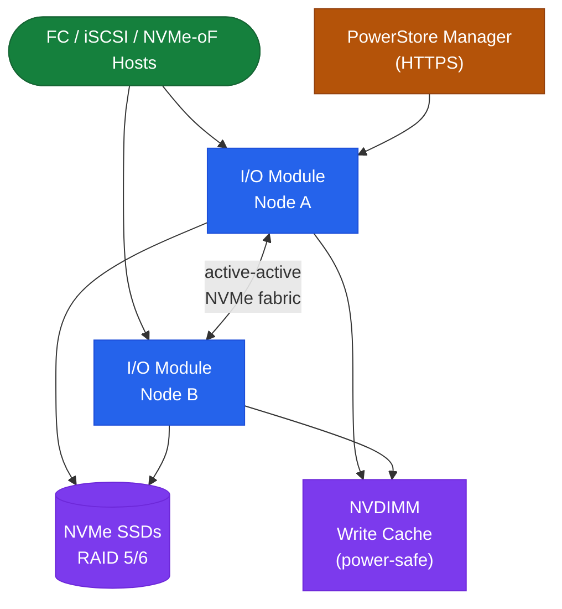

# PowerStore — Architecture

<div class="kb-summary">
Dell PowerStore is a mid-range all-flash platform with an active-active dual-node appliance architecture built on an NVMe internal fabric. It runs PowerStoreOS (microservices-based) and supports Metro Volume for zero-RPO synchronous replication.
</div>
```text
┌─────────────────────────────────── Dell PowerStore — Architecture ────────────────────────────────────┐
│                                                                                                       │
│   ┌───────────────────────────────────────────────────────────────────────────────────────────────┐   │
│   │ PowerStore architecture overview: mid-range NVMe all-flash array with unified block and file  │   │
│   │                     Protocols: FC · iSCSI · NVMe-oF · NFS · SMB · REST API                    │   │
│   │         Key components: PowerStore Manager, Volume groups, Protection policies, Metro         │   │
│   │          Design principles: HA, scalability, non-disruptive operations, and security          │   │
│   └───────────────────────────────────────────────────────────────────────────────────────────────┘   │
│                                                                                                       │
│    Design → deploy → configure → validate → monitor → optimise                                        │
│                                                                                                       │
│                  ▼                                ▼                                ▼                  │
│                                                                                                       │
│   ┌─────────────────────────────┐  ┌─────────────────────────────┐  ┌─────────────────────────────┐   │
│   │            Layer            │  │          Component          │  │            Notes            │   │
│   │           T-model           │  │          Block only         │  │        iSCSI/FC/NVMe        │   │
│   │           X-model           │  │         Block + File        │  │       Unified protocol      │   │
│   │            Metro            │  │       Sync replication      │  │       Zero-RPO stretch      │   │
│   │          Protection         │  │        Snapshot/Clone       │  │       Immutable snaps       │   │
│   │             Mgmt            │  │          PSM / REST         │  │         Unified pane        │   │
│   └─────────────────────────────┘  └─────────────────────────────┘  └─────────────────────────────┘   │
│                                                                                                       │
│                          ▼                                                 ▼                          │
│                                                                                                       │
│   ┌───────────────────────────────────────────────────────────────────────────────────────────────┐   │
│   │    Component     │     Purpose      │      Protocol     │       Auth       │      Notes       │   │
│   │   Volume group   │ Logical containe │      iSCSI/FC     │    Host group    │  Shared policy   │   │
│   │Protection policy │ Snapshot/repl ru │      Internal     │    Admin role    │    Per volume    │   │
│   │   Metro volume   │ Sync replication │    Internal RPC   │   Certificate    │     Zero RPO     │   │
│   │     Snapshot     │     PiT copy     │      Internal     │    Admin role    │ Space-efficient  │   │
│   └───────────────────────────────────────────────────────────────────────────────────────────────┘   │
│                                                                                                       │
│    Physical: PowerStore T/X appliance · NVMe drives · SAS expansion shelves · 10/25 GbE               │
│                                                                                                       │
│    Key terms:                                                                                         │
│                                                                                                       │
│    PowerStore         = Dell mid-range NVMe storage; T-model block-only, X-model unified block+file   │
│    PowerStore Manager = browser GUI and REST API endpoint for all PowerStore operations               │
│    Volume group       = logical collection of volumes sharing snapshot and replication policies       │
│    Protection policy  = assigned to volumes; defines snapshot schedule, retention, and replication    │
│    Metro volume       = synchronously replicated volume across two sites; zero RPO active-active      │
│    Snapshot           = space-efficient point-in-time copy; crash-consistent or app-consistent        │
│    Clone              = full writable copy of a volume or file system; independent lifecycle          │
│    Applied-to         = PowerStore host mapping; volumes are applied-to a host or host group object   │
│    Capacity license   = PowerStore uses usable-capacity licensing; licensed in TiB increments         │
│    Storage container  = PowerStore X-model; unified block and file from the same storage pool         │
│    Appliance          = single PowerStore node pair (dual controllers); scalable to 4 appliances      │
│    NVMe-oF            = NVMe over Fabrics; FC-NVMe or NVMe/TCP host connectivity on PowerStore        │
│                                                                                                       │
└───────────────────────────────────────────────────────────────────────────────────────────────────────┘
```


<div class="kb-grid kb-grid-3">
  <a class="kb-card" href="how-it-works/">
    <div class="kb-card-icon">⚙️</div>
    <div class="kb-card-title">How It Works</div>
    <div class="kb-card-desc">Dual-node active-active architecture, NVDIMM write cache, Metro Volume sync replication, inline dedup/compression, and REST API.</div>
  </a>
  <a class="kb-card" href="integrations/">
    <div class="kb-card-icon">🔗</div>
    <div class="kb-card-title">Integrations</div>
    <div class="kb-card-desc">vSphere vVols/VASA, Kubernetes CSI, CloudIQ SaaS analytics, and VMware AppsOn (X-series).</div>
  </a>
  <a class="kb-card" href="design-standards/">
    <div class="kb-card-icon">📐</div>
    <div class="kb-card-title">Design Standards</div>
    <div class="kb-card-desc">T vs X family selection, Metro Volume Mediator placement, iSCSI jumbo frame requirements, and protection policy design.</div>
  </a>
</div>

## Families

| Family | Models | Key Differentiator |
|---|---|---|
| PowerStore T | 500T–9000T | Scale-out up to 4 appliances; block, file, vVols |
| PowerStore X | 500X–9000X | AppsOn: runs vSphere VMs directly on array nodes |

Both families use the same NVMe-based architecture and PowerStoreOS. X-series does not support cluster scale-out.

## Topology


