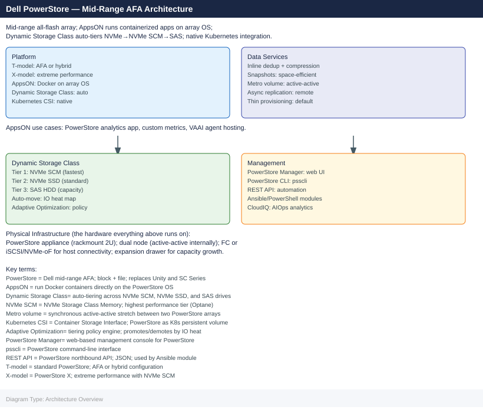
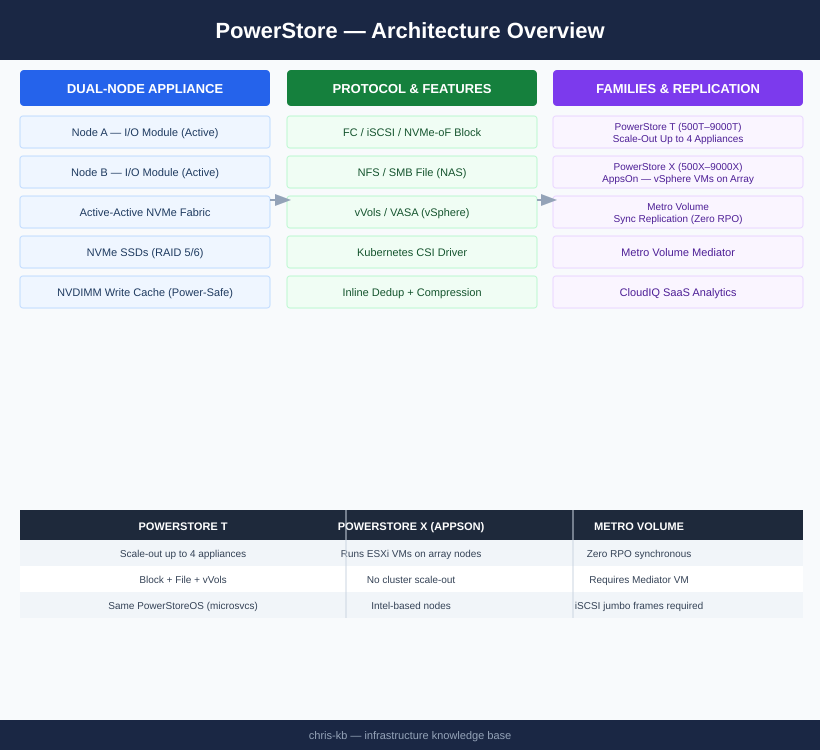

---
tags:
  - architecture
  - dell
---
# PowerStore — Architecture

<div class="kb-summary">
Dell PowerStore is a mid-range all-flash platform with an active-active dual-node appliance architecture built on an NVMe internal fabric. It runs PowerStoreOS (microservices-based) and supports Metro Volume for zero-RPO synchronous replication.

*Applies to: PowerStore 3.x*
</div>



```d2
direction: right

HA: "FC / iSCSI / NVMe-oF Hosts" {shape: rectangle}
IOM_A: "I/O Module\nNode A" {shape: rectangle}
IOM_B: "I/O Module\nNode B" {shape: rectangle}
NVMe: "NVMe SSDs\nRAID 5/6" {shape: rectangle}
NVDIMM: "NVDIMM\nWrite Cache\n(power-safe" {shape: rectangle}
MGR: "PowerStore Manager\n(HTTPS" {shape: rectangle}

HA -> IOM_A
HA -> IOM_B
IOM_A -> IOM_B
IOM_B -> NVMe
IOM_B -> NVDIMM
MGR -> IOM_A
```


<div class="kb-grid kb-grid-3">
  <a class="kb-card" href="how-it-works/">
    <div class="kb-card-icon">⚙️</div>
    <div class="kb-card-title">How It Works</div>
    <div class="kb-card-desc">Dual-node active-active architecture, NVDIMM write cache, Metro Volume sync replication, inline dedup/compression, and REST API.</div>
  </a>
  <a class="kb-card" href="integrations/">
    <div class="kb-card-icon">🔗</div>
    <div class="kb-card-title">Integrations</div>
    <div class="kb-card-desc">vSphere vVols/VASA, Kubernetes CSI, CloudIQ SaaS analytics, and VMware AppsOn (X-series).</div>
  </a>
  <a class="kb-card" href="design-standards/">
    <div class="kb-card-icon">📐</div>
    <div class="kb-card-title">Design Standards</div>
    <div class="kb-card-desc">T vs X family selection, Metro Volume Mediator placement, iSCSI jumbo frame requirements, and protection policy design.</div>
  </a>
</div>

## Families

| Family | Models | Key Differentiator |
|---|---|---|
| PowerStore T | 500T–9000T | Scale-out up to 4 appliances; block, file, vVols |
| PowerStore X | 500X–9000X | AppsOn: runs vSphere VMs directly on array nodes |

Both families use the same NVMe-based architecture and PowerStoreOS. X-series does not support cluster scale-out.

## Topology

