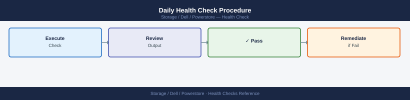
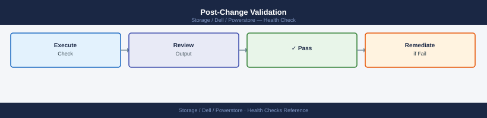
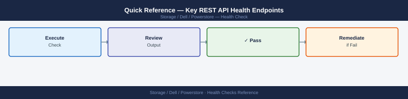

---
tags:
  - dell
  - operations
---
# PowerStore — Health Checks

<div class="kb-summary">
Health Checks reference covering Daily Health Check Procedure, Change Readiness Checklist, Post-Change Validation, Quick Reference — Key REST API Health Endpoints, Incident Triage.

*Applies to: PowerStore 3.x*
</div>

## Before you begin

- **Access:** Storage admin credentials (cluster admin or equivalent)
- **Timing:** safe to run during business hours unless a step is marked ⚠ (causes interruption)
- **Dependencies:** no active upgrades or migrations on the same infrastructure
- **Logging:** capture command output — paste into the change record on completion

---

## Run This Routine

1. **Cluster health:** `pstcli /cluster show` — check Health_state OK
2. **Node status:** `pstcli /node show` — all nodes Healthy
3. **Volume health:** `pstcli /volume show | grep -v Healthy` — should be empty
4. **Alerts:** PowerStore Manager → Alerts → review open/critical
5. **Capacity:** `pstcli /storage_resource show` — check used/available per pool
6. **Replication session health:** `pstcli /replication_session show` — all sessions Active
7. **Drive health:** `pstcli /drive show | grep -v Healthy`

## Daily Health Check Procedure




Run this procedure each morning on all production PowerStore systems. The checks can be automated using the PowerStore REST API — see the scripts in the [Scripts](scripts/index.md) section.

### 1. Log In and Review the Dashboard


Access PowerStore Manager at `https://<management-ip>` and review the Dashboard panel:

- [ ] Overall system health icon is green (no red or orange alerts)
- [ ] Data Reduction Ratio (DRR) is within the expected range for the workload
- [ ] Capacity utilisation is below the Warning threshold (typically 70%)
- [ ] No replication sessions shown in Error or Paused state

### 2. Check Active Alerts


```bash
# List all active (unresolved) alerts
curl -k -X GET "https://<mgmt-ip>/api/rest/alert?state=active" \
  -H "DELL-EMC-TOKEN: <token>" | python3 -m json.tool

# Filter CRITICAL alerts only
curl -k -X GET "https://<mgmt-ip>/api/rest/alert?severity=CRITICAL&state=active" \
  -H "DELL-EMC-TOKEN: <token>" | python3 -m json.tool
```


```text title="Expected output"
{
  "alerts": [
    {
      "id": "alert-2024-001",
      "severity": "CRITICAL",
      "state": "active",
      "message": "Storage pool capacity threshold exceeded",
      "resource_id": "pool-ssd-01",
      "timestamp": "2024-01-15T14:32:18Z",
      "acknowledged": false
    },
    {
      "id": "alert-2024-002",
      "severity": "WARNING",
      "state": "active",
      "message": "Controller temperature elevated",
      "resource_id": "ctrl-a",
      "timestamp": "2024-01-15T13:47:05Z",
      "acknowledged": false
    },
    {
      "id": "alert-2024-003",
      "severity": "CRITICAL",
      "state": "active",
      "message": "Replication link degraded",
      "resource_id": "remote-site-02",
      "timestamp": "2024-01-15T12:15:42Z",
      "acknowledged": false
    }
  ],
  "page": 1,
  "per_page": 100,
  "total": 3
}
{
  "alerts": [
    {
      "id": "alert-2024-001",
      "severity": "CRITICAL",
      "state": "active",
      "message": "Storage pool capacity threshold exceeded",
      "resource_id": "pool-ssd-01",
      "timestamp": "2024-01-15T14:32:18Z",
      "acknowledged": false
    },
    {
      "id": "alert-2024-003",
      "severity": "CRITICAL",
      "state": "active",
      "message": "Replication link degraded",
      "resource_id": "remote-site-02",
      "timestamp": "2024-01-15T12:15:42Z",
      "acknowledged": false
    }
  ],
  "page": 1,
  "per_page": 100,
  "total": 2
}
```

!!! warning "Common errors"
    **`curl: (60) SSL certificate problem: self signed certificate`** — Add the `-k` flag to skip SSL verification (already present in the example, but ensure it's not removed).
    **`{"error": "Unauthorized", "code": 401}`** — Verify the DELL-EMC-TOKEN is valid and not expired by requesting a fresh token from the authentication endpoint.
    **`curl: (7) Failed to connect to <mgmt-ip> port 443: Connection refused`** — Confirm the management IP address is correct and the PowerStore REST API service is running on port 443.
Review every active alert:

| Alert Severity | Required Action |
|---|---|
| CRITICAL | Open an incident immediately; escalate to on-call engineer |
| ERROR | Investigate within 2 hours; escalate if not resolved in 4 hours |
| WARNING | Review and acknowledge; resolve within 24 hours |
| INFO | Review; no immediate action required |

### 3. Hardware Health


```bash
# Check all hardware components
curl -k -X GET "https://<mgmt-ip>/api/rest/hardware" \
  -H "DELL-EMC-TOKEN: <token>" | python3 -m json.tool

# Check drive health specifically
curl -k -X GET "https://<mgmt-ip>/api/rest/drive" \
  -H "DELL-EMC-TOKEN: <token>" | python3 -m json.tool

# Check node hardware
curl -k -X GET "https://<mgmt-ip>/api/rest/node" \
  -H "DELL-EMC-TOKEN: <token>" | python3 -m json.tool
```


```text title="Expected output"
{
  "hardware": [
    {
      "id": "hw-001",
      "name": "PSU_A",
      "type": "power_supply",
      "status": "ok",
      "health_state": "healthy"
    },
    {
      "id": "hw-002",
      "name": "FAN_1",
      "type": "fan",
      "status": "ok",
      "health_state": "healthy"
    },
    {
      "id": "hw-003",
      "name": "CTRL_A",
      "type": "controller",
      "status": "ok",
      "health_state": "healthy"
    }
  ]
}
{
  "drive": [
    {
      "id": "drive-0",
      "slot": 0,
      "status": "ok",
      "health_state": "healthy",
      "capacity_bytes": 10995116277760,
      "media_type": "SSD"
    },
    {
      "id": "drive-1",
      "slot": 1,
      "status": "ok",
      "health_state": "healthy",
      "capacity_bytes": 10995116277760,
      "media_type": "SSD"
    },
    {
      "id": "drive-2",
      "slot": 2,
      "status": "degraded",
      "health_state": "warning",
      "capacity_bytes": 10995116277760,
      "media_type": "SSD"
    }
  ]
}
{
  "node": [
    {
      "id": "node-0",
      "name": "appliance-node-0",
      "status": "ok",
      "health_state": "healthy",
      "mgmt_ip": "192.168.1.50",
      "service_ip": "192.168.2.50"
    },
    {
      "id": "node-1",
      "name": "appliance-node-1",
      "status": "ok",
      "health_state": "healthy",
      "mgmt_ip": "192.168.1.51",
      "service_ip": "192.168.2.51"
    }
  ]
}
```

!!! warning "Common errors"
    **`curl: (60) SSL certificate problem: self signed certificate`** — Add the `-k` flag to skip certificate verification (already present in the example, so ensure it's not removed).
    **`{"error": "Unauthorized", "code": 401}`** — Verify the DELL-EMC-TOKEN is valid and not expired by requesting a fresh token from the authentication endpoint.
    **`curl: (7) Failed to connect to <mgmt-ip> port 443: Connection refused`** — Confirm the management IP address is correct and the REST API service is running on the PowerStore appliance.
Look for drives with a `health_state` of `failed`, `degraded`, or `reconstructing`. A single drive failure places the pool in degraded mode — the array remains fully operational but has reduced fault tolerance until the failed drive is replaced and reconstruction completes.

Reconstruction time estimate: approximately 1 hour per TB of data for NVMe SSDs under normal workload.

### 4. Capacity Check


```bash
# Get capacity metrics per appliance
curl -k -X GET "https://<mgmt-ip>/api/rest/storage_resource?select=name,size_used,size_total,data_reduction_ratio" \
  -H "DELL-EMC-TOKEN: <token>" | python3 -m json.tool

# Per-pool capacity
curl -k -X GET "https://<mgmt-ip>/api/rest/pool?select=name,size_free,size_used,size_total,percent_used" \
  -H "DELL-EMC-TOKEN: <token>" | python3 -m json.tool
```


```text title="Expected output"
{
  "entries": [
    {
      "id": "sr-1001",
      "name": "prod-vmware-01",
      "size_used": 4398046511104,
      "size_total": 10995116277760,
      "data_reduction_ratio": 2.8
    },
    {
      "id": "sr-1002",
      "name": "prod-vmware-02",
      "size_used": 2199023255552,
      "size_total": 10995116277760,
      "data_reduction_ratio": 1.9
    }
  ]
}
{
  "entries": [
    {
      "id": "pool-001",
      "name": "SSD_Tier_1",
      "size_free": 3298534883328,
      "size_used": 7696581394432,
      "size_total": 10995116277760,
      "percent_used": 70
    },
    {
      "id": "pool-002",
      "name": "SAS_Tier_2",
      "size_free": 5497558138880,
      "size_used": 5497558138880,
      "size_total": 10995116277760,
      "percent_used": 50
    }
  ]
}
```

!!! warning "Common errors"
    **`curl: (60) SSL certificate problem: self signed certificate`** — Add `-k` flag to curl command to skip certificate verification (already present in example, but ensure it's not removed).
    **`error: 401 Unauthorized`** — Verify the DELL-EMC-TOKEN is valid and not expired by requesting a fresh token from the authentication endpoint.
    **`command not found: python3`** — Install Python 3 or pipe output to `jq` instead: `| jq '.'` for JSON formatting without the python dependency.
Flag any pool with `percent_used` above 70 for capacity planning review.

### 5. Replication Session Health


```bash
# List all replication sessions and their state
curl -k -X GET "https://<mgmt-ip>/api/rest/replication_session?select=name,state,last_sync_time,remaining_capacity_to_sync" \
  -H "DELL-EMC-TOKEN: <token>" | python3 -m json.tool
```


```text title="Expected output"
{
  "entries": [
    {
      "id": "repl_sess_001",
      "name": "prod-to-dr-sync",
      "state": "synchronized",
      "last_sync_time": "2024-01-15T14:32:18Z",
      "remaining_capacity_to_sync": 0
    },
    {
      "id": "repl_sess_002",
      "name": "backup-mirror-hourly",
      "state": "synchronizing",
      "last_sync_time": "2024-01-15T14:15:00Z",
      "remaining_capacity_to_sync": 2147483648
    },
    {
      "id": "repl_sess_003",
      "name": "archive-offsite",
      "state": "paused",
      "last_sync_time": "2024-01-14T23:45:22Z",
      "remaining_capacity_to_sync": 5368709120
    }
  ]
}
```

!!! warning "Common errors"
    **`curl: (60) SSL certificate problem: self signed certificate`** — Add `-k` flag to the curl command to skip certificate verification (already present in the example, so verify the flag is not being removed).
    **`401 Unauthorized`** — Verify the DELL-EMC-TOKEN is valid and not expired by requesting a fresh token from the authentication endpoint.
    **`curl: (7) Failed to connect to <mgmt-ip> port 443: Connection refused`** — Confirm the management IP address is correct and the PowerStore array is reachable on port 443 using `ping` or `nc`.
Expected states:

| State | Meaning | Action |
|---|---|---|
| `synchronizing` | Replication in progress (normal) | None |
| `synchronized` | Up to date | None |
| `paused` | Manually paused | Confirm this is intentional |
| `failed` | Replication broken | Investigate immediately; check network connectivity to remote system |
| `system_paused` | Array paused replication automatically | Check for fault condition; resume after fault cleared |

### 6. Software Version Check


```bash
# Show installed software version
curl -k -X GET "https://<mgmt-ip>/api/rest/software_installed" \
  -H "DELL-EMC-TOKEN: <token>" | python3 -m json.tool
```


```text title="Expected output"
{
  "id": "0",
  "release": "3.2.1.0",
  "build": "4821",
  "patch_version": "3.2.1.0-4821",
  "installed_date": "2024-01-15T09:42:33Z",
  "release_notes_url": "https://dell.com/support/powerstore/3.2.1.0",
  "is_major_release": false,
  "previous_version": "3.2.0.5",
  "upgrade_status": "Completed",
  "upgrade_duration_seconds": 1847
}
```

!!! warning "Common errors"
    **`curl: (60) SSL certificate problem: self signed certificate`** — Add the `-k` flag to skip SSL verification (already present in the example, but ensure it's not removed).
    **`curl: (7) Failed to connect to <mgmt-ip> port 443: Connection refused`** — Verify the management IP is correct and the REST API service is running with `systemctl status dell-emc-rest-api`.
    **`{"error":"Invalid or expired token"}`** — Regenerate the authentication token using the PowerStore management console or API login endpoint.
Compare the running version against the latest available PowerStoreOS release. Upgrade if the system is more than one minor release behind and a pending CVE applies.

## Change Readiness Checklist

Complete this checklist before any maintenance window or change on a PowerStore system:

| Check | Requirement | Status |
|---|---|---|
| Active CRITICAL alerts | None (resolve before proceeding) | |
| Drive health | No failed or reconstructing drives | |
| Replication sessions | All sessions `synchronized` or `synchronizing`; none `failed` | |
| Capacity utilisation | Below 80% on all pools | |
| Software version | Not in the middle of an upgrade | |
| CloudIQ health score | ≥ 80 | |
| Snapshot policy | Latest snapshot completed successfully | |
| Metro Volume (if in use) | Metro link state `synchronised`; mediator reachable | |
| SupportAssist | Connected (check Settings → Support) | |
| Maintenance window | Communicated to application teams | |

## Post-Change Validation




After completing maintenance, verify the following before closing the change:

```bash
# 1. Check for new alerts introduced during the change
curl -k -X GET "https://<mgmt-ip>/api/rest/alert?state=active" \
  -H "DELL-EMC-TOKEN: <token>" | python3 -m json.tool

# 2. Confirm all replication sessions resumed
curl -k -X GET "https://<mgmt-ip>/api/rest/replication_session?select=name,state" \
  -H "DELL-EMC-TOKEN: <token>"

# 3. Confirm host connectivity (check host I/O counters)
curl -k -X GET "https://<mgmt-ip>/api/rest/host?select=name,type,health_state" \
  -H "DELL-EMC-TOKEN: <token>"

# 4. Check CloudIQ health score returned to baseline
# Log into cloudiq.dell.com and confirm the score matches pre-change value
```


```text title="Expected output"
{
  "alerts": [
    {
      "id": "alert-20240115-001",
      "severity": "warning",
      "state": "active",
      "message": "Replication session lag detected on cluster-02",
      "created_at": "2024-01-15T14:32:18Z"
    }
  ]
}
[
  {
    "name": "repl_session_prod_dr",
    "state": "running"
  },
  {
    "name": "repl_session_backup_tier",
    "state": "running"
  },
  {
    "name": "repl_session_archive",
    "state": "running"
  }
]
[
  {
    "name": "host-esx-01.prod.local",
    "type": "ESXi",
    "health_state": "healthy"
  },
  {
    "name": "host-esx-02.prod.local",
    "type": "ESXi",
    "health_state": "healthy"
  },
  {
    "name": "host-sql-db-01.prod.local",
    "type": "Windows",
    "health_state": "healthy"
  }
]
```

!!! warning "Common errors"
    **`curl: (60) SSL certificate problem: self signed certificate`** — Add `-k` flag to curl command to skip SSL verification (already present in the example, but ensure it's not removed).
    **`{"error": "Unauthorized", "code": 401}`** — Verify the DELL-EMC-TOKEN is valid and not expired by requesting a fresh token from the authentication endpoint.
## Quick Reference — Key REST API Health Endpoints




| Check | Endpoint |
|---|---|
| Active alerts | `GET /api/rest/alert?state=active` |
| Hardware health | `GET /api/rest/hardware` |
| Drive status | `GET /api/rest/drive` |
| Node health | `GET /api/rest/node` |
| Pool capacity | `GET /api/rest/pool` |
| Replication sessions | `GET /api/rest/replication_session` |
| Software version | `GET /api/rest/software_installed` |
| Host connectivity | `GET /api/rest/host` |
| Volume list | `GET /api/rest/volume?select=name,health_state,size,state` |
| Snapshot status | `GET /api/rest/volume_snapshot?select=name,state,creation_timestamp` |

## Incident Triage


When a CRITICAL alert fires on PowerStore:

1. Log into PowerStore Manager; note the exact alert message and affected resource
2. Pull the alert detail via REST API for the full error code and description
3. Check drive health — most CRITICAL hardware alerts are drive or node related
4. Check replication session state — confirm whether replication is still running or has failed
5. If a node fault is suspected, review node-level health: `GET /api/rest/node`
6. Check CloudIQ for the historical health score timeline — identify when the issue began and whether it correlates with a change
7. For unresolved hardware faults, open a Dell support case from PowerStore Manager → **Support → New Case** — the support case is pre-populated with system serial number and log bundles

### Common Alert Codes


| Alert Code / Message | Likely Cause | First Response |
|---|---|---|
| `Drive failed` | NVMe SSD hardware failure | Confirm drive fault in hardware view; open Dell case for physical drive replacement |
| `Pool degraded` | Drive failure or reconstruction in progress | Check drive health; monitor reconstruction progress |
| `Replication session failed` | Network connectivity lost between sites | Check WAN/MPLS link; check firewall rules for replication port TCP/443 |
| `NAS server unavailable` | Node-level fault or NAS server software fault | Check node health; attempt NAS server failover manually |
| `Metro Volume link down` | Metro Volume network connectivity lost or mediator unreachable | Check inter-site network; check mediator VM status; prepare for manual promotion if link is persistently down |
| `Certificate expired` | Management certificate past expiry date | Renew and import the certificate; see [Security / Authentication](../security/authentication/index.md) |
| `SupportAssist connectivity lost` | Outbound HTTPS to Dell SRS blocked | Check proxy/firewall for `esrs3.emc.com:443`; confirm SupportAssist configuration |

---

## Verify

- Confirm the operation completed without errors in the log or management UI
- Verify the expected state change is visible (service running, object created, config applied)
- Document the outcome in the change record

---

## See also

- [Powerstore — Procedures](../procedures/)
- [Powerstore — CLI Reference](../cli-reference/)
- [Powerstore — Common Issues](../../troubleshooting/common-issues/)
