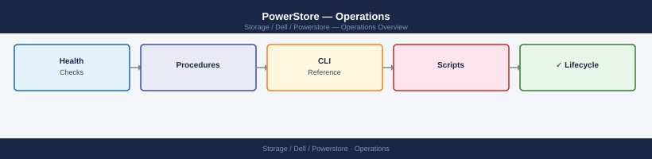

---
tags:
  - dell
  - operations
---
# PowerStore — Operations

PowerStore day-to-day operations — volume/file provisioning, native replication, snapshots, and host connectivity.

*Applies to: PowerStore 3.x*

<a class="kb-card" href="cli-reference/">
  <strong>CLI Reference</strong>
  PowerStore CLI command reference with syntax and examples.
</a>

<a class="kb-card" href="health-checks/">
  <strong>Health Checks</strong>
  Daily checks, array health commands, and status verification.
</a>

<a class="kb-card" href="procedures/">
  <strong>Procedures</strong>
  Change readiness, maintenance windows, and provisioning.
</a>

<a class="kb-card" href="install-upgrade/">
  <strong>Install &amp; Upgrade</strong>
  Software version matrix, upgrade paths, and lifecycle management.
</a>

<a class="kb-card" href="backup-restore/">
  <strong>Backup &amp; Restore</strong>
  Backup procedures and restore workflows.
</a>

<a class="kb-card" href="scripts/">
  <strong>Scripts</strong>
  Automation scripts for health checks and operations.
</a>

  <a class="kb-card" href="faq/"><strong>FAQ</strong>Frequently asked questions, common issues, and quick answers for day-to-day operations.</a>

