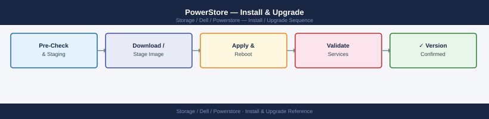

---
tags:
  - dell
  - operations
---
# PowerStore — Install & Upgrade


<div class="kb-summary">
Install & Upgrade reference covering Initial Setup, Software Upgrade, Appliance Lifecycle.

*Applies to: PowerStore 3.x*
</div>



## Before you begin

- **Access:** Storage admin credentials (cluster admin or equivalent)
- **Timing:** safe to run during business hours unless a step is marked ⚠ (causes interruption)
- **Dependencies:** no active upgrades or migrations on the same infrastructure
- **Logging:** capture command output — paste into the change record on completion

---

## Initial Setup

### Pre-Installation Requirements

Before racking and initialising a new PowerStore appliance:

| Requirement | Details |
|---|---|
| Rack space | 2U per appliance (standard); cable management arm optional |
| Power | Dual power feeds (A and B circuit) per PSU set |
| Management network | 1 GbE switch port (dedicated management VLAN) |
| Data network | FC: 16/32 Gb switch ports per fabric; iSCSI: 10/25/100 GbE switch ports |
| IP addresses | Management IP (floating VIP), Node A mgmt, Node B mgmt, optional iSCSI data IPs |
| DNS | Forward and reverse DNS entries for the management FQDN |
| NTP | NTP server reachable from management network |
| SMTP relay | For alert email notifications (optional but recommended) |
| Laptop / management host | For initial configuration via the PowerStore Initial Configuration wizard |

### Initial Configuration Wizard

Dell ships PowerStore with a default management IP pre-configured. Connect a laptop to the management switch and access the Initial Configuration Wizard:

1. Navigate to `https://192.168.1.20` (default initial IP — verify with the Dell shipping documentation for the specific order)
2. Log in with the default credentials (`admin` / `Password123!` — change immediately)
3. Complete the Initial Configuration Wizard:
   - Set the management FQDN and IP address
   - Configure NTP servers
   - Configure DNS servers
   - Set the admin password (minimum 12 characters, at least one uppercase, one digit, one special character)
   - Configure SupportAssist (ESRS) if permitted
   - Optional: configure SMTP for email alerts
4. After the wizard completes, the array reboots with the new management IP
5. Access the production management IP and verify the Dashboard shows all hardware healthy

### Post-Installation Baseline

Complete these steps before onboarding the first workloads:

```bash
# Verify software version
curl -k -X GET "https://<mgmt-ip>/api/rest/software_installed" \
  -H "DELL-EMC-TOKEN: <token>"

# Verify hardware health (all components should be 'OK')
curl -k -X GET "https://<mgmt-ip>/api/rest/hardware" \
  -H "DELL-EMC-TOKEN: <token>"

# Set NTP configuration (if not done in wizard)
curl -k -X POST "https://<mgmt-ip>/api/rest/ntp_server" \
  -H "DELL-EMC-TOKEN: <token>" \
  -H "Content-Type: application/json" \
  -d '{"addresses": ["192.168.1.252", "192.168.1.253"]}'

# Configure LDAP/AD authentication
# PowerStore Manager → Settings → Security → LDAP Configuration

# Register with Secure Connect Gateway for CloudIQ
# SCG web UI → Devices → Add Device → enter PowerStore management IP
```

## Software Upgrade

PowerStore software upgrades are non-disruptive to host I/O. The upgrade orchestrates a rolling restart of both nodes, maintaining continuous availability throughout.

### Upgrade Preparation

Before beginning an upgrade, complete a full pre-upgrade health check:

```bash
# 1. Verify no active alerts (clear all before upgrading)
curl -k -X GET "https://<mgmt-ip>/api/rest/alert?state=active&severity=CRITICAL" \
  -H "DELL-EMC-TOKEN: <token>"

# 2. Confirm all drives are healthy (no reconstructing or failed)
curl -k -X GET "https://<mgmt-ip>/api/rest/drive?select=name,health_state" \
  -H "DELL-EMC-TOKEN: <token>"

# 3. Confirm all replication sessions are synchronised
curl -k -X GET "https://<mgmt-ip>/api/rest/replication_session?select=name,state" \
  -H "DELL-EMC-TOKEN: <token>"

# 4. Check available capacity — upgrade staging requires temporary disk space
# Pool utilisation should be below 75% before upgrade
curl -k -X GET "https://<mgmt-ip>/api/rest/pool?select=name,percent_used" \
  -H "DELL-EMC-TOKEN: <token>"
```

**Additional pre-upgrade checks:**

- [ ] Check Dell PowerStore Interoperability Matrix for the target version against all connected components (vSphere, vCenter, SRA, Veeam)
- [ ] Review the PowerStoreOS Release Notes for the target version — note any upgrade sequencing requirements or known issues
- [ ] Take manual snapshots of critical volumes as a rollback option (snapshots are automatically taken by the upgrade process but taking manual pre-upgrade snapshots is belt-and-suspenders)
- [ ] Notify application teams of the maintenance window (even though host I/O is uninterrupted, management access may be briefly unavailable during node restart)

### PowerStoreOS Version Matrix

| From Version | To Version | Path | Notes |
|---|---|---|---|
| 3.x | 3.5.x | Direct | Single upgrade |
| 3.x | 4.x | Via 3.5.x | Must upgrade to 3.5.x first |
| 3.5.x | 4.0.x | Direct | Single upgrade |
| 4.0.x | 4.5.x | Direct | Single upgrade |
| Any version | Any version 2+ major versions ahead | Multi-hop | Follow the upgrade path in release notes |

> Always verify the specific upgrade path in the current PowerStoreOS Release Notes for the target version.

### Download and Apply the Upgrade

```bash
# Step 1: Download the upgrade package from Dell Support
# Portal: https://www.dell.com/support → Products → PowerStore → Downloads
# File: PowerStoreOS_4.5.x.x.bin (approximately 2–5 GB)

# Step 2: Upload to PowerStore via the Manager UI
# Settings → Software → Upload Software Package → browse to .bin file
# Or upload via REST API (multipart form upload)
curl -k -X POST "https://<mgmt-ip>/api/rest/software_package/upload" \
  -H "DELL-EMC-TOKEN: <token>" \
  -F "file=@/path/to/PowerStoreOS_4.5.x.x.bin"

# Step 3: Verify the package was uploaded and is valid
curl -k -X GET "https://<mgmt-ip>/api/rest/software_package" \
  -H "DELL-EMC-TOKEN: <token>"

# Step 4: Initiate the upgrade
curl -k -X POST "https://<mgmt-ip>/api/rest/software_package/<package-id>/install" \
  -H "DELL-EMC-TOKEN: <token>" \
  -H "Content-Type: application/json" \
  -d '{"appliance_ids": ["<appliance-id>"]}'
```

### Upgrade Timeline

Typical upgrade durations:

| Appliance Model | Upgrade Duration |
|---|---|
| 500T / 500X | 45–90 minutes |
| 3000T / 3000X | 60–120 minutes |
| 9000T | 90–150 minutes |
| Cluster (4 appliances) | 3–6 hours (sequential per appliance) |

During the upgrade:

- Host I/O continues uninterrupted (paths temporarily shift during node restart)
- Management UI may be briefly unavailable (2–5 minutes per node restart)
- Replication sessions automatically pause and resume
- Do not manually intervene; the upgrade orchestration handles node sequencing

### Monitor Upgrade Progress

```bash
# Poll upgrade job status (run every few minutes during upgrade)
curl -k -X GET "https://<mgmt-ip>/api/rest/job?type=upgrade&state=running" \
  -H "DELL-EMC-TOKEN: <token>"

# Alternatively, monitor via PowerStore Manager
# Settings → Software → Current Upgrade → shows percentage complete and current step
```

### Post-Upgrade Validation

```bash
# 1. Confirm new software version is running
curl -k -X GET "https://<mgmt-ip>/api/rest/software_installed" \
  -H "DELL-EMC-TOKEN: <token>"

# 2. Check for new alerts introduced by the upgrade
curl -k -X GET "https://<mgmt-ip>/api/rest/alert?state=active" \
  -H "DELL-EMC-TOKEN: <token>"

# 3. Verify replication sessions resumed
curl -k -X GET "https://<mgmt-ip>/api/rest/replication_session?select=name,state" \
  -H "DELL-EMC-TOKEN: <token>"

# 4. Verify host I/O paths are healthy on all hosts
# ESXi: esxcli storage nmp device list | grep PathSelectionPolicy
# Linux: multipath -ll | grep status

# 5. Verify CloudIQ is still receiving telemetry
# Log into cloudiq.dell.com; confirm system health score is visible
```

## Appliance Lifecycle

### Adding a Second Appliance to a Cluster (PowerStore T only)

```bash
# Step 1: Rack and cable the new appliance
# Step 2: Complete the Initial Configuration Wizard on the new appliance
# Step 3: Join the new appliance to the existing cluster
# PowerStore Manager → Settings → Appliances → Add Appliance → enter management IP of new appliance
# Or via REST API:
curl -k -X POST "https://<mgmt-ip>/api/rest/appliance/join" \
  -H "DELL-EMC-TOKEN: <token>" \
  -H "Content-Type: application/json" \
  -d '{"management_address": "<new-appliance-mgmt-ip>"}'
```

After joining, the new appliance appears in the cluster and its capacity is immediately available. Existing volumes can be migrated to the new appliance non-disruptively via the Data Migration feature in PowerStore Manager.

### Decommissioning an Appliance

Before decommissioning:

1. Migrate all volumes off the appliance being removed (PowerStore Manager → Storage → Migrate)
2. Confirm no volumes or NAS servers remain on the appliance
3. Remove the appliance from the cluster via PowerStore Manager → Settings → Appliances → Remove
4. Wipe the appliance before physical disposal (Dell provides a Secure Erase option under Settings → Security → Secure Erase)

### Drive Replacement

PowerStore drives are hot-swappable. When a drive failure alert fires:

1. Confirm the failed drive slot in PowerStore Manager → Hardware → Drives
2. Engage Dell Support for a replacement drive if under ProSupport
3. Remove the failed drive (the drive slot LED will be lit amber to identify it)
4. Insert the replacement drive; reconstruction begins automatically
5. Monitor reconstruction progress in PowerStore Manager → Hardware → Drives (state will show `reconstructing` then return to `healthy`)

Reconstruction time: approximately 1 hour per TB under moderate workload. During reconstruction, the pool remains operational but with reduced fault tolerance.

---

## Verify

- Confirm the operation completed without errors in the log or management UI
- Verify the expected state change is visible (service running, object created, config applied)
- Document the outcome in the change record

---

## See also

- [Powerstore — Procedures](procedures/)
- [Powerstore — Health Checks](health-checks/)
- [Powerstore — Deploy](../deploy/)
