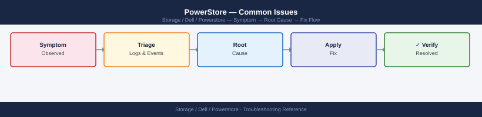
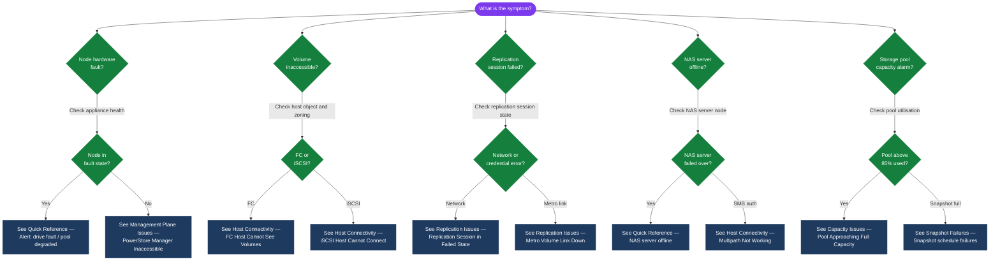

---
tags:
  - dell
  - troubleshooting
search:
  boost: 1.5
---
# PowerStore — Common Issues


<div class="kb-summary">
Common Issues reference covering Quick Reference, Host Connectivity Issues, Replication Issues, Performance Issues, Capacity Issues and 2 more sections.

*Applies to: PowerStore 3.x*
</div>



## Diagnostic Flow



---

## Before you begin

- **Access:** Storage admin credentials (cluster admin or equivalent)
- **Gather first:** recent error message text, event timestamps, and affected object names
- **Scope:** confirm whether the issue affects a single object, host, cluster, or site
- **Escalation:** open a vendor support ticket before running any destructive step
- **Logging:** document each command and output — required if escalation is needed

---

## Quick Reference

| Symptom | Likely Cause | First Action |
|---|---|---|
| Host cannot see volumes after provisioning | Host object has wrong initiators, or zoning is incomplete | Verify initiators; check SAN zone; rescan storage on host |
| Replication session shows `Failed` state | Network connectivity lost to remote system, or auth failure | Check WAN/firewall; verify remote system credentials; check replication port 443 |
| Volume snapshot failed | Pool capacity above 90%; or too many concurrent snapshots | Check pool utilisation; reduce snapshot frequency; expand capacity |
| NAS server offline | Node fault; NAS server auto-failed-over | Check node health; confirm NAS server current node |
| Metro Volume link down | Inter-site network loss; mediator unreachable | Check inter-site network; check mediator VM status; be prepared to promote secondary |
| PowerStore Manager inaccessible | Management node restart; certificate error; network issue | Try the peer node management IP; check network connectivity |
| Alert: drive fault | NVMe SSD failure | Confirm in hardware view; open Dell case for drive replacement |
| Alert: pool degraded | Drive failure or reconstruction in progress | Check drive health; monitor reconstruction; verify pool state |
| Performance degradation | Workload spike; workload imbalance; DRR inefficiency | Check performance metrics; review per-volume IOPS/latency; check if deduplication is being bypassed |
| iSCSI sessions not connecting | iSCSI network not reachable; CHAP credentials mismatch | Check iSCSI VLAN; verify CHAP credentials match both sides |
| Certificate expired | Management certificate past expiry | Renew and import certificate; see [Encryption](../security/encryption/index.md) |
| SupportAssist shows disconnected | Proxy blocking outbound HTTPS; ESRS service down | Check proxy for `esrs3.emc.com:443`; restart SupportAssist from Manager UI |

## Host Connectivity Issues

### FC Host Cannot See Volumes

```bash
# Step 1: Verify the host object has the correct initiator WWNs
curl -k -X GET "https://<mgmt-ip>/api/rest/host_initiator?host_id=<host-id>&select=port_name,port_type" \
  -H "DELL-EMC-TOKEN: <token>"

# Compare with what the host actually reports:
# ESXi: esxcli storage core adapter list | grep fc
# Linux: cat /sys/class/fc_host/host*/port_name

# Step 2: Verify volume is mapped to the correct host or host group
curl -k -X GET "https://<mgmt-ip>/api/rest/host_volume_mapping?volume_id=<volume-id>" \
  -H "DELL-EMC-TOKEN: <token>"

# Step 3: Check SAN zoning (on the FC switch)
# Brocade: switch:admin> zoneshow | grep <host-wwn>
# Cisco MDS: switch# show zoneset active | include <host-wwn>

# Step 4: On ESXi — rescan storage after confirming zoning is correct
esxcli storage core adapter rescan --all
```

### iSCSI Host Cannot Connect

```bash
# Step 1: Verify iSCSI network reachability
ping -s 8972 -M do <powerstore-iscsi-ip>   # Jumbo frame test
# If ping fails with fragmentation needed, MTU is not consistent end-to-end

# Step 2: Discover PowerStore iSCSI targets from the host
iscsiadm -m discovery -t sendtargets -p <powerstore-iscsi-ip>

# Step 3: Verify initiator IQN matches the host object in PowerStore
cat /etc/iscsi/initiatorname.iscsi
curl -k -X GET "https://<mgmt-ip>/api/rest/host_initiator?host_id=<host-id>&select=port_name" \
  -H "DELL-EMC-TOKEN: <token>"

# Step 4: Check CHAP credentials (if configured)
# Mismatch is a common cause of iSCSI session failure
iscsiadm -m session -P 3 | grep -i chap

# Step 5: Rescan iSCSI sessions after fixing the issue
iscsiadm -m session --rescan
```

### Multipath Not Working (Linux)

```bash
# Verify multipathd is running
systemctl status multipathd

# Show multipath device topology
multipath -ll

# If a path is shown as 'faulty' or 'ghost', investigate the specific path:
# - FC: check the zone for that fabric; check the target port health
# - iSCSI: check network connectivity on that iSCSI VLAN

# Check for DM-Multipath configuration matching PowerStore vendor string
grep -A 5 'DELL' /etc/multipath.conf

# Reload multipath configuration after changes
systemctl reload multipathd
```

## Replication Issues

### Replication Session in `Failed` State

```bash
# Get the replication session details and error
curl -k -X GET "https://<mgmt-ip>/api/rest/replication_session/<session-id>?select=name,state,last_sync_time,failed_reason" \
  -H "DELL-EMC-TOKEN: <token>"

# Check network connectivity to the remote system
curl -k -X GET "https://<mgmt-ip>/api/rest/remote_system?select=name,management_address,replication_interfaces" \
  -H "DELL-EMC-TOKEN: <token>"

# Test connectivity from the PowerStore to the remote management IP
# (this must be done from the PowerStore node — initiate a ping test via Manager UI or support)
# PowerStore Manager → Settings → Connectivity → Test → Remote System → Ping

# Common causes:
# - Firewall blocking port 443 between the two PowerStore management IPs
# - Remote PowerStore has had a password change and the remote system credentials need updating
# - WAN link failure between sites

# Update remote system credentials if they have changed
curl -k -X PATCH "https://<mgmt-ip>/api/rest/remote_system/<remote-id>" \
  -H "DELL-EMC-TOKEN: <token>" \
  -H "Content-Type: application/json" \
  -d '{"password": "<new-remote-admin-password>"}'

# Resume the session after fixing connectivity
curl -k -X POST "https://<mgmt-ip>/api/rest/replication_session/<session-id>/resume" \
  -H "DELL-EMC-TOKEN: <token>"
```

### Metro Volume Link Down

```bash
# Check Metro Volume session state
curl -k -X GET "https://<mgmt-ip>/api/rest/replication_session?select=name,state,sync_state" \
  -H "DELL-EMC-TOKEN: <token>"

# Expected states during failure:
# state=Paused, sync_state=Unknown → site partition — both sites waiting for mediator verdict

# Check mediator reachability from both sites
# Mediator port: TCP 6666
nc -zv <mediator-ip> 6666   # Run from both sites

# If mediator is unreachable from both sites:
# DO NOT manually promote — both sites may attempt to resume simultaneously causing a split-brain
# Resolve network issue first, or contact Dell Support

# If mediator is reachable from only one site:
# The mediator will promote that site automatically
# If automatic promotion has not occurred within 5 minutes, check mediator VM health

# Manual promotion (only if mediator is not performing automatic failover):
# On the surviving secondary PowerStore:
curl -k -X POST "https://<secondary-mgmt-ip>/api/rest/replication_session/<session-id>/promote" \
  -H "DELL-EMC-TOKEN: <token>"
```

## Performance Issues

### High Latency

```bash
# Get per-volume performance metrics via REST API
curl -k -X GET "https://<mgmt-ip>/api/rest/volume/<volume-id>/query_metrics" \
  -H "DELL-EMC-TOKEN: <token>" \
  -H "Content-Type: application/json" \
  -d '{
    "entity": "volume",
    "entity_id": "<volume-id>",
    "metrics": ["avg_latency", "read_iops", "write_iops", "read_bandwidth", "write_bandwidth"],
    "interval": "last_1_hour"
  }'

# Check if the pool is oversubscribed
curl -k -X GET "https://<mgmt-ip>/api/rest/pool?select=name,percent_used,size_used,size_total" \
  -H "DELL-EMC-TOKEN: <token>"

# Common causes of high latency:
# - Pool utilisation above 85% (write performance degrades as pool fills)
# - NVDIMM destage backpressure (check for 'destage' related alerts)
# - Workload spike (identify the top I/O consuming volumes)
# - Deduplication disabled for a workload that would benefit from it
```

### Data Reduction Ratio Below Expectation

```bash
# Check DRR per volume group
curl -k -X GET "https://<mgmt-ip>/api/rest/volume_group?select=name,data_reduction_ratio" \
  -H "DELL-EMC-TOKEN: <token>"

# Common causes:
# - Volume is storing pre-encrypted data (backup data, DB with TDE)
# - Volume is storing pre-compressed media (video, compressed archives)
# - Volume has deduplication explicitly disabled

# Check if deduplication is disabled for a volume group
curl -k -X GET "https://<mgmt-ip>/api/rest/volume_group/<vg-id>?select=name,is_replication_destination,protection_policy_id" \
  -H "DELL-EMC-TOKEN: <token>"
```

## Capacity Issues

### Pool Approaching Full Capacity

```bash
# Identify the most space-consuming volumes
curl -k -X GET "https://<mgmt-ip>/api/rest/volume?select=name,size,size_used,type&order=size_used desc&limit=20" \
  -H "DELL-EMC-TOKEN: <token>"

# Check for large manual snapshots consuming space
curl -k -X GET "https://<mgmt-ip>/api/rest/volume_snapshot?select=name,size,creation_timestamp&order=size desc&limit=20" \
  -H "DELL-EMC-TOKEN: <token>"

# Emergency options if pool is critically full (above 90%):
# 1. Delete unnecessary manual snapshots
# 2. Delete unused cloned volumes
# 3. Reclaim space from over-provisioned thin volumes (host-side: zero the free space; let array dedup/compress)
# 4. Expand the pool by adding drive enclosures (requires hardware; schedule with Dell)
# 5. Migrate volumes to a less-full pool or appliance (if cluster has multiple appliances)
```

## Snapshot Failures

```bash
# Check for snapshot schedule failures
curl -k -X GET "https://<mgmt-ip>/api/rest/job?type=snapshot&state=failed&order=start_time desc&limit=10" \
  -H "DELL-EMC-TOKEN: <token>"

# Common causes:
# - Pool utilisation above the snapshot reserve threshold
# - Too many concurrent snapshot jobs (schedule conflict)
# - Protection policy misconfigured

# Check snapshot count per volume (too many snapshots can slow performance)
curl -k -X GET "https://<mgmt-ip>/api/rest/volume_snapshot?select=volume_id&volume_id=<volume-id>" \
  -H "DELL-EMC-TOKEN: <token>" | python3 -c "import sys,json; print(len(json.load(sys.stdin)))"
# If snapshot count is very high (>100 per volume), review retention policy
```

## Management Plane Issues

### PowerStore Manager Inaccessible

1. Try the alternate management IP (if cluster has multiple appliances)
2. Try the direct node management IP for Node A and Node B individually
3. Check if HTTPS port 443 is reachable: `nc -zv <mgmt-ip> 443`
4. If the management node is restarting (e.g., post-upgrade), wait 5 minutes and retry
5. Check the SupportAssist call-home — if the array has triggered an alert, Dell may already be aware

### REST API Returns 401 Unauthorized

```bash
# Common causes:
# - Token has expired (sessions expire after idle timeout)
# - Wrong credentials
# - Account is locked out

# Check if the account is locked (too many failed attempts)
curl -k -X GET "https://<mgmt-ip>/api/rest/user/local?select=name,is_locked" \
  -H "DELL-EMC-TOKEN: <admin-token>"

# Unlock a locked account
curl -k -X PATCH "https://<mgmt-ip>/api/rest/user/local/<user-id>" \
  -H "DELL-EMC-TOKEN: <admin-token>" \
  -H "Content-Type: application/json" \
  -d '{"lock_status": "Unlocked"}'

# Re-authenticate to get a fresh token
TOKEN=$(curl -ks -X POST "https://<mgmt-ip>/api/rest/login_session" \
  -H "Content-Type: application/json" \
  -d '{"username":"admin","password":"<password>"}' \
  | jq -r '.token')
```

---

## Verify resolution

- Confirm the original symptom no longer occurs
- Check logs for any residual errors related to the issue
- Monitor for 10–15 minutes to confirm the fix is stable

---

## See also

- [Powerstore — Diagnostics](diagnostics/)
- [Powerstore — Escalation](escalation/)
- [Powerstore — Health Checks](../operations/health-checks/)
