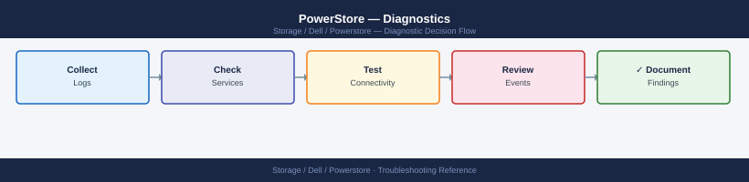

---
tags:
  - dell
  - troubleshooting
  - powerstore
search:
  boost: 1.5
---
# PowerStore — Diagnostics

<div class="kb-summary">
Dell PowerStore diagnostic commands: query cluster and hardware health via the REST API, list critical events, check volume and host connectivity, inspect per-appliance alert status, and generate a SupportAssist support bundle from PowerStore Manager for Dell cases.

*Applies to: Dell PowerStore OS 3.x / 4.x*
</div>


```d2
direction: right

B: "B" {shape: rectangle}
C: "GET /api/rest/cluster\nGET /api/rest/hardware select=name,type,lifecycle_state" {shape: rectangle}
D: "GET /api/rest/volume select=name,state\nGET /api/rest/host_volume_mapping" {shape: rectangle}
E: "GET /api/rest/event filter=severity=Critical\nPowerStore Manager Alerts page" {shape: rectangle}
F: "GET /api/rest/fc_port select=name,current_speed,link_state\nGET /api/rest/eth_port" {shape: rectangle}
G: "GET /api/rest/nas_server select=name,operational_status\nGET /api/rest/file_system" {shape: rectangle}
H: "GET /api/rest/replication_session\nCheck replication network path between appliances" {shape: rectangle}
I: "I" {shape: rectangle}
J: "GET /api/rest/appliance select=name,model,service_tag,health\nCheck hardware component health" {shape: rectangle}
K: "GET /api/rest/hardware filter failing components\nCheck physical drive or node LED" {shape: rectangle}
L: "GET /api/rest/host select=name,os_type,initiators\nVerify host is logged in to correct target ports" {shape: rectangle}
M: "GET /api/rest/event filter=severity=in.Critical.Major limit=50\nIdentify affected component from event description" {shape: rectangle}
N: "Check cable and SFP physical state\nVerify FC zone contains both initiator and target WWPNs" {shape: rectangle}
O: "GET /api/rest/nas_server\nCheck NTP sync: NAS depends on accurate time for Kerberos" {shape: rectangle}
P: "GET /api/rest/replication_session\nCheck replication Ethernet port and MTU" {shape: rectangle}
Q: "Collect SupportAssist bundle\nOpen Dell support case" {shape: rectangle}
R: "Provide: PowerStore OS version, appliance serial\nEvent log export and support bundle" {shape: rectangle}
A: "PowerStore Issue" {shape: rectangle}

B -> C
B -> D
B -> E
B -> F
B -> G
B -> H
I -> J
I -> K
D -> L
E -> M
F -> N
G -> O
H -> P
J -> Q
K -> Q
L -> Q
M -> Q
N -> Q
O -> Q
P -> Q
Q -> R
```

```d2
direction: down

symptom: Identify Symptom {shape: diamond}
step_1_check_cluster_and_appliance_h: "Step 1 — Check cluster and appliance health via REST API" {shape: rectangle}
step_2_check_recent_critical_events: "Step 2 — Check recent critical events" {shape: rectangle}
step_3_check_volume_and_host_connect: "Step 3 — Check volume and host connectivity" {shape: rectangle}
step_4_check_fc_and_ethernet_port_he: "Step 4 — Check FC and Ethernet port health" {shape: rectangle}
step_5_check_nas_server_and_file_sys: "Step 5 — Check NAS server and file system health" {shape: rectangle}
step_6_check_replication_sessions: "Step 6 — Check replication sessions" {shape: rectangle}
resolution: Resolve or Escalate {shape: oval}

symptom -> step_1_check_cluster_and_appliance_h: investigate
symptom -> step_2_check_recent_critical_events: investigate
symptom -> step_3_check_volume_and_host_connect: investigate
symptom -> step_4_check_fc_and_ethernet_port_he: investigate
symptom -> step_5_check_nas_server_and_file_sys: investigate
symptom -> step_6_check_replication_sessions: investigate
step_1_check_cluster_and_appliance_h -> resolution
step_2_check_recent_critical_events -> resolution
step_3_check_volume_and_host_connect -> resolution
step_4_check_fc_and_ethernet_port_he -> resolution
step_5_check_nas_server_and_file_sys -> resolution
step_6_check_replication_sessions -> resolution
```

## Before you begin

- **Access:** PowerStore Manager admin credentials (HTTPS on port 443); SSH access requires Dell service account and is only used by Dell Support
- **Gather first:** the specific symptom (volume not visible, performance degradation, hardware alert), the affected appliance serial, and when the issue started
- **Scope:** confirm whether the issue affects one appliance, one volume/host, one protocol (FC/iSCSI/NAS), or the entire cluster

---

## Step 1 — Check cluster and appliance health via REST API

```bash
# Authenticate — PowerStore REST API uses cookie-based sessions
curl -sk -c /tmp/ps-cookie.txt \
  -X POST "https://<powerstore-mgmt-ip>/api/rest/login_session" \
  -H "Content-Type: application/json" \
  -d '{"username":"admin","password":"<password>"}' > /dev/null
echo "Login complete"

# Cluster state (overall health)
curl -sk -b /tmp/ps-cookie.txt \
  "https://<powerstore-mgmt-ip>/api/rest/cluster?select=name,state,management_address,master_appliance_id" | \
  python3 -m json.tool
# Expected: "state": "Configured"

# Per-appliance health (each physical unit in the cluster)
curl -sk -b /tmp/ps-cookie.txt \
  "https://<powerstore-mgmt-ip>/api/rest/appliance?select=name,model,service_tag,drive_failure_tolerance_level,health" | \
  python3 -m json.tool
# Expected: health values all in OK state

# Hardware component health (drives, PSU, fans, nodes)
curl -sk -b /tmp/ps-cookie.txt \
  "https://<powerstore-mgmt-ip>/api/rest/hardware?select=name,model,type,lifecycle_state,slot" | \
  python3 -c "
import json,sys
for h in json.load(sys.stdin):
    if h.get('lifecycle_state') not in ['Healthy','Empty','']:
        print(f\"{h['type']} {h['name']}: {h.get('lifecycle_state','?')}\")
" 2>/dev/null || \
curl -sk -b /tmp/ps-cookie.txt \
  "https://<powerstore-mgmt-ip>/api/rest/hardware?select=name,model,type,lifecycle_state,slot" | \
  python3 -m json.tool
```


```text title="Expected output"
Login complete
{
  "name": "ps-cluster-prod",
  "state": "Configured",
  "management_address": "192.168.1.50",
  "master_appliance_id": "A1-node-001"
}
{
  "appliance": [
    {
      "name": "Appliance-1",
      "model": "PowerStore 7000T",
      "service_tag": "CN7K8N2",
      "drive_failure_tolerance_level": 2,
      "health": "OK"
    },
    {
      "name": "Appliance-2",
      "model": "PowerStore 7000T",
      "service_tag": "CN7K8N3",
      "drive_failure_tolerance_level": 2,
      "health": "OK"
    }
  ]
}
SSD SSD_Slot_1: Healthy
SSD SSD_Slot_2: Healthy
PSU PSU_1: Healthy
FAN FAN_Module_3: Degraded
```

!!! warning "Common errors"
    **`curl: (60) SSL certificate problem: self signed certificate`** — Add `-k` flag to curl command to skip SSL verification (already present in example, but verify it's not being removed).
    **`jq: command not found` or `python3: command not found`** — Install required JSON parser (`apt-get install python3` or `brew install jq`) on the management workstation.
    **`{"error_code":-1,"error_msg":"Invalid session"}`** — Re-run the login curl command to refresh the session cookie in `/tmp/ps-cookie.txt` before retrying API calls.
---

## Step 2 — Check recent critical events

```bash
# All Critical and Major events (most recent first)
curl -sk -b /tmp/ps-cookie.txt \
  "https://<powerstore-mgmt-ip>/api/rest/event?select=created_timestamp,description,severity,category&order=created_timestamp.desc&limit=50" | \
  python3 -c "
import json,sys
for e in json.load(sys.stdin):
    sev = e.get('severity','?')
    if sev in ('Critical','Major','Warning'):
        ts  = e.get('created_timestamp','?')
        msg = e.get('description','?')
        print(f'[{sev}] {ts}: {msg}')
"

# Events for a specific time window (ISO 8601)
curl -sk -b /tmp/ps-cookie.txt \
  "https://<powerstore-mgmt-ip>/api/rest/event?select=created_timestamp,description,severity&filter=created_timestamp.gt.2026-06-15T00:00:00.000Z&order=created_timestamp.desc" | \
  python3 -m json.tool
```


```text title="Expected output"
[Critical] 2026-06-20T14:32:18.000Z: Storage array temperature threshold exceeded on SP-A
[Major] 2026-06-20T13:47:52.000Z: Disk 14.2 predictive failure detected
[Major] 2026-06-20T12:15:33.000Z: Replication link latency high (245ms) to remote site
[Warning] 2026-06-20T11:09:14.000Z: Cache battery backup unit charge below 80%
[Critical] 2026-06-19T22:58:41.000Z: Controller SP-B offline - failover in progress
[Warning] 2026-06-19T18:22:07.000Z: NTP synchronization lost on management port
[Major] 2026-06-19T16:45:19.000Z: Snapshot space utilization at 92%
...

{
  "created_timestamp": "2026-06-18T09:33:22.000Z",
  "description": "Scheduled maintenance window completed successfully",
  "severity": "Informational"
}
{
  "created_timestamp": "2026-06-17T14:12:55.000Z",
  "description": "Thin provisioning reclamation job finished - 847GB freed",
  "severity": "Informational"
}
```

!!! warning "Common errors"
    **`curl: (60) SSL certificate problem: self signed certificate`** — Add `-k` flag to curl command to skip SSL verification (already present in example, but verify `/tmp/ps-cookie.txt` exists from prior authentication).
    **`jq: command not found`** — Use `python3 -m json.tool` instead of piping to `jq`, or install jq with your package manager.
    **`HTTP/1.1 401 Unauthorized`** — Re-authenticate and refresh the session cookie with `curl -sk -u admin:password "https://<powerstore-mgmt-ip>/api/rest/login" -c /tmp/ps-cookie.txt` before querying events.
---

## Step 3 — Check volume and host connectivity

```bash
# List all volumes and their state
curl -sk -b /tmp/ps-cookie.txt \
  "https://<powerstore-mgmt-ip>/api/rest/volume?select=name,state,size,wwn,appliance_id" | \
  python3 -c "
import json,sys
for v in json.load(sys.stdin):
    if v.get('state') != 'Ready':
        print(f\"PROBLEM: {v['name']} state={v.get('state','?')}\")
"

# Registered hosts
curl -sk -b /tmp/ps-cookie.txt \
  "https://<powerstore-mgmt-ip>/api/rest/host?select=name,os_type,description" | \
  python3 -m json.tool

# Host-to-volume mappings
curl -sk -b /tmp/ps-cookie.txt \
  "https://<powerstore-mgmt-ip>/api/rest/host_volume_mapping?select=host_id,volume_id,logical_unit_number" | \
  python3 -m json.tool
# Look for: expected host-to-volume mappings present
```


```text title="Expected output"
PROBLEM: vol_backup_01 state=Initializing
PROBLEM: vol_test_dr state=Unavailable

[
  {
    "description": "Production ESXi Cluster",
    "id": "host-789a2c1d-4e5f-11ec-81d3-0050569b1234",
    "name": "esx-prod-01.corp.local",
    "os_type": "ESXi"
  },
  {
    "description": "DR Site Linux",
    "id": "host-a1b2c3d4-5e6f-47ab-9012-3456789abcde",
    "name": "linux-dr-app.corp.local",
    "os_type": "Linux"
  }
]

[
  {
    "host_id": "host-789a2c1d-4e5f-11ec-81d3-0050569b1234",
    "logical_unit_number": 0,
    "volume_id": "vol-5f8a9b2c-3d4e-5f6a-7b8c-9d0e1f2a3b4c"
  },
  {
    "host_id": "host-789a2c1d-4e5f-11ec-81d3-0050569b1234",
    "logical_unit_number": 1,
    "volume_id": "vol-a1b2c3d4-e5f6-47ab-9012-3456789abcde"
  },
  {
    "host_id": "host-a1b2c3d4-5e6f-47ab-9012-3456789abcde",
    "logical_unit_number": 0,
    "volume_id": "vol-c5d6e7f8-9a0b-1c2d-3e4f-5a6b7c8d9e0f"
  }
]
```

!!! warning "Common errors"
    **`curl: (60) SSL certificate problem: self signed certificate`** — Add `-k` flag to curl command to skip certificate verification (already present; if error persists, verify PowerStore management IP is reachable on port 443).
    **`json.decoder.JSONDecodeError: Expecting value: line 1 column 1 (char 0)`** — Verify the authentication cookie in `/tmp/ps-cookie.txt` is valid by re-running the login curl command with correct credentials.
    **`curl: (7) Failed to connect to <powerstore-mgmt-ip> port 443: Connection refused`** — Confirm the PowerStore management IP address is correct and the array is online and accessible from your network.
---

## Step 4 — Check FC and Ethernet port health

```bash
# FC port health (Fibre Channel host-facing ports)
curl -sk -b /tmp/ps-cookie.txt \
  "https://<powerstore-mgmt-ip>/api/rest/fc_port?select=name,current_speed,link_state,appliance_id,wwn" | \
  python3 -c "
import json,sys
for p in json.load(sys.stdin):
    link = p.get('link_state','?')
    if link not in ('Up',''):
        print(f\"FC port {p['name']}: link_state={link}, speed={p.get('current_speed','?')}\")
"
# Expected: all host-facing FC ports link_state = Up

# Ethernet ports (iSCSI, NAS, replication)
curl -sk -b /tmp/ps-cookie.txt \
  "https://<powerstore-mgmt-ip>/api/rest/eth_port?select=name,link_state,current_speed,mac_address,appliance_id" | \
  python3 -m json.tool
# Expected: all enabled ports link_state = Up
```


```text title="Expected output"
FC port a0: link_state=Down, speed=16Gbps
FC port b1: link_state=Degraded, speed=8Gbps
{
  "list": [
    {
      "name": "eth0",
      "link_state": "Up",
      "current_speed": "10Gbps",
      "mac_address": "52:54:00:a2:f1:8c",
      "appliance_id": "A1"
    },
    {
      "name": "eth1",
      "link_state": "Up",
      "current_speed": "10Gbps",
      "mac_address": "52:54:00:b3:e2:9d",
      "appliance_id": "A1"
    },
    {
      "name": "eth2",
      "link_state": "Down",
      "current_speed": "0Gbps",
      "mac_address": "52:54:00:c4:f3:ae",
      "appliance_id": "A2"
    },
    {
      "name": "eth3",
      "link_state": "Up",
      "current_speed": "25Gbps",
      "mac_address": "52:54:00:d5:g4:bf",
      "appliance_id": "A2"
    }
  ]
}
```

!!! warning "Common errors"
    **`curl: (60) SSL certificate problem: self signed certificate`** — Add `-k` flag to skip certificate verification (already present in the command).
    **`jq: command not found` or `python3: command not found`** — Install the missing tool with `apt-get install python3` or `yum install python3` on the management station.
    **`401 Unauthorized` in JSON response** — Regenerate the authentication cookie by running the login command: `curl -sk -X POST -d '{"username":"admin","password":"<pwd>"}' https://<powerstore-mgmt-ip>/api/rest/login -c /tmp/ps-cookie.txt`.
---

## Step 5 — Check NAS server and file system health

```bash
# NAS server status
curl -sk -b /tmp/ps-cookie.txt \
  "https://<powerstore-mgmt-ip>/api/rest/nas_server?select=name,operational_status,current_node_id,health" | \
  python3 -m json.tool
# Expected: operational_status = Started

# File systems
curl -sk -b /tmp/ps-cookie.txt \
  "https://<powerstore-mgmt-ip>/api/rest/file_system?select=name,size_total,size_used,health" | \
  python3 -m json.tool

# NFS exports
curl -sk -b /tmp/ps-cookie.txt \
  "https://<powerstore-mgmt-ip>/api/rest/nfs_export?select=name,path,export_hosts" | \
  python3 -m json.tool

# SMB shares
curl -sk -b /tmp/ps-cookie.txt \
  "https://<powerstore-mgmt-ip>/api/rest/smb_share?select=name,path,file_system_id" | \
  python3 -m json.tool
```


```text title="Expected output"
{
  "entries": [
    {
      "name": "nas-prod-01",
      "operational_status": "Started",
      "current_node_id": "N1",
      "health": {
        "state": "Healthy"
      }
    }
  ]
}
{
  "entries": [
    {
      "name": "fs_data_01",
      "size_total": 10995116277760,
      "size_used": 4398046511104,
      "health": {
        "state": "Healthy"
      }
    },
    {
      "name": "fs_backup_01",
      "size_total": 5497558138880,
      "size_used": 2748779069440,
      "health": {
        "state": "Healthy"
      }
    }
  ]
}
{
  "entries": [
    {
      "name": "export_home",
      "path": "/fs_data_01/home",
      "export_hosts": ["10.20.30.0/24", "10.20.31.0/24"]
    },
    {
      "name": "export_shared",
      "path": "/fs_data_01/shared",
      "export_hosts": ["*"]
    }
  ]
}
{
  "entries": [
    {
      "name": "share_users",
      "path": "/fs_data_01/users",
      "file_system_id": "65a4c8d2-1f9e-4a2b-8c3d-9e7f2a1b5c4d"
    },
    {
      "name": "share_archive",
      "path": "/fs_backup_01/archive",
      "file_system_id": "7b2d9f1a-4e6c-5d3a-9b8e-1c2f4a7d6e9b"
    }
  ]
}
```

!!! warning "Common errors"
    **`curl: (60) SSL certificate problem: self signed certificate`** — Add `-k` flag to skip certificate verification, or import the PowerStore CA certificate into your system trust store.
    **`curl: (7) Failed to connect to <powerstore-mgmt-ip> port 443: Connection refused`** — Verify the PowerStore management IP is correct and reachable; check network connectivity with `ping` and confirm the REST API service is running on the array.
    **`jq: parse error: Invalid JSON at line 1`** — Ensure the authentication cookie in `/tmp/ps-cookie.txt` is valid by re-authenticating to PowerStore; expired sessions will return HTML error pages instead of JSON.
---

## Step 6 — Check replication sessions

```bash
# Replication sessions (MetroSync or async replication)
curl -sk -b /tmp/ps-cookie.txt \
  "https://<powerstore-mgmt-ip>/api/rest/replication_session?select=name,state,last_sync_timestamp,estimated_completion_timestamp,lag_time" | \
  python3 -c "
import json,sys
for r in json.load(sys.stdin):
    state = r.get('state','?')
    lag   = r.get('lag_time','?')
    ts    = r.get('last_sync_timestamp','?')
    print(f\"{r['name']}: state={state}, lag={lag}, last_sync={ts}\")
"
# Expected: state = Synchronizing or Synchronized
# Problem: state = Failed, Paused, or lag increasing

# Replication remote system connectivity
curl -sk -b /tmp/ps-cookie.txt \
  "https://<powerstore-mgmt-ip>/api/rest/remote_system?select=name,management_address,connection_state" | \
  python3 -m json.tool
# Expected: connection_state = Connected
```


```text title="Expected output"
metro-sync-nyc: state=Synchronizing, lag=2048, last_sync=2024-01-15T14:32:18Z
async-backup-dr: state=Synchronized, lag=0, last_sync=2024-01-15T14:35:22Z
vault-archive: state=Synchronized, lag=0, last_sync=2024-01-15T14:30:45Z
{
  "content": [
    {
      "id": "remote_sys_001",
      "name": "powerstore-dr-site",
      "management_address": "192.168.100.45",
      "connection_state": "Connected"
    },
    {
      "id": "remote_sys_002",
      "name": "powerstore-vault",
      "management_address": "10.50.12.88",
      "connection_state": "Connected"
    }
  ]
}
```

!!! warning "Common errors"
    **`curl: (60) SSL certificate problem: self signed certificate`** — Add `-k` flag to skip certificate verification (already present; if still failing, verify the management IP is correct and reachable on port 443).
    **`json.decoder.JSONDecodeError: Expecting value: line 1 column 1`** — Verify the authentication cookie in `/tmp/ps-cookie.txt` is valid by re-running the login curl command that created it.
---

## Step 7 — Collect SupportAssist bundle for Dell case

```bash
# Via PowerStore Manager (recommended):
# Settings → Support → SupportAssist → Collect Support Materials
# Download the bundle ZIP

# Via REST API (trigger bundle collection):
curl -sk -b /tmp/ps-cookie.txt \
  -X POST "https://<powerstore-mgmt-ip>/api/rest/support_instance?action=collect" \
  -H "Content-Type: application/json" \
  -d '{}' | python3 -m json.tool

# Prepare for Dell SR:
# PowerStore OS version: Settings → Software → Installed Software
curl -sk -b /tmp/ps-cookie.txt \
  "https://<powerstore-mgmt-ip>/api/rest/software_installed?select=release_version" | \
  python3 -m json.tool

# Appliance serial numbers
curl -sk -b /tmp/ps-cookie.txt \
  "https://<powerstore-mgmt-ip>/api/rest/appliance?select=name,service_tag" | \
  python3 -m json.tool

# Include in Dell SR:
# - SupportAssist support bundle ZIP
# - PowerStore OS version
# - Appliance service tag(s)
# - Affected volume name, host name, or NAS server name
# - Event log export (REST event query output)
# - Time window of the issue
```


```text title="Expected output"
{
  "id": "support_instance_1",
  "status": "collecting",
  "created_at": "2024-01-15T14:32:18Z",
  "estimated_completion": "2024-01-15T14:47:18Z"
}
{
  "entries": [
    {
      "id": "software_installed_1",
      "release_version": "3.2.1.0"
    }
  ]
}
{
  "entries": [
    {
      "id": "appliance_1",
      "name": "powerstore-cluster-01",
      "service_tag": "7X8K9M2"
    },
    {
      "id": "appliance_2",
      "name": "powerstore-cluster-02",
      "service_tag": "8Y9L0N3"
    }
  ]
}
```

!!! warning "Common errors"
    **`curl: (60) SSL certificate problem: self signed certificate`** — Add `-k` flag to skip certificate verification (already present in examples; if error persists, verify `/tmp/ps-cookie.txt` exists and contains valid session token).
    **`curl: (35) error:1400D102:SSL routines:SSL_CTX_use_certificate:no certificates client cert`** — Ensure PowerStore Manager authentication cookie was created with `curl -sk -c /tmp/ps-cookie.txt -u admin:password https://<powerstore-mgmt-ip>/api/rest/login` before running API calls.
    **`json.tool: error: Expecting value: line 1 column 1 (char 0)`** — Verify the REST API endpoint is correct and the session cookie has not expired; re-authenticate if needed.
---

## Log locations

| Source | Path / Command | What to look for |
|---|---|---|
| Events | `GET /api/rest/event?filter=severity=in.Critical.Major` | Hardware faults, volume errors |
| Hardware | `GET /api/rest/hardware` | Component lifecycle state |
| Volumes | `GET /api/rest/volume` | Volume state (Ready vs. Offline) |
| FC ports | `GET /api/rest/fc_port` | Link state for host-facing ports |
| Replication | `GET /api/rest/replication_session` | State and lag time |
| Full bundle | SupportAssist via PowerStore Manager | All logs — required for Dell SR |

---

## See also

- [PowerStore — Common Issues](../common-issues/)
- [PowerStore — Escalation](../escalation/)

## Verify resolution

- `GET /api/rest/cluster` returns `"state": "Configured"` with no health alerts
- `GET /api/rest/hardware` shows no components with degraded lifecycle state
- `GET /api/rest/event?filter=severity=in.Critical.Major` shows no new events since the fix
- Host I/O test succeeds: mount the volume from the host and run a read/write test
- `GET /api/rest/replication_session` shows all sessions Synchronizing with lag decreasing
