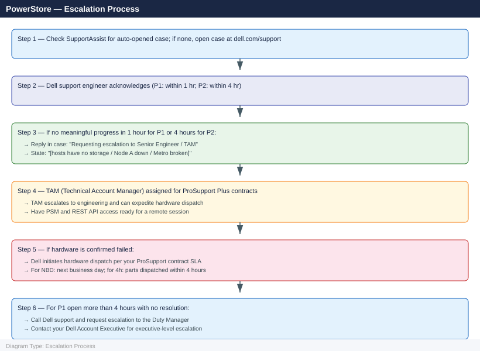

---
tags:
  - dell
  - troubleshooting
search:
  boost: 1.5
---
# PowerStore — Escalation

<div class="kb-summary">
How to escalate Dell PowerStore issues to Dell support: what data to collect, how to generate the support bundle, step-by-step case creation on the Dell portal, and the escalation path when progress stalls.

*Applies to: PowerStore 3.x*
</div>


---

```d2
direction: down

symptom: Identify Symptom {shape: diamond}
preescalation_selfcheck: "Pre-Escalation Self-Check" {shape: rectangle}
stepbystep_data_collection: "Step-by-Step Data Collection" {shape: rectangle}
how_to_open_the_sr_on_wwwdellcomsupp: "How to Open the SR on www.dell.com/support" {shape: rectangle}
escalation_path: "Escalation Path" {shape: rectangle}
what_not_to_do: "What NOT to Do" {shape: rectangle}
useful_commands_for_case_updates: "Useful Commands for Case Updates" {shape: rectangle}
resolution: Resolve or Escalate {shape: oval}

symptom -> preescalation_selfcheck: investigate
symptom -> stepbystep_data_collection: investigate
symptom -> how_to_open_the_sr_on_wwwdellcomsupp: investigate
symptom -> escalation_path: investigate
symptom -> what_not_to_do: investigate
symptom -> useful_commands_for_case_updates: investigate
preescalation_selfcheck -> resolution
stepbystep_data_collection -> resolution
how_to_open_the_sr_on_wwwdellcomsupp -> resolution
escalation_path -> resolution
what_not_to_do -> resolution
useful_commands_for_case_updates -> resolution
```

## Before you begin

- **Access required:** PowerStore Manager (PSM) admin credentials; Dell account at dell.com/support with ProSupport contract linked to the system service tag
- **Check SupportAssist first:** if SupportAssist is enabled and connected, Dell may have already automatically opened a case for qualifying hardware faults. Check **PSM → Help → My Cases** before opening a duplicate
- **Do NOT reboot a controller** without Dell guidance — in a degraded state a reboot may take the array offline. Dell support will tell you if a reboot is the right action
- **Do NOT replace failed drives** without Dell confirming the replacement sequence — pulling drives in the wrong order from a degraded RAID group can cause data loss

---

## Pre-Escalation Self-Check

Run these before opening the case.

| Check | Where to look | Expected result |
|---|---|---|
| PowerStoreOS version | PSM → Help → About | Note full version string |
| Service tag | PSM → Hardware → Appliance → Properties | 7-char tag e.g. `ABC1234` |
| Active alerts | PSM → Alerts dashboard or REST API | Review all Critical/Major alerts |
| Controller health | PSM → Hardware → Controllers | Both controllers show Online |
| Drive health | PSM → Hardware → Drives | No drives in Failed or Degraded state |
| Appliance health | PSM → Dashboard → Hardware Health | All appliances show Healthy |
| Volume health | PSM → Storage → Volumes | No volumes in Degraded state |
| SupportAssist status | PSM → Settings → Support → SupportAssist | Status: Connected |
| Existing auto-case | PSM → Help → My Cases | Check for Dell-opened case before creating new |

---

## Step-by-Step Data Collection

### 1. Get the PowerStoreOS version and service tag

In PSM: click **Help → About** and note the full PowerStoreOS version string.

Then click **Hardware → Appliance → Properties** to find the service tag. The service tag is required for all Dell support cases. If PSM is unavailable:

```bash
# PowerStore REST API — get the version (authenticated curl)
curl -k -X GET "https://<powerstore-mgmt-ip>/api/rest/software_installed" \
  -H "Authorization: Basic <base64-user:pass>"

# Get the appliance model and serial number
curl -k -X GET "https://<powerstore-mgmt-ip>/api/rest/appliance" \
  -H "Authorization: Basic <base64-user:pass>"
```


```text title="Expected output"
{
  "id": "0",
  "release_version": "3.2.1.0",
  "build_number": "7891",
  "build_date": "2024-01-15T08:32:00Z",
  "installed_date": "2024-02-10T14:22:15Z"
}
{
  "id": "A1B2C3D4E5F6",
  "name": "PowerStore-T",
  "model": "DELL EMC PowerStore T630",
  "serial_number": "PS-2024-001847",
  "service_tag": "ABC1234",
  "node_count": 3,
  "management_address": "192.168.1.50"
}
```

!!! warning "Common errors"
    **`curl: (60) SSL certificate problem: self signed certificate`** — Add the `-k` flag to skip SSL verification (already present in the example, so ensure it's not removed).
    **`curl: (7) Failed to connect to <powerstore-mgmt-ip> port 443: Connection refused`** — Verify the PowerStore management IP is correct and the REST API service is running with `ssh admin@<ip>` and check service status.
    **`{"error":"Unauthorized","code":"401"}`** — Ensure the base64-encoded credentials are correct by re-encoding with `echo -n "user:password" | base64` and updating the Authorization header.
### 2. Capture all active alerts

```bash
# Get all active alerts via REST API — paste full output into the case description
curl -k -X GET "https://<powerstore-mgmt-ip>/api/rest/alert?state=active" \
  -H "Authorization: Basic <base64-user:pass>"

# Alternative: PSM → Alerts → filter by Status=Active; Export to CSV
```


```text title="Expected output"
{
  "alerts": [
    {
      "id": "alert-2847392",
      "severity": "warning",
      "state": "active",
      "message": "Disk 14 in Enclosure 2 predicted failure",
      "timestamp": "2024-01-15T09:23:47Z",
      "resource_id": "disk-e2-14"
    },
    {
      "id": "alert-2847391",
      "severity": "critical",
      "state": "active",
      "message": "Array cache battery backup unit degraded",
      "timestamp": "2024-01-15T08:15:22Z",
      "resource_id": "battery-001"
    },
    {
      "id": "alert-2847389",
      "severity": "info",
      "state": "active",
      "message": "Replication lag detected on remote array",
      "timestamp": "2024-01-15T07:42:10Z",
      "resource_id": "remote-array-nyc"
    }
  ],
  "page": 1,
  "per_page": 100,
  "total": 3
}
```

!!! warning "Common errors"
    **`curl: (60) SSL certificate problem: self signed certificate`** — Add the `-k` flag to skip certificate verification (already present in the example; if still failing, verify the management IP is correct).
    **`curl: (7) Failed to connect to <powerstore-mgmt-ip> port 443: Connection refused`** — Confirm the PowerStore management IP is reachable and the REST API service is running with `ping <powerstore-mgmt-ip>` and check network connectivity.
    **`{"error": "Unauthorized"}`** — Verify the base64-encoded credentials are correct by re-encoding the username:password and ensure the user has API access permissions in PowerStore.
### 3. Check hardware health (controller and drive state)

In PSM: click **Hardware → Appliance** and screenshot the hardware topology view showing controller and drive status.

```bash
# REST: check controller health
curl -k -X GET "https://<powerstore-mgmt-ip>/api/rest/hardware?type=Node" \
  -H "Authorization: Basic <base64-user:pass>"

# REST: check drive health
curl -k -X GET "https://<powerstore-mgmt-ip>/api/rest/hardware?type=Drive" \
  -H "Authorization: Basic <base64-user:pass>"
```


```text title="Expected output"
{
  "entries": [
    {
      "id": "N1",
      "name": "node-01",
      "health_state": "Healthy",
      "status": "OK",
      "power_supply_health": "Healthy",
      "temperature": 42,
      "cpu_usage": 18.5
    },
    {
      "id": "N2",
      "name": "node-02",
      "health_state": "Healthy",
      "status": "OK",
      "power_supply_health": "Healthy",
      "temperature": 39,
      "cpu_usage": 22.1
    }
  ]
}
{
  "entries": [
    {
      "id": "D1.0",
      "name": "SSD_001",
      "health_state": "Healthy",
      "status": "OK",
      "capacity_bytes": 1099511627776,
      "used_bytes": 412316860416
    },
    {
      "id": "D1.1",
      "name": "SSD_002",
      "health_state": "Healthy",
      "status": "OK",
      "capacity_bytes": 1099511627776,
      "used_bytes": 389412864000
    },
    {
      "id": "D2.0",
      "name": "SSD_003",
      "health_state": "Degraded",
      "status": "Warning",
      "capacity_bytes": 1099511627776,
      "used_bytes": 521109504000
    }
  ]
}
```

!!! warning "Common errors"
    **`curl: (60) SSL certificate problem: self signed certificate`** — Add `-k` flag to skip certificate verification (already present in the example, but ensure it's included if removed).
    **`401 Unauthorized`** — Verify the base64-encoded credentials are correct by running `echo -n "user:password" | base64` and comparing the output to your Authorization header.
    **`curl: (7) Failed to connect to <powerstore-mgmt-ip> port 443: Connection refused`** — Confirm the PowerStore management IP is reachable and the REST API service is running with `ping <powerstore-mgmt-ip>` and check firewall rules.
### 4. Collect the support bundle

The support bundle packages all PSM logs, configuration data, and event history.

1. In PSM: click **Help → Collect Support Materials**.
2. Select the affected appliance(s).
3. Click **Collect** and wait 5–15 minutes for the bundle to be generated.
4. Download the resulting archive when the collection completes.

This archive is the most important attachment for the Dell support case.

If PSM is inaccessible:

```bash
# REST: trigger a support bundle collection
curl -k -X POST "https://<powerstore-mgmt-ip>/api/rest/support_material" \
  -H "Authorization: Basic <base64-user:pass>" \
  -H "Content-Type: application/json" \
  -d '{"appliance_ids": ["<appliance-id>"]}'
```


```text title="Expected output"
{
  "id": "support_material_request_20250115_093847",
  "state": "COLLECTION_IN_PROGRESS",
  "appliance_ids": ["A1B2C3D4E5F6G7H8"],
  "created_at": "2025-01-15T09:38:47Z",
  "estimated_completion": "2025-01-15T10:15:00Z",
  "bundle_size_mb": null,
  "status_message": "Collecting diagnostic data from appliance A1B2C3D4E5F6G7H8"
}
```

!!! warning "Common errors"
    **`curl: (60) SSL certificate problem: self signed certificate`** — Add the `-k` flag to skip SSL verification (already present in the example, so ensure it's not being removed).
    **`{"error": "401 Unauthorized", "message": "Invalid or expired credentials"}`** — Verify the base64-encoded credentials are correct by re-encoding `username:password` and ensure the user has REST API permissions.
    **`{"error": "404 Not Found", "message": "Appliance ID not found"}`** — Confirm the appliance ID exists by running `curl -k -H "Authorization: Basic <base64>" https://<powerstore-mgmt-ip>/api/rest/appliances` to list valid IDs.
### 5. Write the timeline

```text
PowerStoreOS version: 3.5.0.0.0.14
Service tag: ABC1234
Appliance model: PowerStore 1200T
Issue first observed: 2026-06-14 14:30 UTC
Last known good state: 2026-06-14 12:00 UTC
Changes in 24h before the issue:
  - 12:00: Firmware update applied via PSM to both controllers
  - 14:30: Alert fired: "Node A hardware fault — node degraded"
  - 14:35: 4 hosts lost I/O access to volumes on this appliance
Steps already taken:
  - Reviewed PSM alerts: 3 Critical alerts for hardware fault on Node A
  - Checked SupportAssist: no automatic case found
  - Did NOT reboot controllers or replace drives
Blast radius: 4 ESXi hosts cannot access storage; 20 VMs have I/O stalled
```

---

## How to Open the SR on www.dell.com/support

1. Go to **www.dell.com/support** and sign in with your Dell account. The account must be linked to a ProSupport or ProSupport Plus contract associated with the system service tag.

2. Click **Get Support** → **Service Requests** → **Create a New Service Request**.

3. Under **Product**, search for **PowerStore** and select your appliance model.

4. Enter the **Service Tag** (7-character code from Step 1). This validates entitlement and links Dell's system database to the case.

5. Under **Problem Type**, select **Hardware** for physical faults or **Software** for PSM, REST API, or data management issues.

6. Under **Severity**, select:
   - **P1 — Critical**: Both controllers unreachable; all hosts have lost storage access; no I/O can proceed; production is down; no workaround
   - **P2 — High**: Single controller degraded; drive failure reducing redundancy; significant I/O performance degradation; Metro or replication broken; production impacted
   - **P3 — Medium**: Non-critical feature affected; alert that has a workaround; one volume unavailable while other volumes remain accessible
   - **P4 — Low**: How-to question, planning, documentation request, or non-urgent configuration review

7. In the **Description** field, paste:
   - PowerStoreOS version and service tag from Step 1
   - Active alerts from Step 2
   - Hardware state from Step 3
   - The timeline from Step 5

8. Under **Attachments**, upload the support bundle from Step 4. If the file is too large for the portal, Dell will provide a secure upload link.

9. Click **Submit**. You will receive a case number by email immediately.

10. **P1 only:** call Dell support immediately after submission:
    - Global: **+1 800 945 3355** (24×7 for ProSupport P1)
    - UK: +44 0800 028 2847
    - Germany: +49 0800 000 3672
    - State "P1 — PowerStore controller degraded / hosts have no storage" at the start of the call.

---

## Escalation Path



---

## What NOT to Do

| Do NOT do this | Why | What to do instead |
|---|---|---|
| Reboot a controller without Dell guidance | May cause both nodes to enter a recovery state simultaneously, taking the array offline | Wait for Dell to confirm the exact command and timing for the reboot |
| Replace failed drives without Dell confirmation | Pulling drives in the wrong order from a degraded RAID group can cause unrecoverable data loss | Let Dell provide the replacement procedure and part number |
| Modify volumes or host mappings mid-case | Changes the configuration Dell is analysing; may fix symptoms while masking the root cause | Freeze all storage configuration changes until the case is closed |
| Disable SupportAssist during the case | Severs Dell's telemetry visibility; prevents automatic dispatch of replacement parts | Leave SupportAssist enabled; it accelerates diagnosis and part dispatch |
| Apply a PSM firmware update mid-incident | Changes the PSM software version and log format mid-investigation | Freeze all firmware and software updates until Dell advises |
| Open multiple parallel cases for the same appliance | Splits Dell's diagnostic context; delays assignment | Use one case; add all updates to the same service request |

---

## Useful Commands for Case Updates

```bash
# Active alerts snapshot — paste into every case update
curl -k -X GET "https://<powerstore-mgmt-ip>/api/rest/alert?state=active" \
  -H "Authorization: Basic <base64-user:pass>"

# Hardware health
curl -k -X GET "https://<powerstore-mgmt-ip>/api/rest/hardware?type=Node" \
  -H "Authorization: Basic <base64-user:pass>"

# Drive health
curl -k -X GET "https://<powerstore-mgmt-ip>/api/rest/hardware?type=Drive" \
  -H "Authorization: Basic <base64-user:pass>"

# Recent event log (last 50 events)
curl -k -X GET "https://<powerstore-mgmt-ip>/api/rest/event?order=created_timestamp%20desc&limit=50" \
  -H "Authorization: Basic <base64-user:pass>"

# Volume health
curl -k -X GET "https://<powerstore-mgmt-ip>/api/rest/volume?select=name,state,size" \
  -H "Authorization: Basic <base64-user:pass>"

# Replication session state (Metro / async)
curl -k -X GET "https://<powerstore-mgmt-ip>/api/rest/replication_session" \
  -H "Authorization: Basic <base64-user:pass>"
```


```text title="Expected output"
{
  "entries": [
    {
      "id": "alert-7f2c9e1a",
      "severity": "critical",
      "message": "Drive 2.0.3 predictive failure detected",
      "state": "active",
      "created_timestamp": "2024-01-15T09:42:31Z"
    },
    {
      "id": "alert-5b8d4c2f",
      "severity": "warning",
      "message": "Node A temperature threshold exceeded",
      "state": "active",
      "created_timestamp": "2024-01-15T08:15:22Z"
    }
  ]
}
{
  "entries": [
    {
      "id": "node-001",
      "name": "Node-A",
      "health_state": "degraded",
      "status": "online"
    },
    {
      "id": "node-002",
      "name": "Node-B",
      "health_state": "healthy",
      "status": "online"
    }
  ]
}
{
  "entries": [
    {
      "id": "drive-2-0-3",
      "slot": "2.0.3",
      "health_state": "degraded",
      "predictive_failure": true
    },
    {
      "id": "drive-1-1-5",
      "slot": "1.1.5",
      "health_state": "healthy",
      "predictive_failure": false
    }
  ]
}
{
  "entries": [
    {"id": "evt-9847", "severity": "critical", "message": "Drive failure imminent", "created_timestamp": "2024-01-15T09:41:00Z"},
    {"id": "evt-9846", "severity": "warning", "message": "Replication lag detected", "created_timestamp": "2024-01-15T08:30:15Z"},
    {"id": "evt-9845", "severity": "info", "message": "Snapshot created", "created_timestamp": "2024-01-15T07:00:00Z"}
  ]
}
{
  "entries": [
    {
      "name": "prod-db-vol-01",
      "state": "healthy",
      "size": 1099511627776
    },
    {
      "name": "backup-vol-02",
      "state": "healthy",
      "size": 549755813888
    }
  ]
}
{
  "entries": [
    {
      "id": "repl-sess-001",
      "name": "metro-sync-dc1",
      "type": "Metro",
      "state": "synchronized"
    },
    {
      "id": "repl-sess-002",
      "name": "async-dr-site",
      "type": "Async",
      "state": "synchronized"
    }
  ]
}
```

!!! warning "Common errors"
    **`curl: (60) SSL certificate problem: self signed certificate`** — Add `-k` flag to skip certificate verification (already present in examples, but ensure it's not removed).
    **`{"error": "Unauthorized"}`** — Verify base64 credentials are
---

## Support SLA Reference

| Priority | Definition | Initial Response SLA |
|---|---|---|
| P1 — Critical | Array completely down; all I/O stopped; data inaccessible | 1 hour (24×7 — requires ProSupport 24×7) |
| P2 — High | Single controller degraded; drive failure; replication broken | 4 hours (24×7 — requires ProSupport 24×7) |
| P3 — Medium | Non-critical feature degraded; workaround available | Next business day |
| P4 — Low | How-to, planning, documentation, advisory review | Next business day |

---

## See also

- [PowerStore — Diagnostics](../diagnostics/)
- [PowerStore — Common Issues](../common-issues/)

---

## Verify resolution

- Check PSM → Dashboard → Hardware Health: all appliances show Healthy
- Check PSM → Alerts: no active Critical or Major alerts related to the original issue
- Run REST `GET /api/rest/hardware?type=Node` and confirm both controllers show `Online`
- Run REST `GET /api/rest/hardware?type=Drive` and confirm no drives in `Failed` or `Degraded` state
- Confirm hosts can access storage: run an I/O test from an affected host
- Check PSM → Storage → Volumes: all volumes show `Ready` state
- Monitor for 15 minutes after the fix before confirming resolution to Dell
