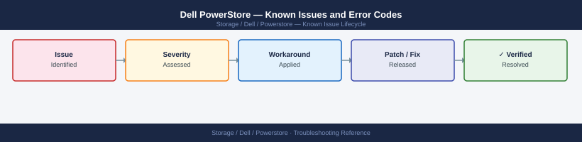

---
tags:
  - troubleshooting
  - powerstore
  - dell
  - known-issues
---
# Dell PowerStore — Known Issues and Error Codes

<div class="kb-summary">
Catalog of known PowerStore bugs, error codes, and workarounds covering NAS, SAN, replication, and PowerStore Manager UI.

*Applies to: PowerStore OS 3.x / 4.x*
</div>



```d2
direction: down

symptom: Identify Symptom {shape: diamond}
host_connectivity: "Host Connectivity" {shape: rectangle}
replication: "Replication" {shape: rectangle}
powerstore_manager: "PowerStore Manager" {shape: rectangle}
resolution: Resolve or Escalate {shape: oval}

symptom -> host_connectivity: investigate
symptom -> replication: investigate
symptom -> powerstore_manager: investigate
host_connectivity -> resolution
replication -> resolution
powerstore_manager -> resolution
```

## Before you begin

- PowerStore alerts appear in PowerStore Manager → Infrastructure → Events.
- Collect logs via `gather_diagnostic_information` from the PowerStore CLI for support.
- SRS (Secure Remote Services) / ESRS must be active for proactive support.

## Host Connectivity

| Error / Symptom | Affected Versions | Cause | Workaround / Fix | Fixed In |
|---|---|---|---|---|
| iSCSI host shows single path | PowerStore 3.x | Multipath not configured on host | Install `multipath-tools`; configure `multipath.conf` with `user_friendly_names yes` | N/A |
| NFS export `Access Denied` | PowerStore 3.x | Export host access not configured for client IP | Add client IP to NAS server export access list in PowerStore Manager | N/A |

## Replication

| Error / Symptom | Affected Versions | Cause | Workaround / Fix | Fixed In |
|---|---|---|---|---|
| Replication session stuck in `Synchronizing` | PowerStore 3.x | WAN bandwidth insufficient; replication behind | Check replication lag; verify TCP 443 between PowerStore management IPs cross-site | N/A |
| `Replication protection group out of sync` after network interruption | PowerStore 3.x | Session aborted mid-transfer | Pause and resume replication session in PowerStore Manager | N/A |

## PowerStore Manager

| Error / Symptom | Affected Versions | Cause | Workaround / Fix | Fixed In |
|---|---|---|---|---|
| Manager UI `503` after node reboot | PowerStore 3.x | Management services not fully started | Wait 5 minutes; if persistent, check node health via `service_user` CLI | N/A |
| Software upgrade stuck at `Validating` | PowerStore 4.x | ESRS / SRS connectivity check failing during preflight | Verify TCP 443 from PowerStore to esrs.dell.com; retry upgrade | N/A |

## See also

- [Dell PowerStore — Common Issues](../common-issues/)
- [Dell CloudIQ — Known Issues](../../cloudiq/troubleshooting/known-issues.md)
