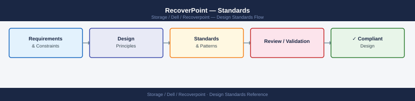

---
tags:
  - architecture
  - dell
---
# RecoverPoint — Standards

RecoverPoint design standards: RPA cluster sizing, consistency group limits, journal volume sizing, supported FC/iSCSI connectivity, and RPO target configuration.

*Applies to: RecoverPoint 5.x*

---

## Naming Conventions

### Consistency Groups

---

## See also

- [Recoverpoint — How It Works](how-it-works/)
- [Recoverpoint — Integrations](integrations/)
- [Recoverpoint — Deploy](../deploy/)
